欢迎学习《Ruby on Rails 教程》。本书的目标是成为对“如果想学习使用 Ruby on Rails 进行 Web 开发，我应该从那儿开始？”这一问题的最好答案。学习完本书的内容之后，你将具备使用 Rails 进行开发和部署 Web 程序的技能。同时你还能够通过一些进阶的书籍、博客和视频教程等活跃的 Rails 教学体系继续深造。本书基于 Rails 3，这里的知识代表着 Web 开发的发展方向。（《Ruby on Rails 教程》的最新版本可以从[本书的网站](http://railstutorial.org/)上获取。）

注意，本书的目标并不仅仅是教你 Rails，而是教你怎样使用 Rails 进行 Web 开发，教会你为因特网开发软件的技能。除了讲到 Ruby on Rails 之外，涉及到的技术还有 HTML、CSS、数据库、版本控制、测试和部署。为了达成学习目标，本书使用了一个完整的方案：通过实例学习使用 Rails 从零开始创建一个真正的程序。如 [Derek Sivers](http://sivers.org/) 在前言中所说的，本书内容采用线形结构，需要从头开始按顺序读到结尾。如果你经常跳着阅读技术类书籍，这种线形的组织方式需要你适应一下。你可以将本书设想为一个电子游戏，学习完每一章就会升一级。（而练习就是每一关的[小怪兽](http://en.wikipedia.org/wiki/Boss_\(video_gaming\)#Miniboss)。）

本章首先将介绍如何安装 Ruby on Rails 所需的软件，搭建开发所需的环境（[1.2 节](#sec-1-2 "跳到 1.2 节")）。然后创建第一个 Rails 程序 `first_app`。本书会遵从一些优秀的软件开发习惯，所以在创建第一个程序后我们会立即将它放到版本控制系统 Git 中（[1.3 节](#sec-1-3 "跳到 1.3 节")）。最后，我们还将把这个程序放到实际的生产环境中运行（[1.4 节](#sec-1-4 "跳到 1.4 节")）。

第二章我们会创建第二个程序，演示一些 Rails 程序的基本操作。为了快速创建，我们会使用脚手架功能（[旁注 1.1](#box-1-1 "跳到旁注 1.1")）来创建一个示例程序（名为 `demo_app`），因为生成的代码还很粗糙也很复杂，第二章将集中精力在通过浏览器的 URI （有时也称 URL）[1](#fn-1)来和程序交互这一点上。

本书剩下的章节将介绍从零开始开发一个大型示例程序（名为 `sample_app`）。在这个程序的开发过程中将使用“测试驱动开发”（TDD=Test-driven Development）理念，从第三章开始创建静态页面，然后增加一些动态的内容。第四章则会简要的介绍一下 Rails 背后的 Ruby 程序语言。第五章到第九章将逐步完善这个程序的基础框架：网站的布局，用户数据模型，完整的注册和验证系统。最后在第十章和第十一章将添加微博和社交网站的功能，最终开发出一个可以实际运行的示例网站。

最终的示例程序将在外表上和一个同样采用 Rails 开发的微博网站十分相似（*译者注：指 Twiiter*）。虽然我们将主要的精力集中在这个示例程序上了，但是本书的重点却在于提供一些通用的方法，这样你就会具有坚实的基本功，不论开发什么样的 Web 程序都能够派上用场。

	<h4 class="title">旁注 1.1 脚手架：更快，更简单，更诱人</h4>
	
Rails 出现伊始就吸引了众多目光，特别是 Rails 创始人 DHH （David Heinemeier Hansson）制作的著名的“<a href="http://media.rubyonrails.org/video/rails_take2_with_sound.mov">15分钟博客程序</a>”视频，该视频以及其衍生版本是窥探 Rails 强大功能一种很好的方式，我推荐你也看一下这些视频。剧透一下：这些视频中的演示能控制在15分钟得益于一个叫做“脚手架（scaffold）”的功能，它通过 Rails 命令 <code>generate</code> 生产大量的代码。

	
很多人制作 Rails 教程时选择使用脚手架功能，因为它<a href="http://en.wikipedia.org/wiki/Dark_side_(Star_Wars)">更快、更简单、更诱人</a>。不过脚手架会生成大量复杂的代码，会使初学者产生困惑，虽然会用了但却不明白到底发生了什么事。使用脚手架功能可能会把你变成一个脚本生成器的使用者但却不会增进你对 Rails 知识的掌握。

	
本书将采用一种不同的方式，虽然第二章会用脚手架开发一个小型的示例程序，但本书的核心是从第三章开始开发的较为大型的程序。在开发一个大型程序的每一个阶段我们只会编写少量的代码，易于理解但又具有一定的挑战性。这样的过程最终会让你对 Rails 知识有较为深刻地理解，能灵活运用，创建几乎任何类型的 Web 程序。

<h2 id="sec-1-1">1.1 简介</h2>

自 2004 年出现以来，Rails 迅速成为动态 Web 程序开发领域功能最强大、最受欢迎的框架之一。从初创的项目到很多的大公司都在使用 Rails：[37signals](http://37signals.com/)，[Github](http://github.com/)，[Shopify](http://shopify.com/)，[Scribd](http://scribd.com/)，[Twitter](http://twitter.com/)，[LivingSocial](http://livingsocial.com/)，[Groupon](http://groupon.com/)，[Hulu](http://hulu.com/) 和 [Yellow Pages](http://yellowpages.com/) 等，[这个列表](http://rubyonrails.org/applications)还很长。有很多 Web 开发工作室也在使用 Rails，比如 [ENTP](http://entp.com/)，[thoughtbot](http://thoughtbot.com/)，[Pivotal Labs](http://pivotallabs.com/) 和 [Hashrocket](http://hashrocket.com/)，以及无数的独立顾问，培训人员和项目承包商。

是什么使得 Rails 如此成功呢？首先，Ruby on Rails 是完全开源的，基于 [MIT 协议](http://www.opensource.org/licenses/mit-license.php)发布，可以免费下载、使用。Rails 的成功有很大一部分是得益于它优雅而紧凑的设计。研习 Ruby 语言的高可扩展性后，Rails 开发了一套用于开发 Web 程序的 [DSL](http://en.wikipedia.org/wiki/Domain_Specific_Language)（Domain-speific Language）。所以 Web 编程中像生成 HTML、创建数据模型、URI 路由等任务在 Rails 中都很容易实现，最终得到的程序代码很简洁而且可读性较高。

Rails 还会快速跟进 Web 领域最新的技术和框架架构技术。例如，Rails 是最早实现 REST 这个 Web 程序架构体系的框架之一（这一体系将贯穿本书）。当其他的框架开发出成功的新技术后，Rails 的创建者 DHH 及其核心开发团队会毫不犹豫的将其吸纳进来。或许最典型的例子就是 Rails 和 Merb （和 Rails 类似的 Ruby Web 框架）两个项目的合并，这样一来 Rails 就继承了 Merb 的模块化设计、稳定的 API，性能也得到了提升。

最后一点，Rails 有一个活跃而多元化的社区。社区中有数以百计的开源项目[贡献者](http://contributors.rubyonrails.org/)，组织了很多[会议](http://railsconf.com/)，开发了大量的[插件](http://agilewebdevelopment.com/plugins)和 [gem](https://rubygems.org/)，很多内容丰富的博客，一些讨论组和 IRC 频道。有如此多数量的 Rails 程序员也使得处理程序错误变的简单了：“使用 Google 搜索错误信息”的方法几乎总能搜到一篇相关的博客文章或讨论组的话题。

<h3 id="sec-1-1-1">1.1.1 给不同读者群的建议</h3>

本书的内容不仅只是讲解 Rails，还会涉及 Ruby 语言、RSPec 测试框架、[HTML](http://en.wikipedia.org/wiki/HTML)、[CSS](http://en.wikipedia.org/wiki/CSS)、少量的 [JavaScript](http://en.wikipedia.org/wiki/JavaScript) 和一些 [SQL](http://en.wikipedia.org/wiki/SQL)。所以不管你的 Web 开发技能处在什么层次，读完本书后你就能够继续学习一些较为高级的 Rails 资源了，同时也会对书中提到的其他技术有一个大体的认识。这么说也意味着本书要覆盖很多知识，如果你不是一个有些经验的程序员学起来会觉得有些吃力。下面就根据不同的开发背景给出使用本书的一些建议。

**所有读者：**学习 Rails 时一个常见的疑问是，是否要先学习 Ruby。这个问题的答案取决于你个人的学习方式以及你所具有的编程经验。如果你希望较为系统的彻底学习，或者你以前从未编程过，那么先学 Ruby 或许更适合你，我推荐你阅读 Peter Cooper 的《[Ruby 入门](http://www.amazon.com/gp/product/1430223634)》一书。而很多 Rails 开发初学者很想立马就开始 Web 程序开发，而不是在此之前阅读一本 500 多页纯粹讲解 Ruby 的书。如果你是这类人群，我推荐你在 [Try Ruby](http://tryruby.org/)[2](#fn-2) 上学习一些短小的交互式教程，然后还可以看一下 [Rails for Zombies](http://railsforzombies.org/) [3](#fn-3) 这个免费的视频教程，看看 Rails 都能做些什么。

另外一个常见的疑问是，是否要在一开始就使用测试。就如前面的介绍所说的，本书会使用“测试驱动开发（也叫“先测试后开发”）”理念，我认为这是使用 Rails 进行 Web 开发最好的方式，但这样也会增加难度和复杂度。如果你觉得做测试有些困难，我建议你在第一遍阅读时直接跳过所有测试，或者（更好的是）只把它们当做验证代码正确性的工具，而不用管测试的机理。如果采用后一种方法，你要创建一些必要的测试文件（叫做 spec），然后将本书中提供的测试代码编写进去，然后运行这些测试用例（[第五章](chapter5.html)会介绍）得到失败消息，然后编写代码再运行测试让其通过。

**缺乏经验的程序员：**本书的主要读者群不是刚入门的程序员，Web 程序及其相关的任意一个技术都是很复杂的。如果你完全是个 Web 编程菜鸟，发现本书的内容太难了，我建议你先学习基本的 HTML 和 CSS（很可惜这两种技术我没有推荐的书籍，但是《深入浅出 HTML》（译者注：[豆瓣](http://book.douban.com/subject/3040870/)）应该不错，一个读者推荐 David Sawyer McFarland 的《CSS 实战手册》（译者注：[豆瓣](http://book.douban.com/subject/4861462/)）），然后再试着阅读本书。你也可以考虑先阅读 Peter Cooper 的《Ruby 入门》的前几章，这几章中的示例程序都比功能完善的 Web 程序小得多。不过也有一批初学者通过本书学会了 Web 开发，所以你不妨也试一下，而且我强烈推荐[本书配套的教学视频](http://railstutorial.org/screencasts) [4](#fn-4)，通过观看别人的操作来学习 Rails 开发。

**经验丰富的程序员，但是刚接触 Web 开发：**以前的经验说明你可能已经理解了类、方法、数据结构等概念，这是个好的开始。不过，如果你以前是 C/C++ 或 Java 程序员，你会觉得 Ruby 有点另类，需要花一段时间才能适应；慢慢的适应，你会习惯的。（如果你实在无法放弃使用行尾的分号，Ruby 允许你这么做）本书会为你介绍所有 Web 相关的概念，所以如果你现在并不知道 `PUT` 和 `POST` 的区别也不要紧。

**经验丰富的 Web 开发者，但是刚接触 Rails：**你有很好的基础了，如果你曾经使用过 PHP 或 Python（更好）这些动态语言就更好了。我们要将的基础都是一致的，但是你可能对 TDD 还有 Rails 采用的 REST 架构感到陌生。而且 Ruby 语言有自己的风格，这一点对你来说也是陌生的。

**经验丰富的 Ruby 程序员：**如今 Ruby 程序员不懂 Rails 的很少，如果你是这种情况，你可以快速的过一遍本书，然后接着阅读 Obie Fernandez 的《[Ruby 之道](http://www.amazon.com/gp/product/0321601661)》（译者注：[豆瓣](http://book.douban.com/subject/1906854/)，[中文版](http://book.douban.com/subject/2280936/)）一书。

**缺乏经验的 Rails 程序员：**你或许阅读过其他的 Rails 教程，也开发过小型的 Rails 程序。根据一些读者的反馈，本书还是会给你带来帮助，别的不说，单就时效性而言，本书会比你当初学习 Rails 使用的教程要更新一些。

**经验丰富的 Rails 程序员：**你不需要阅读本书了，但是很多经验丰富的 Rails 开发者还是说他们从本书中学到了很多，或许通过本书你会换个角度来看 Rails。

读完本书后，我建议经验丰富的程序员继续阅读 David A. Black 的《[The Well-Grounded Rubyist](http://www.amazon.com/gp/product/1933988657)》（译者注：[豆瓣](http://book.douban.com/subject/3335184/)）一书，这本书较为系统的对 Ruby 进行了深入的讨论；或者阅读 Hal Fulton 的《Ruby 之道》，这本也是进阶书籍，不过更为专注在某些特定的话题上。然后再阅读《[Rails 3 之道](http://www.amazon.com/gp/product/0321601661)》（译者注：[豆瓣](http://book.douban.com/subject/4739317/)）来加强 Rails 技能。

不管你是从哪里开始的，学完本书你就应该继续学习一些中高级 Rails 资源了。以下是我推荐的学习资源：

- [RailsCasts](http://railscasts.com/)，Ryan Bates：优秀的免费（大多数）视频教程
- [PeepCode](http://peepcode.com)：优秀的收费视频教程
- [Code School](http://www.codeschool.com/)：交互式的编程课程
- [Rails 官方指南](http://guides.rubyonrails.org/)：按话题编写经常更新的 Rails 参考
- [Ryan Bates 的 RailsCasts](http://railscasts.com/)：我是不是已经说过 RailsCasts了？真的，强烈推荐 RailsCasts。

**译者注：**Ruby 中文社区也有一些质量比较高的资源：

- [RailsCasts China](http://railscasts-china.com)
- [Happycasts](http://happycasts.net/)

<h3 id="sec-1-1-2">1.1.2 Rails 的性能</h3>

继续介绍之前，我想花点时间说明一下 Rails 框架发布初期一个备受指责的问题：Rails 的性能很不好，例如不能处理较大的访问量。这个问题之所以存在是因为有些人没搞清状况，性能是要在你的网站中优化，而不是在框架中，强大的 Rails 只是一个框架而已。所以上面的问题应该换个角度来看：使用 Rails 开发的网站可以做性能优化吗？这样的问题已经得到了肯定的回答，因为很多世界上访问量最大的网站就是用 Rails 开发的。实际上性能优化涉及到的不仅仅是 Rails，如果你的程序需要处理类似 Hulu 或 Yellow Pages 这种数量级的访问量，Rails 并不会拖你的后退。

<h3 id="sec-1-1-3">1.1.3 本书排版约定</h3>

本书中使用的排版约定很多都是不言自明的，在本节我要说一下那些意义不是很清晰的部分。

本书的 HTML 版和 PDF 版都包含了大量的链接，有内部各章节之间的链接（例如 [1.2](#sec-1-2)节），也有链接到其他网站的链接（例如[Ruby on Rails 下载](http://rubyonrails.org/download)页面）。[5](#fn-5)

本书中很多例子都用到了命令行命令，为了行文方便，所有的命令行示例都使用了 Unix 风格的命令行提示符（美元符号），例如：


$ echo "hello, world"
hello, world


Windows 用户要知道在 Windows 中命令行的提示符是 `>`：


C:\Sites> echo "hello, world"
hello, world


在 Unix 系统中，一些命令要使用 `sudo`（超级用户的工作，“substitute user do”）执行。默认情况下，使用 `sudo` 执行的命令是以管理员的身份执行的，这样就能访问普通用户无法访问的文件和文件夹了。例如 [1.2.2 节](#sec-1-2-2)中的一个例子：


sudo ruby setup.rb


在多数的 Unix/Linux/OS X 系统中默认需要使用 `sudo`，但是如果使用下面介绍的 Ruby 版本管理工具就没必要使用了，直接使用以下命令即可：


ruby setup.rb


Rails 附带了很多可以在命令行中运行的命令。例如，在 [1.2.5 节](#sec-1-2-5)中将使用下面的命令在本地运行一个开发服务器：


$ rails server


和命令提示符一样，本书也使用了 Unix 中使用的文件夹分隔符（例如，一个斜线 /）。例如，我的示例程序存放在：


/Users/mhartl/rails_projects/sample_app


在 Windows 中等价的文件夹可能是：


C:\Sites\sample_app


一个程序的根目录称为“Rails 根目录”，但是这个称呼很容易让一些人产生困惑，他们以为“Rails 根目录”是指 Rails 框架的根目录。为了避免歧义，本书将使用“程序根目录”替代“Rails 根目录”的称呼，程序中所有文件夹都是相对该目录的。例如，示例程序的 `config` 目录是：


/Users/mhartl/rails_projects/sample_app/config


这个程序的根目录就是 `config` 之前的部分：


/Users/mhartl/rails_projects/sample_app


为了方便，如果需要指向下面这个文件


/Users/mhartl/rails_projects/sample_app/config/routes.rb


我会省略前面的程序根目录，直接写成 `config/routes.rb`。

本书经常需要显示一些来自其他程序（命令行，版本控制系统，Ruby 程序等）的输出，因为系统之间存在差异，你所得到的输出结果可能和本书中的不同，但是无需担心。

你在使用某些命令时可能会导致一些错误的发生，我不会一一列举各个错误的解决方法，你可以自行通过 Google 搜索解决。如果你在学习本书的过程中遇到了问题，我建议你看一下[本书帮助页面](http://railstutorial.org/help) [6](#fn-6) 中列出的资源。

<h2 id="sec-1-2">1.2 搭建环境</h2>

> 我认为第一章就像法学院的“淘汰阶段”一样，如果你能成功的搭建开发环境，后面就会很顺利。
>
> -- 本书读者 Bob Cavezza

现在可以开始搭建 Ruby on Rails 开发环境并创建第一个程序了。本节的知识量比较大，特别是对于没有很多编程经验的人来说，所以如果在某个地方卡住了也不要灰心，不只你一个人如此，每个开发者都是从这一步走过来的，慢慢来，功夫不负有心人。

<h3 id="sec-1-2-1">1.2.1 开发环境</h3>

不同的人有不同的喜好，每个 Rails 程序员都有一套自己开发环境，但基本上分为两类：文本编辑器+命令行的环境，“集成开发环境”（IDE=Integrated Development Environment）。先来说说后一种。

<h4>IDE</h4>

Rails 并不缺乏 IDE，[RadRails](http://www.aptana.com/rails/)、[RubyMine](http://www.jetbrains.com/ruby/index.html) 和 [3rd Rails](http://www.codegear.com/products/3rdrail) 都是。我听说 RubyMine 不错，一个读者（David Loeffler）还总结了一篇文章讲解[如何结合本书使用 RubyMine](https://github.com/perfectionist/sample_project/wiki) [7](#fn-7)。

<h4>文本编辑器和命令行</h4>

较之 IDE，我更喜欢使用文本编辑器编辑文本，使用命令行执行命令（如图 1.1）。如何组合取决于你的喜好和所用的平台。

- **文本编辑器：**我推荐使用 [Sublime Text 2](http://www.sublimetext.com/2)，这是一个跨平台支持的文本编辑器，写作本书时还处于 Beta 测试阶段，即便如此还是被认为是异常强大的编辑器。Sublime Text 深受 [Textmate](http://macromates.com/) 的影响，它能兼容大多数 Textmate 的定制功能，例如代码片段和配色方案。（Textmate 只可在 OS X 中使用，如果你使用 Mac 的话，它仍然是一个很好的选择。）另外一个很好的选择是 [Vim](http://www.vim.org/) [8](#fn-8)，它有针对各种主要平台的版本。Sublime Text 需要付费，而 Vim 则是免费的。二者都是界内人士普遍使用的编辑器，但就我的经验而言，Sublime Text 对初学者更友好。
- **终端（命令行）：**OS X 系统中我推荐使用 [iTerm](http://iterm.sourceforge.net/) 或是内置的终端程序。Linux 系统默认的终端就很好。在 Windows 中，很多用户选择在虚拟机中运行 Linux 来开发 Rails 程序，那么终端就使用默认的好了。如果你是在纯 Windows 系统中开发，我推荐使用 [Rails Installer](http://railsinstaller.org/) 中附带的终端。

如果你决定使用 Sublime Text，你可以参照[针对本书的安装说明](https://github.com/mhartl/rails_tutorial_sublime_text) [9](#fn-9)来安装。

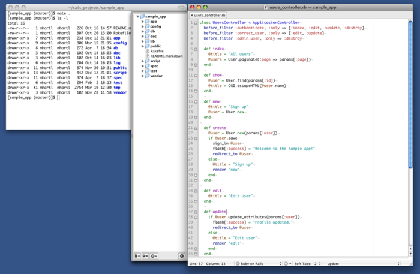

图 1.1 文本编辑器和命令行的开发环境（TextMate 和 iTerm）

<h4>浏览器</h4>

虽然浏览器有很多选择，但是大多数的 Rails 开发者使用 Firefox、Safari 或 Chrome 进行开发。本书附带的教程视频中使用的是 Firefox，如果你也使用 Firefox，推荐你安装 [Firebug](http://getfirebug.com/) 扩展，这个扩展很强大，可以动态的查看或编辑任何页面的 HTML 结构和 CSS。如果你不使用 Firefox，Safari 和 Chrome 都内置了“查看元素”功能，在任意页面右键鼠标就能找到。

<h4>关于工具的一点说明</h4>

在搭建开发环境的过程中，你会发现花费了很多时间来熟悉各种工具。特别是学习编辑器和 IDE，需要花费特别长的时间。单单用在 Sublime Text 和 Vim 教程上的时间就可能是几个星期。如果你刚刚接触这一领域，我要告诉你，学习工具要花费时间是正常的。每个人都是这样过来的。有时你会抓狂，当你在脑中有了很好的程序构思时，你只想学习 Rails，但却要浪费一个星期去学习老旧的 Unix 编辑器，这时很容易失去耐心。但请记住，工欲善其事必先利其器。

<h3 id="sec-1-2-2">1.2.2 安装 Ruby，RubyGems，Rails 和 Git</h3>

> 世界上几乎所有的软件不是无法使用就是很难使用。所以用户惧怕软件。用户们已经得到经验了，不论是安装软件还是填写一个在线表格，都不会成功。我也害怕安装东西，可笑的是我是个计算机科学博士。
>
> -- Paul Graham，《创业者》

现在可以安装 Ruby on Rails 了。我会尽量讲得浅一点，但是系统之间存在差异，很多地方都可能出现问题，如果你遇到问题的话请通过 Google 搜索，或访问[本书的帮助页面](http://railstutorial.org/help)。

除非有特殊说明，你应该使用本书中所有软件的相同版本，包括 Rails，这样才能得到相同的结果。有时候不同的补丁版本会产生相同的结果，但不完全相同，特别是针对 Rails 的版本。不过 Ruby 是个例外，1.9.2 和 1.9.3 都可以用于本教程，所以二者随意选择。

<h4>Rails Installer（Windows）</h4>

以前在 Windows 中安装 Rails 是件很痛苦的事，但多亏了 [Engine Yard](http://engineyard.com/) 公司的大牛们，特别是 Nic Williams 博士和 Wayne E. Seguin，现在在 Windows 中安装 Rails 及相关的软件简单多了。如果你使用 Windows 的话，可以到 [Rails Installer 的网站](http://railsinstaller.org/)下载 Rails Installer 安装程序，顺便可以看一下安装视频。双击安装文件按照说明安装 Git、Ruby、RubyGems 和 Rails。安装完成后你就可以直接跳到 [1.2.3 节](#sec-1-2-3)去创建第一个应用程序了。

有一点需要说明，使用 Rails Installer 安装的 Rails 版本可能和下面介绍的方法得到的版本不一致，这可能会导致不兼容的问题。为了解决这个问题，我现在正在与 Nic 和 Wayne 一起工作，按照 Rails 版本号的顺序列出一个 Rails Installer 列表。

<h4>安装 Git</h4>

Rails 社区中的人多少都会使用一个叫 Git（[1.3 节](#sec-1-3)中会详细介绍）的版本控制系统，因为大家都这么做，所以你在一开始就要开始用 Git。如何在你使用的平台中安装 Git 可以参考[《Pro Git》书中的“安装 Git”一节](http://git-scm.com/book/zh/%E8%B5%B7%E6%AD%A5-%E5%AE%89%E8%A3%85-Git)。

<h4>安装 Ruby</h4>

接下来要安装 Ruby 了。很有可能你使用的系统已经自带了 Ruby，你可以执行下面的命令来看一下：


$ ruby -v
ruby 1.9.3


这个命令会显示 Ruby 的版本。Rails 3 需要使用 Ruby 1.8.7 或以上的版本，但最好是 1.9.x 系列。本教程假设多数的读者使用的是 Ruby 1.9.2 或 1.9.3，不过 Ruby 1.8.7 应该也可以用（[第四章](chapter4.html)中会介绍，这个版本和最新版之间有个语法差异，而且也会导致输出有细微的差别）。

如果你使用的是 OS X 或者 Linux，在安装 Ruby 时我强烈建议使用 Ruby 版本管理工具 [RVM](http://rvm.io/)，它允许你在同一台电脑上安装并管理多个 Ruby 版本。（在 Windows 中可以使用 [Pik](http://github.com/vertiginous/pik)）如果你希望在同一台电脑中运行不同版本的 Ruby 或 Rails 就需要它了。如果你在使用 RVM 时遇到什么问题的话，可以在 RVM 的 IRC 频道（[freenode.net 上的 #rvm](http://webchat.freenode.net/?channels=rvm)）中询问它的开发者 Wayne E. Seguin。[10](#fn-10)如果你使用的是 Linux，我推荐你阅读 Sudobits 博客中的《[如何在 Ubuntu 中安装 Ruby on Rails](http://blog.sudobits.com/2012/05/02/how-to-install-ruby-on-rails-in-ubuntu-12-04-lts/)》一文。

[安装 RVM](http://rvm.io/rvm/install/) 后，你可以按照下面的方式安装 Ruby：[11](#fn-11)


$ rvm get head && rvm reload
$ rvm install 1.9.3
<等一会儿>


命令的第一行会更新并重新加载 RVM，这是个好习惯，因为 RVM 经常会更新。第二行命令安装 Ruby 1.9.3。然后会用花一些时间下载和编译，所以如果看似没反应了也不要担心。

一些 OS X 用户可能会因为没有 `autoconf` 执行文件而麻烦一些，不过你可以安装 [Homebrew](http://mxcl.github.com/homebrew/) [12](#fn-12)（OS X 系统中的包管理程序），然后执行以下命令：


$ brew install automake
$ rvm install 1.9.3


有些 Linux 用户反馈说要包含 OpenSSL 代码库的路径：


$ rvm install 1.9.3 --with-openssl-dir=$HOME/.rvm/


在一些较旧的 OS X 系统中，你或许要包含 `readline` 代码库的路径：


$ rvm install 1.9.3 --with-readline-dir=/opt/local


（就像我说过的，很多地方都可能会出错，唯一的解决办法就是网络搜索，然后自己解决。）

安装 Ruby 之后，你要配置一下你的系统，这样其他程序才能运行 Rails。这个过程会涉及到 gem 的安装，gem 是 Ruby 代码的打包系统。因为不同版本的 gem 会有差异，我们经常要创建一个额外的 gem 集（gemset），包含一系列的 gem。针对本教程，我推荐你创建一个名为 `rails3tutorila2ndEd` 的 gemset：


$ rvm use 1.9.3@rails3tutorial2ndEd --create --default
Using /Users/mhartl/.rvm/gems/ruby-1.9.3 with gemset rails3tutorial2ndEd


上面的命令会使用 Ruby 1.9.3 创建（`--create`）一个名为 `rails3tutorial2ndEd` 的 gemset，然后立马就开始使用（`use`） 这个 gemset，并将其设为默认的（`--default`） gemset，这样每次打开新的终端就会自动使用 `1.9.3@rails3tutorial2ndEd` 这个 Ruby 和 gemset 的组合。RVM 提供了大量的命令用来处理 gemset，更多内容可以查看其文档（<http://rvm.io/gemsets/>）。如果你在使用 RVM 时遇到了问题，可以运行以下的命令显示帮助信息：


$ rvm --help
$ rvm gemset --help


<h4>安装 RubyGems</h4>

RubyGems 是 Ruby 项目的包管理程序，有很多有用的代码库（包括 Rails）都可以通过包（或叫做 gem）的形式获取。安装 Ruby 后再安装 RubyGems 就很简单了。如果你安装了 RVM 就已经安装 RubyGems 了，因为 RVM 已经自动将其安装了：


$ which gem
/Users/mhartl/.rvm/rubies/ruby-1.9.3-p0/bin/gem


如果你还没有安装 RubyGems，你可以[下载 RubyGems](http://rubyforge.org/frs/?group_id=126)，解压文件，然后进入 `rubygems` 目录运行安装程序：


ruby setup.rb


（如果你遇到了权限错误的提示，参照 [1.1.3](#sec-1-1-3) 节所说的，你要使用 `sudo`。）

安装 RubyGems 之后，你要确保你使用的版本和本书一致：


gem update --system 1.8.24


将你的系统定格在这个版本可以避免以后因为 RubyGems 升级而产生的差异。

安装 gem 时，默认情况下 RubyGems 会生成两种不同的文档（ri 和 rdoc），但是很多 Ruby 和 Rails 开发者认为花时间生成这些文档没什么必要。（很多程序员更依靠在线文档，而不是内置的 ri 和 rdoc 文档。）为了禁止自动生成文档，我建议你执行代码 1.1 中的命令在你的家目录中创建一个名为 `.gemrc` 的 gem 配置文件，文件的内容参见代码 1.2。（波浪号“~”代表“家目录”，`.gemrc` 中的点号代表这是个隐藏文件，配置文件一般都是隐藏的。）

**代码 1.1** 创建 gem 配置文件


$ subl ~/.gemrc


这里的 `subl` 是 OS X 中启动 Sublime Text 的命令，你可以参照 Sublime Text 2 文档中的 “[OS X 命令](http://www.sublimetext.com/docs/2/osx_command_line.html)”一文进行设置。如果你使用的是其他系统，或者你使用的是其他的编辑器，只需换用其他相应的命令（例如，你可以直接双击来启动程序，或者使用其他的命令，如 `mate`、`vim`、`gvim` 或 `mvim`）。为了行文简洁，在本书后续的内容中当我说使用 `subl` 时，我的意思是“使用你喜好的文本编辑器打开”。

**代码 1.2** 在 `.gemrc` 中配置不生成 ri 和 rdoc 文档


install: --no-rdoc --no-ri
update: --no-rdoc --no-ri


<h4>安装 Rails</h4>

安装玩 RubyGems 后安装 Rails 也就简单了。本教程使用 Rails 3.2，通过以下命令安装：


$ gem install rails -v 3.2.8


译者注：鉴于国内的“社会主义特色”，你可能无法正常下载 gem，这时你可以使用 [VPN](http://en.wikipedia.org/wiki/Vpn) 或者使用 [RubyGems 在国内的镜像](http://ruby.taobao.com)。

检查 Rails 是否安装成功，执行以下命令显示 Rails 的版本号：


$ rails -v
Rails 3.2.8


注意：如果你是通过上述的 Rails Installer 安装的 Rails，你所得到的版本号可能会有些不同。在写这本书的时候，这些不同还不会带来大的问题，但是如果 Rails 升级到了更高的版本，问题可能就很严重了。我目前正在和 Engine Yard 一起工作来创建一个 Rails Installer 版本列表。

如果你使用的是 Linux，现在或许你还需要安装一些其他的代码包：


$ sudo apt-get install libxslt-dev libxml2-dev libsqlite3-dev # 只针对 Linux


<h3 id="sec-1-2-3">1.2.3 第一个程序</h3>

Rails 程序一般都是从 `rails` 命令开始的，这个命令会在你指定的文件夹中创建一个 Rails 程序模板。首先为你的 Rails 程序新建一个文件夹，然后执行 `rails` 命令创建第一个程序（参见代码 1.3）：

**代码 1.3** 运行 `rails` 生成一个新程序


$ mkdir rails_projects
$ cd rails_projects
$ rails new first_app
      create
      create  README.rdoc
      create  Rakefile
      create  config.ru
      create  .gitignore
      create  Gemfile
      create  app
      create  app/assets/images/rails.png
      create  app/assets/javascripts/application.js
      create  app/assets/stylesheets/application.css
      create  app/controllers/application_controller.rb
      create  app/helpers/application_helper.rb
      create  app/mailers
      create  app/models
      create  app/views/layouts/application.html.erb
      create  app/mailers/.gitkeep
      create  app/models/.gitkeep
      create  config
      create  config/routes.rb
      create  config/application.rb
      create  config/environment.rb
      .
      .
      .
      create  vendor/plugins
      create  vendor/plugins/.gitkeep
         run  bundle install
Fetching source index for https://rubygems.org/
.
.
.
Your bundle is complete! Use `bundle show [gemname]` to see where a bundled
gem is installed.


如代码 1.3 所示，运行 `rails` 命令会在文件创建完之后自动执行 `bundle install`。如果这一步没有正确执行，先不要担心，按照 [1.2.4 节](#sec-1-2-4)中的步骤来做应该就可以了。

留意一下 `rails` 命令创建的文件和文件夹。这些标准的文件夹和文件结构（如图 1.2）是 Rails 的很多优势之一，它让你从零开始快速的创建一个可运行的简单的程序。而且因为这样的结构对 Rails 程序都是一致的，你在阅读其他人的代码时就显得很亲切。表格 1.1 是这些文件的简介，在本书的后续内容中将介绍其中的大多数。从 [5.2.1 节](chapter5.html#sec-5-2-1) 开始，首先将介绍 `app/assets` 文件夹，它是 asset pipeline（Rails 3.1 新增）的一部分，这个功能让组织和部署 CSS 和 JavaScript 等资源文件变得异常简单。

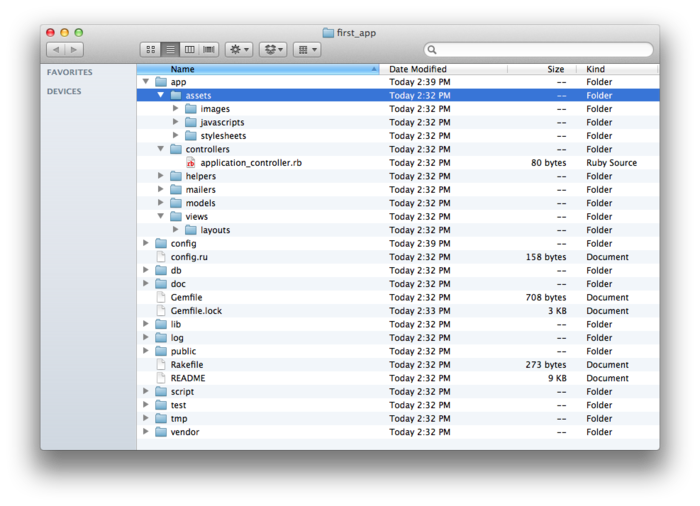

图 1.2：新创建的 Rails 程序的文件结构

<table id="table-1-1" class="tabular">
	<tbody>
		<tr>
			<th class="align_left"><strong>文件/文件夹</strong></th>
			<th class="align_left"><strong>说明</strong></th>
		</tr>
		<tr class="top_bar">
			<td class="align_left"><code>app/</code></td>
			<td class="align_left">程序的核心文件，包含模型、视图、控制器和帮助方法</td>
		</tr>
		<tr>
			<td class="align_left"><code>app/assets</code></td>
			<td class="align_left">程序的资源文件，如 CSS、JavaScript 和图片</td>
		</tr>
		<tr>
			<td class="align_left"><code>config/</code></td>
			<td class="align_left">程序的设置</td>
		</tr>
		<tr>
			<td class="align_left"><code>db/</code></td>
			<td class="align_left">数据库文件</td>
		</tr>
		<tr>
			<td class="align_left"><code>doc/</code></td>
			<td class="align_left">程序的文档</td>
		</tr>
		<tr>
			<td class="align_left"><code>lib/</code></td>
			<td class="align_left">代码库文件</td>
		</tr>
		<tr>
			<td class="align_left"><code>lib/assets</code></td>
			<td class="align_left">代码库包含的资源文件，如 CSS、JavaScript 和 图片</td>
		</tr>
		<tr>
			<td class="align_left"><code>log/</code></td>
			<td class="align_left">程序的日志文件</td>
		</tr>
		<tr>
			<td class="align_left"><code>public/</code></td>
			<td class="align_left">公共（例如浏览器）可访问的数据，如出错页面</td>
		</tr>
		<tr>
			<td class="align_left"><code>script/rails</code></td>
			<td class="align_left">生成代码、打开终端会话或开启本地服务器的脚本</td>
		</tr>
		<tr>
			<td class="align_left"><code>test/</code></td>
			<td class="align_left">程序的测试文件（在 <a class="ref" href="chapter3.html#sec-3-1-2">3.1.2 节</a> 中被 <code>spec/</code> 代替）</td>
		</tr>
		<tr>
			<td class="align_left"><code>tmp/</code></td>
			<td class="align_left">临时文件</td>
		</tr>
		<tr>
			<td class="align_left"><code>vendor/</code></td>
			<td class="align_left">第三方代码，如插件和 gem</td>
		</tr>
		<tr>
			<td class="align_left"><code>vendor/assets</code></td>
			<td class="align_left">第三方代码包含的资源文件，如 CSS、JavaScript 和图片</td>
		</tr>
		<tr>
			<td class="align_left"><code>README.rdoc</code></td>
			<td class="align_left">程序的简介</td>
		</tr>
		<tr>
			<td class="align_left"><code>Rakefile</code></td>
			<td class="align_left"><code>rake</code> 命令包含的任务</td>
		</tr>
		<tr>
			<td class="align_left"><code>Gemfile</code></td>
			<td class="align_left">该程序所需的 gem</td>
		</tr>
		<tr>
			<td class="align_left"><code>Gemfile.lock</code></td>
			<td class="align_left">一个 gem 的列表，确保本程序的复制版使用相同版本的 gem</td>
		</tr>
		<tr>
			<td class="align_left"><code>config.ru</code></td>
			<td class="align_left"><a href="http://rack.rubyforge.org/doc/">Rack 中间件</a> 的配置文件</td>
		</tr>
		<tr>
			<td class="align_left"><code>.gitignore</code></td>
			<td class="align_left">git 忽略的文件类型</td>
		</tr>
	</tbody>
</table>

表格 1.1：Rails 默认文件结构的简介

<h3 id="sec-1-2-4">1.2.4 Bundler</h3>

创建完一个新的 Rails 程序后，你可以使用 Bundler 来安装和包含该程序所需的 gem。在 [1.2.3 节](#sec-1-2-3) 中提到过，Bundler 会被 `rails` 命令自动执行（通过 `bundle install`），不过本节将对程序默认包含的 gem 做些修改，然后再运行 Bundler。首先在你喜好的文本编辑器中打开 `Gemfile` 文件：


$ cd first_app/
$ subl Gemfile


该文件内容如代码 1.4。这些代码就是常规的 Ruby 代码，现在无需关注句法，第四章将会详细的介绍 Ruby。

**代码 1.4** `first_app` 默认的 `Gemfile` 文件


source 'https://rubygems.org'

gem 'rails', '3.2.8'

# Bundle edge Rails instead:
# gem 'rails', :git => 'git://github.com/rails/rails.git'

gem 'sqlite3'

# Gems used only for assets and not required
# in production environments by default.
group :assets do
  gem 'sass-rails',   '~> 3.2.3'
  gem 'coffee-rails', '~> 3.2.2'

  gem 'uglifier', '>= 1.2.3'
end

gem 'jquery-rails'

# To use ActiveModel has_secure_password
# gem 'bcrypt-ruby', '~> 3.0.0'

# To use Jbuilder templates for JSON
# gem 'jbuilder'

# Use unicorn as the web server
# gem 'unicorn'

# Deploy with Capistrano
# gem 'capistrano'

# To use debugger
# gem 'ruby-debug19', :require => 'ruby-debug'


其中很多行代码都用 `#` 注释掉了，这些代码放在这是告诉你一些常用的 gem，也展示了 Bundler 的句法。现在，除了默认的 gem 我们还不需要其他的 gem：Rails，一些 asset pipeline 相关的 gem（[5.2.1 节](chapter5.html/#sec-5-2-1)）—— jQuery 库 gem，[SQLite 数据库](http://www.sqlite.org/)的 Ruby 接口 gem。

如果不为 `gem` 命令指定一个版本号，Bundler 会自动安装 gem 的最新版本。有些 gem 的更新会带来细微但有时会破坏代码的差异，所以在本教程中我们特意加入了可以正常运行的 gem 版本号，如代码 1.5 所示（同时我们也将注释掉的代码去掉了）。

**代码 1.5** 指定了 gem 版本号的 `Gemfile` 文件


source 'https://rubygems.org'

gem 'rails', '3.2.8'

group :development do
  gem 'sqlite3', '1.3.5'
end

# Gems used only for assets and not required
# in production environments by default.
group :assets do
  gem 'sass-rails',   '3.2.5'
  gem 'coffee-rails', '3.2.2'

  gem 'uglifier', '1.2.3'
end

gem 'jquery-rails', '2.0.2'


代码 1.5 将 Rails 默认使用的 JavaScript 库 jQuery 的 gem 从


gem 'jquery-rails'


改为


gem 'jquery-rails', '2.0.2'


同时也将


gem 'sqlite3'


修改成


group :development do
  gem 'sqlite3', '1.3.5'
end


强制 Bundler 安装 `sqlite3` gem 的 `1.3.5` 版。注意，我们仅把 SQLite 放到了开发环境中（[7.1.1 节](chapter7.html/#sec-7-1-1)），这样可以避免和 Heroku（[1.4 节](#sec-1-4)）的数据库冲突。

代码 1.5 也修改了其他几行，将


group :assets do
  gem 'sass-rails',   '~> 3.2.3'
  gem 'coffee-rails', '~> 3.2.2'
  gem 'uglifier', '>= 1.2.3'
end


改成了


group :assets do
  gem 'sass-rails',   '3.2.5'
  gem 'coffee-rails', '3.2.2'
  gem 'uglifier', '1.2.3'
end


如下的代码


gem 'uglifier', '>=1.2.3'


会安装 `1.2.3` 版以上的最新版 `uglifier` gem（在 asset pipeline 中处理文件的压缩），当然也可以安装 `7.2` 版。而下面的代码


gem 'coffee-rails', '~> 3.2.2'


只会安装低于 `3.3` 版的 `coffee-rails`（也是 asset pipeline 用到的）。换句话说，`>=` 总会升级到最新版；`~> 3.2.2` 只会升级补丁版本的更新（例如从 `3.1.1` 到 `3.1.2`），而不会升级到次版本或主版本的更新（例如从 `3.1` 到 `3.2`）。不过，经验告诉我们，即使是补丁版本的升级也可能会产生错误，所以在本教程中我们基本上会为所以的 gem 指定明确的版本号。（在写作本书时处于 RC 或 Beta 测试阶段的 gem 是个例外，这些 gem 会使用 `~>` 以便正式发布后包含正式版。）

修改完 `Gemfile` 后，运行 `bundle install` 安装所需的 gem：


$ bundle install
Fetching source index for https://rubygems.org/
.
.
.


如果你使用的是 OS X，得到一个错误信息提示缺少 Ruby 头文件（例如 `ruby.h`），那么你需要安装 Xcode。Xcode 是 OS X 安装盘中附带的开发者工具包，相对于安装整个工具包我更推荐你安装较小的 [Xcode 命令行工具包](https://developer.apple.com/downloads/) [13](#fn-13)。如果在安装 Nokogiri gem 时提示 libxslt 错误，重新安装 Ruby 试一下：


$ rvm reinstall 1.9.3
$ bundle install


`bundle install` 命令会花费一点时间，一旦结束我们的程序就可以运行了。注意：这里只是对我们的第一个应用做个演示，这是理想的情况。[第三章](chapter3.html)会介绍使用 Bundler 安装 Ruby gem 更强大的方法。

<h3 id="sec-1-2-5">1.2.5 <code>rails server</code></h3>

运行完 [1.2.3 节](#sec-1-2-3)中介绍的 `rails new` 和 [1.2.4 节](#sec-1-2-4) 中介绍的 `bundle install` 后我们的程序就可以运行了，但怎么运行呢？Rails 自带了一个命令行程序可以在开发电脑上运行一个本地服务器：[14](#fn-14)


$ rails server
=> Booting WEBrick
=> Rails application starting on http://0.0.0.0:3000
=> Call with -d to detach
=> Ctrl-C to shutdown server


（如果系统提示缺少 JavaScript 运行时，浏览 [execjs 位于 github 的页面](https://github.com/sstephenson/execjs)查看一些可选的运行时，我建议安装 [Node.js](http://nodejs.org/)。）上述代码的提示信息告诉我们这个应用程序在 `0.0.0.0` 地址的 3000[15](#fn-15) 端口运行。这个地址告诉系统监听那台电脑上的每一个可用的 IP 地址。一般来说，我们可以通过一个特殊的地址 `127.0.0.1` 来查看应用程序，或者也可以使用 `localhost`。通过 <http://localhost:3000> 查看结果，如图 1.3。

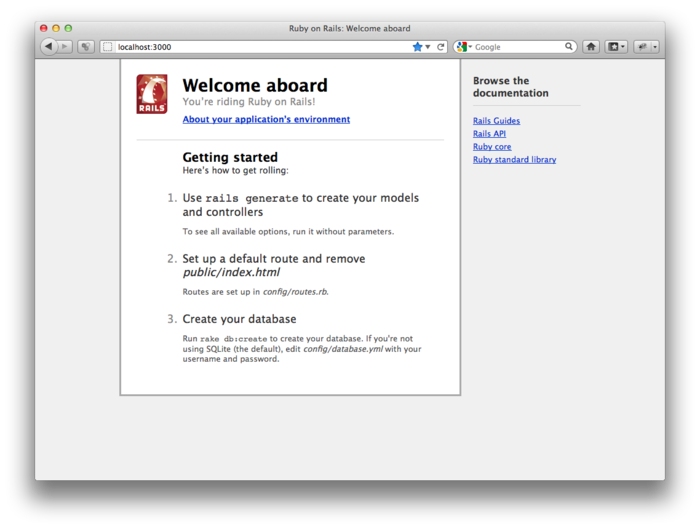

图 1.3：默认的 Rails 页面

点击“About your application's environment” 可以查看应用程序的信息。结果如图 1.4 所示。（图 1.4 显示的是截图时我电脑上的环境信息，你的结果可能会与我的不同。）

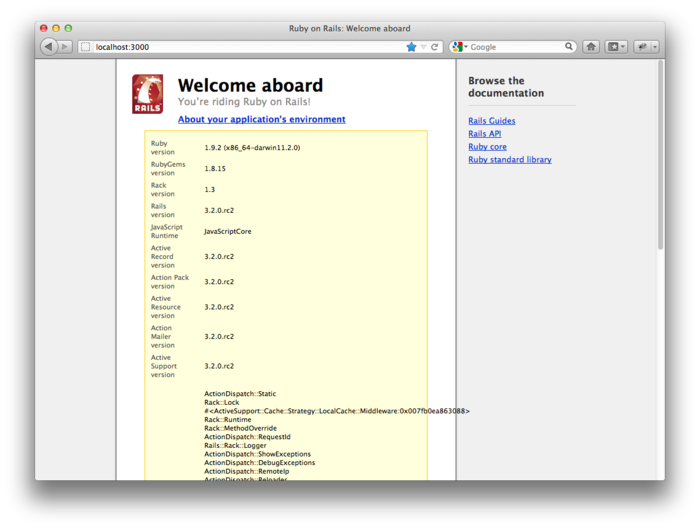

图 1.4：默认页面中的应用程序信息

当然我们不是真的想使用默认的 Rails 页面，但这个页面告诉我们 Rails 可以正常运行了。我们会在 [5.3.2 节](chapter5.html/#sec-5-3-2)中移除默认页面。

<h3 id="sec-1-2-6">1.2.6 模型-视图-控制器（MVC）</h3>

在初期阶段，概览一下 Rails 程序的工作方式（如图 1.5）多少是会有些帮助的。你可能已经注意到了，在 Rails 应用程序的文件结构（如图 1.2）中有一个文件夹叫 `app/`，其中有三个子文件夹：`models`、`views` 和 `controllers`。这暗示 Rails 采用了 MVC 架构模式，这种模式强制将“域逻辑（domain logic）”（也叫“业务逻辑（business logic）”）和图形用户界面（GUI）的输入、表现逻辑分开。在 Web 应用程序中，“域逻辑”的典型代表是“用户（users）”、“文章（articles）”和“产品（products）”等数据模型，GUI 则是浏览器中的网页。

在 Rails 交互中，浏览器发送一个请求（request），网络服务器收到请求然后将其传送到 Rails 的控制器，然后决定下一步做什么。某些情况下，控制器会立即渲染视图（view）模板，生成 HTML 然后将结果发送回浏览器。对于动态网站来说，控制器会和模型（model）交互。模型是一个 Ruby 对象，表示网站中的一个元素（例如一个用户），并且负责和数据库通信。调用模型后，控制器再渲染视图并将生成的 HTML 代码返回给浏览器。

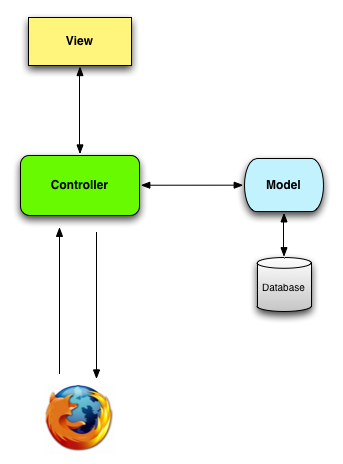

图 1.5：MVC 架构的图解

如果这些内容对你来说有点抽象，不用担心，后续会经常讲到 MVC。在 [2.2.2 节](chapter2.html#sec-2-2-2) 中会以演示程序为例较为深入的讨论 MVC；在后面的大型示例程序中会使用 MVC 的全部内容，[3.1.2 节](chapter3.html#sec-3-1-2) 将介绍控制器和视图，[6.1 节](chapter6.html#sec-6-1)将介绍模型，[7.1.2 节](chapter7.htnml#sec-7-1-2)中将把三个部分放在一起使用。

<h2 id="sec-1-3">1.3 用 git 做版本控制</h2>

我们已经创建了一个可以运行的 Rails 应用程序，接下来要花点时间来做一件事，虽然不是必须做的，但是很多 Rails 开发者基本上都认为这是应该做的最基本的事情，这件事就是将应用程序的源代码放入版本控制系统中。版本控制系统可以跟踪项目代码的变化，便利的和他人协作，如果出现问题（例如不小心删除了文件）还可以回滚到以前的版本。每个软件开发者都应该学习使用版本控制系统。

版本控制工具很多，Rails 社区更多的会使用 [git](http://git-scm.com/)，它最初是由 Linus Torvalds 开发用来存储 Linux 内核代码的。git 的知识很多，这里我们只会介绍一些简单的内容，网络上有很多免费的资料可以阅读，我特别推荐 Scott Chacon 的《[Pro Git](http://git-scm.com/book)》（Apress 2009 年出版。[中文版](http://git-scm.com/book/zh)）。之所以推荐你将代码放到 git 这个版本控制系统中是因为这几乎是 Rails 社区的普遍做法，还因为这样做更利于代码的分享（[1.3.4 节](#sec-1-3-4)），也便于程序的部署（[1.4 节](#sec-1-4)）。

<h3 id="sec-1-3-1">1.3.1 安装与设置</h3>

如果你还没安装 git，请按照前面的介绍进行安装。（如前所述，安装的过程可以参考《Pro Git》书中的“[安装 Git](http://git-scm.com/book/en/Getting-Started-Installing-Git)”（[中文版](http://git-scm.com/book/zh/%E8%B5%B7%E6%AD%A5-%E5%AE%89%E8%A3%85-Git)）部分。）

<h4>第一次运行时的设置</h4>

安装 git 后，你应该做一些只需做一次的事情：系统设置——这样的设置在每台电脑上只需做一次：


$ git config --global user.name "Your Name"
$ git config --global user.email your.email@example.com


我还想用 `co` 代替字数较多的 `checkout` 命令，做如下设置：


$ git config --global alias.co checkout


本书中我基本上都会使用完整的 `checkout` 命令，防止你没有做以上的设置，但我自己是都是使用 `git co`。

最后，你还可以设置 git 提交信息使用的编辑器。如果你使用的是图形界面的编辑器，例如 Sublime Text、TextMate、gVim 或 MacVim，你要加上一个旗标确保编辑器会在终端中保持状态还不是立马结束命令：[16](#fn-16)


$ git config --global core.editor "subl -w"


如果使用其他编辑器，请使用以下代码替换 `subl -w`：TextMate 用 `mate -w`，gVim 用 `gvim -f`，MacVim 用 `mvim -f`。

<h4>设置第一个仓库</h4>

下面的步骤你每次新建一个仓库时都要执行。首先进入刚创建的应用程序的根目录，然后初始化一个新仓库：


$ git init
Initialized empty Git repository in /Users/mhartl/rails_projects/first_app/.git/


接下来要将项目的文件添加到仓库中。不过有一点要说明一下：git 默认会跟踪所有文件的变化，但是有些文件我们并不想跟踪。例如，Rails 会创建一些日志文件记录应用程序的动作，这些文件经常变化，我们并不需要版本控制系统跟踪这些文件。git 有忽略文件的机制：在应用程序的根目录创建一个名为 `.gitignore` 的文件，然后写入一些规则告诉 git 要忽略哪些文件即可。[17](#fn-17)

看一下前面的表格 1.1，`rails` 命令默认会在应用程序的根目录创建 `.gitignore` 文件，其内容如代码 1.6。

**代码 1.6** `rails` 命令默认创建的 `.gitignore` 文件


# See http://help.github.com/ignore-files/ for more about ignoring files.
#
# If you find yourself ignoring temporary files generated by your text editor
# or operating system, you probably want to add a global ignore instead:
#   git config --global core.excludesfile ~/.gitignore_global

# Ignore bundler config
/.bundle

# Ignore the default SQLite database.
/db/*.sqlite3

# Ignore all logfiles and tempfiles.
/log/*.log
/tmp


代码 1.6 中的代码会让 git 忽略日志文件，Rails 的临时文件（`tmp/`）和 SQLite 数据库。（为了忽略 `log/` 文件夹中的日志文件，我们用 `log/*.log` 来忽略所有以 `.log` 结尾的文件）大部分被忽略的文件都是变动频繁，而且是自动创建的，将这些文件纳入版本控制不符合常规做法。而且，当和他人协作时这些文件还可能会导致冲突。

代码 1.6 中的代码只是针对本教程的，但是系统中的一些文件也要忽略，代码 1.7 则更为全面。增强后的 `.gitignore` 文件会忽略 Rails 应用程序的文档、Vim 和 Emacs 的交换文件（swap file），以及 Mac Finder 程序生成的诡异的 `.DS_Store` 文件（针对 OS X 用户）。如果你想使用这个更全面的忽略文件，用你喜好的文本编辑器打开 `.gitignore` 文件（译者注：在“打开文件”窗口中按 `⌘+⇧+.` 可以显示或隐藏隐藏的文件），然后写入代码 1.7 中的代码。

**代码 1.7** 加强版 `.gitignore` 文件


# Ignore bundler config
/.bundle

# Ignore the default SQLite database.
/db/*.sqlite3

# Ignore all logfiles and tempfiles.
/log/*.log
/tmp

# Ignore other unneeded files.
doc/
*.swp
*~
.project
.DS_Store
.idea


<h3 id="sec-1-3-2">1.3.2 添加文件并提交</h3>

最后我们要把 Rails 项目中的文件添加到 git 中，然后提交结果。你可以使用下述命令添加所有的文件（除了 `.gitignore` 中忽略的文件）：


$ git add .


这里的点号（.）代表当前目录，git 会自动的将所有的文件，包括子目录中的文件添加到 git 中。这个命令会将项目的文件添加到暂存区域（staging area），这个区域包含未提交的改动。你可以使用 `status` 命令查看暂存区域有哪些文件：[18](#fn-18)


$ git status
# On branch master
#
# Initial commit
#
# Changes to be committed:
#   (use "git rm --cached <file>..." to unstage)
#
#       new file:   README.rdoc
#       new file:   Rakefile
.
.
.


（显示的结果很长，所以我用点号代替了。）

用 `commit` 命令告诉 git 你想保存这些改动：


$ git commit -m "Initial commit"
[master (root-commit) df0a62f] Initial commit
42 files changed, 8461 insertions(+), 0 deletions(-)
create mode 100644 README.rdoc
create mode 100644 Rakefile
.
.
.


旗标 `-m` 允许你为这次提交添加一个信息，如果没有提供 `-m`，git 会打开你在 [1.3.1 节](#sec-1-3-1)中设置的编辑器，你需要在编辑器中填写信息。

有一点很重要，git 提交是针对本地的，数据只存在执行提交的电脑中。这一点和另一个很著名的开源版本控制系统 SVN 不同，SVN 提交时会更新远程仓库。git 将 SVN 中的提交分成了两部分：本地保存的更改（`git commit`）和将更改推送到远程仓库（`git push`）。在 [1.3.5 节](#sec-1-3-5)中会演示推送这一步。

顺便说一下，你可以使用 `log` 命令查看提交的历史信息：


$ git log
commit df0a62f3f091e53ffa799309b3e32c27b0b38eb4
Author: Michael Hartl <michael@michaelhartl.com>
Date:   Thu Oct 15 11:36:21 2009 -0700

  Initial commit


如果要退出 `git log`，输入 `q`。

<h3 id="sec-1-3-3">1.3.3 git 为我们带来了什么好处？</h3>

现在你可能还不是完全清楚将源码纳入版本控制系统有什么好处，那我就举个例子来说明一下吧。（后续章节中还有很多例子）假设你不小心做了一些改动，比如说删除了 `app/controllers/` 文件夹：


$ ls app/controllers/
application_controller.rb
$ rm -rf app/controllers/
$ ls app/controllers/
ls: app/controllers/: No such file or directory


我们用 Unix 中的 `ls` 命令列出 `app/controllers/` 文件夹中的内容，用 `rm` 命令删除这个文件夹。旗标 `-rf` 的意思是“强制递归”，无需得到确认就递归的删除所有文件、文件夹、子文件夹等。

查看一下状态看看发生了什么：


$ git status
# On branch master
# Changed but not updated:
#   (use "git add/rm <file>..." to update what will be committed)
#   (use "git checkout -- <file>..." to discard changes in working directory)
#
#       deleted:    app/controllers/application_controller.rb
#
no changes added to commit (use "git add" and/or "git commit -a")


可以看到一个文件被删除了，但是这个改动只发生在工作区，还没有提交。这样我们就可以使用 `checkout` 命令切换到前一个提交记录来撤销这次改动（其中旗标 `-f` 意思是覆盖当前的改动）：


$ git checkout -f
$ git status
# On branch master
nothing to commit (working directory clean)
$ ls app/controllers/
application_controller.rb


删除的文件夹和文件又回来了，这下放心了！

<h3 id="sec-1-3-4">1.3.4 GitHub</h3>

你已经将你项目的代码纳入 git 版本控制系统了，现在你可以将其推送到 GitHub 了。GitHub 是一个针对 Git 仓库的存储及分享社交平台。将代码的拷贝存一份在 GitHub 有两个目的：其一是对代码的完整备份（包括完整的提交历史），其二是方便以后的协作。这一步不是必须要做的，不过加入 GitHub 可以给你提供机会参与到更广为人知的开源项目中。

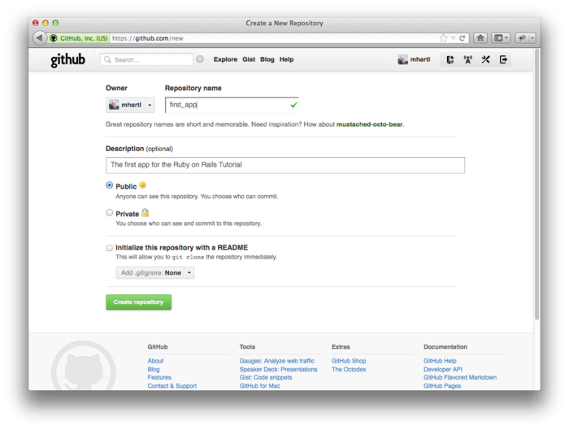

图 1.6：在 GitHub 创建第一个仓库

GitHub 有一些收费的计划，但是对开源项目的代码是免费的，如果你还没有 GitHub 的账户就赶快注册一个[免费的账户](https://github.com/signup/free)吧。（或许你先要参考 GitHub 的“[创建 SSH 密匙](https://help.github.com/articles/generating-ssh-keys)”一文）注册后，点击创建仓库的链接（[New repository](https://github.com/repositories/new)），然后填入所需的信息，如图 1.6 所示。（注意，不要选择使用 `README` 文件初始化仓库（Initialize this repository with a README），因为 `rails new` 已经自动创建了这个文件。）提交表单后，按照下面的方法将你第一个应用程序推送上去：


$ git remote add origin git@github.com:<username>/first_app.git
$ git push -u origin master


上面的代码告诉 Git 你要添加 GitHub 上面的仓库地址为代码的原本，代表本地的主分支（`master`），然后将本地的仓库推送到 GitHub 上。（先不要关心旗标 `-u` 的作用，如果你实在好奇可以搜索“git set upstream”。）当然你要把 `<username>` 换成你真正的用户名。例如，我用 `railstutorial` 这个用户名就要这么做：


$ git remote add origin git@github.com:railstutorial/first_app.git


然后在 GitHub 就有了这个应用程序仓库的页面，页面中有文件浏览功能，包含了完整的提交历史，还有一些其他好玩的功能（如图 1.7）。

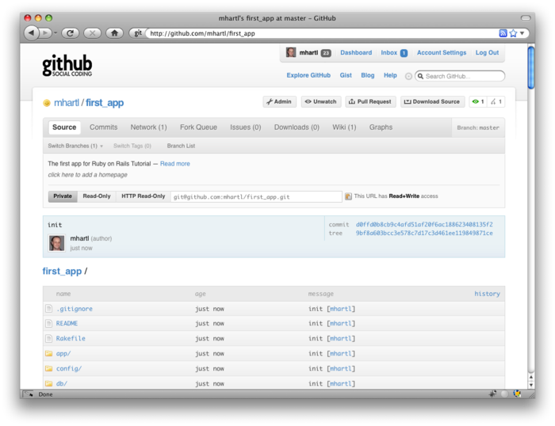

图 1.7：GitHub 仓库页面

GitHub 还提供了增强命令行界面的工具，如果你更喜欢使用 GUI 程序，可以到 [GitHub for Windows](http://windows.github.com/) 和 [GitHub for Mac](http://mac.github.com/) 页面下载。（GitHub 针对 Linux 的工具看样子就是 Git 本身了。）

<h3 id="sec-1-3-5">1.3.5 分支，编辑，提交，合并</h3>

如果你按照 [1.3.4 节](#sec-1-3-4)中所说的做了，或许你已经注意了，GitHub 在仓库的主页面会自动显示 `README` 文件的内容。在这里，因为项目是使用 `rails` 命令生成的，这个 `README` 是 Rails 自带的（如图 1.8）。鉴于 `.rdoc` 扩展名，GitHub 会按照一定的格式显示其内容。但是其内容本身并没有什么意义。在本节，我们将做第一次编辑，修改 `README` 文件的内容来描述我们的项目而不是 Rails 框架。在编辑的过程中你可以看到分支、编辑、提交、合并的工作流，我推荐你在 Git 中使用这样的工作流。

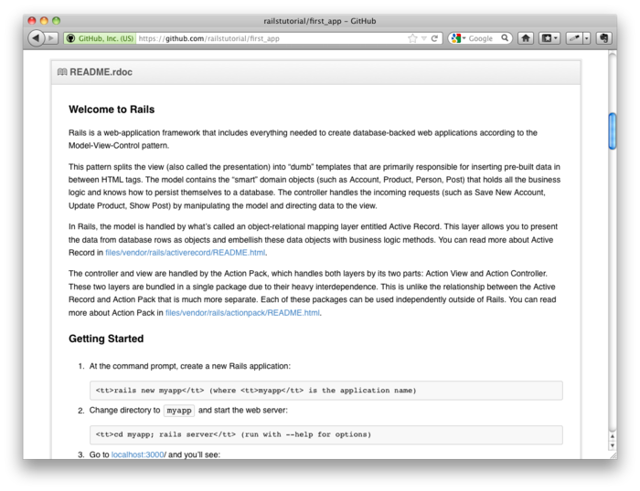

图 1.8：GitHub 中显示的项目初始生成的 <code>README</code> 文件。

<h4>分支</h4>

Git 中的分支功能很强大，分支是对仓库的复制，在分支中所做的改动（或许是实验性质的）不会影响父级文件。大多数情况下，父级仓库是 `master` 分支。我们可以使用 `checkout` 命令，并指定 `-b` 旗标创建一个新分支：


$ git checkout -b modify-README
Switched to a new branch 'modify-README'
$ git branch
master
* modify-README


第二个命令，`git branch`，会将本地所有的分支列出来，分支名前面的星号（`*`）指明当前所在的分支。注意，`git checkout -b modify-README` 会创建一个新分支，然后切换到这个分支，`modify-README` 前面的星号证明了这一点。（如果你在 [1.3 节](#sec-1-3)中设置了别名 `co`，那么你就要使用 `git co -b modify-README` 了。）

分支的唯一价值是在多个开发人员协同开发一个项目时使开发的过程更明了，[19](#fn-19)不过对只有一个开发者的项目（比如本教程）也有用。一般而言，主分支是和从分支隔离开的，所以即便我们搞砸了也只需切换回到主分支并删除从分支来丢掉改动。在本节末尾我们会看到怎么做。

顺便说一下，对于较小的改动我一般不会动用新分支，这里是对好的习惯做一个演示。

<h4>编辑</h4>

创建了从分支后，我们要编辑文件让其更好的描述我们的项目。较之默认的 RDoc 格式，我更喜欢 Markdown 标记语言，如果你的文件扩展名是 `.md`，GitHub 会自动为你排版。首先我们使用 Unix 命令 `mv`（移动，move）的 git 版本来修改文件名，然后写入代码 1.8 所示的内容：


$ git mv README.rdoc README.md
$ subl README.md


**代码 1.8** 新的 `README` 文件，`README.md`


# Ruby on Rails Tutorial: first application

This is the first application for
[*Ruby on Rails Tutorial: Learn Rails by Example*](http://railstutorial.org/)
by [Michael Hartl](http://michaelhartl.com/).


<h4>提交</h4>

改动完毕后，查看一下本分支的状态：


$ git status
# On branch modify-README
# Changes to be committed:
#   (use "git reset HEAD <file>..." to unstage)
#
#       renamed:    README.rdoc -> README.md
#
# Changed but not updated:
#   (use "git add <file>..." to update what will be committed)
#   (use "git checkout -- <file>..." to discard changes in working directory)
#
#       modified:   README.md
#


这时，我们可以使用 [1.3.2 节](#sec-1-3-2)中用到的 `git add .`，但是 Git 提供了旗标 `-a`，它的意思是将现有文件的所有改动（包括使用 `git mv` 创建的文件，对 Git 来说这并不是新的文件）添加进来：


$ git commit -a -m "Improve the README file"
2 files changed, 5 insertions(+), 243 deletions(-)
delete mode 100644 README.rdoc
create mode 100644 README.md


千万别误用了 `-a` 旗标。如果在上次提交之后你向项目添加了新文件的话，首先你要使用 `git add` 告诉 Git 你添加的文件。

注意，提交的信息我们用的是现在时。Git 将提交作为一系列打补丁的活动，在这种情况下说明现在做了什么比说明过去做了什么要更合理。而且这种用法和 Git 生成的提交信息更匹配。更多信息请查看 GitHub 的博文《[Shiny new commit styles](https://github.com/blog/926-shiny-new-commit-styles)》。

<h4>合并</h4>

我们已经修改完了，现在可以将其合并到主分支了：


$ git checkout master
Switched to branch 'master'
$ git merge modify-README
Updating 34f06b7..2c92bef
Fast forward
README.rdoc     |  243 --------------------------------------------------
README.md       |    5 +
2 files changed, 5 insertions(+), 243 deletions(-)
delete mode 100644 README.rdoc
create mode 100644 README.md


注意 Git 经常会显示类似 `34f06b7` 的字符，这是 Git 内部对仓库的指代。你得到的输出结果不会和我的一模一样，但大致相同。

合并完后，我们可以清理一下分支了，使用 `git branch -d` 删除这个从分支：


$ git branch -d modify-README
Deleted branch modify-README (was 2c92bef).


这一步是可选的，事实上一般我们都会留着这个从分支，这样你就可以在主、从分支之间来回切换，在合适的时候将改动合并到主分支中。

如前面提到的，你可以使用 `git branch -D` 放弃对从分支所做的修改：


# For illustration only; don't do this unless you mess up a branch
$ git checkout -b topic-branch
$ <really screw up the branch>
$ git add .
$ git commit -a -m "Major screw up"
$ git checkout master
$ git branch -D topic-branch


和旗标 `-d` 不同，即使还未合并 `-D` 也会删除分支。

<h4>推送</h4>

我们已经更新了 `README` 文件，可以将改动推送到 GitHub 看看改动的结果。因为之前我们已经推送过一次了（[1.3.4 节](#sec-1-3-4)），在大多数系统中我们都可以省略 `origin master`，只要运行 `git push`：


$ git push


正像我们介绍的，GitHub 使用 Markdown 对文件进行了排版（如图 1.9）。

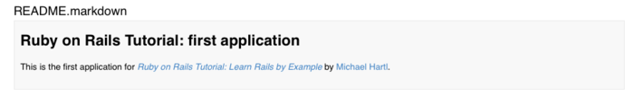

图 1.9：使用 Markdown 排版的改进版 <code>README</code> 文件。

<h2 id="sec-1-4">1.4 部署</h2>

即使现在还处在早期阶段，我们还是要将我们（没什么内容）的 Rails 应用程序部署到生产环境。这一步是可选的，不过在开发过程中尽早、频繁的部署可以尽早的发现开发中的问题。在开发环境中极力解决问题之后再部署,等到发布日期到来时经常会导致严重的问题。[20](#fn-20)

过去部署 Rails 应用程序是很痛苦的事，但最近几年 Rails 开发群体不断的成熟，现在有很多好的解决方案了。这些方案包括运行 [Phusion Passenger](http://www.modrails.com/)（Apache 和 Nginx[21](#fn-21) 网络服务器的一个模块）的共享主机或私有虚拟服务器，[Engine Yard](http://engineyard.com/) 和 [Rails Machine](http://railsmachine.com/) 这种提供全方位部署服务的公司，[Engine Yard Cloud](http://cloud.engineyard.com/) 和 [Heroku](http://heroku.com/) 这种云部署服务。

我最喜欢的部署方案是 Heroku，这是一个特别针对 Rails 和其他 Ruby Web 应用程序[22](#fn-22)的托管平台。Heroku 让 Rails 应用程序的部署变得异常简单，只要你的源码纳入了 Git 版本控制系统就好。（这也是为什么你要按照 [1.3 节](#sec-1-3) 中介绍的步骤安装 Git 的原因，如果你还没有安装就赶快安装吧。）本节下面的内容就是介绍如何将我们的第一个应用程序部署到 Heroku。

<h3 id="sec-1-4-1">1.4.1 搭建 Heroku 部署环境</h3>

首先你要[注册一个 Heroku 账户](http://api.heroku.com/signup)，然后安装 Heroku 提供的 gem：


$ gem install heroku


和 Github 一样（[1.3.4 节](#sec-1-3-4)），使用 Heroku 需要你[创建 SSH 密匙](http://help.github.com/key-setup-redirect)，然后告诉 Heroku 你的“[公匙](http://en.wikipedia.org/wiki/Public-key_cryptography)”，这样你就可以使用 Git 将应用程序的仓库推送到 Heroku 的服务器了：


$ heroku keys:add


最后，使用 `heroku` 命令在 Heroku 的服务器上创建一个区域放置你的应用程序（参照代码 1.9）。

**代码 1.9** 在 Heroku 上新建一个应用程序


$ heroku create --stack cedar
Created http://stormy-cloud-5881.herokuapp.com/ |
git@heroku.com:stormy-cloud-5881.herokuapp.com
Git remote heroku added


（上面代码中 `--stack cedar` 的意思是使用 Heroku 的最新版，Heroku 将其称为“[Celadon Cedar Stack](http://devcenter.heroku.com/articles/cedar)”）。`heroku` 命令会为你的应用程序新建一个子域名，立马就可以生效。当然，现在还看不到内容，让我们开始部署吧。

<h3 id="sec-1-4-2">1.4.2 Heroku 部署步骤一</h3>

要部署到 Heroku，第一步是通过 Git 将应用程序推动到 Heroku 中：


$ git push heroku master


<h3 id="sec-1-4-3">1.4.3 Heroku 部署步骤二</h3>

事实上没有第二步了。我们已经完成部署了（如图 1.10）。你可以通过 `heroku create` 命令给出的地址（参照代码 1.9，但那里的地址是我的应用程序的）查看你刚刚部署的应用程序了。你可以向 `heroku` 命令传递一个参数来让其自动启动浏览器并打开你的地址：


$ heroku open


因为 Heroku 做了特殊设置，“About your application's environment”这个链接是没用的。不过不用担心，这是正常的。在 [5.3.2 节](chapter5.html#sec-5-3-2)中我们会移除这个默认的页面，然后这个错误就不存在了。

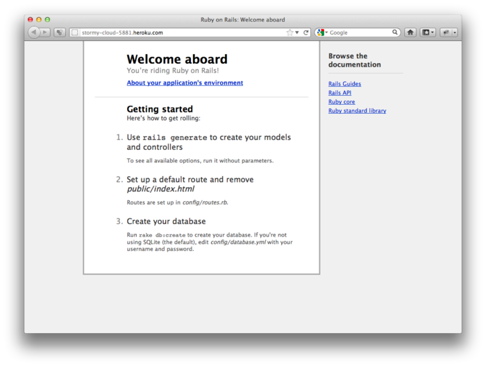

图 1.10：本教程的第一个应用程序运行在 Heroku 上

部署成功后，Heroku 会提供一个很精美的界面管理和设置你的应用程序（如图 1.11）。

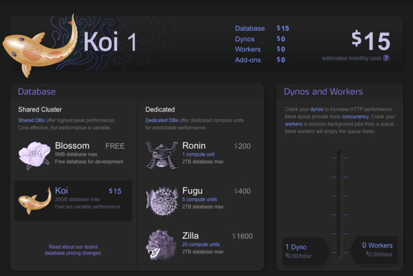

图 1.11：Heroku 提供的精美界面

<h3 id="sec-1-4-4">1.4.4 Heroku 的其他命令</h3>

Heroku 提供了很多[命令](http://devcenter.heroku.com/heroku-command)，本书只介绍了几个基本的。下面再介绍一个命令，用来重命名应用程序：


$ heroku rename railstutorial


你不要再使用这个名字了，我已经使用了。事实上，现在你无需做这样的修改，使用 Heroku 提供的默认值就行。不过如果你真的想重命名你的应用程序，你可以基于安全的考虑使用一些随机或难猜测到的名字，例如：


hwpcbmze.heroku.com
seyjhflo.heroku.com
jhyicevg.heroku.com


使用这样随机的域名，只有你将地址告诉别人他们才能访问你的网站。（顺便说一下，让你一窥 Ruby 的强大，以下是我用来生成随机域名的代码，很精妙吧。）


('a'..'z').to_a.shuffle[0..7].join


除了支持子域名，Heroku 也支持自定义域名。（事实上[本书的网站](http://railstutorial.org/)（译者注：原网站在 Heroku，本中文版在 Github 上）就放在 Heroku 上。如果你阅读的是本书的在线版，你现在就正在浏览一个托管在 Heroku 上的网站。）在 [Heroku 文档](http://devcenter.heroku.com/) 中可以查看更多关于自定义域名的信息以及其他 Heroku 相关的话题。

<h2 id="sec-1-5">1.5 小节</h2>

这一章中做的事情真不少：安装，搭建开发环境，版本控制以及部署。如果你现在想分享阅读本书的进度，你可以发一条推特或者更新 Facebook 状态写上类似下面的内容：

我正在阅读 @railstutorial 学习 Ruby on Rails！ http://railstutorial.org/

	<a class="next_page" href="chapter2.html">第二章 演示程序 &raquo;</a>

1. URI 是统一资源标识符（Uniform Resources Identifier）的简称，较少使用的 URL 是统一资源定位符（Uniform Resource Locator）的简称。在实际使用中，URI 一般和浏览器地址栏中的内容一样。
1. <http://tryruby.org>
1. <http://railsforzombies.org/>
1. <http://railstutorial.org/screencasts>
1. 阅读本书时你会发现内部章节之间的链接很有用，你可以查看引用的内容然后快速的回到之前的位置。在浏览器中阅读时这种操作很简单，直接点击浏览器的后退按钮就可以了，不过 Adobe Reader 和 OS X 的预览程序也为 PDF 提供了这种功能。在 Reader 中，在文档中点击鼠标右键，然后选择“上一个视图”就可以返回了。在预览程序中要使用“浏览（Go）”菜单：浏览->返回（Back）。
1. <http://railstutorial.org/help>
1. <https://github.com/perfectionist/sample_project/wiki>
1. vi 编辑器是 Unix 中古老而强大的强力工具，Vim 是 vi 的增强版（vi improved）。
1. <https://github.com/mhartl/rails_tutorial_sublime_text>
1. 如果你从未使用过 IRC，我建议你先搜索一下“irc client <你的平台>”。OS X 上的客户端有 [Colloquy](http://colloquy.info/) 和 [LimeChat](http://limechat.net/mac/)。当然网页客户端总是可以使用的 <http://webchat.freenode.net/?channels=rvm>。
1. 或许你要安装 [SVN](http://subversion.tigris.org/) 才行。
1. <http://mxcl.github.com/homebrew/>
1. <https://developer.apple.com/downloads/>
1. 如 [1.1.3 节](#sec-1-1-3)中所说，在 Windows 中或许你要输入 `ruby rails server`。
1. 一般情况下网站使用的是 80 端口，但这需要特别的权限，所以 Rails 为开发服务器选择了一个没有受限制的较大值。
1. 这其实是一个特性，因为启动编辑器之后你可以继续使用命令行，不过 git 执行程序在脱离后会关闭文件，返回一个空信息，这就阻碍了提交的进行。我在这里提到这一点是因为如果不说你在使用 `subl` 和 `gvim` 时就会困惑为什么行不通。如果你发现这个注释很难懂那就完全忽略它吧。
1. 如果你没有看到 `.gitignore` 文件，或许你需要设置一下让文件查看器显示隐藏文件。
1. 如果以后你执行 `git status` 看到一些不需要的文件出现了，你就可以将其加入你的 `.gitignore` 文件中。
1. 更多内容请查看《Pro Git》书中的“[Git 分支](http://progit.org/book/ch3-0.html)（[中文版](http://git-scm.com/book/zh/Git-%E5%88%86%E6%94%AF)）”部分。
1. 虽然针对本书的示例程序你无需关心，不过如果你很担心太早的将你的应用程序公开，参考在 [1.4.4 节](#sec-1-4-4)中提供几个方法。
1. 发音为“Engine X”。
1. Heroku 可以正常运行任意一个使用 [Rack 中间件](http://rack.rubyforge.org/)的 Ruby Web 程序，Rack 为 Web 框架和 Web 服务器之间提供了标准接口。Ruby 社区很严格的承袭了这一标准，很多框架都是这样做的，例如 [Sinatra](http://www.sinatrarb.com/)、[Ramaze](http://ramaze.net/)、[Camping](http://camping.rubyforge.org/files/README.html) 和 Rails，这也就意味着 Heroku 基本上支持所有的 Ruby Web 应用程序。
