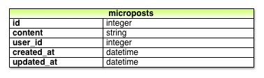

我们在[第九章](chapter9.html)中已经实现了一个完整且符合 REST 架构的资源：用户，本章我们要再实现一个资源：用户微博（micropost）。<sup>[1](#fn-1)</sup>微博是由用户发布的一种简短消息，我们在[第 2 章]中实现过微博雏形。 本章我们会在 [2.3 节](chapter2.html#sec-2-3)的基础上，实现一个功能完善的微博功能。首先，我们要创建微博所需的数据模型，通过  `has_many` 和 `belongs_to` 方法把微博和用户关联起来，再建立处理和显示微博所需的表单及局部视图。在 [第 11 章](chapter11.html)，还要加入关注其他用户的功能，其时，我们这个山寨版 Twitter 才算完成。

如果你使用 Git 做版本控制的话，和之前一样，我建议你新建一个分支：

```sh
$ git checkout -b user-microposts
```

<h2 id="sec-10-1">10.1 微博模型</h2>

实现微博资源的第一步是创建微博所需的数据模型，在模型中设定微博的基本属性。和 [2.3 节](chapter2.html#sec-2-3) 创建的模型类似，我们要实现的 Micropost 模型要包含数据验证，以及和用户模型的关联。除此之外，我们会做充分的测试，指定默认的排序方式，自动删除已注销用户的微博。

<h3 id="sec-10-1-1">10.1.1 基本模型</h3>

微博模型只需要两个属性：其一是 `content`，用来保存微博的内容；<sup>[2](#fn-2)</sup>其二是 `user_id`，把当前微博和用户关联起来。我们使用 `generate model` 命令生成所需的模型，这一点和创建用户模型时是一样的（参见代码 6.1）：

```sh
$ rails generate model Micropost content:string user_id:integer
```

这个命令会生成一个迁移文件，作用是在数据库中生成一个名为 `microposts` 的表（参见代码 10.1）。读者朋友可以和生成 `users` 表的迁移文件对照一下（参见代码 6.2）。

**代码 10.1** 创建微博模型的迁移文件（注意：为 `user_id` 和 `created_at` 列加入了索引）<br />`db/migrate/[timestamp]_create_microposts.rb`

```ruby
class CreateMicroposts < ActiveRecord::Migration
  def change
    create_table :microposts do |t|
      t.string :content
      t.integer :user_id

      t.timestamps
    end
    add_index :microposts, [:user_id, :created_at]
  end
end
```

注意，因为我们设想要按照发布时间的倒序查询某个用户所有的微博，所以在上述代码中为 `user_id` 和 `created_at` 列加入了索引：

```ruby
add_index :microposts, [:user_id, :created_at]
```

我们把 `user_id` 和 `created_at` 放在一个数组中，告诉 Rails 我们要创建的是“多键索引（multiple key index）”，Active Record 便会同时使用这两个键。还要注意 `t.timestamps` 这行，我们在 [6.1.1 节](chapter6.html#sec-6-1-1)中介绍过，它会自动创建 `created_at` 和 `updated_at` 两个属性。在 [10.1.4 节](chapter10.html#sec-10-1-4) 和 [10.2.1 节](chapter10.html#sec-10-2-1) 中才会用到 `created_at`。

我们先参照用户模型的测试（参照代码 6.8），为微博模型编写一些基本的测试。我们要测试微博对象是否可以响应 `content` 和 `user_id` 方法，如代码 10.2 所示。

**代码 10.2** 微博模型测试（初始版）<br />`spec/models/micropost_spec.rb`

```ruby
require 'spec_helper'

describe Micropost do

  let(:user) { FactoryGirl.create(:user) }
  before do
    # This code is wrong!
    @micropost = Micropost.new(content: "Lorem ipsum", user_id: user.id)
  end

  subject { @micropost }

  it { should respond_to(:content) }
  it { should respond_to(:user_id) }
end
```

若要这个测试通过，我们先要执行数据库迁移，再准备好“测试数据库”：

```sh
$ bundle exec rake db:migrate
$ bundle exec rake db:test:prepare
```

执行上面两个命令之后，会生成微博模型，结构如图 10.1 所示。



图 10.1：微博数据模型

然后确认测试是否可以通过：

```sh
$ bundle exec rspec spec/models/micropost_spec.rb
```

测试虽然可以通过，不过你可能注意到代码 10.2 中的这几行代码了：

```ruby
let(:user) { FactoryGirl.create(:user) }
before do
  # This code is wrong!
  @micropost = Micropost.new(content: "Lorem ipsum", user_id: user.id)
end
```

就像其中的注释所说，`before` 块中的代码是错误的。你可以想一下为什么，我们会在下一小节中告诉你答案。

<h3 id="sec-10-1-2">10.1.2 可访问的属性和第一个数据验证</h3>

要知道为什么 `before` 块中的代码是错误的，我们先要为微博模型编写一个数据验证测试，如代码 10.3 所示。（读者朋友可以和代码 6.11 中针对用户模型的测试对比一下。）

**代码 10.3** 测试微博能否通过验证<br />`spec/models/micropost_spec.rb`

```ruby
require 'spec_helper'

describe Micropost do

  let(:user) { FactoryGirl.create(:user) }
  before do
    # This code is wrong!
    @micropost = Micropost.new(content: "Lorem ipsum", user_id: user.id)
  end

  subject { @micropost }

  it { should respond_to(:content) }
  it { should respond_to(:user_id) }

  it { should be_valid }

  describe "when user_id is not present" do
    before { @micropost.user_id = nil }
    it { should_not be_valid }
  end
end
```

这段代码测试了微博是否能够通过验证，以及是否指定了 `user_id` 的值。要想让上述测试通过，我们要按照代码 10.4 所示，加入一个简单的存在性验证。

**代码 10.4** 对微博 `user_id` 属性的验证<br />`app/models/micropost.rb`

```ruby
class Micropost < ActiveRecord::Base
  attr_accessible :content, :user_id
  validates :user_id, presence: true
end
```

现在我就来告诉你为什么 `@micropost = Micropost.new(content: "Lorem ipsum", user_id: user.id)` 是错的。

在 Rails 3.2.3 之前，默认情况下微博模型的所有属性都是可访问的，我们在 [6.1.2.2 节](chapter6.html#sec-6-1-2-2)和 [9.4.1.1 节](chapter9.html#sec-9-4-1-1) 中做过介绍，可访问就意味着任何人都可以篡改微博对象的属性值，然后通过命令行发送非法请求。例如，某非法用户可以篡改微博的 `user_id` 属性，把该微博的作者设定为错误的用户。所以，我们要把 `user_id` 从 `attr_accessible` 定义的就=可访问属性列表中删除。如果你真的删除了，上面的测试也就会失败了。我们会在 [10.1.3 节](#sec-10-1-3)中再次让这个测试通过。
