在这一章中，我们会在现有程序的基础上增加社交功能，允许用户关注（follow）或取消关注其他人，并在用户主页上显示其所关注用户的微博更新。我们还会创建两个页面用来显示关注的用户列表和粉丝列表。我们将会在 [11.1 节](#sec-11-1)学习如何构建用户之间的模型关系，随后在 [11.2 节](#sec-11-2)设计网页界面，同时还会介绍 Ajax。最后，我们会在 [11.3 节](#sec-11-3)实现一个完整的动态列表。

这是本书最后一章，其中会包含了一些本教程中最具有挑战性的内容，为了实现动态列表，我们会使用一些 Ruby/SQL 小技巧。 通过这些例子，你会了解到 Rails 是如何处理更加复杂的数据模型的，而这些知识会在你日后开发其他应用时发挥作用。 为了帮助你平稳地从教程学习过渡到独立开发，在 [11.4 节](#sec-11-4)我们推荐了几个可以在已有微博核心基础上开发的额外功能，以及一些进阶资料的链接。

和之前章节一样，Git 用户应该创建一个新的分支：

```sh
$ git checkout -b following-users
```

因为本章的内容比较有挑战性，在开始编写代码之前，我们先来思考一下网站的界面。 和之前的章节一样，在开发的早期阶段我们会通过构思图来呈现页面。<sup>[1](#fn-1)</sup> 完整的页面流程是这样的：一名用户 (John Calvin) 从他的个人资料页面（如图 11.1 ）浏览到用户索引页面（如图 11.2），关注了一个用户。Calvin 打开另一个用户 Thomas Hobbes 的个人主页（如图 11.3），点击“Follow（关注）”按钮 关注该用户，然后，这个“Follow”按钮会变为“Unfollow（取消关注）” ，而且 Hobbes 的关注人数会增加 1 个（如图 11.4）。接着，Calvin 回到自己的主页，看到关注人数增加了 1 个，在动态列表中也能看到 Hobbes 的状态更新（如图 11.5）。接下来的整章内容就是要实现这样的页面流程。

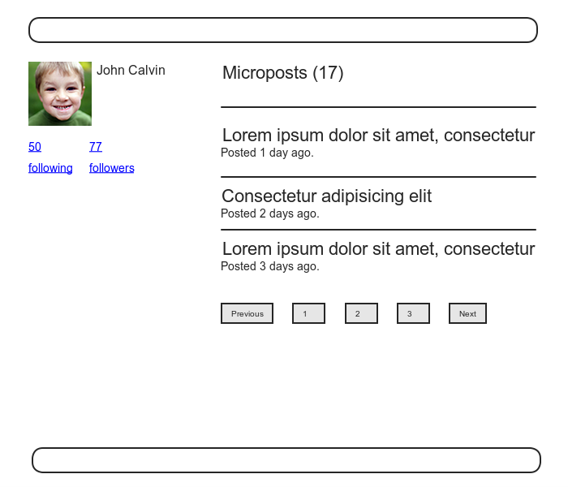

图 11.1：当前登入用户的个人资料页面

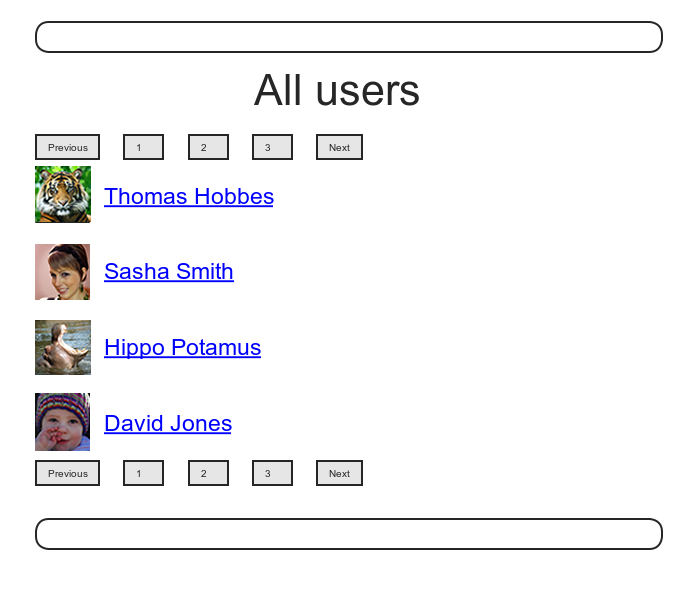

图 11.2：寻找一个用户来关注

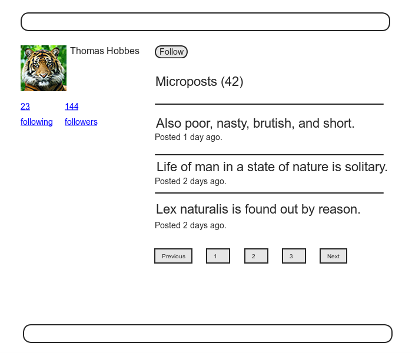

图 11.3：一个想要关注的用户资料页面，显示有关注按钮


图 11.4：关注按钮变为取消关注的同时，关注人数增加了 1 个

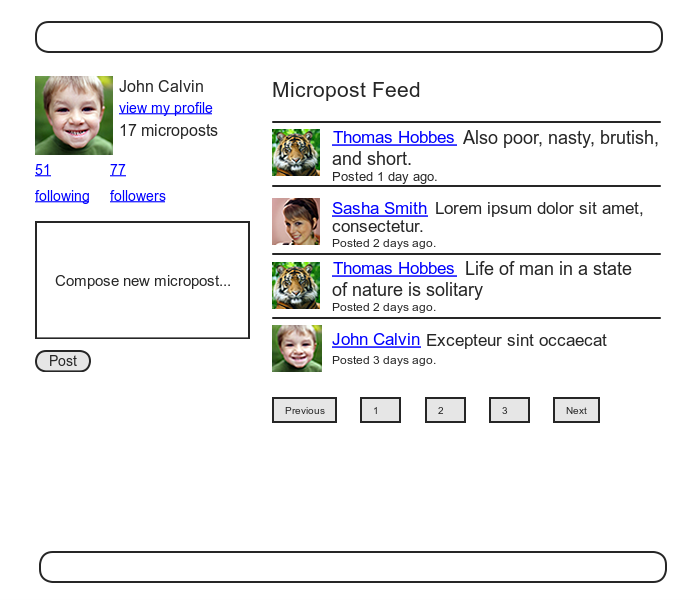

图 11.5：个人主页出现了新关注用户的微博，关注人数增加了 1 个

<h2 id="sec-11-1">11.1 关系模型</h2>

为了实现关注用户这一功能，第一步我们要做的是创建一个看上去并不是那么直观的数据模型。一开始我们可能会认为一个 `has_many` 的数据关系能满足我们的要求：一个用户可以关注多个用户，同时一个用户还能被多个用户关注。但实际上这种关系是存在问题的，下面我们就来学习如何使用 `has_many through` 来解决这个问题。本节很多功能的实现初看起来都有点难以理解，你需要花一点时间思考，才能真正搞清楚这样做的原因。如果在某个地方卡住了，尝试着先往后读，然后再把本节读一遍，看一下刚才卡住的地方想明白了没。

<h3 id="sec-11-1-1">11.1.1 数据模型带来的问题以及解决方式</h3>

构造数据模型的第一步，我们先来看一个典型的情况。假如一个用户关注了另外一个用户，比如 Calvin 关注了 Hobbes，也就是 Hobbes 被 Calvin 关注了，那么 Calvin 就是关注者（follower），而 Hobbes 则是被关注者( followed )。按照 Rails 默认的复数表示习惯， 我们称关注某一特定用户的用户集合为该用户的 followers，`user.followers` 就是这些用户组成的数组。不过，当我们颠倒一下顺序，上述关系则不成立了：默认情况下，所有被关注的用户称为 followeds，这样说在英语语法上并不通顺恰当。我们可以称被关注者为 following，但这个词有些歧义：在英语里，"following" 指关注你的人，和我们想表达的恰恰相反。考虑到上述两种情况，尽管我们将使用“following”作为标签，如“50 following, 75 followers”, 但在数据模型中会使用“followed users”表示我们关注的用户集合，以及一个对应的 `user.followed_users` 数组。<sup>[2](#fn-2)</sup>

经过上述的讨论，我们会按照图 11.6 的方式构建被关注用户的模型，使用 `followed_users` 表实现一对多(`has_many`)关联。由于 `user.followed_users` 应该是一个用户对象组成的数组，所以 `followed_users` 表中的每一行应该对应一个用户，并且指定 `followed_id` 列，和其他用户建立关联。<sup>[3](#fn-3)</sup>除此之外，由于每一行均对应一个用户，所以我们还要在表中加入用户的其他属性，包括名字，密码等。

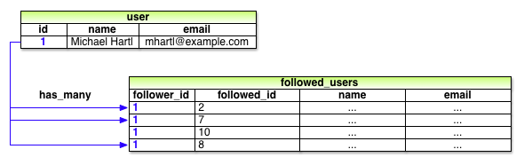

图 11.6：一个简单的用户互相关注实现

图 11.6 中描述的数据模型仍存在一个问题，那就是存在非常多的冗余，每一行不仅包括了所关注用户的 id, 还包括了他们的其他信息，而这些信息在 `users` 表中都有。 更糟糕的是，为了建立关注用户的数据模型，我们还需要一个单独的，同样冗余的 `followers` 表。这最终将导致数据模型极难维护，每当用户修改姓名时，我们不仅要修改用户在 `users` 表中的数据，还要修改 `followed_users` 和 `followers` 表中对应该用户的每一个记录。

造成这个问题的主要原因是，我们缺少了一层抽象。 找到合适抽象的一个方法是，思考我们会如何在应用程序中实现关注用户的操作。在 [7.1.2 节](chapter7.html#sec-7-1-2)中我们介绍过，REST 架构涉及到创建资源和销毁资源两个过程。 由此引出两个问题： 当用户关注另一个用户时，创建了什么？ 当用户取消关注另一个用户是，销毁了什么？

按照 REST 架构的思路再次思考之后，我们会发现，在关注用户的过程中，被创建和被销毁的是两个用户之间的“关系”。在这种“关系”中，一个用户有多个“关系”（`has_many :relationships`），并有很多关注的用户（`followed_users` 或 `followers`)。其实，在图 11.6 中我们已经基本实现了这种“关系”： 由于每一个被关注的用户都是由 `followed_id` 独一无二的标识出来的，我们就可以将 `followed_users` 表转化成 `relationships` 表，删掉用户的详细资料，使用 `followed_id` 从 `users` 表中获得被关注用户的数据。 同样的，这种“关系”反过来，我们可以使用 `follower_id` 获取所有粉丝组成的数组。

为了得到一个由所有被关注用户组成的 `followed_users` 数组，我们可以先获取由 `followed_id` 属性组成的数组，再查找每个用户。不过，如你所想，Rails 为我们提供了一种更简单的方式，那就是 `has_many through`。我们将在 [11.1.4 节](#sec-11-1-4)介绍， Rails 允许我们使用下面这行清晰简洁的代码，通过 `relationships` 表来描述一个用户关注了很多其他用户：

```ruby
has_many :followed_users, through: :relationships, source: "followed_id"
```

这行代码会自动获取被关注用户组成的数组，也就是 `user.followed_users`。 图11.7 描述了这个数据模型。

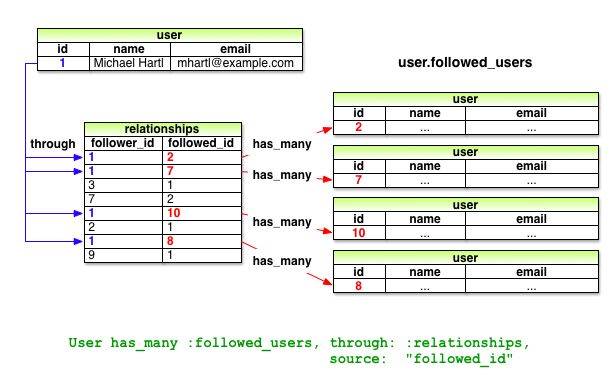

图 11.7：通过 `relationships` 表建立的被关注用户数据模型

下面让我们动手实现，首先我们通过下面的命令创建 Relationship 模型：

```sh
$ rails generate model Relationship follower_id:integer followed_id:integer
```

由于我们需通过 `follower_id` 和 `followed_id` 来查找用户之间的关系，考虑到性能，要为这两列加上索引， 如代码 11.1 所示。

**代码 11.1** 在 `relationships` 表中设置索引<br />`db/migrate/[timestamp]_create_relationships.rb`

```ruby
class CreateRelationships < ActiveRecord::Migration
  def change
    create_table :relationships do |t|
      t.integer :follower_id
      t.integer :followed_id
      t.timestamps
    end

    add_index :relationships, :follower_id
    add_index :relationships, :followed_id
    add_index :relationships, [:follower_id, :followed_id], unique: true
  end
end
```

在代码 11.1 中，我们还设置了一个组合索引（composite index），其目的是确保 (`follower_id, followed_id`) 组合是唯一的，这样用户就无法多次关注同一个用户了 (可以和代码 6.22 中为保持 Email 地址唯一的 index 做比较一下)：

```ruby
add_index :relationships, [:follower_id, :followed_id], unique: true
```

从 [11.1.4 节](#sec-11-1-4)开始，我们会发现，在用户界面中这样的事情是不会发生的，但是添加了组合索引后，如果用户试图二次关注时，程序会抛出异常（例如，使用像 `curl` 这样的命令行程序）。我们也可以在 Relationship 模型中添加唯一性数据验证，但因为每次尝试创建一个重复关系时都会触发错误，所以这个组合索引足以满足我们的需求了。


为了创建 `relationships` 表，和之前一样，我们要先执行数据库迁移，再准备好“测试数据库”：

```sh
$ bundle exec rake db:migrate
$ bundle exec rake db:test:prepare
```

得到的 Relationship 数据模型如图 11.8 所示。

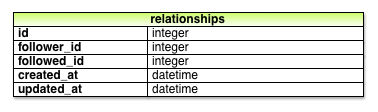

图 11.8：Relationship 数据模型

<h3 id="sec-11-1-2">11.1.2 User 和 Relationship 模型之间的关联</h3>

在着手实现已关注用户和关注者之前，我们先要建立 User 和 Relationship 模型之间的关联关系。一个用户可以有多个“关系”（`has_many` relationships）, 因此一个“关系”涉及到两个用户，所以这个“关系”就同时属于（`belongs_to`）该用户和被关注者。

和 [10.1.3 节](chapter10.html#sec-10-1-3)创建微博一样，我们将通过 User 和 Relationship 模型之间的关联来创建这个“关系”，使用如下的代码实现：

```ruby
user.relationships.build(followed_id: ...)
```

首先，我们来编写测试，如代码 11.2 所示，我们声明了 `relationship` 变量，检查其是否合法，再确认 `follower_id`列是无法访问的。（如果检查可访问属性的测试没有失败，请检查你的 `application.rb` 是否已经按照代码 10.6 做了修改。）

**代码 11.2** 测试建立“关系”以及属性的可访问性<br />`spec/models/relationship_spec.rb`

```ruby
require 'spec helper' describe Relationship do
  let(:follower) { FactoryGirl.create(:user) }
  let(:followed) { FactoryGirl.create(:user) }
  let(:relationship) { follower.relationships.build(followed_id: followed.id) }

  subject { relationship }
  it { should be_valid }

  describe "accessible attributes" do
    it "should not allow access to follower id" do
      expect do
        Relationship.new(follower_id: follower.id)
      end.to raise_error(ActiveModel::MassAssignmentSecurity::Error)
    end
  end
end
```

这里需要注意，与测试 User 和 Micropost 模型时使用 `@user` 和 `@micropost` 不同，代码 11.2 中使用 `let` 代替了实例变量。这两种方式之间几乎没有差别<sup>[4](#fn-4)</sup>，但我认为使用 `let` 相对于使用实例变量更易懂。测试 User 和 Micropost 时之所以使用实例变量，是希望读者早些接触这个重要的概念，而 `let` 则略显高深，所以我们放在这里才用。

同时，在 User 模型中我们还要测试用户对象是否可以响应 `relationships` 方法，如代码 11.3 所示。

**代码 11.3** 测试 `user.relationships`<br />`spec/models/user_spec.rb`

```ruby
require 'spec helper'
describe User do .
  .
  .
  it { should respond_to(:feed) }
  it { should respond_to(:relationships) } .
  .
  .
end
```

此时，你可能会想在程序中中加入类似于 [10.1.3 节](chapter10.html#sec-10-1-3)中用到的代码，我们要添加的代码确实很像，但二者之间有一处很不一样：在 Micropost 模型中， 我们使用

```ruby
class Micropost < ActiveRecord::Base
  belongs_to :user
  .
  .
  .
end
```

和

```ruby
class User < ActiveRecord::Base
  has_many :microposts
  .
  .
  .
end
```

因为 `microposts` 表中存有 `user_id` 属性，可以标示用户（参见 [10.1.1 节](chapter10.html#sec-10-1-1)）。这种连接两个数据表的 id，我们称之为外键（foreign key），当指向 User 模型的外键为 `user_id` 时，Rails 就会自动的获知关联关系，因为默认情况下，Rails 会寻找 `<class>_id` 形式的外键，其中 `<class>` 是模型类名的小写形式。<sup>[5](#fn-5)</sup>现在，尽管我们处理的还是用户，但外键是 `follower_id` 了，所以我们要告诉 Rails 这一变化，如代码 11.4 所示。<sup>[6](#fn-6)</sup>

**代码 11.4** 实现 User 和 Relationship 模型之间 `has_many` 的关联关系<br />`app/models/user.rb`

```ruby
class User < ActiveRecord::Base
  .
  .
  .
  has_many :microposts, dependent: :destroy
  has_many :relationships, foreign_key: "follower_id", dependent: :destroy
  .
  .
  .
```

（由于删除用户后，也应该删除该用户的所有“关系”， 于是我们指定了 `dependent: :destroy` 参数；针对删除效果的测试会留作练习，参见 [11.5 节](#sec-11-5)。）

和 Micropost 模型一样，Relationship 模型和 User 模型之间也有一层 `belongs_to` 关系，此时，这种关系同时属于关注着和被关注着，针对这层“关系”的测试如代码 11.5 所示。

**代码 11.5** 测试 User 和 Relationship 模型之间的 `belongs_to` 关系<br />`spec/models/relationship_spec.rb`

```ruby
describe Relationship do .
  .
  .
  describe "follower methods" do
    it { should respond_to(:follower) }
    it { should respond_to(:followed) }
    its(:follower) { should == follower }
    its(:followed) { should == followed }
  end
end
```

下面我们开始写程序的代码，`belongs_to` 关系的建立和之前一样。Rails 会通过 Symbol 获知外键的名字（例如，`:follower` 对应的外键是 `follower_id`，`:followed` 对应的外键是 `followed_id`），但 Followed 或 Follower 模型是不存在的，因此这里就要使用 `User` 这个类名， 如代码 11.6 所示。注意，与默认生成的 Relationship 模型不同，这里只有 `followed_id` 是可以访问的。

**代码 11.6** 为 Relationship 模型添加 `belongs_to` 关系<br />`app/models/relationship.rb`

```ruby
class Relationship < ActiveRecord::Base
  attr_accessible :followed_id

  belongs_to :follower, class_name: "User"
  belongs_to :followed, class_name: "User"
end
```

尽管直到 [11.1.5 节](#sec-11-1-5)我们才会用到 `followed` 关联，但同时实现 follower 和 followed 关联会更容易理解。

此时，代码 11.2 和代码 11.3 中的测试应该可以通过了。

```sh
$ bundle exec rspec spec/
```

<h3 id="sec-11-1-3">11.1.3 数据验证</h3>

在结束这部分之前，我们将添加一些针对 Relationship 模型的数据验证，确保代码的完整性。测试（代码 11.7）和程序代码（代码 11.8）都非常易懂。

**代码 11.7** 测试 Relationship 模型的数据验证<br />`spec/models/relationship_spec.rb`

```ruby
describe Relationship do .
  .
  .
  describe "when followed id is not present" do
    before { relationship.followed_id = nil }
    it { should_not be_valid }
  end

  describe "when follower id is not present" do
    before { relationship.follower_id = nil }
    it { should_not be_valid }
  end
end
```

**列表 11.8** 添加 Relationship 模型数据验证<br />`app/models/relationship.rb`

```ruby
class Relationship < ActiveRecord::Base
  attr accessible :followed_id

  belongs_to :follower, class_name: "User"
  belongs_to :followed, class_name: "User"

  validates :follower_id, presence: true
  validates :followed_id, presence: true

end
```

<h3 id="sec-11-1-4">11.1.4 被关注的用户</h3>

下面到了 Relationship 关联关系的核心部分了，获取 `followed_users` 和 `followers`。 我们首先从 `followed_users` 开始，测试如代码 11.9 所示。

**列表 11.9** 测试 `user.followed_users` 属性<br />`spec/models/user_spec.rb`

```ruby
require 'spec helper'
describe User do .
  .
  .
  it { should respond_to(:relationships) }
  it { should respond_to(:followed_users) } .
  .
  .
end
```

实现的代码会第一次使用 `has_many through`：用户通过 `relationships` 表拥有多个关注关系，就像图 11.7 所示的那样。默认情况下，在 `has_many through` 关联中，Rails 会寻找关联名单数形式对应的外键，也就是说，像下面的代码

```ruby
has_may :followeds, through: :relationships
```

会使用 `relationships` 表中的 `followed_id` 列生成一个数组。但是，正如在 [11.1.1 节](#sec-11-1-1)中说过的，`user.followeds` 这种说法比较蹩脚，若使用“followed users”作为 “followed”的复数形式会好得多，那么被关注的用户数组就要写成 `user.followed_users` 了。Rails 当然会允许我们重写默认的设置，针对本例，我们可以使用 `:source` 参数，告知 Rails `followed_users` 数组的来源是 `followed` 所代表的 id 集合。

**列表 11.10** 在 User 模型中添加 `followed_users` 关联<br />`app/models/user.rb`

```ruby
class User < ActiveRecord::Base .
  .
  .
  has_many :microposts, dependent: :destroy
  has_many :relationships, foreign_key: "follower_id", dependent: :destroy
  has_many :followed_users, through: :relationships, source: :followed
  .
  .
  .
end
```

为了创建关注关联关系，我们将定义一个名为 `follow!` 的方法，这样我们就能使用 `user.follow!(other_user)` 这样的代码创建关注了。（`follow!` 方法应该与 `create!` 和 `save!` 方法一样，失败时抛出异常，所以我们在后面加上了感叹号。）对应地，我们还会添加一个 `following?` 布尔值方法，检查一个用户是否关注了另一个用户。<sup>[7](#fn-7)</sup>代码 11.11 中的测试表明了我们希望如何使用这两个方法。

**列表 11.11** 测试关注关系用到的方法<br />`spec/models/user_spec.rb`

```ruby
require 'spec helper'

  describe User do .
  .
  .
  it { should respond_to(:followed_users) }
  it { should respond_to(:following?) }
  it { should respond_to(:follow!) }
  .
  .
  .
  describe "following" do
  let(:other_user) { FactoryGirl.create(:user) }
  before do
    @user.save
    @user.follow!(other_user)
  end

  it { should be_following(other_user) }
  its(:followed_users) { should include(other_user) } end
end
```

在实现的代码中，`following` 方法接受一个用户对象作为参数，参数名为 `other_user`，检查这个被关注者的 id 在数据库中是否存在；`follow!` 方法直接调用 `create!` 方法，通过和 Relationship 模型的关联来创建关注关系，如代码 11.12 所示。

**代码 11.12** 定义 `following?` 和 `follow!` 方法<br />`app/models/user.rb`

```ruby
class User < ActiveRecord::Base .
    .
    .
    def feed
    .
    .
    .
    end

    def following?(other_user)
      relationships.find_by_followed_id(other_user.id)
    end


    def follow!(other_user)
      relationships.create!(followed_id: other_user.id)
    end
    .
    .
    .
end
```

注意，在代码 11.12 中我们忽略了用户对象自身，直接写成

```ruby
relationships.create!(…)
```

而不是等效的

```ruby
self.relationships.create!(…)
```

是否使用 `self` 关键字只是个人偏好而已。

当然，用户应该既能关注也能取消关注，那么还应该有一个 `unfollow!` 方法，如代码 11.13 所示。<sup>[8](#fn-8)</sup>

**代码 11.13** 测试取消关注用户<br />`spec/models/user_spec.rb`

```ruby
require 'spec helper'

  describe User do

    .
    .
    .
    it { should respond_to(:follow!) }
    it { should respond_to(:unfollow!) }
    .
    .
    .
    describe "following" do
      .
      .
      .
      describe "and unfollowing" do
        before { @user.unfollow!(other_user) }
        it { should_not be following(other_user) }
        its(:followed_users) { should_not include(other_user) }
      end
    end
  end
```

`unfollow!` 方法的定义很容易理解，通过 `followed_id` 找到对应的“关系”删除就行了，如代码 11.14 所示。

**代码 11.14** 删除“关系”取消关注用户<br />`app/models/user.rb`

```ruby
class User < ActiveRecord::Base
  .
  .
  .
  def following?(other_user)
    relationships.find_by_followed_id(other_user.id)
  end

  def follow!(other_ser)
    relationships.create!(followed_id: other_user.id)
  end

  def unfollow!(other_user)
    relationships.find_by_followed_id(other_user.id).destroy
  end
  .
  .
  .
end
```

<h3 id="sec-11-1-5">11.1.5 粉丝</h3>

关注关系的最后一部分是定义和 `user.followed_users` 相对应的 `user.followers` 方法。从图 11.7 你或许发现了，获取粉丝数组所需的数据都已经存入 `relationships` 表中了。这里我们用到的方法和实现被关注者时一样，只要对调 `follower_id` 和 `followed_id` 的位置即可。这说明， 只要我们对调这两列的位置，组建成 `reverse_relationships` 表（如图 11.9 所示），`user.followers` 方法的定义就很容易了。

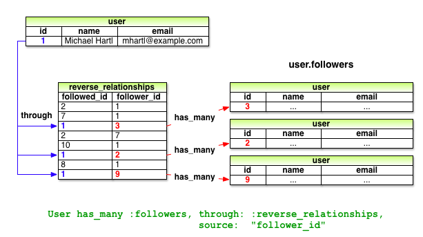

图 11.9：使用倒转后的 Relationship 模型获取粉丝

我们先来编写测试，相信神奇的 Rails 将再一次显现威力，如代码 11.15 所示。

**代码 11.15** 测试对调后的关注关系<br />`spec/models/user_spec.rb`

```ruby
require 'spec helper'
describe User do

  .
  .
  .
  it { should respond_to(:relationships) }
  it { should respond_to(:followed_users) }
  it { should respond_to(:reverse_relationships) }
  it { should respond_to(:followers) }
  .
  .
  .

  describe "following" do .
    .
    .
    it { should be_following(other_user) }
    its(:followed_users) { should include(other_user) }

    describe "followed user" do
      subject { other_user }
    its(:followers) { should include(@user) }
    end
    .
    .
    .
  end
end
```

注意一下上述代码中，我们是如何使用 `subject` 来转变测试对象的，我们从 `@user` 转到了 `other_user`，然后，我们就能使用下面下面这种很自然的方式测试粉丝中是否包含 `@user` 了：

```ruby
subject { other_user }
its(:followers) { should include(@user) }
```

你可能已经想到了，我们不会再建立一个完整的数据表来存放倒转后的关注关系。事实上，我们会通过被关注者和粉丝之间的对称关系来模拟一个 `reverse_relationships` 表，主键设为 `followed_id`。也就是说，`relationships` 表使用 `follower_id` 做外键：

```ruby
has_many :relationships, foreign_key: "follower_id"
```

那么，`reverse_relationships` 虚拟表就用 `followed_id` 做外键：

```ruby
has_many :reverse_relationships, foreign_key: "followed_id"
```

粉丝的关联就建立在这层反转的关系上，如代码 11.16 所示。

**代码 11.16** 通过反转的关系实现 `user.followers`<br />`app/models/user.rb`

```ruby
class User < ActiveRecord::Base
  .
  .
  .
  has_many :reverse_relationships, foreign_key: "followed_id",
    class_name: "Relationship",
    dependent: :destroy
  has_many :followers, through: :reverse_relationships, source: :follower
  .
  .
  .
end
```


（和代码 11.4 一样，针对 `dependent :destroy` 的测试会留作练习，参见 [11.5 节](#sec-11-1-5)。） 注意为了实现数据表之间的关联，我们要指定类名：

```ruby
has_many :reverse_relationships, foreign_key: "followed_id",
                                 class_name: "Relationship"
```

如果没有指定类名，Rails 会尝试寻找 `ReverseRelationship` 类，而这个类并不存在。

还有一点值得注意一下，在里我们其实可以省略 `:source` 参数，使用下面的简单方式

```ruby
has_many :followers, through: :reverse_relationships
```

对 `:followers` 属性而言，Rails 会把“followers”转成单数形式，自动寻找名为 `follower_id` 的外键。在此我保留了 `:source` 参数是为了保持与 `has_many :followed_users` 关系之间结构上的对称，你也可以选择去掉它。

加入代码 11.16 之后，关注者和粉丝之间的关联就完成了，所有的测试应该都可以通过了：

```sh
$ bundle exec rspec spec/
```

<h2 id="sec-11-2">11.2 关注用户功能的网页界面</h2>

在本章的导言中，我们介绍了关注用户功能的操作流程。本节我们会实现这些构思的基本界面，以及关注和取消关注操作。同时，我们还会创建两个页面，分别列出关注的用户和粉丝。在 [11.3 节](#sec-11-3)中我们会加入用户的动态列表，其时，这个示例程序才算完成。

<h3 id="sec-11-2-1">11.2.1 用户关注用到的示例数据</h3>

和之前的几章一样，我们会使用 Rake 任务生成示例数据，向数据库中存入临时的用户关注关联数据。有了这些示例数据，我们就可以先开发网页，而把后端功能的实现放在本节的最后。

我们在代码 10.23 中用到的示例数据生成器有点乱，所以现在我们要分别定义两个方法，用来生成用户和微博示例数据，然后再定义 `make_relationships` 方法，生成用户关注关联数据，如代码 11.17 所示。

**代码 11.17** 加入用户关注关联示例数据<br />`lib/tasks/sample_data.rake`

```ruby
namespace :db do
  desc "Fill database with sample data"
  task populate: :environment do
    make_users
    make_microposts
    make_relationships
  end
end

def make_users
  admin = User.create!(name:     "Example User",
                       email:    "example@railstutorial.org",
                       password: "foobar",
                       password_confirmation: "foobar")
  admin.toggle!(:admin)
  99.times do |n|
    name  = Faker::Name.name
    email = "example-#{n+1}@railstutorial.org"
    password  = "password"
    User.create!(name:     name,
                 email:    email,
                 password: password,
                 password_confirmation: password)
  end
end

def make_microposts
  users = User.all(limit: 6)
  50.times do
    content = Faker::Lorem.sentence(5)
    users.each { |user| user.microposts.create!(content: content) }
  end
end

def make_relationships
  users = User.all
  user  = users.first
  followed_users = users[2..50]
  followers      = users[3..40]
  followed_users.each { |followed| user.follow!(followed) }
  followers.each      { |follower| follower.follow!(user) }
end
```

用户关注关联的示例数据是由下面的代码生成的：

```ruby
def make_relationships
  users = User.all
  user  = users.first
  followed_users = users[2..50]
  followers      = users[3..40]
  followed_users.each { |followed| user.follow!(followed) }
  followers.each      { |follower| follower.follow!(user) }
end
```

我们的安排是随机的，让第 1 个用户关注第 3 到第 51 个用户，再让第 4 到第 41 个用户关注第 1 个用户。形成了这样的用户关注网，就足够用来开发程序的界面了。

和之前一样，要想运行代码 11.17，就要执行下面的数据库命令：

```sh
$ bundle exec rake db:reset
$ bundle exec rake db:populate
$ bundle exec rake db:test:prepare
```

<h3 id="sec-11-2-2">11.2.2 数量统计和关注表单</h3>

现在用户已经有关注的人和粉丝了，我们要更新一下用户资料页面和首页，把这些变动显示出来。首先，我们要创建一个关注和取消关注的表单，然后再创建显示被关注用户列表和粉丝列表的页面。

我们在 [11.1.1 节](#sec-11-1-1)中说过，“following”这个词作为属性名是有点奇怪的（因为 `user.following` 既可以理解为被关注的用户，也可以理解为关注的用户），但可以作为标签使用，例如，可以说“50 following”。其实，Twitter 就使用了这种标签形式，图 11.1 中的构思图沿用了这种表述，这部分详细的构思如图 11.10 所示。

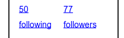

图 11.10：数量统计局部视图的构思图

图 11.10 中显示的数量统计包含了当前用户关注的用户和关注了该用户的粉丝数，二者又分别链接到了各自详细的用户列表页面。在[第五章](chapter5.html)中，我们使用 `#` 占位符代替真实的网址，因为那时我们还没怎么接触路由。现在，虽然在 [11.2.3 节](#sec-11-2-3)中才会创建所需的页面，不过我们可以先设置路由，如代码 11.18 所示。这段代码在 `resources` 块中使用了 `:member` 方法，以前没用过，你可以猜测一下这个方法的作用是什么。（注意，代码 11.18 是用来替换原来的 `resources :users` 的。）

**代码 11.18** 把 `following` 和 `folloers` 动作加入 Users 控制器的路由中<br />`config/routes.rb`

```ruby
SampleApp::Application.routes.draw do
  resources :users do
    member do
      get :following, :followers
    end
  end
  .
  .
  .
end
```

你可能猜到了，设定上述路由后，得到的 URI 地址应该是类似 /users/1/following 和 /users/1/followers 这种形式，不错，代码 11.18 的作用确实如此。因为这两个页面都是用来**显示**数据的，所以我们使用了 `get` 方法，指定这两个地址响应的是 GET 请求。（符合 REST 架构对这种页面的要求）。路由设置中使用的 `member` 方法作用是，设置这两个动作对应的 URI 地址中应该包含用户的 id。类似地，我们还可以使用 `collection` 方法，但 URI 中就没有用户 id 了，所以，如下的代码

```ruby
resources :users do
  collection do
    get :tigers
  end
end
```

设定路由后得到的 URI 是 /users/tigers（可以用来显示程序中所有的老虎）。关于路由的这种设置，更详细的说明可以阅读 Rails 指南中的《[Rails Routing from the Outside In](http://guides.rubyonrails.org/routing.html)》一文。代码 11.18 所生成的路由如[表格 11.1](#table-11-1) 所示。请留意一下被关注用户和粉丝页面的具名路由是什么，稍后我们会用到。为了避免用词混淆，在“following”路由中我们没有使用“followed users”这种说法，而沿用了 Twitter 的方式，采用“following”这个词，因为“followed users” 这种用法会生成 `followed_users_user_path` 这种奇怪的具名路由。如[表格 11.1](#table-11-1) 所示，我们选择使用“following”这个词，因此得到的具名路由是 `following_user_path`。

<table id="table-11-1" class="tabular">
  <tbody>
    <tr>
      <th class="align_left"><strong>HTTP 请求</strong></th>
      <th class="align_left"><strong>URI</strong></th>
      <th class="align_left"><strong>动作</strong></th>
      <th class="align_left"><strong>具名路由</strong></th>
    </tr>
    <tr class="top_bar">
      <td class="align_left"><tt>GET</tt></td>
      <td class="align_left">/users/1/following</td>
      <td class="align_left"><code>following</code></td>
      <td class="align_left"><code>following_user_path(1)</code></td>
    </tr>
    <tr>
      <td class="align_left"><tt>GET</tt></td>
      <td class="align_left">/users/1/followers</td>
      <td class="align_left"><code>followers</code></td>
      <td class="align_left"><code>followers_user_path(1)</code></td>
    </tr>
  </tbody>
</table>

表格 11.1：代码 11.18 中设置的路由生成的 REST 路由

设好了路由后，我们来编写对数量统计局部视图的测试。（原本我们可以先写测试的，但是如果没加入所需的路由设置，可能无从下手编写测试。）数量统计局部视图会出现在用户资料页面和首页中，代码 11.19 只对首页进行了测试。

**代码 11.19** 测试首页中显示的关注和粉丝数量统计<br />`spec/requests/static_pages_spec.rb`

```ruby
require 'spec_helper'

describe "StaticPages" do
  .
  .
  .
  describe "Home page" do
    .
    .
    .
    describe "for signed-in users" do
      let(:user) { FactoryGirl.create(:user) }
      before do
        FactoryGirl.create(:micropost, user: user, content: "Lorem")
        FactoryGirl.create(:micropost, user: user, content: "Ipsum")
        sign_in user
        visit root_path
      end

      it "should render the user's feed" do
        user.feed.each do |item|
          page.should have_selector("li##{item.id}", text: item.content)
        end
      end

      describe "follower/following counts" do
        let(:other_user) { FactoryGirl.create(:user) }
        before do
          other_user.follow!(user)
          visit root_path
        end

        it { should have_link("0 following", href: following_user_path(user)) }
        it { should have_link("1 followers", href: followers_user_path(user)) }
      end
    end
  end
  .
  .
  .
end
```

上述测试的核心是，检测页面中是否显示了关注和粉丝数，以及是否指向了正确的地址：

```ruby
it { should have_link("0 following", href: following_user_path(user)) }
it { should have_link("1 followers", href: followers_user_path(user)) }
```

我们用到了[表格 11.1](#table-11-1)中的具名路由来测试链接是否指向了正确的地址。还有一处要注意一下，这里的“followers”是作为标签使用的，所以我们会一直用复数形式，即使只有一个粉丝也是如此。

数量统计局部视图的代码很简单，在一个 `div` 元素中显示几个链接就行了，如代码 11.20 所示。

**代码 11.20** 显示关注数量统计的局部视图<br />`app/views/shared/_stats.html.erb`

```erb
<% @user ||= current_user %>
<div class="stats">
  <a href="<%= following_user_path(@user) %>">
    <strong id="following" class="stat">
      <%= @user.followed_users.count %>
    </strong>
    following
  </a>
  <a href="<%= followers_user_path(@user) %>">
    <strong id="followers" class="stat">
      <%= @user.followers.count %>
    </strong>
    followers
  </a>
</div>
```

因为这个局部视图会同时在用户资料页面和首页中显示，所以在代码 11.20 的第一行中，我们要获取正确的用户对象：

```erb
<% @user ||= current_user %>
```

我们在[旁注 8.2](chapter8.html#box-8-2)中介绍过这样的用法，如果 `@user` 不是 `nil`（在用户资料页面），这行代码就没什么效果，而如果是 `nil`（在首页）， 就会把当前用户对象赋值给 `@user`。

还有一处也要注意一下，关注数量和粉丝数量是通过关联获取的，分别使用 `@user.followed_users.count` 和 `@user.followers.count`。

我们可以和代码 10.20 中获取微博数量的代码对比一下，微博的数量是通过 `@user.microposts.count` 获取的。

最后还有一些细节需要注意下，那就是某些元素的 CSS id，例如

```html
<strong id="following" class="stat">
...
</strong>
```

这些 id 是为 [11.2.5 节](#sec-11-2-5)中实现 Ajax 功能服务的，Ajax 会通过独一无二的 id 获取页面中的元素。

编好了局部视图，把它放入首页中就很简单了，如代码 11.21 所示。（加入局部视图后，代码 11.19 中的测试也就会通过了。）

**代码 11.21** 在首页中显示的关注和粉丝数量统计<br />`app/views/static_pages/home.html.erb`

```erb
<% if signed_in? %>
      .
      .
      .
      <section>
        <%= render 'shared/user_info' %>
      </section>
      <section>
        <%= render 'shared/stats' %>
      </section>
      <section>
        <%= render 'shared/micropost_form' %>
      </section>
      .
      .
      .
<% else %>
  .
  .
  .
<% end %>
```

我们会添加一些 SCSS 代码来美化一下数量统计部分，如代码 11.22 所示（这段代码包含了本章用到的所有样式）。添加样式后的页面如图 11.11 所示。

**代码 11.22** 首页侧边栏的 SCSS 样式<br />`app/assets/stylesheets/custom.css.scss`

```scss
.
.
.

/* sidebar */
.
.
.
.stats {
  overflow: auto;
  a {
    float: left;
    padding: 0 10px;
    border-left: 1px solid $grayLighter;
    color: gray;
    &:first-child {
      padding-left: 0;
      border: 0;
    }
    &:hover {
      text-decoration: none;
      color: $blue;
    }
  }
  strong {
    display: block;
  }
}

.user_avatars {
  overflow: auto;
  margin-top: 10px;
  .gravatar {
    margin: 1px 1px;
  }
}
.
.
.
```

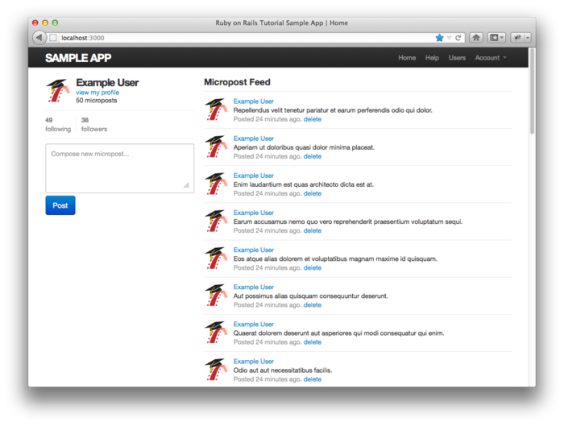

图 11.11：显示了关注数量统计的首页

稍后我们再把数量统计局部视图加入用户资料页面，现在先来编写关注和取消关注按钮的局部视图，如代码 11.23 所示。

**代码 11.23** 关注和取消关注表单<br />`app/views/users/_follow_form.html.erb`

```erb
<% unless current_user?(@user) %>
  <div id="follow_form">
  <% if current_user.following?(@user) %>
    <%= render 'unfollow' %>
  <% else %>
    <%= render 'follow' %>
  <% end %>
  </div>
<% end %>
```

这段代码其实也没做什么，只是把具体的工作分配给 `follow` 和 `unfollow` 局部视图了，这样我们就要再次设置路由，加入 Relationships 资源，参照 Microposts 资源的设置（参见代码 10.25），如代码 11.24 所示。

**代码 11.24** 添加 Relationships 资源的路由设置<br />`config/routes.rb`

```ruby
SampleApp::Application.routes.draw do
  .
  .
  .
  resources :sessions,      only: [:new, :create, :destroy]
  resources :microposts,    only: [:create, :destroy]
  resources :relationships, only: [:create, :destroy]
  .
  .
  .
end
```

`follow` 和 `unfollow` 局部视图的代码分别如代码 11.25 和代码 11.26 所示。

**代码 11.25** 关注用户的表单<br />`app/views/users/_follow.html.erb`

```erb
<%= form_for(current_user.relationships.build(followed_id: @user.id)) do |f| %>
  <div><%= f.hidden_field :followed_id %></div>
  <%= f.submit "Follow", class: "btn btn-large btn-primary" %>
<% end %>
```

**代码 11.26** 取消关注用户的表单<br />`app/views/users/_unfollow.html.erb`

```erb
<%= form_for(current_user.relationships.find_by_followed_id(@user),
             html: { method: :delete }) do |f| %>
  <%= f.submit "Unfollow", class: "btn btn-large" %>
<% end %>
```

这两个表单都使用了 `form_for` 来处理 Relationship 模型对象，二者之间主要的不同点是，代码 11.25 中的代码是构建一个新的“关系”，而代码 11.26 是查找现有的“关系”。很显然，第一个表单会向 Relationships 控制器发送 POST 请求，创建“关系”；而第二个表单发送的是 DELETE 请求，销毁“关系”。（两个表单用到的动作会在 [11.2.4 节](#sec-11-2-4)编写。）你可能还注意到了，这两个表单中除了按钮之外什么内容也没有，但是还要传送 `followed_id`，我们会调用 `hidden_fields` 方法将其加入，生成的 HTML 如下：

```html
<input id="followed_relationship_followed_id"
       name="followed_relationship[followed_id]"
       type="hidden" value="3" />
```

隐藏的 `input` 表单域会把所需的信息包含在表单中，但是在浏览器中不会显示出来。

现在我们可以在页面中加入关注表单和关注数量统计了，只需渲染相应的局部视图即可，如代码 11.27 所示。在用户资料页面中，根据实际的关注情况，会分别显示关注按钮或取消关注按钮，如图 11.12 和图 11.13 所示。

**代码 11.27** 在用户资料页面加入关注表单和关注数量统计<br />`app/views/users/show.html.erb`

```erb
<% provide(:title, @user.name) %>
<div class="row">
  <aside class="span4">
    <section>
      <h1>
        <%= gravatar_for @user %>
        <%= @user.name %>
      </h1>
    </section>
    <section>
      <%= render 'shared/stats' %>
    </section>
  </aside>
  <div class="span8">
    <%= render 'follow_form' if signed_in? %>
    .
    .
    .
  </div>
</div>
```

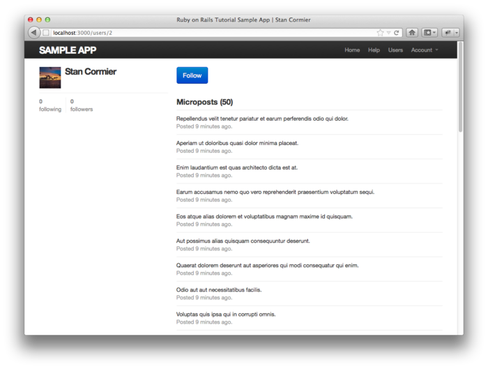

图 11.12：显示了关注按钮的用户资料页面（[/users/2](http://localhost:3000/users/2)）

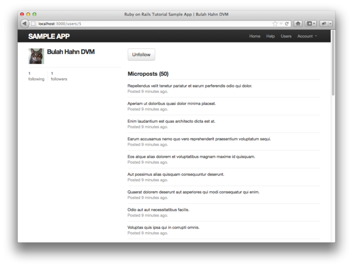

图 11.13：显示了取消关注按钮的用户资料页面（[/users/6](http://localhost:3000/users/6)）

稍后我们会让这些按钮起作用，而且我们会使用两种实现方式，一种是常规方式（[11.2.4 节](#sec-11-2-4)），另一种是使用 Ajax 的方式（[11.2.5 节](#sec-11-2-5)）。不过在此之前，我们要完成用户界面的制作，创建显示关注的用户列表和粉丝列表的页面。

<h3 id="sec-11-2-3">11.2.3 关注列表和粉丝列表页面</h3>

显示关注列表和粉丝列表的页面基本上是重组用户的资料页面和用户索引页面（参见 [9.3.1 节](chapter9.html#sec-9-3-1)），在侧边栏中显示用户的信息（包括关注数量统计），再列出用户列表。除此之外，还会在侧边栏中显示一个由用户的头像组成的栅格。构思图如图 11.14（关注的人）和图 11.15（粉丝们）所示。

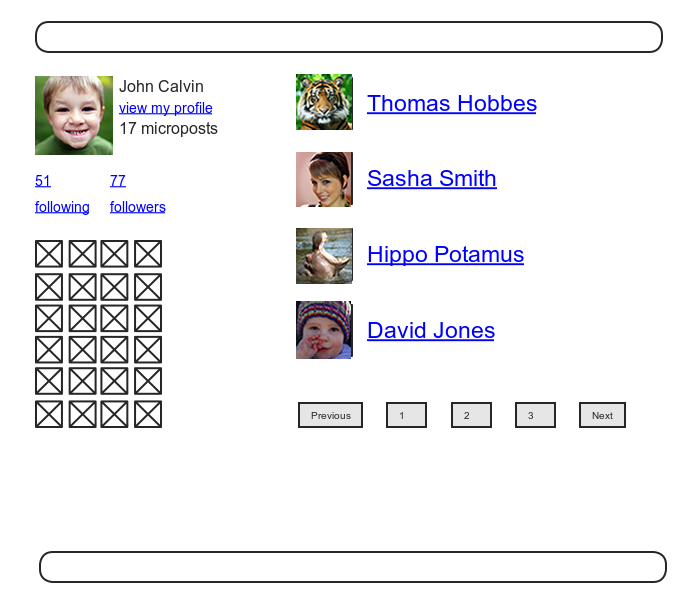

图 11.14：关注列表页面的构思图

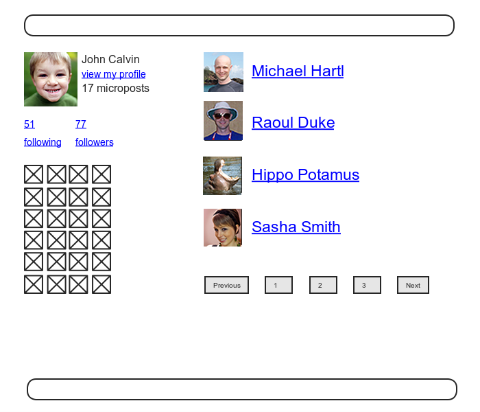

图 11.15：粉丝列表页面的构思图

首先，我们要让这两个页面的地址可访问，按照 Twitter 的方式，访问这两个页面都需要先登录，测试如代码 11.28 所示。用户登录后，页面中应该分别显示关注的用户列表和粉丝列表，测试如代码 11.29 所示。

**代码 11.28** 测试关注列表和粉丝列表页面的访问权限设置<br />`spec/requests/authentication_pages_spec.rb`

```ruby
require 'spec_helper'

describe "Authentication" do
  .
  .
  .
  describe "authorization" do

    describe "for non-signed-in users" do
      let(:user) { FactoryGirl.create(:user) }

      describe "in the Users controller" do
        .
        .
        .
        describe "visiting the following page" do
          before { visit following_user_path(user) }
          it { should have_selector('title', text: 'Sign in') }
        end

        describe "visiting the followers page" do
          before { visit followers_user_path(user) }
          it { should have_selector('title', text: 'Sign in') }
        end
      end
      .
      .
      .
    end
    .
    .
    .
  end
  .
  .
  .
end
```

**代码 11.29** 测试关注列表和粉丝列表页面<br />`spec/requests/user_pages_spec.rb`

```ruby
require 'spec_helper'

describe "User pages" do
  .
  .
  .
  describe "following/followers" do
    let(:user) { FactoryGirl.create(:user) }
    let(:other_user) { FactoryGirl.create(:user) }
    before { user.follow!(other_user) }

    describe "followed users" do
      before do
        sign_in user
        visit following_user_path(user)
      end

      it { should have_selector('title', text: full_title('Following')) }
      it { should have_selector('h3', text: 'Following') }
      it { should have_link(other_user.name, href: user_path(other_user)) }
    end

    describe "followers" do
      before do
        sign_in other_user
        visit followers_user_path(other_user)
      end

      it { should have_selector('title', text: full_title('Followers')) }
      it { should have_selector('h3', text: 'Followers') }
      it { should have_link(user.name, href: user_path(user)) }
    end
  end
end
```

在这两个页面的实现过程中，唯一一处很难想到的地方是，要意识到我们需要在 Users 控制器中添加两个动作，按照代码 11.18 中路由的设置，这两个动作分别名为 `following` 和 `followers`。在这两个动作中，需要设置页面的标题，查询用户，分别获取 `@user.followed_users` 和 `@user.followers`（要分页显示），然后再渲染页面，如代码 11.30 所示。

**代码 11.30** `following` 和 `followers` 动作<br />`app/controllers/users_controller.rb`

```ruby
class UsersController < ApplicationController
  before_filter :signed_in_user,
                only: [:index, :edit, :update, :destroy, :following, :followers]
  .
  .
  .
  def following
    @title = "Following"
    @user = User.find(params[:id])
    @users = @user.followed_users.paginate(page: params[:page])
    render 'show_follow'
  end

  def followers
    @title = "Followers"
    @user = User.find(params[:id])
    @users = @user.followers.paginate(page: params[:page])
    render 'show_follow'
  end
  .
  .
  .
end
```

注意，在这两个动作中都明确的调用了 `render` 方法，渲染一个名为 `show_follow` 的视图，接下来我们就来编写这个视图。这两个动作之所以使用同一个视图，是因为两种情况用到的 ERb 代码差不多，如代码 11.31 所示。

**代码 11.31** 渲染关注列表和粉丝列表的 `show_follow` 视图<br />`app/views/users/show_follow.html.erb`

```erb
<% provide(:title, @title) %>
<div class="row">
  <aside class="span4">
    <section>
      <%= gravatar_for @user %>
      <h1><%= @user.name %></h1>
      <span><%= link_to "view my profile", @user %></span>
      <span><b>Microposts:</b> <%= @user.microposts.count %></span>
    </section>
    <section>
      <%= render 'shared/stats' %>
      <% if @users.any? %>
        <div class="user_avatars">
          <% @users.each do |user| %>
            <%= link_to gravatar_for(user, size: 30), user %>
          <% end %>
        </div>
      <% end %>
    </section>
  </aside>
  <div class="span8">
    <h3><%= @title %></h3>
    <% if @users.any? %>
      <ul class="users">
        <%= render @users %>
      </ul>
      <%= will_paginate %>
    <% end %>
  </div>
</div>
```

这时，测试应该可以通过了，页面也能正常显示了，如图 11.16（关注的人）和图 11.17（粉丝们）所示。

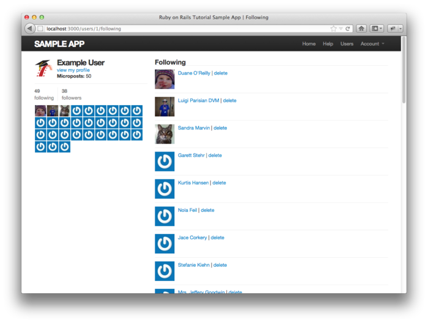

图 11.16：显示当前用户关注的人

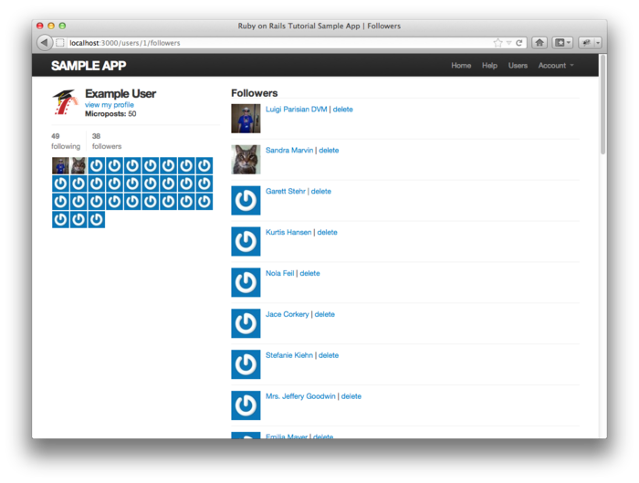

图 11.17：显示当前用户的粉丝

<h3 id="sec-11-2-4">11.2.4 关注按钮的常规实现方式</h3>

创建好了视图后，我们就要让关注和取消关注按钮起作用了。针对这两个按钮的测试用到了本教程中介绍的很多测试技术，也是对代码阅读能力的考察。请认真的阅读代码 11.32，直到你理解了测试的内容以及为什么这么做，再阅读后面的内容。（这段代码中有一处很小的安全疏漏，看一下你是否能发现。稍后我们会说明。）

**代码 11.32** 测试关注和取消关注按钮<br />`spec/requests/user_pages_spec.rb`

```ruby
require 'spec_helper'

describe "User pages" do
  .
  .
  .
  describe "profile page" do
    let(:user) { FactoryGirl.create(:user) }
    .
    .
    .
    describe "follow/unfollow buttons" do
      let(:other_user) { FactoryGirl.create(:user) }
      before { sign_in user }

      describe "following a user" do
        before { visit user_path(other_user) }

        it "should increment the followed user count" do
          expect do
            click_button "Follow"
          end.to change(user.followed_users, :count).by(1)
        end

        it "should increment the other user's followers count" do
          expect do
            click_button "Follow"
          end.to change(other_user.followers, :count).by(1)
        end

        describe "toggling the button" do
          before { click_button "Follow" }
          it { should have_selector('input', value: 'Unfollow') }
        end
      end

      describe "unfollowing a user" do
        before do
          user.follow!(other_user)
          visit user_path(other_user)
        end

        it "should decrement the followed user count" do
          expect do
            click_button "Unfollow"
          end.to change(user.followed_users, :count).by(-1)
        end

        it "should decrement the other user's followers count" do
          expect do
            click_button "Unfollow"
          end.to change(other_user.followers, :count).by(-1)
        end

        describe "toggling the button" do
          before { click_button "Unfollow" }
          it { should have_selector('input', value: 'Follow') }
        end
      end
    end
  end
  .
  .
  .
end
```

上述针对关注和取消关注按钮的测试，先点击这两个按钮，然后检测是否做了适当的操作。实现这两个按钮的操作需要想得深入一点：关注和取消关注的过程涉及到创建“关系”和销毁“关系”，也就是说，要在 Relationships 控制器中定义 `create` 和 `destroy` 动作（这就是我们要做的）。虽然只有登录后的用户才能看到关注和取消关注按钮，增加了一层安全措施，但是代码 11.32 中的测试疏忽了一个较为底层的问题，那就是 `create` 和 `destroy` 动作本身只能被登录后的用户访问。（这就是前面提到的安全疏漏。）代码 11.33 中的测试，分别调用 `post` 和 `delete` 方法直接访问这两个动作，检测未登录的用户是否能访问相应的动作。

**代码 11.33** 测试 Relationships 控制器的访问限制<br />`spec/requests/authentication_pages_spec.rb`

```ruby
require 'spec_helper'

describe "Authentication" do
  .
  .
  .
  describe "authorization" do

    describe "for non-signed-in users" do
      let(:user) { FactoryGirl.create(:user) }
      .
      .
      .
      describe "in the Relationships controller" do
        describe "submitting to the create action" do
          before { post relationships_path }
          specify { response.should redirect_to(signin_path) }
        end

        describe "submitting to the destroy action" do
          before { delete relationship_path(1) }
          specify { response.should redirect_to(signin_path) }
        end
      end
      .
      .
      .
    end
  end
end
```

注意，我们不想多定义一个没用的 Relationship 对象，所以在针对 `delete` 请求的测试中，在具名路由中直接写入了 id 的值：

```ruby
before { delete relationship_path(1) }
```

这样的代码之所以有效，是因为程序在尝试使用 id 获取“关系”之前就应该转向到登录页面了。

能够让上述测试通过的控制器代码极其简单，我们只需获得已经关注或想关注的用户对象，然后使用相应的工具方法关注或取消关注就可以了。具体的实现代码如代码 11.34 所示。

**代码 11.34** Relationships 控制器<br />`app/controllers/relationships_controller.rb`

```ruby
class RelationshipsController < ApplicationController
  before_filter :signed_in_user

  def create
    @user = User.find(params[:relationship][:followed_id])
    current_user.follow!(@user)
    redirect_to @user
  end

  def destroy
    @user = Relationship.find(params[:id]).followed
    current_user.unfollow!(@user)
    redirect_to @user
  end
end
```

从代码 11.34 我们能够看出为什么前面提到的安全疏漏不是什么大问题，因为如果未登录的用户直接访问了任意一个动作（例如，使用命令行工具），`current_user` 的值就是 `nil`，那么动作的第二行代码就会抛出异常，得到错误提示，而不会破坏程序或数据。不过，最好还是不要依靠这样的处理方式，因此我们在前面才加入了额外的安全措施。

至此，整个关注和取消关注的功能就都实现了，任何一个用户都可以关注或取消关注另一个用户了，你可以在程序中点击相应的链接检查一下，也可以运行测试验证一下：

```sh
$ bundle exec rspec spec/
```

<h3 id="sec-11-2-5">11.2.5 关注按钮的 Ajax 实现方式</h3>

虽然在上一小节我们说过关注用户的功能已经完全实现了，但是在实现状态列表之前，还有可以增强的地方。你可能已经注意到了，在 [11.2.4 节](#sec-11-2-4)中，Relationships 控制器的 `create` 和 `destroy` 动作最后都返回了一开始访问的用户资料页面。也就是说，用户 A 先浏览了用户 B 的资料页面，点击关注按钮关注用户 B，然后页面会立马转回到用户 A 的资料页面。因此，对这样的过程我们就有了一个疑问：为什么要多一次页面转向呢？

Ajax 可以解决这个疑问，通过向服务器发送异步请求，在不刷新页面的情况下，Ajax 就可以更新页面里的内容。<sup>[9](#fn-9)</sup>因为在表单中处理 Ajax 请求是很常用的技术，所以 Rails 把实现 Ajax 的过程变得很简单。其实，关注和取消关注表单局部视图不用做大的改动，只要把 `form_for` 改成 `form_for..., remote: true`，Rails 就会自动使用 Ajax 处理表单了。<sup>[10](#fn-10)</sup>更新后的局部视图如代码 11.35 和代码 11.36 所示。

**代码 11.35** 使用 Ajax 后的关注用户表单<br />`app/views/users/_follow.html.erb`

```erb
<%= form_for(current_user.relationships.build(followed_id: @user.id),
             remote: true) do |f| %>
  <div><%= f.hidden_field :followed_id %></div>
  <%= f.submit "Follow", class: "btn btn-large btn-primary" %>
<% end %>
```

**代码 11.36** 使用 Ajax 后的取消关注用户表单<br />`app/views/users/_unfollow.html.erb`

```erb
<%= form_for(current_user.relationships.find_by_followed_id(@user),
             html: { method: :delete },
             remote: true) do |f| %>
  <%= f.submit "Unfollow", class: "btn btn-large" %>
<% end %>
```

上述 ERb 代码生成的 HTML 没什么好说的，如果你好奇的话，可以看一下下面的示例：

```html
<form action="/relationships/117" class="edit_relationship" data-remote="true"
      id="edit_relationship_117" method="post">
  .
  .
  .
</form>
```

从这段代码中我们可以看到，`form` 元素中设置了 `data-remote="true"`，这个属性就是用来告知 Rails 该表单可以使用 JavaScript 处理的。Rails 3 遵从了“[非侵入式 JavaScript](http://railscasts.com/episodes/205-unobtrusive-javascript)”原则（unobtrusive JavaScript），没有在视图中写入整个 JavaScript 代码（在 Rails 之前的版本中却是这么做的），而是使用了一个简单的 HTML 属性。

更新表单后，我们要让 Relationships 控制器可以响应那个 Ajax 请求。针对 Ajax 的测试有点复杂，完全可以写本书了，不过我们可以先从代码 11.37 下手。这段测试中使用了 `xhr` 方法（表示“XmlHttpRequest”）发送 Ajax 请求，`xhr` 方法和之前使用的 `get`、`post`、`put` 和 `delete` 方法是类似的。然后再检查发送 Ajax 请求后，`create` 和 `destroy` 动作是否进行了正确的操作。（如果要为大量使用 Ajax 的程序编写完整的测试，请了解一下 [Selenium](http://seleniumhq.org/) 和 [Watir](http://watir.com/)。）

**代码 11.37** 测试 Relationships 控制器对 Ajax 请求的响应<br />`spec/controllers/relationships_controller_spec.rb`

```ruby
require 'spec_helper'

describe RelationshipsController do

  let(:user) { FactoryGirl.create(:user) }
  let(:other_user) { FactoryGirl.create(:user) }

  before { sign_in user }

  describe "creating a relationship with Ajax" do

    it "should increment the Relationship count" do
      expect do
        xhr :post, :create, relationship: { followed_id: other_user.id }
      end.to change(Relationship, :count).by(1)
    end

    it "should respond with success" do
      xhr :post, :create, relationship: { followed_id: other_user.id }
      response.should be_success
    end
  end

  describe "destroying a relationship with Ajax" do

    before { user.follow!(other_user) }
    let(:relationship) { user.relationships.find_by_followed_id(other_user) }

    it "should decrement the Relationship count" do
      expect do
        xhr :delete, :destroy, id: relationship.id
      end.to change(Relationship, :count).by(-1)
    end

    it "should respond with success" do
      xhr :delete, :destroy, id: relationship.id
      response.should be_success
    end
  end
end
```

代码 11.37 是我们第一次使用控制器测试（controller test），我以前经常使用控制器测试（如在本书的第一版中），但是现在我倾向于使用集成测试。这里之所以使用控制器测试是因为，`xhr` 方法在集成测试中不可用（有点让人不解）。虽然这是我们第一次使用 `xhr` 方法，但结合本书前面的内容，你应该可以理解下面这行代码的作用：

```ruby
xhr :post, :create, relationship: { followed_id: other_user.id }
```

我们看到，`xhr` 方法的第一个参数是相应的 HTTP 方法，第二个参数是动作名，第三个参数是一个 Hash，其元素是控制器中的 `params` 变量的值。和以前的测试一样，我们把相关的操作放入 `expect` 块中，检查数量是不是增加或减少了。

这段测试说明：在程序中，我们要使用同等的 `create` 和 `destroy` 动作响应 Ajax 请求，这两个动作之前可响应的是普通的 POST 请求和 DELETE 请求。我们要做的是：当接到普通的 HTTP 请求时，进行页面转向（参见 [11.2.4 节](#sec-11-2-4)），而当接到 Ajax 请求时使用 JavaScript 进行处理。控制器的代码如代码 11.38 所示。（在 [11.5 节](#sec-11-5)的练习中，我们介绍了一种更简单的实现方式。）

**代码 11.38** 在 Relationships 控制器中响应 Ajax 请求<br />`app/controllers/relationships_controller.rb`

```ruby
class RelationshipsController < ApplicationController
  before_filter :signed_in_user

  def create
    @user = User.find(params[:relationship][:followed_id])
    current_user.follow!(@user)
    respond_to do |format|
      format.html { redirect_to @user }
      format.js
    end
  end

  def destroy
    @user = Relationship.find(params[:id]).followed
    current_user.unfollow!(@user)
    respond_to do |format|
      format.html { redirect_to @user }
      format.js
    end
  end
end
```

代码 11.38 中使用了 `respond_to`
 方法，根据接到的请求类型进行不同的操作。（这里用到的 `respond_to` 和 RSpec 中的 `respond_to` 没任何联系。）`repond_to` 方法的写法可能有点让人迷糊，你要知道，如下的代码

```ruby
respond_to do |format|
  format.html { redirect_to @user }
  format.js
end
```

只有一行会被执行（依据请求的类型而定）。

在处理 Ajax 请求时，Rails 会自动调用文件名和动作名一样的“含有 JavaScript 的 ERb（JavaScript Embedded Ruby）”文件（扩展名为 `.js.erb`），例如 `create.js.erb` 和 `destroy.js.erb`。你可能已经猜到了，这种文件是可以包含 JavaScript 和 Ruby 代码的，可以用来处理当前页面的内容。在关注用户和取消关注用户时，更新用户资料页面的内容就需要创建这种文件。

在 JS-ERb 文件中，Rails 自动提供了 jQuery 库的帮助函数，可以通过“文本对象模型（Document Object Model，DOM）”处理页面的内容。jQuery 库中有很多处理 DOM 的函数，但现在我们只会用到其中的两个。首先，我们要知道通过 id 获取 DOM 元素的美元符号，例如，要获取 `follow_form` 元素，我们可以使用如下的代码：

```javascript
$("#follow_form")
```

（参见代码 11.23，这个元素是包含表单的 `div`，而不是表单本身。）上面的句法和 CSS 一样，`#` 符号表示 CSS 中的 id。由此你可能猜到了，jQuery 和 CSS 一样，点号 `.` 表示 CSS 中的 class。

我们会使用的第二个函数是 `html`，它会使用参数中指定的内容修改元素所包含的 HTML。例如，如果要把整个表单换成字符串 `"foobar"`，jQuery 代码可以这么写：

```javascript
$("#follow_form").html("foobar")
```

和常规的 JavaScript 文件不同，JS-ERb 文件还可以使用嵌入式 Ruby 代码。在 `create.js.erb` 文件中我们会把关注用户表单换成取消关注用户表单（成功关注后），并更新关注者的数量，如代码 11.39 所示。这段代码中用到了 `escape_javascript` 方法，在 JavaScript 中写入 HTML 代码必须使用这个方法对 HTML 进行转义。

**代码 11.39** 创建关注“关系”的 JS-ERb 代码<br />`app/views/relationships/create.js.erb`

```erb
$("#follow_form").html("<%= escape_javascript(render('users/unfollow')) %>")
$("#followers").html('<%= @user.followers.count %>')
```

`destroy.js.erb` 文件的内容类似，如代码 11.40 所示。

**代码 11.40** 销毁关注“关系”的 JS-ERb 代码<br />`app/views/relationships/destroy.js.erb`

```erb
$("#follow_form").html("<%= escape_javascript(render('users/follow')) %>")
$("#followers").html('<%= @user.followers.count %>')
```

加入上述代码后，你应该访问用户资料页面，看一下关注或取消关注用户后页面是不是真的没有刷新，再验证一下测试是否可以通过：

```sh
$ bundle exec rspec spec/
```

在 Rails 中使用 Ajax 可以讲的太多了，技术变化的也快，我们只是介绍了点皮毛（本书其他的内容也是如此），你可以据此为基础学习其他更高级的用法。

<h2 id="sec-11-3">11.3 动态列表</h2>

接下来我们要实现示例程序最难的功能：动态列表。基本上本节的内容算是全书最高深的部分了。完整的动态列表是以 [10.3.3 节](chapter10.html#sec-10-3-3)的临时动态列表为基础实现的，列表中除了当前用户自己的微博之外，还包含了他所关注用户的微博。为了实现这样的功能，我们会用到一些很高级的 Rails、Ruby 和 SQL 技术。

因为我们要做的事情很多，在此之前最好先清楚我们要实现的是什么样的功能。图 11.5 显示了最终要实现的动态列表，图 11.8 还是同一幅图。


图 11.8：显示有动态列表的用户资料页面构思图

<h3 id="sec-11-3-1">11.3.1 目的和策略</h3>

我们对动态列表的构思是很简单的。图 11.19 中显示了一个示例的 `microposts` 表和要显示的动态。动态列表就是要把当前用户所关注用户的微博（也包括当前用户自己的微博）从 `microposts` 表中取出来，如图中箭头所指。

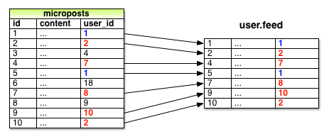

图 11.19：id 为 1 的用户关注了 id 为 2，7，8，10 的用户后得到的动态列表

因为需要把指定用户所关注用户的全部微博取出来，我们计划定义一个名为 `from_users_followed_by` 方法，以下面的方式调用：

```ruby
Micropost.from_users_followed_by(user)
```

虽然我们还不知道怎么定义这个方法，但在此之前却可以先编写测试检测它的功能是否按设想实现了。测试的关键是要覆盖三种情况：动态列表中要包含被关注用户和用户自己的微博，而且不能包含未被关注用户的微博。前面的测试已经检测了其中两种情况：代码 11.38 验证了动态列表中有用户自己的微博，而且没有未被关注用户的微博。既然我们已经实现了关注用户功能，那就加入对第三种情况的测试吧，检测动态列表中是否包含了被关注用户的微博，如代码 11.41 所示。

**代码 11.41** 针对动态列表测试的最终版<br />`spec/models/user_spec.rb`

```ruby
require 'spec_helper'

describe User do
  .
  .
  .
  describe "micropost associations" do
    before { @user.save }
    let!(:older_micropost) do
      FactoryGirl.create(:micropost, user: @user, created_at: 1.day.ago)
    end
    let!(:newer_micropost) do
      FactoryGirl.create(:micropost, user: @user, created_at: 1.hour.ago)
    end
    .
    .
    .
    describe "status" do
      let(:unfollowed_post) do
        FactoryGirl.create(:micropost, user: FactoryGirl.create(:user))
      end
      let(:followed_user) { FactoryGirl.create(:user) }

      before do
        @user.follow!(followed_user)
        3.times { followed_user.microposts.create!(content: "Lorem ipsum") }
      end

      its(:feed) { should include(newer_micropost) }
      its(:feed) { should include(older_micropost) }
      its(:feed) { should_not include(unfollowed_post) }
      its(:feed) do
        followed_user.microposts.each do |micropost|
          should include(micropost)
        end
      end
    end
  end
end
```

我们要把动态列表的实现交给 `Micropost.from_users_followed_by` 方法，如代码 11.42 所示。

**代码 11.42** 在 User 模型中加入实现动态列表的方法<br />`app/models/user.rb`

```ruby
class User < ActiveRecord::Base
  .
  .
  .
  def feed
    Micropost.from_users_followed_by(self)
  end
  .
  .
  .
end
```

<h3 id="sec-11-3-2">11.3.2 初步实现动态列表</h3>

现在我们要来定义 `Micropost.from_users_followed_by` 方法了，为了行文简洁，在后面的内容中我会使用“动态列表”指代这个方法。因为要实现的结果有点复杂，因此我们会一点一点的说明动态列表的实现过程。

首先，我们要知道需要使用怎样的查询语句。我们要做的是，从 `microposts` 表中取出被关注用户发布的微博（也要取出用户自己的微博）。对此，我们可以使用类似下面的查询语句：

```sql
SELECT * FROM microposts
WHERE user_id IN (<list of ids>) OR user_id = <user id>
```

写下这个查询语句时，我们假设 SQL 支持使用 `IN` 关键字检测集合是否包含指定的元素。（还好，SQL 支持。）

在 [10.3.3 节](chapter10.html#sec-10-3-3)实现临时动态列表时，是调用 Active Record 中的 `where` 方法完成上面这种查询的，如代码 10.39 所示。这段代码中用到的查询很简单，只是通过当前用户的 id 取出了他发布的微博：

```ruby
Micropost.where("user_id = ?", id)
```

而现在，我们遇到的情况复杂的多，要使用类似下面的代码实现：

```ruby
where("user_id in (?) OR user_id = ?", following_ids, user)
```

（在指定查询条件时，我们使用了 Rails 中的约定，用 `user` 代替 `user.id`，Rails 会自动获取用户的 `id`。我们还省略了方法的调用者 `Micropost`，因为我们只会在 Micropost 模型中使用这个方法。）

从上面的查询条件可以看出，我们需要生成一个数组，其元素为被关注用户的 id。生成这个数组的方法之一是，使用 Ruby 中的 `map` 方法，这个方法可以在任意的“可枚举（enumerable）”对象上调用，例如包含了元素的集合类对象（数组，Hash 等）。<sup>[11](#fn-11)</sup>我们在 [4.3.2 节](chapter4.html#sec-4-3-2)中举例介绍过这个方法，其用法如下：

```sh
$ rails console
>> [1, 2, 3, 4].map { |i| i.to_s }
=> ["1", "2", "3", "4"]
```

像上面这种在每个元素上调用同一个方法的情况是很常见的，所以 Ruby 为此定义了一种简写形式，在 `&` 符号后面跟上被调用方法的 Symbol 形式：<sup>[12](#fn-12)</sup>

```sh
>> [1, 2, 3, 4].map(&:to_s)
=> ["1", "2", "3", "4"]
```

然后再调用 `join` 方法（参见 [4.3.1 节](chapter4.html#sec-4-3-1)），就可以将数组中的元素合并起来组成字符串，各元素之间用逗号加一个空格分开：

```sh
>> [1, 2, 3, 4].map(&:to_s).join(', ')
=> "1, 2, 3, 4"
```

参照上面介绍的方法，我们可以在 `user.followed_users` 的每个元素上调用 `id` 方法，得到一个由被关注用户的 id 组成的数组。例如，对数据库中第 1 个用户而言，就可以用下面的代码实现：

```sh
>> User.first.followed_users.map(&:id)
=> [4, 5, 6, 7, 8, 9, 10, 11, 12, 13, 14, 15, 16, 17, 18, 19, 20, 21, 22, 23,
24, 25, 26, 27, 28, 29, 30, 31, 32, 33, 34, 35, 36, 37, 38, 39, 40, 41, 42,
43, 44, 45, 46, 47, 48, 49, 50, 51]
```

其实，因为这种用法太普遍了，所以 Active Record 默认已经提供了：

```sh
>> User.first.followed_user_ids
=> [4, 5, 6, 7, 8, 9, 10, 11, 12, 13, 14, 15, 16, 17, 18, 19, 20, 21, 22, 23,
24, 25, 26, 27, 28, 29, 30, 31, 32, 33, 34, 35, 36, 37, 38, 39, 40, 41, 42,
43, 44, 45, 46, 47, 48, 49, 50, 51]
```

上述代码中的 `followed_user_ids` 方法是 Active Record 根据 `has_many :followed_users` 关联（参见代码 11.10）合成的，这样我们只需在关联名的后面加上 `_ids` 就可以获取 `user.followed_users` 集合中所有用户的 id 了。用户 id 组成的字符串如下：

```sh
>> User.first.followed_user_ids.join(', ')
=> "4, 5, 6, 7, 8, 9, 10, 11, 12, 13, 14, 15, 16, 17, 18, 19, 20, 21, 22, 23,
24, 25, 26, 27, 28, 29, 30, 31, 32, 33, 34, 35, 36, 37, 38, 39, 40, 41, 42,
43, 44, 45, 46, 47, 48, 49, 50, 51"
```

不过，当插入 SQL 语句中时，你无须手动生成字符串，`?` 插值操作会为你代劳（同时也避免了一些数据库之间的兼容问题）。所以，我们实际要使用的只是 `user.followed_user_ids` 而已。

现在这个阶段，你可能已经想到了，要使用 `Micropost.from_users_followed_by(user)`，就要在 `Micropost` 类中定义一个类方法（[4.4.1 节](chapter4.html#sec-4-4-1)简单的介绍过）。这个类方法的初步定义如代码 11.43 所示，其中包含了上述分析得到的一些代码：

**代码 11.43** `from_users_followed_by` 方法的初步定义<br />`app/models/micropost.rb`

```ruby
class Micropost < ActiveRecord::Base
  .
  .
  .
  def self.from_users_followed_by(user)
    followed_user_ids = user.followed_user_ids
    where("user_id IN (?) OR user_id = ?", followed_user_ids, user)
  end
end
```

虽然代码 11.43 之前的讨论都是以假设为基础进行的，但得到的代码却是可用的。你可以运行测试验证一下，应该是可以通过的：

```sh
$ bundle exec rspec spec/
```

在某些程序中，这样的初步实现已经能满足大部分需求了。不过这不是我们最终要使用的实现方式，在继续阅读下一小节之前，你可以想一下为什么。（提示：如果用户关注了 5000 个用户呢？）

<h3 id="sec-11-3-3">11.3.3 子查询（subselect）</h3>

如上一小节末尾中所说的，[11.3.2 节](#sec-11-3-2)的实现方式，当动态列表中的微博数量很多时性能就会下降，这种情况可能会发生在用户关注了 5000 个用户后。本小节，我们会重新实现动态列表，在关注用户数量很多时，性能表现也会很好。

[11.3.2 节](#sec-11-3-2)中所用代码的问题在于`followed_user_ids = user.followed_user_ids` 这行代码，它会把**所有**被关注用户的 id 取出存入内存，然后再创建一个元素数量和被关注用户数量相同的数组。既然代码 11.43 的目的只是为了检查集合是否包含了指定的元素，那么就一定存在一种更高效的方法，其实 SQL 真的提供了针对这种问题的优化措施：使用子查询把查询被关注用户 id 的操作放入数据库层进行。

针对动态列表的重构，先从代码 11.44 中的小改动开始。

**代码 11.44** 改进 `from_users_followed_by` 方法<br />`app/models/micropost.rb`

```ruby
class Micropost < ActiveRecord::Base
  .
  .
  .
  # Returns microposts from the users being followed by the given user.
  def self.from_users_followed_by(user)
    followed_user_ids = user.followed_user_ids
    where("user_id IN (:followed_user_ids) OR user_id = :user_id",
          followed_user_ids: followed_user_ids, user_id: user)
  end
end
```

为了给下一步做准备，我们把

```ruby
where("user_id IN (?) OR user_id = ?", followed_user_ids, user)
```

换成了等效的

```ruby
where("user_id IN (:followed_user_ids) OR user_id = :user_id",
      followed_user_ids: followed_user_ids, user_id: user))
```

使用问号做插值虽然可以，但当我们要在多处插入同一个值时，后一种写法就方便多了。

上面这段话表明，我们要在 SQL 查询语句中两次用到 `user_id`。简单来说就是，我们要把下面这行 Ruby 代码

```ruby
followed_user_ids = user.followed_user_ids
```

换成包含 SQL 语句的代码

```ruby
followed_user_ids = "SELECT followed_id FROM relationships
                     WHERE follower_id = :user_id"
```

上面这行代码使用了 SQL 的子查询语句，那么针对 id 为 1 的用户，整个查询语句就可以写成：

```sql
SELECT * FROM microposts
WHERE user_id IN (SELECT followed_id FROM relationships
                  WHERE follower_id = 1)
      OR user_id = 1
```

使用子查询后，所有的集合包含关系都会交由数据库处理，这样性能就得到提升了。<sup>[13](#fn-13)</sup>

有了这些基础，我们就可以着手实现更高效的动态列表了，如代码 11.45 所示。注意，因为现在要使用纯 SQL 语句，所以 `followed_user_ids` 是被插值进语句中的，而没有通过转义的方式。（其实两种方式都可以使用，只不过这种情况使用插值操作更合理。）

**代码 11.45** `from_users_followed_by` 方法的最终版本<br />`app/models/micropost.rb`

```ruby
class Micropost < ActiveRecord::Base
  attr_accessible :content
  belongs_to :user

  validates :user_id, presence: true
  validates :content, presence: true, length: { maximum: 140 }

  default_scope order: 'microposts.created_at DESC'

  def self.from_users_followed_by(user)
    followed_user_ids = "SELECT followed_id FROM relationships
                         WHERE follower_id = :user_id"
    where("user_id IN (#{followed_user_ids}) OR user_id = :user_id",
          user_id: user.id)
  end
end
```

这段代码结合了 Rails、Ruby 和 SQL 的优势，达到了目的，而且做的很好。（当然，子查询也不是万能的。对于更大型的网站而言，可能要使用“后台作业（background job）”异步生成动态列表。性能优化这个话题已经超出了本书的范围，你可以观看 [Scaling Rails](http://railslab.newrelic.com/scaling-rails) 系列视频来学习。）

<h3 id="sec-11-3-4">11.3.4 新的动态列表</h3>

编完代码 11.45，动态列表功能就实现了。提醒一下，`home` 动作所需的代码如代码 11.46 所示，这段代码生成了一个可分页显示的动态列表变量，可在视图中使用，如图 11.20 所示。<sup>[14](#fn-14)</sup>注意，`paginate` 最终会调用代码 11.45 中定义的类方法，一次只从数据库中取出 30 篇微博。（如果你想验证一下，可以查看“开发服务器”的日志。）

**代码 11.46** 定义了可分页动态列表的 `home` 动作<br />`app/controllers/static_pages_controller.rb`

```ruby
class StaticPagesController < ApplicationController

  def home
    if signed_in?
      @micropost  = current_user.microposts.build
      @feed_items = current_user.feed.paginate(page: params[:page])
    end
  end
  .
  .
  .
end
```

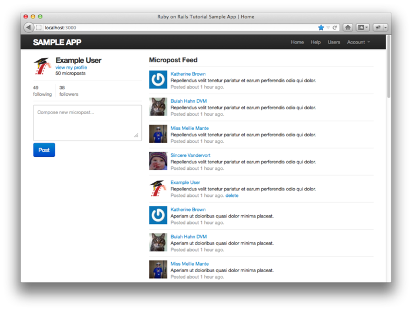

图 11.20：显示了动态列表的首页

<h2 id="sec-11-4">11.4 小结</h2>

实现了动态列表后，本书的核心示例程序就开发完了。这个程序演示了 Rails 全部的主要功能，包括模型，视图，控制器，模板，局部视图，过滤器，数据验证，回调函数，`has_many`/`belongs_to` 和 `has_many through` 关联，安全，测试，以及部署。除此之外，Rails 还有很多功能值得我们学习。你可以把本节作为后续学习的第一站，下面几小节介绍了可以对示例程序进行的功能扩展，也对后续学习提供一些参考资源。

在介绍可对程序进行的功能扩展之前，最好先把本章的改动合并到主分支：

```sh
$ git add .
$ git commit -m "Add user following"
$ git checkout master
$ git merge following-users
```

和之前一样，你也可以把代码推送到 GitHub，还可以部署到 Heroku：

```sh
$ git push
$ git push heroku
$ heroku pg:reset <DATABASE>
$ heroku run rake db:migrate
$ heroku run rake db:populate
```

请参照 [9.5 节](chapter9.html#sec-9-5)的说明，把第二个命令中的 `<DATABASE>` 换成正确的值。

<h3 id="sec-11-4-1">11.4.1 扩展示例程序的功能</h3>

本节建议的功能扩展灵感基本上都是来自常规 Web 程序的一般功能，如密码提醒和 Email 地址确认，或是来自同类型程序，例如搜索，回复和私信。自己实现几个功能扩展，可以让你从教程的跟学者变成自主程序开发者。

如果开始时觉得有点难也不用奇怪，从零开始实现一个功能确实有难度。为了帮助你，我可以提两点建设性的建议。第一点，在开始实现新功能之前，浏览一下 [RailsCasts 的归档](http://railscasts.com/episodes/archive)，看一下 Ryan 是否介绍过类似的功能。<sup>[15](#fn-15)</sup>如果他介绍过，先看一下相关的视频会节省很多时间。第二点，总是在 Google 中大范围的搜索你要实现的功能，寻找相关的博文和教程。Web 程序开发是有难度的，从有经验的开发者那里取经总是会对你有所帮助的。

下面列出的功能很多都是有一定挑战性的，在功能的介绍中我会给你一定的提示，告诉你实现过程中可能会用到的工具。虽然有提示，但是这些功能实现起来比章后的练习难多了，在没下真功夫之前千万别轻言放弃。因为时间有限，我无法一对一的辅导，不过如果你对这些功能感兴趣，将来我可能会发布一些独立的文章或视频介绍一下，请到本书的网站 <http://railstutorial.org/> 订阅 Feed 获取最新的更新。

#### 回复

Twitter 允许用户使用“@replies” 的格式进行回复，回复也是一篇微博，不过内容的开头是 `@` 符号加用户名。回复只会出现在被回复用户的动态列表和粉丝的动态列表中。请实现一个简化的回复功能，限制回复只可以出现在接收者和发送者的动态列表中。实现的过程可能要在 `microposts` 表中加入 `in_reply_to` 列，还要在 Micropost 模型中添加 `including_replies` 作用域。

因为我们的示例程序没有限制用户登录名要是唯一的，所以你可能要决定一下要采用什么方式表示用户的身份。一种方式是，结合 id 和名字，例如 `@1-michael-hartl`。另一种方式是，在注册表单中添加一个用户名字段，用户名将是唯一的，然后用来表示 @replies。

#### 私信

Twitter 支持在微博的前面加上字母“d”发送私信。请在示例程序中加入这个功能。实现的过程中可能要创建 Message 模型，还要使用正则表达式匹配微博的内容。

#### 被关注提醒

请实现当用户有新粉丝时向被关注用户发送提醒邮件的功能，并把这一功能设为可选的，这样如果用户不想接收提醒就可以不选择这个功能。实现这个功能需要学习如何在 Rails 中发送邮件，我建议观看 RailsCasts 中的《[Action Mailer in Rails 3](http://railscasts.com/episodes/206-action-mailer-in-rails-3)》一集来学习。

#### 密码提醒

现在，如果程序的用户忘记密码了，就没办法获取了。因为我们在[第六章](chapter6.html)使用了单向密码加密，程序没办法把密码通过 Email 发送给用户，但是我们可以发送一个重设密码表单的链接。按照 RailsCasts 中的《[Remember Me & Reset Password](http://railscasts.com/episodes/274-remember-me-reset-password)》一集来修正这个问题。

#### 注册确认

除了匹配 Email 地址的正则表达式之外，示例程序现在没有其他方法可以验证用户的 Email 地址是否合法。请在注册步骤中添加确认用户注册这一步。这个功能应该在注册时把用户设为未激活状态，发送一封包含激活链接的邮件，当链接被点击后再把用户设为已激活状态。你可能要先阅读 [Rails state machine 相关的文章](http://www.google.com/search?q=state+machines+in+rails)，学习如何在未激活和激活状态之间转换。

#### RSS Feed

请为每一个用户的微博更新创建一个 RSS，然后再为用户的状态列表实现一个 RSS，如果可以，你还可以使用身份验证机制限制对动态列表 RSS 的访问。RailsCasts 中的《[Generating RSS Feeds](http://railscasts.com/episodes/87-generating-rss-feeds)》一集可以给你一些帮助。

#### REST API

很多网站都提供了“应用编程接口（Application Programmer Interface，API）”，允许第三方程序获取（get），创建（post），更新（put）和删除（delete）程序的资源。请为示例程序实现这种 REST API。实现的过程中可能要为程序的多数控制器动作添加 `respond_to` 代码块（参见 [11.2.5 节](#sec-11-2-5)），响应 XML 类型的请求。请注意安全问题，API 应该只对授权的用户开放。

#### 搜索

现在，除了浏览用户索引页面，或者查看其他用户的动态列表之外，没有办法找到另外的用户。请实现搜索功能来弥补这个缺陷。然后再添加搜索微博的功能。RailsCasts 中的《[Simple Search Form](http://railscasts.com/episodes/37-simple-search-form)》一集可以给你一些帮助。如果你的程序部署在共享主机或专用服务器，我建议你使用 [Thinking Sphinx](http://freelancing-god.github.com/ts/en/)（参考 RailsCasts 中的《[Thinking Sphinx](http://railscasts.com/episodes/120-thinking-sphinx)》一集）。如果你的程序部署在 Heroku 上，你应该参照《[Full Text Search Options on Heroku](https://devcenter.heroku.com/articles/full-text-search)》一文中的说明。

<h3 id="sec-11-4-2">11.4.2 后续学习的资源</h3>

商店和网上都有很多 Rails 资源，而且多得会让你挑花眼。可喜的是，你阅读到这里时，已经可以学习几乎所有的其他知识了。下面是建议你后续学习的资源：

- 本书配套视频：我为本书录制了内容充足的配套视频，除了覆盖本书的内容之外，在视频中我还介绍了很多小技巧，当然视频还能弥补印刷书的不足，让你观看别人是如何开发的。你可以在[本书的网站](http://railstutorial.org/)上购买这些视频。
- RailsCasts：如何强调 RailsCasts 的重要性都不为过。我建议你浏览一下 [RailsCasts 的视频归档](http://railscasts.com/episodes/archive)，观看你感兴趣的视频。
- Scaling Rails：本书基本没有涉及的内容是性能、优化和扩放（scaling）。幸好大多数网站不会面对严重的性能问题，纯 Rails 之外的都算是过早优化。如果你确实遇到了性能问题，可以观看 [Envy Labs](http://envylabs.com/) 公司 Gregg Pollack 的 [Scaling Rails](http://railslab.newrelic.com/scaling-rails) 系列视频教程。我也建议你研究一下程序监控应用 [Scout](http://scoutapp.com/) 和 [New Relic](http://www.newrelic.com/)。<sup>[16](#fn-16)</sup>而且，你可能已经猜到了，在 RailsCasts 中有很多集都涉及到性能的问题，包括性能分析，缓存和后台作业。
- Ruby 和 Rails 相关的书：学习 Ruby 我推荐 Peter Cooper 的《[Ruby 入门](http://www.amazon.com/gp/product/1430223634)》，David A. Black 的《[The Well-Grounded Rubyist](http://www.amazon.com/gp/product/1933988657)》和 Hal Fulton 的《Ruby 之道》。继续学习 Rails 我推荐 Obie Fernandez 的《[Rails 3 之道](http://www.amazon.com/gp/product/0321601661)》和 Ryan Bigg、Yehuda Katz 合著的《Rails 3 实战》（请阅读第 2 版）。
- PeepCode 和 Code School：[PeepCode](http://peepcode.com/) 的视频教程和 [Code School](http://codeschool.com/) 的交互教程质量都很高，我真心地向你推荐。

<h2 id="sec-11-5">11.5 练习</h2>

1. 添加针对销毁指定用户关注关联（通过代码 11.4 和代码 11.16 中的 `dependent :destroy` 实现）的测试。提示：可参照代码 10.15。
2. 代码 11.38 中用到的 `respond_to` 方法可以提取出来放入 Relationships 控制器中，而且 `respond_to` 代码块可以使用 Rails 中的 `respond_with` 方法代替。请运行测试组件确认上面两个操作实施后得到的代码（如代码 11.47 所示）仍是正确的。（`respond_with` 方法的详细用法，请在 Google 中搜索“rails respond_with”。）
3. 重构代码 11.31，把关注者列表页面、粉丝列表页面，首页和用户资料页面的通用部分提取出来，创建成局部视图。
4. 按照代码 11.19 中的方式，编写测试检测个人资料页面的关注数量统计。

**代码 11.47** 重构，把代码 11.38 变得更简洁

```ruby
class RelationshipsController < ApplicationController
  before_filter :signed_in_user

  respond_to :html, :js

  def create
    @user = User.find(params[:relationship][:followed_id])
    current_user.follow!(@user)
    respond_with @user
  end

  def destroy
    @user = Relationship.find(params[:id]).followed
    current_user.unfollow!(@user)
    respond_with @user
  end
end
```

<div class="navigation">
  <a class="prev_page" href="chapter10.html">&laquo; 第十章 用户的微博</a>
</div>

1. 构思图中的头像来自 <http://www.flickr.com/photos/john_lustig/2518452221> 和 <http://www.flickr.com/photos/30775272@N05/2884963755>
2. 在本书第一版中，使用了 `user.following`， 但我发现有时读起来感觉怪怪的。感谢读者 Cosmo Lee 说服我修改这个表述，并建议我如何使其理解起来更容易些。(不过我并没有完全采纳他的建议，所以如果你阅读时仍感到迷惑请不要怪他。)
3. 为了简单清晰，图 11.6 中没有显示 `followed_users` 表的 id 列
4. 请在 Stack Overflow 网站上阅读[关于“何时应使用 let 方法”的讨论](http://stackoverflow.com/questions/5359558/when-to-use-rspec-let)来了解更多内容
5. 严格来说，Rails 是使用 `underscore` 方法把类名转换为 id 的。例如，`"Foobar".underscore` 的结果是 `"foo_bar"`，所以 Foobar 对象的外键是 `foo_bar_id`。（顺便说一下，`underscore` 的逆操作是 `camelize`，这个方法会把 `"camel_case"` 转换成 `"CamelCase"`。）
6. 如果你注意到 `followed_id` 同样可以标识用户，并且担心这个解决方法会造成被关注者和粉丝之间存在非对称的关系, 你已经想到我们的前面了，我们会在 [11.1.5 节](#sec-11-1-5)解决这个问题。
7. 当你拥有在某个领域大量建立模型的经验后，总能提前猜到这样的工具方法，如果没有猜到的话，也经常能发现自己动手写这样的方法可以使测试代码更加整洁。此时，如果你没有猜到它们的话也很正常。软件开发经常是一个循序渐进的过程，你先埋头编写代码，发现代码很乱时，再重构。 但为了行文简洁，本书采取的是直捣黄龙的方法。
8. 事实上 `unfollow!`方法在失败时不会抛出异常，我甚至不知道 Rails 是如何表明删除操作失败的。不过为了和 `follow!` 保持一致，我们还是加上了感叹号。
9. 因为 Ajax 是 asynchronous JavaScript and XML 的缩写，所以经常被错误的拼写为“AJAX”，不过在[最初介绍 Ajax 的文章](http://www.adaptivepath.com/ideas/essays/archives/000385.php)中，通篇都拼写为“Ajax”。
10. 只有当浏览器启用 JavaScript 时才能正常使用，不过可以优雅降级，如果禁用了 JavaScript 就会按照 [11.2.4 节](#sec-11-2-4)中的方式工作。
11. 可枚举的对象最基本的要求是必须实现 `each` 方法，用来遍历集合。
12. 这个简写方式最初是 Rails 对 Ruby 的扩展，因为很有用，所以 Ruby 最后自己也实现了。很牛吧。
13. 创建子查询语句更多高级的方式，请阅读《[Hacking a subselect in ActiveRecord](http://pivotallabs.com/users/jsusser/blog/articles/567-hacking-a-subselect-in-activerecord)》一文。
14. 为了图 11.20 中显示的动态列表更好看，我自己动手在 Rails 控制台中加入了一些微博。
15. 注意，RailsCasts 经常会省略测试，可能是为了要控制视频的质量和长度，这可能会让你会错意，认为测试并不重要。观看过 RailsCasts 中相关的视频知道怎么开发后，我建议你按照“测试驱动开发”原则实现功能。（我建议你看一下 RailsCasts 中的《[How I test](http://railscasts.com/episodes/275-how-i-test)》，你会看到 Ryan Bates 在实际的开发中经常会使用 TDD，而且他的测试风格和本书的很像。）
16. New Relic 这个名称很有新意，新（new）遗迹（relic）在措辞上是矛盾的，而且这个名字还是对公司创始人 Lew Cirne 这个人名的变位词。
