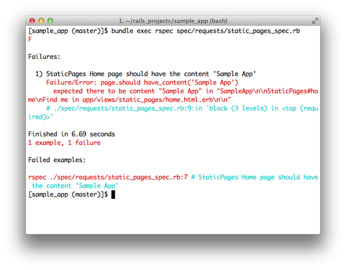
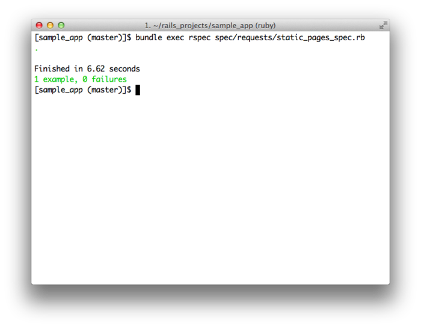
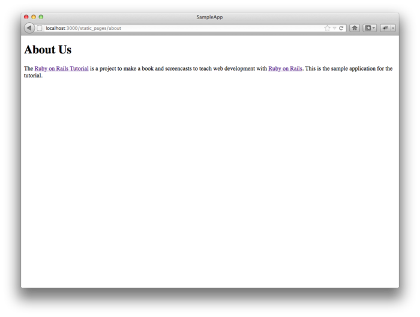

从本章开始我们要开发一个大型的示例程序，本书后续内容都会基于这个示例程序。最终完成的程序会包含用户、微博功能，以及完整的登录和用户验证系统，不过我们会从一个看似功能有限的话题出发——创建静态页面。这看似简单的一件事却是一个很好的锻炼，极具意义，对这个初建的程序而言也是个很好的开端。

虽然 Rails 是被设计用来开发基于数据库的动态网站的，不过它也能胜任使用纯 HTML 创建的静态页面。其实，使用 Rails 创建动态页面还有一点好处：我们可以方便的添加一小部分动态内容。这一章就会教你怎么做。在这个过程中我们还会一窥自动化测试（automated testing）的面目，自动化测试可以让我们确信自己编写的代码是正确的。而且，编写一个好的测试用例还可以让我们信心十足的重构（refactor）代码，修改实现过程但不影响最终效果。

本章有很多的代码，特别是在 [3.2 节](#sec-3-2)和[3.3 节](#sec-3-3)，如果你是 Ruby 初学者先不用担心没有理解这些代码。就像在 [1.1.1 节](chapter1.html#sec-1-1-1)中说过的，你可以直接复制粘贴测试代码，用来验证程序中代码的正确性而不用担心其工作原理。[第四章](chapter4.html)会更详细的介绍 Ruby，你有的是机会来理解这些代码。还有 RSpec 测试，它在本书中会被反复使用，如果你现在有点卡住了，我建议你硬着头皮往下看，几章过后你就会惊奇地发现，原本看起来很费解的代码已经变得很容易理解了。

类似第二章，在开始之前我们要先创建一个新的 Rails 项目，这里我们叫它 `sample_app`：


$ cd ~/rails_projects
$ rails new sample_app --skip-test-unit
$ cd sample_app


上面代码中传递给 `rails` 命令的 `--skip-test-unit` 选项的意思是让 Rails 不生成默认使用的 `Test::Unit` 测试框架对应的 `test` 文件夹。这样做并不是说我们不用写测试，而是从 [3.2 节](#sec-3-2)开始我们会使用另一个测试框架 RSpec 来写整个的测试用例。

类似 [2.1 节](chapter2.html#sec-2-1)，接下来我们要用文本编辑器打开并编辑 `Gemfile`，写入程序所需的 gem。这个示例程序会用到之前没用过的两个 gem：RSpec 所需的 gem 和针对 Rails 的 RSPec 库 gem。代码 3.1 所示的代码会包含这些 gem。（注意：如果此时你想安装这个示例程序用到的所有 gem，你应该使用代码 9.49 中的代码。）

**代码 3.1** 示例程序的 `Gemfile`


source 'https://rubygems.org'

gem 'rails', '3.2.8'

group :development, :test do
  gem 'sqlite3', '1.3.5'
  gem 'rspec-rails', '2.11.0'
end

# Gems used only for assets and not required
# in production environments by default.
group :assets do
  gem 'sass-rails',   '3.2.5'
  gem 'coffee-rails', '3.2.2'
  gem 'uglifier', '1.2.3'
end

gem 'jquery-rails', '2.0.2'

group :test do
  gem 'capybara', '1.1.2'
end

group :production do
  gem 'pg', '0.12.2'
end


上面的代码将 `rspec-rails` 放在了开发组中，这样我们就可以使用 RSpec 相关的生成器了，同样我们还把它放到了测试组中，这样才能在测试时使用它。我们没必要单独的安装 RSpec，因为它是 rspec-rails 的依赖件（dependency），会被自动安装。我们还加入了 [Capybara](https://github.com/jnicklas/capybara)，这个 gem允许我们使用类似英语中的句法编写模拟与应用程序交互的代码。[1](#fn-1) 和[第二章](chapter2.html)一样，我们还要把 PostgreSQL 所需的 gem 加入生产组，这样才能部署到 Heroku：


group :production do
  gem 'pg', '0.12.2'
end


Heroku 建议在开发环境和生产环境使用不同的数据库，不过对我们的示例程序而言没什么影响，SQLite 比 PostgreSQL 更容易安装和配置。在你的电脑中安装和配置 PostgreSQL 会作为一个练习。（参见 [3.5 节](#sec-3-5)）

要安装和包含这些新加的 gem，运行 `bundle install`：


$ bundle install --without production


和第二章一样，我们使用 `-without production` 禁止安装生产环境所需的 gem。这个选项会被记住，所以后续调用 Bundler 就不用再指定这个选项，直接运行 `bundle install` 就可以了。[2](#fn-2)

接着我们要设置一下让 Rails 使用 RSpec 而不用 `Test::Unit`。这个设置可以通过 `rails generate rspec:install` 命令实现：


$ rails generate rspec:install


如果系统提示缺少 JavaScript 运行时，你可以访问 [execjs 在 GitHub 的页面](https://github.com/sstephenson/execjs)查看可以使用的运行时。 我一般都建议安装 [Node.js](http://nodejs.org/)。

然后剩下的就是初始化 Git 仓库了：[3](#fn-3)


$ git init
$ git add .
$ git commit -m "Initial commit"


和第一个程序一样，我建议你更新一下 `README` 文件，更好的描述这个程序，还可以提供一些帮助信息，可参照代码 3.2。

**代码 3.2** 示例程序改善后的 `README` 文件


# Ruby on Rails Tutorial: sample application

This is the sample application for
[*Ruby on Rails Tutorial: Learn Rails by Example*](http://railstutorial.org/)
by [Michael Hartl](http://michaelhartl.com/).


然后添加 `.md` 后缀将其更改为 Markdown 格式，再提交所做的修改：


$ git mv README.rdoc README.md
$ git commit -a -m "Improve the README"


图 3.1：为示例程序在 GitHub 新建一个仓库

这个程序在本书的后续章节会一直使用，所以建议你在 GitHub 新建一个仓库（如图 3.1），然后将代码推动上去：


$ git remote add origin git@github.com:<username>/sample_app.git
$ git push -u origin master


我自己也做了这一步，你可以在 GitHub 上找到[这个示例程序的代码](https://github.com/railstutorial/sample_app_2nd_ed)。（我用了一个稍微不同的名字）[4](#fn-4)

当然我们也可以选择在这个早期阶段将程序部署到 Heroku：


$ heroku create --stack cedar
$ git push heroku master


在阅读本书的过程中，我建议你经常地推送并部署这个程序：


$ git push
$ git push heroku


这样你可在远端做个备份，也可以尽早的获知生成环境中出现的错误。如果你在 Heroku 遇到了问题，可以看一下生产环境的日志文件尝试解决这些问题：


$ heroku logs


所有的准备工作都结束了，下面要开始开发这个示例程序了。

<h2 id="sec-3-1">3.1 静态页面</h2>

Rails 中有两种方式创建静态页面。其一，Rails 可以处理真正只包含 HTML 代码的静态页面。其二，Rails 允许我们定义包含纯 HTML 的视图，Rails 会对其进行渲染，然后 Web 服务器会将结果返回浏览器。

现在回想一下 [1.2.3 节](chapter1.html#sec-1-2-3) 中讲过的 Rails 目录结构（图 1.2）会对我们有点帮助。本节主要的工作都在 `app/controllers` 和 `app/views` 文件夹中。（[3.2 节](#sec-3-2)中我们还会新建一个文件夹）

在这节你会第一次发现在文本编辑器或 IDE 中打开整个 Rails 目录是多么有用。不过怎么做却取决于你的系统，大多数情况下你可以在命令行中用你选择的浏览器命令打开当前应用程序所在的目录，在 Unix 中当前目录就是一个点号（`.`）：


$ cd ~/rails_projects/sample_app
$ <editor name> .


例如，用 Sublime Text 打开示例程序，你可以输入：


$ subl .


对于 Vim 来说，针对你使用的不同变种，你可以输入 `vim .`、`gvim .` 或 `mvim .`。

<h3 id="sec-3-1-1">3.1.1 真正的静态页面</h3>

我们先来看一下真正静态的页面。回想一下 [1.2.5 节](chapter1.html#sec-1-2-5)，每个 Rails 应用程序执行过 `rails` 命令后都会生成一个小型的可以运行的程序，默认的欢迎页面的地址是 <http://localhost:3000/>（图 1.3）。

图 3.2：`public/index.html` 文件

如果想知道这个页面是怎么来的，请看一下 `public/index.html` 文件（如图 3.2）。因为文件中包含了一些样式信息，所以看起来有点乱，不过其效果却达到了：默认情况下 Rails 会直接将 `public` 目录下的文件发送给浏览器。[5](#fn-5) 对于特殊的 `index.html` 文件，你不用在 URI 中指定它，因为它是默认显示的文件。如果你想在 URI 中包含这个文件的名字也可以，不过 http://localhost:3000/ 和 http://localhost:3000/index.html 的效果是一样的。

如你所想的，如果你需要的话也可以创建静态的 HTML 文件，并将其放在和 `index.html` 相同的目录 `public` 中。举个例子，我们要创建一个文件显示一个友好的欢迎信息（参见代码 3.3）：[6](#fn-6)


$ subl public/hello.html


**代码 3.3** 一个标准的 HTML 文件，包含一个友好的欢迎信息  `public/hello.html`


<!DOCTYPE html>
<html>
  <head>
    <title>Greeting</title>
  </head>
  <body>
    
Hello, world!

  </body>
</html>


从代码 3.3 中我们可以看到 HTML 文件的标准结构：位于文件开头的文档类型（document type，简称 doctype）声明，告知浏览器我们所用的 HTML 版本（本例使用的是 HTML5）；[7](#fn-7) `head` 部分：本例包含一个 `title` 标签，其内容是“Greeting”；`body` 部分：本例包含一个 `p`（段落）标签，其内容是“Hello,world!”。（缩进是可选的，HTML 并不强制要求使用空格，它会忽略 Tab 和空格，但是缩进可以使文档的结构更清晰。）

现在执行下述命令启动本地浏览器


$ rails server


然后访问 <http://localhost:3000/hello.html>。就像前面说过的，Rails 会直接渲染这个页面（如图 3.3）。注意图 3.3 浏览器窗口顶部显示的标题，它就是 `title` 标签的内容，“Greeting”。

图 3.3：一个新的静态 HTML 文件

这个文件只是用来做演示的，我们的示例程序并不需要它，所以在体验了创建过程之后最好将其删掉：


$ rm public/hello.html


现在我们还要保留 `index.html` 文件，不过最后我们还是要将其删除的，因为我们不想把 Rails 默认的页面（如图 1.3）作为程序的首页。[5.3 节](chapter5.html#sec-5-3)会介绍如何将 <http://localhost:3000/> 指向 `public/index.html` 之外的地方。

<h3 id="sec-3-1-2">3.1.2 Rails 中的静态页面</h3>

能够显示静态 HTML 页面固然很好，不过对动态 Web 程序却没有什么用。本节我们要向创建动态页面迈出第一步，我们会创建一系列的 Rails 动作（action），这可比通过静态文件定义 URI  地址要强大得多。[8](#fn-8) Rails 的动作会按照一定的目的性归属在某个控制器（[1.2.6 节](chapter1.html#sec-1-2-6)介绍的 MVC 中的 C）中。在[第二章](chapter2.html)中已经简单介绍了控制器，当我们更详细的介绍 [REST 架构](http://en.wikipedia.org/wiki/Representational_State_Transfer)后（从[第六章](chapter6.html)开始）你会更深入的理解它。大体而言，控制器就是一组网页的（也许是动态的）容器。

开始之前，回想一下 [1.3.5 节](chapter1.html#sec-1-3-5)中的内容，使用 Git 时，在一个有别于主分支的独立从分支中工作是一个好习惯。如果你使用 Git 做版本控制，可以执行下面的命令：


$ git checkout -b static-pages


Rails 提供了一个脚本用来创建控制器，叫做 `generate`，只要提供控制器的名字就可以运行了。如果你想让 `generate` 同时生成 RSpec 测试用例，你要执行 RSpec 生成器命令，如果在阅读本章前面内容时没有执行这个命令的话，请执行下面的命令：


$ rails generate rspec:install


因为我们要创建一个控制器来处理静态页面，所有我们就叫它 StaticPages 吧。我们计划创建“首页”（Home）、“帮助”（Help）和“关于”（About）页面的动作。`generate` 可以接受一个可选的参数列表，指明要创建的动作，我们现在只通过命令行创建两个动作（参见代码 3.4）。

**代码 3.4** 创建 StaticPages 控制器


$ rails generate controller StaticPages home help --no-test-framework
      create  app/controllers/static_pages_controller.rb
       route  get "static_pages/help"
       route  get "static_pages/home"
      invoke  erb
      create    app/views/static_pages
      create    app/views/static_pages/home.html.erb
      create    app/views/static_pages/help.html.erb
      invoke  helper
      create    app/helpers/static_pages_helper.rb
      invoke  assets
      invoke    coffee
      create      app/assets/javascripts/static_pages.js.coffee
      invoke    scss
      create      app/assets/stylesheets/static_pages.css.scss


注意我们使用了 `--no-test-framework` 选项禁止生成 RSpec 测试代码，因为我们不想自动生成，在 [3.2 节](#sec-3-2)会手动创建测试。同时我们还故意从命令行参数中省去了 `about` 动作，稍后我们会看到如何通过 TDD 添加它（[3.2 节](#sec-3-2)）。

顺便说一下，如果在生成代码时出现了错误，知道如何撤销操作就很有用了。[旁注 3.1](#box-3-1) 中介绍了一些如何在 Rails 中撤销操作的方法。

  <h4>旁注 3.1 撤销操作</h4>
  
即使再小心，在开发 Rails 应用程序过程中仍然可能犯错。幸运的是，Rails 提供了一些工具能够帮助你进行复原。

  
举例来说，一个常见的情况是你想更改控制器的名字，这时你就要撤销生成的代码。生成控制器时，除了控制器文件本身之外，Rails 还会生成很多其他的文件（参见代码 3.4）。撤销生成的文件不仅仅要删除主要的文件，还要删除一些辅助的文件。（事实上，我们还要撤销对 <code>routes.rb</code> 文件自动做的一些改动。）在 Rails 中，我们可以通过 <code>rails destroy</code> 命令完成这些操作。一般来说，下面的两个命令是相互抵消的：

  <pre>
    $ rails generate controller FooBars baz quux
    $ rails destroy  controller FooBars baz quux
  </pre>
  
同样的，在<a href="chapter6.html">第六章</a>中会使用下面的命令生成模型： 

  <pre>
    $ rails generate model Foo bar:string baz:integer
  </pre>
  
生成的模型可通过下面的命令撤销：

  <pre>
    $ rails destroy model Foo
  </pre>
  
（对模型来说我们可以省略命令行中其余的参数。当阅读到<a href="chapter6.html">第六章</a>时，看看你能否发现为什么可以这么做。）

  
对模型来说涉及到的另一个技术是撤销迁移。<a href="chapter2.html">第二章</a>已经简要的介绍了迁移，<a href="chapter6.html">第六章</a>开始会更深入的介绍。迁移通过下面的命令改变数据库的状态：

  <pre>
    $ rake db:migrate
  </pre>
  
我们可以使用下面的命令撤销一个迁移操作：

  <pre>
    $ rake db:rollback
  </pre>
  
如果要回到最开始的状态，可以使用：

  <pre>
    $ rake db:migrate VERSION=0
  </pre>
  
你可能已经猜到了，将数字 <tt>0</tt> 换成其他的数字就会回到相应的版本状态，这些版本数字是按照迁移顺序排序的。

  
拥有这些技术，我们就可以得心的应对开发过程中遇到的各种<a href="http://en.wikipedia.org/wiki/SNAFU">混乱（snafu）</a>了。

代码 3.4 中生成 StaticPages 控制器的命令会自动更新路由文件（route），叫做 `config/routes.rb`，Rails 会通过这个文件寻找 URI 到网页之间的对应关系。这是我们第一次讲到 `config` 目录，所以让我们看一下该目录的结构吧（如图 3.4）。`config` 目录如其名字所示，是存储 Rails 应用程序中的设置文件的。

图 3.4：示例程序的 `config` 文件夹

因为我们生成了 `home` 和 `help` 动作，路由文件中已经为每个动作生成了规则，如代码 3.5。

**代码 3.5** StaticPages 控制器中 `home` 和 `help` 动作的路由配置  `config/routes.rb`


SampleApp::Application.routes.draw do
  get "static_pages/home"
  get "static_pages/help"
  .
  .
  .
end


如下的规则


get "static_pages/home"


将来自 /static_pages/home 的请求映射到 StaticPages 控制器的 `home` 动作上。另外，当使用 `get` 时会将其对应到 GET 请求方法上，GET 是 HTTP（超文本传输协议，Hypertext Transfer Protocol）支持的基本方法之一（参见[旁注 3.2](#box-3-2)）。在我们这个例子中，当我们在 StaticPages 控制器中生成 `home` 动作时，我们就自动的在 /static_pages/home 地址上获得一个页面了。访问 [/static_pages/home](http://localhost:3000/static_pages/home) 查看这个页面（如图 3.5）。

图 3.5：简陋的“首页”视图（[/static_pages/home](http://localhost:3000/static_pages/home)）

  <h4>旁注 3.2 GET 等</h4>
  
超文本传输协议（HTTP）定义了四个基本的操作，对应到四个动词上，分别是 get、post、put 和 delete。这四个词表现了客户端电脑（通常会运行一个浏览器，例如 Firefox 或 Safari）和服务器（通常会运行一个 Web 服务器，例如 Apache 或 Nginx）之间的操作。（有一点很重要需要你知道，当在本地电脑上开发 Rails 应用程序时，客户端和服务器是在同一个物理设备上的，但是二者是不同的概念。）受 REST 架构影响的 Web 框架（包括 Rails）都很重视对 HTTP 动词的实现，我们在<a href="chapter2.html">第二章</a>已经简要介绍了 REST，从<a href="chapter7.html">第七章</a>开始会做更详细的介绍。

  
GET 是最常用的 HTTP 操作，用来从网络上读取数据，它的意思是“读取一个网页”，当你访问 google.com 或 wikipedia.org 时，你的浏览器发出的就是 GET 请求。POST 是第二最常用的操作，当你提交表单时浏览器发送的就是 POST 请求。在 Rails 应用程序中，POST 请求一般被用来创建某个东西（不过 HTTP 也允许 POST 进行更新操作）。例如，你提交注册表单时发送的 POST 请求就会在网站中创建一个新用户。剩下的两个动词，PUT 和 DELETE 分别用来更新和销毁服务器上的某个东西。这两个操作比 GET 和 POST 少用一些，因为浏览器没有内建对这两种请求的支持，不过有些 Web 框架（包括 Rails）通过一些聪明的处理方式让它看起来是浏览器发出的这种请求。

要想弄明白这个页面是怎么来的，让我们在浏览器中看一下 StaticPages 控制器文件吧，你应该会看到类似代码 3.6 的内容。你可能已经注意到了，不像第二章中的 Users 和 Microposts 控制器，StaticPages 控制器没有使用标准的 REST 动作。这对静态页面来说是很常见的，REST 架构并不能解决所有的问题。

**代码 3.6** 代码 3.4 生成的 StaticPages 控制器  `app/controllers/static_pages_controller.rb`


class StaticPagesController < ApplicationController

  def home
  end

  def help
  end
end


从上面代码中的 `class` 可以看到 `static_pages_controller.rb` 文件定义了一个类（class），叫做 `StaticPagesController`。类是一种组织函数（也叫方法）的有效方式，例如 `home` 和 `action` 动作就是方法，使用 `def` 关键字定义。尖括号 `<` 说明 `StaticPagesController` 是继承自 Rails 的 `ApplicationController` 类，这就意味着我们定义的页面拥有了 Rails 提供的大量功能。（我们会在 [4.4 节](chapter4.html#sec-4-4)中更详细的介绍类和继承。）

在本例中，StaticPages 控制器的两个方法默认都是空的：


def home
end

def help
end


如果是普通的 Ruby 代码，这两个方法什么也做不了。不过在 Rails 中就不一样了，`StaticPagesController` 是一个 Ruby 类，因为它继承自 `ApplicationController`，它的方法对 Rails 来说就有特殊的意义了：访问 /static_pages/home 时，Rails 在 StaticPages 控制器中寻找 `home` 动作，然后执行该动作，再渲染相应的视图（[1.2.6 节](chapter1.html#sec-1-2-6)中介绍的 MVC 中的 V）。在本例中，`home` 动作是空的，所以访问 /static_pages/home 后只会渲染视图。那么，视图是什么样子，怎么才能找到它呢？

如果你再看一下代码 3.4 的输出，或许你能猜到动作和视图之间的对应关系：`home` 动作对应的视图叫做 `home.html.erb`。[3.3 节](#sec-3-3)将告诉你 `.erb` 是什么意思。看到 `.html` 你或许就不会奇怪了，它基本上就是 HTML（代码 3.7）。

**代码 3.7** 为“首页”生成的视图  `app/views/static_pages/home.html.erb`


<h1>StaticPages#home</h1>

Find me in app/views/static_pages/home.html.erb



`help` 动作的视图代码类似（参见代码 3.8）。

**代码 3.8** 为“帮助”页面生成的视图  `app/views/static_pages/help.html.erb`


<h1>StaticPages#help</h1>

Find me in app/views/static_pages/help.html.erb



这两个视图只是站位用的，它们的内容都包含了一个一级标题（`h1` 标签）和一个显示视图文件完整的相对路径的段落（`p` 标签）。我们会在 [3.3 节](#sec-3-3)中添加一些简单的动态内容。这些静态内容的存在是为了强调一个很重要的事情：Rails 的视图可以只包含静态的 HTML。从浏览器的角度来看，[3.1.1 节](#sec-3-1-1)中的原始 HTML 文件和本节通过控制器和动作的方式渲染的页面没有什么差异，浏览器能看到的只有 HTML。

在本章剩下的内容中，我们会为“首页”和“帮助”页面添加一些内容，然后补上 [3.1.2 节](#sec-3-1-2)中丢下的“关于”页面。然后会添加量很少的动态内容，在每个页面显示不同的标题。

在继续下面的内容之前，如果你使用 Git 的话最好将 StaticPages 控制器相关的文件加入仓库：


$ git add .
$ git commit -m "Add a StaticPages controller"


<h2 id="sec-3-2">3.2 第一个测试</h2>

本书采用了一种直观的测试应用程序表现的方法，而不关注具体的实现过程，这是 TDD 的一个变种，叫做 BDD（行为驱动开发，Behavior-driven Development）。我们使用的主要工具是集成测试（integration test）和单元测试(unit test)。集成测试在 RSpec 中叫做 request spec，它允许我们模拟用户在浏览器中和应用程序进行交互的操作。和 Capybara 提供的自然语言句法（natural-language syntax）一起使用，集成测试提供了一种强大的方法来测试应用程序的功能而不用在浏览器中手动去检查每个页面。（BDD 另外一个受欢迎的选择是 Cucumber，在 [8.3 节](chapter8.html#sec-8-3)中会介绍。）

TDD 的好处在于测试优先，比编写应用程序的代码还早。刚接触的话要花一段时间才能适应这种方式，不过好处很明显。我们先写一个失败测试（failing test），然后编写代码使这个测试通过，这样我们就会相信测试真的是针对我们设想的功能。这种“失败-实现-通过”的开发循环包含了一个[心流](http://en.wikipedia.org/wiki/Flow_\(psychology\))，可以提高编程的乐趣并提高效率。测试还扮演着应用程序代码客户的角色，会提高软件设计的优雅性。

关于 TDD 有一点很重要需要你知道，它不是万用良药，没必要固执的认为总是要先写测试、测试要囊括程序所有的功能、所有情况都要写测试。例如，当你不确定如何处理某些编程问题时，通常推荐你跳过测试先编写代码看一下解决方法能否解决问题。（在[极限编程](http://en.wikipedia.org/wiki/Extreme_Programming)中，这个过程叫做“探针实验（spike）”。）一旦看到了解决问题的曙光，你就可以使用 TDD 实现一个更完美的版本。

本节我们会使用 RSpec 提供的 `rspec` 命令运行测试。初看起来这样做是理所当然的，不过却不完美，如果你是个高级用户我建议你按照 [3.6 节](#sec-3-6)的内容设置一下你的系统。

<h3 id="sec-3-2-1">3.2.1 测试驱动开发</h3>

在测试驱动开发中，我们先写一个会失败的测试，在很多测试工具中会将其显示为红色。然后编写代码让测试通过，显示为绿色。最后，如果需要的话，我们还会重构代码，改变实现的方式（例如消除代码重复）但不改变功能。这样的开发过程叫做“遇红，变绿，重构（Red, Green, Refactor）”。

我们先来使用 TDD 为“首页”增加一些内容，一个内容为 `Sample App` 的顶级标题（`<h1>`）。第一步要做的是为这些静态页面生成集成测试（request spec）：


$ rails generate integration_test static_pages
      invoke  rspec
      create    spec/requests/static_pages_spec.rb


上面的代码会在 `rspec/requests` 文件夹中生成 `static_pages_spec.rb` 文件。自动生成的代码不能满足我们的需求，用文本编辑器打开 `static_pages_spec.rb`，将其内容替换成代码 3.9 所示的代码。

**代码 3.9** 测试“首页”内容的代码  `spec/requests/static_pages_spec.rb`


require 'spec_helper'

describe "Static pages" do

  describe "Home page" do

    it "should have the content 'Sample App'" do
      visit '/static_pages/home'
      page.should have_content('Sample App')
    end
  end
end


代码 3.9 是纯粹的 Ruby，不过即使你以前学习过 Ruby 也看不太懂，这是因为 RSpec 利用了 Ruby 语言的延展性定义了一套“领域特殊语言”（Domain-Specifi Language, DSL）用来写测试代码。重要的是，如果你想使用 RSpec 不是一定要知道 RSpec 的句法。初看起来是有些神奇，RSpec 和 Capybara 就是这样设计的，读起来很像英语，如果你多看一些 `generate` 命令生成的测试或者本书中的示例，很快你就会熟练了。

代码 3.9 包含了一个 `describe` 块以及其中的一个测试用例（sample），以 `it "..." do` 开头的代码块就是一个用例：


describe "Home page" do

  it "should have the content 'Sample App'" do
    visit '/static_pages/home'
    page.should have_content('Sample App')
  end
end


第一行代码指明我们描绘的是“首页”，内容就是一个字符串，如果需要你可以使用任何的字符串，RSpec 不做强制要求，不过你以及其他的人类读者或许会关心你用的字符串。然后测试说，如果你访问地址为 `/static_pages/home` 的“首页”时，其内容应该包含“Sample App”这两个词。和第一行一样，这个双引号中的内容 RSpec 没做要求，只要能为人类读者提供足够的信息就行了。下面这一行：


visit '/static_pages/home'


使用了 Capybara 中的 `visit` 函数来模拟在浏览器中访问 `/static_pages/home` 的操作。下面这一行：


page.should have_content('Sample App')


使用了 `page` 变量（同样由 Capybara 提供）来测试页面中是否包含了正确的内容。

我们有很多种方式来运行测试代码，[3.6 节](#sec-3-6)中还提供了一些便利且高级的方法。现在，我们在命令行中执行 `rspec` 命令（前面会加上 `bundle exec` 来保证 RSpec 运行在 `Gemfile` 指定的环境中）：[9](#fn-9)


$ bundle exec rspec spec/requests/static_pages_spec.rb


上述命令会输出一个失败测试。失败测试的具体样子取决于你的系统，在我的系统中它是红色的，如图 3.6。[10](#fn-10)（截图中显示了当前所在的 Git 分支，是 master 而不是 staticpages，这个问题你先不要在意。）

图 3.6：一个红色（失败）的测试

要想让测试通过，我们要用代码 3.10 中的 HTML 替换掉默认的“首页”内容。

**代码 3.10** 让“首页”测试通过的代码  `app/views/static_pages/home.html.erb`


<h1>Sample App</h1>

  This is the home page for the
  <a href="http://railstutorial.org/">Ruby on Rails Tutorial</a>
  sample application.



这段代码中一级标题（`<h1>`）的内容是 `Sample App` 了，会让测试通过。我们还加了一个锚记标签 `<a>`，链接到一个给定的地址（在锚记标签中地址由“href”（hypertext reference）指定）：


<a href="http://railstutorial.org/">Ruby on Rails Tutorial</a>


现在再运行测试看一下结果：


$ bundle exec rspec spec/requests/static_pages_spec.rb


在我的系统中，通过的测试显示如图 3.7 所示。

图 3.7：一个绿色（通过）的测试

基于上面针对“首页”的例子，或许你已经猜到了“帮助”页面类似的测试和程序代码。我们先来测试一下相应的内容，现在我们的字符串变成“`Help`”了（参见代码 3.11）。

**代码 3.11** 添加测试“帮助”页面内容的代码  `spec/requests/static_pages_spec.rb`


require 'spec_helper'

describe "Static pages" do

  describe "Home page" do

    it "should have the content 'Sample App'" do
      visit '/static_pages/home'
      page.should have_content('Sample App')
    end
  end

  describe "Help page" do

    it "should have the content 'Help'" do
      visit '/static_pages/help'
      page.should have_content('Help')
    end
  end
end


然后运行测试：


$ bundle exec rspec spec/requests/static_pages_spec.rb


有一个测试会失败。（因为系统的不同，而且统计每个阶段的测试数量很难，从现在开始我就不会再截图 RSpec 的输出结果了。）

程序所需的代码（原始的 HTML）和代码 3.10 类似，如代码 3.12 所示。

**代码 3.12** 让“帮助”页面的测试通过的代码  `app/views/static_pages/help.html.erb`


<h1>Help</h1>

  Get help on the Ruby on Rails Tutorial at the
  <a href="http://railstutorial.org/help">Rails Tutorial help page</a>.
  To get help on this sample app, see the
  <a href="http://railstutorial.org/book">Rails Tutorial book</a>.



现在测试应该可以通过了：


$ bundle exec rspec spec/requests/static_pages_spec.rb


<h3 id="sec-3-2-2">3.2.2 添加页面</h3>

看过了上面简单的 TDD 开发过程，下面我们要用这个技术完成一个稍微复杂一些的任务，添加一个新页面，就是 [3.1.3 节](#sec-3-1-2)中没有生成的“关于”页面。通过每一步中编写测试和运行 RSpec 的过程，我们会看到 TDD 是如何引导我们进行应用程序代码开发的。

<h4>遇红</h4>

先来到“遇红-变绿”过程中的“遇红”部分，为“关于”页面写一个失败测试。按照代码 3.11 的代码，或许你已经知道如何写这个测试了（参见代码 3.13）。

**代码 3.13** 添加测试“关于”页面内容的代码  `spec/requests/static_pages_spec.rb`


require 'spec_helper'

describe "Static pages" do

  describe "Home page" do

    it "should have the content 'Sample App'" do
      visit '/static_pages/home'
      page.should have_content('Sample App')
    end
  end

  describe "Help page" do

    it "should have the content 'Help'" do
      visit '/static_pages/help'
      page.should have_content('Help')
    end
  end

  describe "About page" do

    it "should have the content 'About Us'" do
      visit '/static_pages/about'
      page.should have_content('About Us')
    end
  end
end


<h4>变绿</h4>

回顾一下 [3.1.2 节](#sec-3-1-2)的内容，在 Rails 中我们可以通过创建一个动作并添加相应的视图文件来生成一个静态页面。所以首先我们要在 StaticPages 控制器中添加一个 `about` 动作。我们已经写过失败测试了，现在已经相信，如果能让它通过，我们就可以创建一个可以运行的“关于”页面。

如果你运行 RSpec 测试：


$ bundle exec rspec spec/requests/static_pages_spec.rb


输出的结果会提示下面的错误：


No route matches [GET] "/static_pages/about"


这提醒我们要在路由文件中添加 `static_pages/about`，我们可以按照代码 3.5 所示的格式添加，结果如代码 3.14 所示。

**代码 3.14** 添加 `about` 页面的路由  `config/routes.rb`


SampleApp::Application.routes.draw do
  get "static_pages/home"
  get "static_pages/help"
  get "static_pages/about"
  .
  .
  .
end


现在运行


$ bundle exec rspec spec/requests/static_pages_spec.rb


将提示如下错误


The action 'about' could not be found for StaticPagesController


为了解决这个问题，我们按照代码 3.6 中 `home` 和 `help` 的格式在 StaticPages 控制器中添加 `about` 动作的代码（如代码 3.15 所示）。

**代码 3.15** 添加了 `about` 动作的 StaticPages 控制器  `app/controllers/static_pages_controller.rb`


class StaticPagesController < ApplicationController

  def home
  end

  def help
  end

  def about
  end
end


再运行


$ bundle exec rspec spec/requests/static_pages_spec.rb


会提示缺少模板（template，例如一个视图）：


ActionView::MissingTemplate:
  Missing template static_pages/about


要解决这个问题，我们要添加 `about` 相应的视图。我们需要在 `app/views/static_pages` 目录下创建一个名为 `about.html.erb` 的新文件，写入代码 3.16 所示的内容。

**代码 3.16** “关于”页面的源码  `app/views/static_pages/about.html.erb`


<h1>About Us</h1>

  The <a href="http://railstutorial.org/">Ruby on Rails Tutorial</a>
  is a project to make a book and screencasts to teach web development
  with <a href="http://rubyonrails.org/">Ruby on Rails</a>. This
  is the sample application for the tutorial.



再运行 RSpec 就应该“变绿”了：


$ bundle exec rspec spec/requests/static_pages_spec.rb


当然，在浏览器中查看一下这个页面来确保测试没有失效也是个不错的主意。（如图 3.8）

图 3.8：新添加的“关于”页面（[/static_pages/about](http://localhost:3000/static_pages/about)）

<h4>重构</h4>

现在测试已经变绿了，我们可以很自信的尽情重构了。我们的代码经常会“变味”（意思是代码会变得丑陋、啰嗦、大量的重复），电脑不会在意，但是人类会，所以经常的重构让代码变得简洁是很重要的。这时候一个好的测试就显出其价值了，因为它可以降低重构过程中引入 bug 的风险。

我们的示例程序现在还很小没什么可重构的，不过代码无时无刻不在变味，所以我们的重构也不会等很久：在 [3.3.4 节](#sec-3-3-4)中就要忙于重构了。

<h2 id="sec-3-3">3.3 有点动态内容的页面</h2>

到目前为止，我们已经为一些静态页面创建了动作和视图，我们还改变每一个页面显示的内容（标题）让它看起来是动态的。改变标题到底算不算真正动态还有争议，不过前面的内容却可以为[第七章](chapter7.html)介绍的真正动态打下基础。

如果你跳过了 [3.2 节](#sec-3-2)中的 TDD 部分，在继续阅读之前先按照代码 3.14、代码 3.15 和代码 3.16 创建“关于”页面。

<h3 id="sec-3-3-1">3.3.1 测试标题的变化</h3>

我们计划修改“首页”、“帮助”页面和“关于”页面的标题，让它在每一页都有所变化。这个过程将使用视图中的 `<title>` 标签。大多数浏览器会在浏览器窗口的顶部显示标题的内容（Google Chrome 是个特例），标题对搜索引擎优化也是很重要的。我们会先写测试标题的代码，然后添加标题，再然后使用一个布局（layout）文件进行重构，削减重复。

你可能已经注意到了，`rails new` 命令已经创建了布局文件。稍后我们会介绍这个文件的作用，现在在继续之前先将其重命名：


$ mv app/views/layouts/application.html.erb foobar   # 临时修改


（`mv` 是 Unix 命令，在 Windows 中你可以在文件浏览器中重命名或者使用 `rename` 命令。）在真正的应用程序中你不需要这么做，不过没有了这个文件之后你就能更容易理解它的作用。

<table id="table-3-1" class="tabular">
  <tbody>
    <tr>
      <th class="align_center"><strong>页面</strong></th>
      <th class="align_left"><strong>URI</strong></th>
      <th class="align_left"><strong>基本标题</strong></th>
      <th class="align_left"><strong>变动部分</strong></th>
    </tr>
    <tr class="top_bar">
      <td class="align_center">首页</td>
      <td class="align_left">/static_pages/home</td>
      <td class="align_left"><code>"Ruby on Rails Tutorial Sample App"</code></td>
      <td class="align_left"><code>"Home"</code></td>
    </tr>
    <tr>
      <td class="align_center">帮助</td>
      <td class="align_left">/static_pages/help</td>
      <td class="align_left"><code>"Ruby on Rails Tutorial Sample App"</code></td>
      <td class="align_left"><code>"Help"</code></td>
    </tr>
    <tr>
      <td class="align_center">关于</td>
      <td class="align_left">/static_pages/about</td>
      <td class="align_left"><code>"Ruby on Rails Tutorial Sample App"</code></td>
      <td class="align_left"><code>"About"</code></td>
    </tr>
  </tbody>
</table>

表格 3.1：示例程序中基本上是静态内容的页面

本节结束后，三个静态页面的标题都会是“Ruby on Rails Tutorial Sample App | Home”这种形式，标题的后面一部分会根据所在的页面而有所不同（参见[表格 3.1](#table-3-1)）。我们接着代码 3.3 中的测试，添加代码 3.17 所示测试标题的代码。

**代码 3.17** 标题测试


it "should have the right title" do
  visit '/static_pages/home'
  page.should have_selector('title',
                    :text => "Ruby on Rails Tutorial Sample App | Home")
end


`have_selector` 方法会测试一个 HTML 元素（“selector”的意思）是否有指定的内容。换句话说，下面的代码：


page.should have_selector('title',
                  :text => "Ruby on Rails Tutorial Sample App | Home")


检查 `title` 标签的内容是否为


"Ruby on Rails Tutorial Sample App | Home"


（在 [4.3.3 节](chapter4.html#sec-4-3-3)中我们会介绍，`:text => "…"` 是一个以 Symbol 为键值的 Hash。）你要注意一下，检查的内容不一定要完全匹配，任何的子字符串都可以，所以


page.should have_selector('title',
                  :text => " | Home")


也会匹配完整形式的标题。

注意，在代码 3.17 中，我们将 `have_selector` 方法切成两行显示，这种用法说明了 Ruby 句法中一个很重要的原则：Ruby 不介意换行。[11](#fn-11) 我之所以把代码切成两行是因为我要保证代码的每一行都少于 80 个字符，这样能提高可读性。[12](#fn-12) 即使这样，代码的结构还是很乱，在 [3.5 节](#sec-3-5)中会有个重构的练习，将代码结构变得更好一些，在 [5.3.4 节](chapter5.html#sec-5-3-4)中会使用 RSpec 最新的功能完全重写 StaticPages 测试。

按照代码 3.17 的格式为三个静态页面都加上测试代码，结果参照代码 3.18。

**代码 3.18** StaticPages 控制器的测试文件，包含标题测试  `spec/requests/static_pages_spec.rb`


require 'spec_helper'

describe "Static pages" do

  describe "Home page" do

    it "should have the h1 'Sample App'" do
      visit '/static_pages/home'
      page.should have_selector('h1', :text => 'Sample App')
    end

    it "should have the title 'Home'" do
      visit '/static_pages/home'
      page.should have_selector('title',
                        :text => "Ruby on Rails Tutorial Sample App | Home")
    end
  end

  describe "Help page" do

    it "should have the h1 'Help'" do
      visit '/static_pages/help'
      page.should have_selector('h1', :text => 'Help')
    end

    it "should have the title 'Help'" do
      visit '/static_pages/help'
      page.should have_selector('title',
                        :text => "Ruby on Rails Tutorial Sample App | Help")
    end
  end

  describe "About page" do

    it "should have the h1 'About Us'" do
      visit '/static_pages/about'
      page.should have_selector('h1', :text => 'About Us')
    end

    it "should have the title 'About Us'" do
      visit '/static_pages/about'
      page.should have_selector('title',
                    :text => "Ruby on Rails Tutorial Sample App | About Us")
    end
  end
end


注意我们把 `have_content` 换成了更具体的 `have_selector('h1', ...)`。试试你能不能猜到原因。（提示：试想一下如果标题的内容是“Help”，但是 `h1` 标签中的内容是“Helf”会出现什么情况？）

现在已经有了如代码 3.18 所示的测试，你应该运行


$ bundle exec rspec spec/requests/static_pages_spec.rb


确保得到的结果是红色的（失败的测试）。

<h3 id="sec-3-3-2">3.3.2 让标题测试通过</h3>

现在我们要让标题测试通过，同时我们还要完善 HTML，让它通过验证。先来看“首页”，它的 HTML 和代码 3.3 中欢迎页面的结构类似。

**代码 3.19** “首页”的完整 HTML  `app/views/static_pages/home.html.erb`


<!DOCTYPE html>
<html>
  <head>
    <title>Ruby on Rails Tutorial Sample App | Home</title>
  </head>
  <body>
    <h1>Sample App</h1>
    

      This is the home page for the
      <a href="http://railstutorial.org/">Ruby on Rails Tutorial</a>
      sample application.
    

  </body>
</html>


代码 3.19 使用了代码 3.18 中测试用到的标题：


<title>Ruby on Rails Tutorial Sample App | Home</title>


所以，“首页”的测试现在应该可以通过了。你还会看到红色的错误提示是因为“帮助”页面和“关于”页面的测试还是失败的，我们使用代码 3.20 和代码 3.21 中的代码让它们也通过测试。

**代码 3.20** “帮助”页面的完整 HTML  `app/views/static_pages/home.html.erb`


<!DOCTYPE html>
<html>
  <head>
    <title>Ruby on Rails Tutorial Sample App | Help</title>
  </head>
  <body>
    <h1>Help</h1>
    

      Get help on the Ruby on Rails Tutorial at the
      <a href="http://railstutorial.org/help">Rails Tutorial help page</a>.
      To get help on this sample app, see the
      <a href="http://railstutorial.org/book">Rails Tutorial book</a>.
    

  </body>
</html>


**代码 3.21** “关于”页面的完整 HTML  `app/views/static_pages/home.html.erb`


<!DOCTYPE html>
<html>
  <head>
    <title>Ruby on Rails Tutorial Sample App | About Us</title>
  </head>
  <body>
    <h1>About Us</h1>
    

      The <a href="http://railstutorial.org/">Ruby on Rails Tutorial</a>
      is a project to make a book and screencasts to teach web development
      with <a href="http://rubyonrails.org/">Ruby on Rails</a>. This
      is the sample application for the tutorial.
    

  </body>
</html>


<h3 id="sec-3-3-3">3.3.3 嵌入式 Ruby</h3>

本节到目前位置已经做了很多事情，我们通过 Rails 控制器和动作生成了三个可以通过验证的页面，不过这些页面都是纯静态的 HTML，没有体现出 Rails 的强大所在。而且，它们的代码充斥着重复：

- 页面的标签几乎（但不完全）是一模一样的
- 每个标题中都有“Ruby on Rails Tutorial Sample App”
- HTML 结构在每个页面都重复的出现了

代码重复的问题违反了很重要的“不要自我重复”（Don't Repeat Yourself, DRY）原则，本小节和下一小节将按照 DRY 原则去掉重复的代码。

不过我们去除重复的第一步却是要增加一些代码让页面的标题看起来是一样的。这样我们就可以更容易的去掉重复的代码了。

这个过程会在视图中使用嵌入式 Ruby（Embedded Ruby）。既然“首页”、“帮助”页面和“关于”页面的标题有一个变动的部分，那我们就利用一个 Rails 中特别的函数 `provide` 在每个页面设定不同的标题。通过将视图 `home.html.erb` 标题中的“Home”换成如代码 3.22 所示的代码，我们可以看一下是实现的过程。

**代码 3.22** 标题中使用了嵌入式 Ruby 代码的“首页”视图  `app/views/static_pages/home.html.erb`


<% provide(:title, 'Home') %>
<!DOCTYPE html>
<html>
  <head>
    <title>Ruby on Rails Tutorial Sample App | <%= yield(:title) %></title>
  </head>
  <body>
    <h1>Sample App</h1>
    

      This is the home page for the
      <a href="http://railstutorial.org/">Ruby on Rails Tutorial</a>
      sample application.
    

  </body>
</html>


代码 3.22 中我们第一次使用了嵌入式 Ruby，简称 ERb。（现在你应该知道为什么 HTML 视图文件的扩展名是 `.html.erb` 了。）ERb 是为网页添加动态内容使用的主要模板系统。[13](#fn-13) 下面的代码


<% provide(:title, 'Home') %>


通过 `<% ... %>` 调用 Rails 中的 `provide` 函数，然后将字符串 `'Home'` 赋给 `:title`。[14](#fn-14) 然后，在标题中，我们使用类似的符号 `<%= ... %>` 通过 Ruby 的 `yield` 函数将标题插入模板中：[15](#fn-15)


<title>Ruby on Rails Tutorial Sample App | <%= yield(:title) %></title>


（这两种嵌入 Ruby 代码的方式区别在于，`<% ... %>` **执行**其中的代码，`<%= ... %>` 也会执行其中的代码并将结果**插入**模板中。）最终得到的结果和以前是一样的，只不过标题中变动的部分现在是通过 ERb 动态生成的。

我们可以运行 [3.3.1 节](#sec-3-3-1)中的测试来证实一下，测试还是会通过：


$ bundle exec rspec spec/requests/static_pages_spec.rb


然后我们要对“帮助”页面和“关于”页面做相应的修改了。（参见代码 3.23 和代码 3.24。）

**代码 3.23** 标题中使用了嵌入式 Ruby 代码的“帮助”页面视图  `app/views/static_pages/help.html.erb`


<% provide(:title, 'Help') %>
<!DOCTYPE html>
<html>
  <head>
    <title>Ruby on Rails Tutorial Sample App | <%= yield(:title) %></title>
  </head>
  <body>
    <h1>Help</h1>
    

      Get help on the Ruby on Rails Tutorial at the
      <a href="http://railstutorial.org/help">Rails Tutorial help page</a>.
      To get help on this sample app, see the
      <a href="http://railstutorial.org/book">Rails Tutorial book</a>.
    

  </body>
</html>


**代码 3.24** 标题中使用了嵌入式 Ruby 代码的“关于”页面视图  `app/views/static_pages/help.html.erb`


<% provide(:title, 'About Us') %>
<!DOCTYPE html>
<html>
  <head>
    <title>Ruby on Rails Tutorial Sample App | <%= yield(:title) %></title>
  </head>
  <body>
    <h1>About Us</h1>
    

      The <a href="http://railstutorial.org/">Ruby on Rails Tutorial</a>
      is a project to make a book and screencasts to teach web development
      with <a href="http://rubyonrails.org/">Ruby on Rails</a>. This
      is the sample application for the tutorial.
    

  </body>
</html>


<h3 id="sec-3-3-4">3.3.4 使用布局文件来消除重复</h3>

我们已经使用 ERb 将页面标题中变动的部分替换掉了，每一个页面的代码很类似：


<% provide(:title, 'Foo') %>
<!DOCTYPE html>
<html>
  <head>
    <title>Ruby on Rails Tutorial Sample App | <%= yield(:title) %></title>
  </head>
  <body>
    <!--内容-->
  </body>
</html>


换句话说，所有的页面结构都是一致的，包括 `title` 标签中的内容，只有 `body` 标签中的内容有细微的差别。

为了提取出相同的结构，Rails 提供了一个特别的布局文件，叫做 `application.html.erb`，我们在 [3.3.1 节](#sec-3-3-1)中将它重命名了，现在我们再改回来：


$ mv foobar app/views/layouts/application.html.erb


为了让布局正常的运行，我们要把默认的标题改为前几例代码中使用的嵌入式 Ruby 代码：


<title>Ruby on Rails Tutorial Sample App | <%= yield(:title) %></title>


最终的布局文件如代码 3.25 所示。

**代码 3.25** 示例程序的网站布局  `app/views/layouts/application.html.erb`


<!DOCTYPE html>
<html>
  <head>
    <title>Ruby on Rails Tutorial Sample App | <%= yield(:title) %></title>
    <%= stylesheet_link_tag    "application", :media => "all" %>
    <%= javascript_include_tag "application" %>
    <%= csrf_meta_tags %>
  </head>
  <body>
    <%= yield %>
  </body>
</html>


注意一下比较特殊的一行


<%= yield %>


这行代码是用来将每一页的内容插入布局中的。没必要了解它的具体实现过程，我们只需要知道，在布局中使用它在访问 /static_pages/home 时会将 `home.html.erb` 中的内容转换成 HTML 然后插入 `<%= yield %>` 所在的位置。

还要注意一下，默认的 Rails 布局文件包含几行特殊的代码：


<%= stylesheet_link_tag    "application", :media => "all" %>
<%= javascript_include_tag "application" %>
<%= csrf_meta_tags %>


这些代码会引入应用程序的样式表和 JavaScript 文件（asset pipeline 的一部分）；Rails 中的 `csrf_meta_tags` 方法是用来避免“跨站请求伪造”（cross-site request forgery，CSRF，一种网络攻击）的。

现在代码 3.22、代码 3.23 和代码 3.24 的内容还是和布局文件中类似的 HTML，所以我们要将内容删除，只保留需要的部分。清理后的视图如代码 3.26、代码 3.27 和代码 3.28 所示。

**代码 3.26** 去除完整的 HTML 结构后的“首页”  `app/views/static_pages/home.html.erb`


<% provide(:title, 'Home') %>
<h1>Sample App</h1>

  This is the home page for the
  <a href="http://railstutorial.org/">Ruby on Rails Tutorial</a>
  sample application.



**代码 3.27** 去除完整的 HTML 结构后的“帮助”页面  `app/views/static_pages/help.html.erb`


<% provide(:title, 'Help') %>
<h1>Help</h1>

  Get help on the Ruby on Rails Tutorial at the
  <a href="http://railstutorial.org/help">Rails Tutorial help page</a>.
  To get help on this sample app, see the
  <a href="http://railstutorial.org/book">Rails Tutorial book</a>.



**代码 3.28** 去除完整的 HTML 结构后的“关于”页面  `app/views/static_pages/about.html.erb`


<% provide(:title, 'About Us') %>
<h1>About Us</h1>

  The <a href="http://railstutorial.org/">Ruby on Rails Tutorial</a>
  is a project to make a book and screencasts to teach web development
  with <a href="http://rubyonrails.org/">Ruby on Rails</a>. This
  is the sample application for the tutorial.



修改这几个视图后，“首页”、“帮助”页面和“关于”页面显示的内容还和之前一样，但是却没有重复的内容了。运行一下测试看是否还会通过，通过了才能证实重构是成功的：


$ bundle exec rspec spec/requests/static_pages_spec.rb


<h2 id="sec-3-4">3.4 小节</h2>

总的来说，本章几乎没有做什么：我们从静态页面开始，最后完成的几乎还是静态的页面。不过从表面来看我们使用了 Rails 中的控制器、动作和视图进行开发工作，现在我们已经可以往我们的网站中添加任意的动态内容了。本教程的后续内容会告诉你怎么添加。

在继续之前，让我们花一点时间提交这些改动，然后将其合并到主分支中。在 [3.1.2 节](#sec-3-1-2)中我们为静态页面的开发工作创建了一个 Git 新分支，在开发的过程中如果你还没有做提交，那么先来做一次提交吧，因为我们已经完成了一些工作：


$ git add .
$ git commit -m "Finish static pages"


然后利用 [1.3.5 节](chapter1.html#sec-1-3-5)中介绍的技术将变动合并到主分支中：


$ git checkout master
$ git merge static-pages


每次完成一些工作后，最好将代码推送到远端的仓库（如果你按照 [1.3.4 节](chapter1.html#sec-1-3-4)中的步骤做了，远端仓库就在 GitHub 上）中：


$ git push


如果你愿意，现在你还可以将改好的应用程序部署到 Heroku 上：


$ git push heroku


<h2 id="sec-3-5">3.5 练习</h2>

1. 为示例程序制作一个“联系”页面。你可以参照代码 3.18，首先写一个测试用例检测 /static_pages/contact 中是否有一个正确的 `h1`，然后再写第二个测试用例测试标题的内容是否为“Ruby on Rails Tutorial Sample App | Contact”。将代码 3.29 的内容写入“练习”页面，让测试可以通过。（这个练习会在 [5.3 节](chapter5.html#sec-5-3)中解决。）
2. 你可能已经发现 StaticPages 测试文件（代码 3.18）中有重复的地方，“Ruby on Rails Tutorial Sample App”在每个标题测试中都出现了。使用 RSpec 的 `let` 函数，将值赋给变量，确保代码 3.30 中的测试仍然是通过的。代码 3.30 中使用了字符串插值（interpolation），会在 [4.2.2 节](chapter4.html#sec-4-2-2)中介绍。
3. （有难度）Heroku 网站中一篇[介绍如何在开发环境中使用 sqlite3 的文章](http://devcenter.heroku.com/articles/how-do-i-use-sqlite3-for-development)提到，最好在开发环境、测试环境和生产环境中使用相同类型的数据库。按照 Heroku 网站上介绍[如何在本地环境中安装 PostgreSQL 的文章](http://devcenter.heroku.com/articles/local-postgresql)内容，在你的电脑上安装 PostgreSQL 数据库。修改 `Gemfile`，删掉 `sqlite3`，换上 `pg`，如代码 3.31 所示。你还要知道如何修改 `config/database.yml` 文件，以及如何在本地运行 PostgreSQL 数据库。这个练习的目标是使用 PostgreSQL 数据库创建并设置开发环境和测试环境中用到的数据库。**注意：**你会发现本题还是有点难度的，我只推荐高级用户做这一题。如果你在某个地方卡住了，不要坚持不放。前面我已经说过了，本教程开发的示例程序完全兼容 SQLite 和 PostgreSQL。

**代码 3.29** “练习”页面的内容  `app/views/static_pages/contact.html.erb`


<% provide(:title, 'Contact') %>
<h1>Contact</h1>

  Contact Ruby on Rails Tutorial about the sample app at the
  <a href="http://railstutorial.org/contact">contact page</a>.



**代码 3.30** 使用了一个通用标题的 StaticPages 测试文件  `spec/requests/static_pages_spec.rb`


require 'spec_helper'

describe "Static pages" do

  let(:base_title) { "Ruby on Rails Tutorial Sample App" }

  describe "Home page" do

    it "should have the h1 'Sample App'" do
      visit '/static_pages/home'
      page.should have_selector('h1', :text => 'Sample App')
    end

    it "should have the title 'Home'" do
      visit '/static_pages/home'
      page.should have_selector('title', :text => "#{base_title} | Home")
    end
  end

  describe "Help page" do

    it "should have the h1 'Help'" do
      visit '/static_pages/help'
      page.should have_selector('h1', :text => 'Help')
    end

    it "should have the title 'Help'" do
      visit '/static_pages/help'
      page.should have_selector('title', :text => "#{base_title} | Help")
    end
  end

  describe "About page" do

    it "should have the h1 'About Us'" do
      visit '/static_pages/about'
      page.should have_selector('h1', :text => 'About Us')
    end

    it "should have the title 'About Us'" do
      visit '/static_pages/about'
      page.should have_selector('title', :text => "#{base_title} | About Us")
    end
  end

  describe "Contact page" do

    it "should have the h1 'Contact'" do
      visit '/static_pages/contact'
      page.should have_selector('h1', :text => 'Contact')
    end

    it "should have the title 'Contact'" do
      visit '/static_pages/contact'
      page.should have_selector('title', :text => "#{base_title} | Contact")
    end
  end
end


**代码 3.31** 删除 SQLite 使用 PostgreSQL 数据库所需的 `Gemfile` 文件


source 'https://rubygems.org'

gem 'rails', '3.2.8'
gem 'pg', '0.12.2'

group :development, :test do
  gem 'rspec-rails', '2.11.0'
end

# Gems used only for assets and not required
# in production environments by default.
group :assets do
  gem 'sass-rails',   '3.2.5'
  gem 'coffee-rails', '3.2.2'
  gem 'uglifier', '1.2.3'
end

gem 'jquery-rails', '2.0.2'

group :test do
  gem 'capybara', '1.1.2'
end


<h2 id="sec-3-6">3.6 高级技术</h2>

[3.2 节](#sec-3-2)中曾经提到过，直接使用 `rspec` 命令不是理想的选择。在本节，我们先会介绍一个方法避免输入 `bundle exec`，然后会介绍如何使用 Guard（[3.6.2 节](#sec-3-6-2)）以及可选的 Spork（[3.6.3 节](#sec-3-6-3)）实现自动运行测试的功能。最后我们会介绍一种如何直接在 Sublime Text 中运行测试的方法，这种技术和 Spork 一起使用时特别方便。

本节的内容只针对高级用户，跳过这一节不会影响后面的内容。相比本书其他的部分，这一节的内容可能很快就过时了，所以你不要期盼在你的系统中使用时得到的结果和这里的一样，你可以利用 Google 确保一切都能正常运行。

<h3 id="sec-3-6-1">3.6.1 去掉 <code>bundle exec</code></h3>

[3.2.1 节](#sec-3-2-1)中提到过，一般我们要在 `rake` 或 `rspec` 命令前加上 `bundle exec`，这样才能保证我们运行的程序就是 `Gemfile` 中指定的版本。（基于技术上的原因，`rails` 命令是个例外。）这种做法很啰嗦，本节会介绍两种方法避免这么做。

<h4>集成了 Bundler 的 RVM</h4>

第一个，也是推荐的方法是使用 RVM，从 V1.11 开始它就集成了 Bundler。你可以运行下面的命令确保自己使用的是 RVM 最新版：


$ rvm get head && rvm reload
$ rvm -v

rvm 1.15.6 (master)


只要版本是 1.11.x 或以上，安装的 gem 就会在特定的 Bundler 环境中执行，所以你就可以直接运行


$ rspec spec/


而不用前面的 `bundle exec`。如果你成功了，那么就可以跳过本小节剩下的内容了。

如果由于每种原因你无法使用较新版的 RVM，你还可以通过使用[集成 Bundler 所需的 gem](https://rvm.io/integration/bundler/)[16](#fn-16) 配置 RVM 让它在本地环境中自动包含相应的可执行文件，这也能去掉 `bundle exec`。如果你好奇的话，其实步骤很简单。首先，执行下面的两个命令：


$ rvm get head && rvm reload
$ chmod +x $rvm_path/hooks/after_cd_bundler


然后执行：


$ cd ~/rails_projects/sample_app
$ bundle install --without production --binstubs=./bundler_stubs


这些命令会通过某种神秘的力量将 RVM 和 Bundler 组合在一起，确保如 `rake` 和 `rspec` 等命令可以自动的在正确的环境中执行。因为这些文件是针对你本地环境的，你应该将 `bundler_stubs` 文件夹加入 `.gitignore` 文件（参见代码 3.32）。

**代码 3.32** 把 `bundler_stubs` 加入 `.gitignore` 文件


# Ignore bundler config
/.bundle

# Ignore the default SQLite database.
/db/*.sqlite3

# Ignore all logfiles and tempfiles.
/log/*.log
/tmp

# Ignore other unneeded files.
doc/
*.swp
*~
.project
.DS_Store
bundler_stubs/


如果你添加了其他的可执行文件（例如在 [3.6.2 节](#sec-3-6-2)中加入了 `guard`），你要重新运行 `bundle install` 命令：


$ bundle install --binstubs=./bundler_stubs


<h4>binstubs</h4>

如果你没使用 RVM 也可以避免输入 `bundle exec`。Bunlder 允许你通过下面的命令生成相关的可执行程序：


$ bundle --binstubs


（事实上，虽然这里用的是不同的目标目录，不过 RVM 也可以使用它。）这个命令会在应用程序中的 `bin/` 文件夹中生成所有必须的可执行文件，所以我们就可以通过下面的方式运行测试了：


$ bin/rspec spec/


对 `rake` 等来说是一样的：


$ bin/rake db:migrate


如果你添加了其他的可执行文件（例如 [3.6.2 节](#sec-3-6-2)中的 `guard`），你需要重新执行 `bundle --binstubs` 命令。

鉴于某些读者会跳过这一节，本教程的后续内容还是会使用 `bundle exec`，避免出现错误。不过，如果你的系统已经做了正确的设置，你应该使用更简洁的形式。

<h3 id="sec-3-6-2">3.6.2 使用 Guard 自动测试</h3>

使用 `rspec` 命令有一点很烦人，你总是要切换到命令行然后手动输入命令执行测试。（另一个很烦人的事情是，测试的启动时间很慢，[3.6.3 节](#sec-3-6-3)会说明）本节我们会介绍如何使用 [Guard](https://github.com/guard/guard) 自动运行测试。Guard 会监视文件系统的变动，假如你修改了 `static_pages_spec.rb`，那么只有这个文件中的测试会被运行。而且，我们可以适当的设置 Guard，当 `home.html.erb` 被修改后，也会自动运行 `static_pages_spec.rb`。

首先我们要把 `guard-rspec` 加入 `Gemfile`。（参见代码 3.33）

**代码 3.33** 示例程序的 `Gemfile`，包含 Guard


source 'https://rubygems.org'

gem 'rails', '3.2.8'

group :development, :test do
  gem 'sqlite3', '1.3.5'
  gem 'rspec-rails', '2.11.0'
  gem 'guard-rspec', '1.2.1'
end

# Gems used only for assets and not required
# in production environments by default.
group :assets do
  gem 'sass-rails',   '3.2.5'
  gem 'coffee-rails', '3.2.2'
  gem 'uglifier', '1.2.3'
end

gem 'jquery-rails', '2.0.2'

group :test do
  gem 'capybara', '1.1.2'
  # 针对不同系统的 gem
end

group :production do
  gem 'pg', '0.12.2'
end


然后我们要把测试组末尾的注释替换成不同系统所需的一些 gem（OS X 用户可能还要安装 [Growl 和 growlnotify](http://growl.info/downloads#generaldownloads)）：


# Mac OS X 中需要的测试组 gem
group :test do
  gem 'capybara', '1.1.2'
  gem 'rb-fsevent', '0.9.1', :require => false
  gem 'growl', '1.0.3'
end



# Linux 中需要的测试组 gem
group :test do
  gem 'capybara', '1.1.2'
  gem 'rb-inotify', '0.8.8'
  gem 'libnotify', '0.5.9'
end



# Windows 中需要的测试组 gem
group :test do
  gem 'capybara', '1.1.2'
  gem 'rb-fchange', '0.0.5'
  gem 'rb-notifu', '0.0.4'
  gem 'win32console', '1.3.0'
end


然后运行 `bundle install` 安装这些 gem：


$ bundle install


然后初始化 Guard，这样它才能和 RSpec 一起使用：


$ bundle exec guard init rspec
Writing new Guardfile to /Users/mhartl/rails_projects/sample_app/Guardfile
rspec guard added to Guardfile, feel free to edit it


然后再编辑 `Guardfile`，这样当集成测试和视图改变后 Guard 才能运行对应的测试。（参见代码 3.34）

**代码 3.34** 加入默认 `Guardfile` 的代码


require 'active_support/core_ext'

guard 'rspec', :version => 2, :all_after_pass => false do
  .
  .
  .
  watch(%r{^app/controllers/(.+)_(controller)\.rb$})  do |m|
    ["spec/routing/#{m[1]}_routing_spec.rb",
     "spec/#{m[2]}s/#{m[1]}_#{m[2]}_spec.rb",
     "spec/acceptance/#{m[1]}_spec.rb",
     (m[1][/_pages/] ? "spec/requests/#{m[1]}_spec.rb" :
                       "spec/requests/#{m[1].singularize}_pages_spec.rb")]
  end
  watch(%r{^app/views/(.+)/}) do |m|
    (m[1][/_pages/] ? "spec/requests/#{m[1]}_spec.rb" :
                       "spec/requests/#{m[1].singularize}_pages_spec.rb")
  end
  .
  .
  .
end


下面这行


guard 'rspec', :version => 2, :all_after_pass => false do


确保失败的测试通过后 Guard 不会运行所有的测试（为了加快“遇红，变绿，重构”过程）。

现在我们可以运行下面的命令启动 `guard` 了：


$ bundle exec guard


如果你不想输入命令前面的 `bundle exec`，需要按照 [3.6.1 节](#sec-3-6-1)中介绍的内容去做。

顺便说一下，如果 Guard 提示缺少 `spec/routing` 目录，你可以创建一个空的文件夹来修正这个错误：


$ mkdir spec/routing


<h3 id="sec-3-6-3">3.6.3 使用 Spork 加速测试</h3>

运行 `bundle exec rspec` 时你或许已经察觉到了，在开始运行测试之前有好几秒的停顿时间，一旦测试开始就会很快完成。这是因为每次 RSpec 运行测试时都要重新加载整个 Rails 环境。[Spork 测试服务器](http://github.com/sporkrb/spork)[17](#fn-17)可以解决这个问题。Spork 只加载一次环境，然后会为后续的测试维护一个进程池。Spork 结合 Guard（参见 [3.6.2 节](#sec-3-6-2)）使用就更强大了。

首先要把 `spork` 加入 `Gemfile`。（参见代码 3.35）

**代码 3.35** 示例程序的 `Gemfile`


source 'https://rubygems.org'

gem 'rails', '3.2.8'
.
.
.
group :development, :test do
  .
  .
  .
  gem 'guard-spork', '1.2.0'
  gem 'spork', '0.9.2'
end
.
.
.


然后运行 `bundle install` 安装 Spork：


$ bundle install


接下来导入 Spork 的设置：


$ bundle exec spork --bootstrap


现在我们要修改名为 `spec/spec_helper.rb` 的 RSpec 设置文件，让所需的环境在一个预派生（prefork）代码块中加载，这样才能保证环境只被加载一次。（参见代码 3.36）

**代码 3.36** 将环境加载代码加入 `Spork.prefork` 代码块  `spec/spec_helper.rb`


require 'rubygems'
require 'spork'

Spork.prefork do
  # Loading more in this block will cause your tests to run faster. However,
  # if you change any configuration or code from libraries loaded here, you'll
  # need to restart spork for it take effect.
  # This file is copied to spec/ when you run 'rails generate rspec:install'
  ENV["RAILS_ENV"] ||= 'test'
  require File.expand_path("../../config/environment", __FILE__)
  require 'rspec/rails'
  require 'rspec/autorun'

  # Requires supporting ruby files with custom matchers and macros, etc,
  # in spec/support/ and its subdirectories.
  Dir[Rails.root.join("spec/support/**/*.rb")].each {|f| require f}

  RSpec.configure do |config|
    # == Mock Framework
    #
    # If you prefer to use mocha, flexmock or RR, uncomment the appropriate line:
    #
    # config.mock_with :mocha
    # config.mock_with :flexmock
    # config.mock_with :rr
    config.mock_with :rspec

    # Remove this line if you're not using ActiveRecord or ActiveRecord fixtures
    config.fixture_path = "#{::Rails.root}/spec/fixtures"

    # If you're not using ActiveRecord, or you'd prefer not to run each of your
    # examples within a transaction, remove the following line or assign false
    # instead of true.
    config.use_transactional_fixtures = true

    # If true, the base class of anonymous controllers will be inferred
    # automatically. This will be the default behavior in future versions of
    # rspec-rails.
    config.infer_base_class_for_anonymous_controllers = false
  end
end

Spork.each_run do
  # This code will be run each time you run your specs.

end


运行 Spork 之前，我们可以运行下面的计时命令为测试时间的提高找一个基准：


$ time bundle exec rspec spec/requests/static_pages_spec.rb
......

6 examples, 0 failures

real  0m8.633s
user  0m7.240s
sys   0m1.068s


我们看到测试组件用了超过 7 秒的时间，测试本身也用了超过 0.1 秒。为了加速这个过程，我们可以打开一个专门的命令行窗口，进入应用程序的根目录，然后启动 Spork 服务器：


$ bundle exec spork
Using RSpec
Loading Spork.prefork block...
Spork is ready and listening on 8989!


（如果不想输入命令前面的 `bundle exec`，请参照 [3.6.1 节](#sec-3-6-1)中的内容。）在另一个命令行窗口中，运行测试组件，并指定 `--drb`（distributed Ruby，分布式 Ruby）选项，验证一下环境的加载时间是否明显的减少了：


$ time bundle exec rspec spec/requests/static_pages_spec.rb --drb
......

6 examples, 0 failures

real  0m2.649s
user  0m1.259s
sys 0m0.258s


每次运行 `rspec` 都要指定 `-drb` 选项有点麻烦，所以我建议将其加入应用程序根目录下的 `.rspec` 文件中，如代码 3.37 所示。

**代码 3.37** 设置 RSpec 让其自动使用 Spork  `.rspec`


--colour
--drb


使用 Spork 时的一点说明：修改完预派生代码块中包含的文件后（例如 `routes.rb`），你要重启 Spork 服务器让它重新加载 Rails 环境。如果你的测试失败了，而你觉得它应该是通过的，你可以使用 `Ctrl-C` 退出然后重启 Spork：


$ bundle exec spork
Using RSpec
Loading Spork.prefork block...
Spork is ready and listening on 8989!
^C
$ bundle exec spork


<h4>Guard 和 Spork 协作</h4>

Spork 和 Guard 一起使用时会很强大，我们可以使用如下的命令设置：


$ bundle exec guard init spork


然后我们要按照代码 3.38 所示的内容修改 `Guardfile`。

**代码 3.38** 为使用 Spork 而修改的 `Guardfile`


require 'active_support/core_ext'

guard 'spork', :rspec_env => { 'RAILS_ENV' => 'test' } do
  watch('config/application.rb')
  watch('config/environment.rb')
  watch(%r{^config/environments/.+\.rb$})
  watch(%r{^config/initializers/.+\.rb$})
  watch('Gemfile')
  watch('Gemfile.lock')
  watch('spec/spec_helper.rb')
  watch('test/test_helper.rb')
  watch('spec/support/')
end

guard 'rspec', :version => 2, :all_after_pass => false, :cli => '--drb' do
  .
  .
  .
end


注意我们修改了 `guard` 的参数，包含了 `:cli => --drb`，这可以确保 Guard 是在 Spork 服务器的命令行界面（Command-line Interface, cli）中运行的。我们还加入了监视 `spec/support/` 目录的命令，这个目录会从[第五章](chapter5.html)开始监视。

修改完之后，我们就可以通过 `guard` 命令同时启动 Guard 和 Spork 了：


$ bundle exec guard


Guard 会自动启动 Spork 服务器，大大减少了每次运行测试的时间。

配置了 Guard、Spork和（可选的）测试通知的测试环境会让测试驱动开发的过程变得有趣，让人沉溺其中。更多内容请观看[本书的配套视频](http://railstutorial.org/screencasts)[18](#fn-18)。

<h3 id="sec-3-6-4">3.6.4 在 Sublime Text 中进行测试</h3>

如果你使用 Sublime Text 的话，它有一些强大的命令可以在编辑器中直接运行测试。如果要使用这个功能，你要参考 [Sublime Text 2 Ruby 测试](https://github.com/maltize/sublime-text-2-ruby-tests)[19](#fn-19)中针对你的系统的说明进行设置。在我的系统中（Mac OS X），我可以按照下面的方法安装所需的命令：


$ cd ~/Library/Application\ Support/Sublime\ Text\ 2/Packages
$ git clone https://github.com/maltize/sublime-text-2-ruby-tests.git RubyTest


这时你或许也想按照 [Rails 教程 Sublime Text](https://github.com/mhartl/rails_tutorial_sublime_text) 的说明设置一下。[20](#fn-20)

重启 Sublime Text，RubyTest 包提供了如下的命令：

- **Command-Shift-R**：运行单一的测试（如果在 `it` 块中运行），或者一组测试（如果在 `describe` 块中运行）
- **Command-Shift-E**：运行上一次运行的测试
- **Command-Shift-T**：运行当前文件中的所有测试

因为即使是一个小型项目的测试也可能会花费很多时间，所以可以单独的运行一个测试（或一小组测试）就可以节省很多的时间。即便是单一的测试也要预先加载 Rails 环境，所以这些命令最好是在 Spork 中运行：运行单一的测试减少了运行整个测试文件的时间，再运行 Spork 还可以减少启动测试环境的时间。下面是我推荐的操作顺序：

1. 在一个命令行窗口中启动 Spork；
2. 编写一个测试或一小组测试；
3. 执行 Command-Shift-R 命令，查看测试或测试组是否为红色；
4. 编写相应的程序代码；
5. 执行 Command-Shift-E 再次运行刚才的测试，查看测试是否变成绿色了；
6. 如果需要，重复第 2-5 步；
7. 完成一个任务后（在提交之前），在命令行中运行 `rspec spec/` 确保全部的测试仍是绿色的。

即使你可以在 Sublime Text 中运行测试，有时我还是会选择使用 Guard。以上就是我要介绍的我经常使用的 TDD 技术。

  <a class="prev_page" href="chapter2.html">&laquo; 第二章 演示程序</a>
  <a class="next_page" href="chapter4.html">第四章 Rails 背后的 Ruby &raquo;</a>

1. Webrat 的继任者，Capybara 是以世界上[最大的啮齿类动物](http://en.wikipedia.org/wiki/Capybara)命名的。
1. 事实上你可以省略 `install`。单独的 `bundle` 就是 `bundle install` 的别名。
1. 和之前一样，使用代码 1.7 的内容对你的系统可能更有用。
1. <https://github.com/railstutorial/sample_app_2nd_ed>
1. 实际上，Rails 会确保请求这样的文件时不经过 Rails 处理，它们会直接从文件系统中传送。（更多内容请参考《[Rails 3 之道](http://www.amazon.com/gp/product/0321601661)》）
1. 和之前一样，用你使用的文本编辑器的命令替换 `subl`。
1. HTML 一直在变化，显式声明一个 doctype 可以确保浏览器在未来还可以正确的解析页面。`<!DOCTYPE html>` 这种极为简单的格式是最新的 HTML 标准 HTML5 的一个特色。
1. 我们创建静态页面使用的方法基本上是最简单的，但不是唯一的方法。方法的选用取决于你的需求。如果你需要创建很多的静态页面，使用 StaticPages 控制器就显得过于麻烦了，不过对我们这个示例程序来说就刚好。你可以阅读 has_many :through 博客上的《[Simple Pages](http://blog.hasmanythrough.com/2008/4/2/simple-pages)》一文查看一些在 Rails 中创建静态页面的方法。注意：这篇文章基本上很高级，所以你可能要花点时间才能理解文章的内容。
1. 每次都要输入 `bundle exec` 显然很麻烦，参考 [3.6 节](#sec-3-6)中介绍的方法来避免输入它。
1. 实际上我的终端和编辑器背景都是暗色调的，在截图中使用亮色效果更好。
1. 换行符在一行的结尾处，它会开始新的一行。在代码中，换行符用 `\n` 表示。
1. 数列数会让你发疯的，所以很多文本编辑器都为你提供了一个视觉上的标示。例如，如果你再看一下图 1.1 的话，你会发现右边有一个小的竖杠，它可以帮助你把代码行控制在 80 个字符以内。（事实上只有 78 列，这样可以给错误留一些空间。）如果你使用 TextMate，你可以在如下菜单中找到这个功能：视图 > 换行 > 78。在 Sublime Text 中是：视图 > 标尺 > 78，或是：视图 > 标尺 > 80。
1. 其实还有另外一个受欢迎的模板系统叫 [Haml](http://haml-lang.com/)，我个人很喜欢用，不过在这样的初级教程中使用不太合适。
1. 经验丰富的 Rails 开发者可能觉得这里应该使用 `content_for`，可是它在 asset pipeline 中不能很好的工作。`provide` 函数是替代方法。
1. 如果你学习过 Ruby，你可能会猜测 Rails 是将内容拽入区块中的，这样想也是对的。不过使用 Rails 开发应用程序不必知道这一点。
1. <http://rvm.io/integration/bundler/>
1. Spork 是 spoon-fork 的合成词。这个项目的名字之所以叫做 Spork 也是取 [POSIX forks](http://en.wikipedia.org/wiki/Fork_\(software_development\)) 的双关。
1. <http://railstutorial.org/screencasts>
1. <https://github.com/maltize/sublime-text-2-ruby-tests>
1. <https://github.com/mhartl/rails_tutorial_sublime_text>
