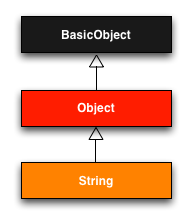
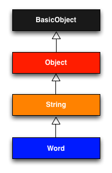
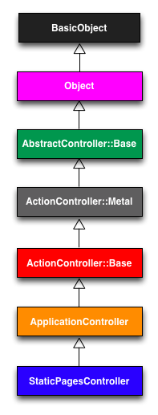

有了[第三章](chapter3.html)中的例子做铺垫，本章将为你介绍一些对 Rails 来说很重要的 Ruby 知识。Ruby 语言的知识点很多，不过对一个 Rails 开发者而言需要掌握的很少。我们采用的是有别于常规的 Ruby 学习过程，我们的目标是开发动态的 Web 应用程序，所以我建议你先学习 Rails，在这个过程中学习一些 Ruby 知识。如果要成为一个 Rails 专家，你就要更深入的掌握 Ruby 了。本书会为你成为专家的路途上奠定一个坚实的基础。如 [1.1.1 节](chapter1.html#sec-1-1-1)中说过的，读完本书后我建议你阅读一本专门针对 Ruby 的书，例如《[Ruby 入门](http://www.amazon.com/gp/product/1430223634)》、《[The Well-Frounded Rubyist](http://www.amazon.com/gp/product/1933988657)》或《[Ruby 之道](http://www.amazon.com/gp/product/0672328844)》。

本章介绍了很多内容，第一遍阅读没有掌握全部是可以理解的。在后续的章节我会经常地提到本章的内容。

<h2 id="sec-4-1">4.1 导言</h2>

从上一章我们可以看到，即使不懂任何背后用到的 Ruby 语言，我们也可以创建一个 Rails 应用程序骨架，也可以进行测试。不过我们依赖的是本教程中提供测试代码，得到错误信息，然后让其通过。我们不能总是这样做，所以这一章我们要暂别网站开发学习，正视我们的 Ruby 短肋。

上次接触应用程序时，我们已经使用 Rails 布局去掉了几乎是静态的页面中的代码重复。（参见代码 4.1）

**代码 4.1** 示例程序的网站布局  `app/views/layouts/application.html.erb`


<!DOCTYPE html>
<html>
  <head>
    <title>Ruby on Rails Tutorial Sample App | <%= yield(:title) %></title>
    <%= stylesheet_link_tag    "application", :media => "all" %>
    <%= javascript_include_tag "application" %>
    <%= csrf_meta_tags %>
  </head>
  <body>
    <%= yield %>
  </body>
</html>


让我们把注意力集中在代码 4.1 中的这一行：


<%= stylesheet_link_tag "application", :media => "all" %>


这行代码使用 Rails 内置的方法 `stylesheet_link_tag`（更多内容请查看 [Rails API 文档](http://api.rubyonrails.org/v3.2.0/classes/ActionView/Helpers/AssetTagHelper/StylesheetTagHelpers.html#method-i-stylesheet_link_tag)）为所有的[媒介类型](http://www.w3.org/TR/CSS2/media.html)引入了 `application.css`。对于经验丰富的 Rails 开发者来说，这一行很简单，但是这里却至少包含了困惑着你的四个 Ruby 知识点：内置的 Rails 方法，不用括号的方法调用，Symbol，Hash。这几点本章都会介绍。

除了提供很多内置的方法供我们在视图中使用之外，Rails 还允许我们自行创建。自行创建的这些方法叫做帮助方法（helper）。要说明如何自行创建一个帮助方法，我们要来看看代码 4.1 中标题那一行：


Ruby on Rails Tutorial Sample App | <%= yield(:title) %>


这行代码依赖于每个视图中定义的页面标题（使用 `provide`），例如


<% provide(:title, 'Home') %>
<h1>Sample App</h1>

  This is the home page for the
  <a href="http://railstutorial.org/">Ruby on Rails Tutorial</a>
  sample application.



那么如果我们不提供标题会怎样呢？我们的标题一般都包含一个公共部分，如果想更具体些就要加上一个变动的部分了。我们在布局中用了个小技巧，基本上已经实现了这样的标题。如果我们删除视图中的 `provide` 方法调用，输出的标题就没有了变动的那部分：


Ruby on Rails Tutorial Sample App |


公共部分已经输出了，而且后面还有一个竖杠 `|`。

为了解决这个标题问题，我们会自定义一个帮助方法，叫做 `full_title`。如果视图中没有定义标题，`full_title` 会返回标题的公共部分，即“Ruby on Rails Tutorial Sample App”；如果定义了，则会在公共部分后面加上一个竖杠，然后再接上该页面的标题（如代码 4.2）。[1](#fn-1)

**代码 4.2** 定义 `full_title` 帮助方法  `app/helpers/application_helper.rb`


module ApplicationHelper

  # Returns the full title on a per-page basis.
  def full_title(page_title)
    base_title = "Ruby on Rails Tutorial Sample App"
    if page_title.empty?
      base_title
    else
      "#{base_title} | #{page_title}"
    end
  end
end


现在我们已经定义了一个帮助方法，我们可以用它来简化布局，将


<title>Ruby on Rails Tutorial Sample App | <%= yield(:title) %></title>


替换成


<title><%= full_title(yield(:title)) %></title>


如代码 4.3 所示。

**代码 4.3** 示例程序的网站布局  `app/views/layouts/application.html.erb`


<!DOCTYPE html>
<html>
  <head>
    <title><%= full_title(yield(:title)) %></title>
    <%= stylesheet_link_tag    "application", :media => "all" %>
    <%= javascript_include_tag "application" %>
    <%= csrf_meta_tags %>
  </head>
  <body>
    <%= yield %>
  </body>
</html>


为了让这个帮助方法起作用，我们要在“首页”视图中将不必要的“Home”这个词删掉，让标题只保留公共部分。首先我们要按照代码 4.4 的内容更新现有的测试，增加对没包含 `'Home'` 的标题测试。

**代码 4.4** 更新“首页”标题的测试  `spec/requests/static_pages_spec.rb`


require 'spec_helper'

describe "Static pages" do

  describe "Home page" do

    it "should have the h1 'Sample App'" do
      visit '/static_pages/home'
      page.should have_selector('h1', :text => 'Sample App')
    end

    it "should have the base title" do
      visit '/static_pages/home'
      page.should have_selector('title',
                        :text => "Ruby on Rails Tutorial Sample App")
    end

    it "should not have a custom page title" do
      visit '/static_pages/home'
      page.should_not have_selector('title', :text => '| Home')
    end
  end
  .
  .
  .
end


试试看你能否猜到为什么我们添加了一个新测试而不是直接修改之前的测试。（提示：答案在 [3.3.1 节](chapter3.html#sec-3-3-1)中。）

运行测试，查看是否有一个测试失败了：


$ bundle exec rspec spec/requests/static_pages_spec.rb


为了让测试通过，我们要将“首页”视图中的 `provide` 那行删除，如代码 4.5 所示。

**代码 4.5** 删除标题定义后的“首页”  `app/views/static_pages/home.html.erb`


<h1>Sample App</h1>

  This is the home page for the
  <a href="http://railstutorial.org/">Ruby on Rails Tutorial</a>
  sample application.



现在测试应该可以通过了：


$ bundle exec rspec spec/requests/static_pages_spec.rb


和引入应用程序样式表那行代码一样，代码 4.2 的内容对经验丰富的 Rails 开发者来说看起来很简单，但是充满了很多会让人困惑的 Ruby 知识：module，注释，局部变量的赋值，布尔值，流程控制，字符串插值，还有返回值。这章也会介绍这些知识。

<h2 id="sec-4-2">4.2 字符串和方法</h2>

学习 Ruby 我们主要使用的工具是 Rails 控制台，它是用来和 Rails 应用程序交互的命令行，在 [2.3.3 节](chapter2.html#sec-2-3-3)中介绍过。这个控制台是基于 Ruby 的交互程序（`irb`）开发的，因此也就能使用 Ruby 语言的全部功能。（在 [4.4.4 节](#sec-4-4-4)中会介绍，控制台还可以进入 Rails 环境。）使用下面的方法在命令行中启动控制台：


$ rails console
Loading development environment
>>


默认情况下，控制台是以开发环境启用的，这是 Rails 定义的三个独立的环境之一（其他两个是测试环境和生产环境）。三个环境的区别在本章还不需要知道，我们会在 [7.1.1 节](#sec-7-1-1)中更详细的介绍。

控制台是个很好的学习工具，你不用有所畏惧尽情的使用吧，没必要担心，你（几乎）不会破坏任何东西。如果你在控制器中遇到问题了可以使用 Ctrl-C 结束当前执行的命令，或者使用 Ctrl-D 直接退出控制台。在阅读本章后面的内容时，你会发现查阅 [Ruby API](http://ruby-doc.org/core-1.9.3/) 会很有用。API 包含很多信息，例如，如果你想查看关于 Ruby 字符串更多的内容，可以查看其中的 `String` 类页面。

<h3 id="sec-4-2-1">4.2.1 注释</h3>

Ruby 中的注释以井号 `#`（也叫“Hask Mark”，或者更诗意的叫“散列字元”）开头，一直到行尾结束。Ruby 会忽略注释，但是注释对代码阅读者（包括代码的创作者）却很有用。在下面的代码中


  # Returns the full title on a per-page basis.
  def full_title(page_title)
    .
    .
    .
  end


第一行就是注释，它说明了后面的方法的目的。

你一般无需在控制台中写注释，不过为了说明代码，我会按照下面的形式加上注释，例如：


$ rails console
>> 17 + 42   # Integer addition
=> 59


在本节的阅读过程中，在控制台中输入或者复制粘贴命令时，如果愿意你可以不复制注释，反正控制台会忽略注释。

<h3 id="sec-4-2-2">4.2.2 字符串</h3>

字符串算是 Web 应用程序中最有用的数据结构了，因为网页的内容就是从数据库发送到浏览器的字符串。然我们现在控制台中体验一下字符串，这次我们使用 `rails c` 启动控制台，这是 `rails console` 的快捷方式：


$ rails c
>> ""         # 空字符串
=> ""
>> "foo"      # 非空的字符串
=> "foo"


上面的字符串是字面量（字面量字符串，literal string），通过双引号（`"`）创建。控制器回显的是每一行的计算结果，本例中字符串字面量的结果就是字符串本身。

我们还可以使用 `+` 号连接字符串：


>> "foo" + "bar"    # 字符串连接
=> "foobar"


`"foo"` 连接 `"bar"` 的运行结果是字符串 `"foobar"`。[2](#fn-2)

另外一种创建字符串的方式是通过一个特殊的句法（`#{}`）进行插值操作：[3](#fn-3)


>> first_name = "Michael"    # 变量赋值
=> "Michael"
>> "#{first_name} Hartl"     # 字符串插值
=> "Michael Hartl"


我们先把“`Michael`”赋值给变量 `first_name`，然后将其插入到字符串 `"#{first_name} Hartl"` 中。我们可以将两个字符串都赋值给变量：


>> first_name = "Michael"
=> "Michael"
>> last_name = "Hartl"
=> "Hartl"
>> first_name + " " + last_name    # 字符串连接，中间加了空格
=> "Michael Hartl"
>> "#{first_name} #{last_name}"    # 作用相同的插值
=> "Michael Hartl"


注意，两个表达式的结果是相同的，不过我倾向使用插值的方式。在两个字符串中加入一个空格（`" "`）显得很别扭。

<h4>打印字符串</h4>

打印字符串最常用的 Ruby 方法是 `puts`（读作“put ess”，意思是“打印字符串”）：


>> puts "foo"     # 打印字符串
foo
=> nil


`puts` 方法还有一个副作用（side-effect）：`puts "foo"` 首先会将字符串打印到屏幕上，然后再返回[空值字面量](http://www.answers.com/nil)：`nil` 是 Ruby 中的“什么都没有”。（后续内容中为了行文简洁我会省略 `=> nil`。）

`puts` 方法会自动在输出的字符串后面加入换行符 `\n`，功能类似的 `print` 方法则不会：


>> print "foo"    # 打印字符串（和 puts 类似，但没有添加换行符）
foo=> nil
>> print "foo\n"  # 和 puts "foo" 一样
=> nil


<h4>单引号字符串</h4>

目前介绍的例子都是使用双引号创建的字符串，不过 Ruby 也支持用单引号创建字符串。大多数情况下这两种字符串的效果是一样的：


>> 'foo'          # 单引号创建的字符串
=> "foo"
>> 'foo' + 'bar'
=> "foobar"


不过两种方法还是有个很重要的区别的：Ruby 不会对单引号字符串进行插值操作：


>> '#{foo} bar'     # 单引号字符串不能进行插值操作
=> "\#{foo} bar"


注意控制台是如何使用双引号返回结果的，需要使用反斜线转义特殊字符，例如 `#`。

如果双引号字符串可以做单引号所做的所有事，而且还能进行插值，那么单引号字符串存在的意义是什么呢？单引号字符串的用处在于它们真的就是字面值，只包含你输入的字符。例如，反斜线在很多系统中都很特殊，就像换行符（`\n`）一样。如果有一个变量需要包含一个反斜线，使用单引号就很简单：


>> '\n'       # 反斜线和 n 字面值
=> "\\n"


和前例的 `#` 字符一样，Ruby 要使用一个额外的反斜线来转义反斜线，在双引号字符串中，要表达一个反斜线就要使用两个反斜线。对简单的例子来说，这省不了多少事，不过如果有很多需要转义的字符就显得出它的作用了：


>> 'Newlines (\n) and tabs (\t) both use the backslash character \.'
=> "Newlines (\\n) and tabs (\\t) both use the backslash character \\."


<h3 id="sec-4-2-3">4.2.3 对象及向其传递消息</h3>

Ruby 中一切皆对象，包括字符串和 `nil` 都是。我们会在 [4.4.2 节](#sec-4-4-2)介绍对象技术层面上的意义，不过一般很难通过阅读一本书就理解对象了，你要多看一些例子才能建立对对象的感性认识。

不过说出对象的作用就很简单：它可以响应消息。例如，一个字符串对象可以响应 `length` 这个消息，它返回字符串包含的字符数量：


>> "foobar".length        # 把 length 消息传递给字符串
=> 6


这样传递给对象的消息叫做方法，它是在对象中定义的函数。[4](#fn-4) 字符串还可以响应 `empty?` 方法：


>> "foobar".empty?
=> false
>> "".empty?
=> true


注意 `empty?` 方法末尾的问号，这是 Ruby 的一个约定，说明方法的返回值是布尔值：`true` 或 `false`。布尔值在流程控制中特别有用：


>> s = "foobar"
>> if s.empty?
>>   "The string is empty"
>> else
>>   "The string is nonempty"
>> end
=> "The string is nonempty"


布尔值还可以使用 `&&`（和）、`||`（或）和 `!`（非）操作符结合使用：


>> x = "foo"
=> "foo"
>> y = ""
=> ""
>> puts "Both strings are empty" if x.empty? && y.empty?
=> nil
>> puts "One of the strings is empty" if x.empty? || y.empty?
"One of the strings is empty"
=> nil
>> puts "x is not empty" if !x.empty?
"x is not empty"
=> nil


因为 Ruby 中的一切都是对象，那么 `nil` 也是对象，所以它也可以响应方法。举个例子，`to_s` 方法基本上可以把任何对象转换成字符串：


>> nil.to_s
=> ""


结果显然是个空字符串，我们可以通过下面的方法串联（chain）验证这一点：


>> nil.empty?
NoMethodError: You have a nil object when you didn\'t expect it!
You might have expected an instance of Array.
The error occurred while evaluating nil.empty?
>> nil.to_s.empty?      # 消息串联
=> true


我们看到，`nil` 对象本身无法响应 `empty?` 方法，但是 `nil.to_s` 可以。

有一个特殊的方法可以测试对象是否为空，你应该能猜到这个方法：


>> "foo".nil?
=> false
>> "".nil?
=> false
>> nil.nil?
=> true


下面的代码


puts "x is not empty" if !x.empty?


说明了关键词 `if` 的另一种用法：你可以编写一个当且只当 `if` 后面的表达式为真时才执行的语句。对应的，关键词 `unless` 也可以这么用：


>> string = "foobar"
>> puts "The string '#{string}' is nonempty." unless string.empty?
The string 'foobar' is nonempty.
=> nil


我们需要注意一下 `nil` 的特殊性，除了 `false` 本身之外，所有的 Ruby 对象中它是唯一一个布尔值为“假”的：


>> if nil
>>   true
>> else
>>   false        # nil 是假值
>> end
=> false


基本上所有其他的 Ruby 对象都是“真”的，包括 0：


>> if 0
>>   true        # 0（除了 nil 和 false 之外的一切对象）是真值
>> else
>>   false
>> end
=> true


<h3 id="sec-4-2-4">4.2.4 定义方法</h3>

在控制台中，我们可以像定义 `home` 动作（代码 3.6）和 `full_title` 帮助方法（代码 4.2）一样进行方法定义。（在控制台中定义方法有点麻烦，我们一般会在文件中定义，不过用来演示还行。）例如，我们要定义一个名为 `string_message` 的方法，可以接受一个参数，返回值取决于参数是否为空：


>> def string_message(string)
>>   if string.empty?
>>     "It's an empty string!"
>>   else
>>     "The string is nonempty."
>>   end
>> end
=> nil
>> puts string_message("")
It\'s an empty string!
>> puts string_message("foobar")
The string is nonempty.


注意 Ruby 方法会非显式的返回值：返回最后一个语句的值。在上面的这个例子中，返回的值会根据参数是否为空而返回两个字符串中的一个。Ruby 也支持显式的指定返回值，下面的代码和上面的效果一样：


>> def string_message(string)
>>   return "It's an empty string!" if string.empty?
>>   return "The string is nonempty."
>> end


细心的读者可能会发现其实这里第二个 `return` 不是必须的，作为方法的最后一个表达式，不管有没有 `return`，字符串 `"The string is nonempty."` 都会作为返回值。不过两处都加上 `return` 看起来更好看。

<h3 id="sec-4-2-5">4.2.5 回顾一下标题的帮助方法</h3>

下载我们来理解一下代码 4.2 中的 `full_title` 帮助方法：[5](#fn-5)


module ApplicationHelper

  # 根据所在页面返回完整的标题                           # 在文档中显示的注释
  def full_title(page_title)                          # 方法定义
    base_title = "Ruby on Rails Tutorial Sample App"  # 变量赋值
    if page_title.empty?                              # 布尔测试
      base_title                                      # 非显式返回值
    else
      "#{base_title} | #{page_title}"                 # 字符串插值
    end
  end
end


方法定义、变量赋值、布尔测试、流程控制和字符串插值——组合在一起定义了一个可以在网站布局中使用的帮助方法。还用到了 `module ApplicationHelper`：module 为我们提供了一种把相关方法组织在一起的方式，稍后我们可以使用 `include` 把它插入其他的类中。编写一般的 Ruby 程序时，你要自己定义一个 module 然后再显式的将其引入类中，但是对于帮助方法所在的 module 就交由 Rails 来处理引入了，最终的结果是 `full_title` 方法[自动的](http://catb.org/jargon/html/A/automagically.html)就可以在所有的视图中使用了。

<h2 id="sec-4-3">4.3 其他的数据类型</h2>

虽然 Web 程序一般都是处理字符串，但也需要其他的数据类型来生成字符串。本节我们就来介绍一些对开发 Rails 应用程序很重要的 Ruby 中的其他数据类型。

<h3 id="sec-4-3-1">4.3.1 数组和 Range</h3>

数组就是一组顺序特定的元素。本书尚且没有用过数组，不过理解了数组就能很好的理解 Hash （[4.3.3 节](#sec-4-3-3)），也有助于理解 Rails 中的数据模型（例如 [2.3.3 节](chapter2.html#sec-2-3-3)中用到的 `has_many` 关联，[10.1.3 节](chapter10.html#sec-10-1-3)会做详细介绍）。

目前我们已经花了很多的时间理解字符串，从字符串过度到数组可以从 `split` 方法开始：


>>  "foo bar     baz".split     # 把字符串分割成有三个元素的数组
=> ["foo", "bar", "baz"]


上述代码的返回结果是一个有三个元素的数组。默认情况下，`split` 在空格处把字符串分割成数组，当然你几乎可以在任何地方进行分割：


>> "fooxbarxbazx".split('x')
=> ["foo", "bar", "baz"]


和其他编程语言的习惯一样，Ruby 中数组的索引（index）也是从零开始的，数组中第一个元素的索引是 0，第二个元素的索引是 1，依此类推：


>> a = [42, 8, 17]
=> [42, 8, 17]
>> a[0]               # Ruby 使用方括号获取数组元素
=> 42
>> a[1]
=> 8
>> a[2]
=> 17
>> a[-1]              # 索引还可以是负数
=> 17


我们看到，在 Ruby 中是使用方括号来获取数组元素的。除了这种方法，Ruby 还为一些常用的元素获取操作提供了别名（synonym）：[6](#fn-6)


>> a                  # 只是为了看一下 a 的值是什么
=> [42, 8, 17]
>> a.first
=> 42
>> a.second
=> 8
>> a.last
=> 17
>> a.last == a[-1]    # 用 == 进行对比
=> true


最后一行介绍了相等比较操作符 `==`，Ruby 和其他语言一样还提供了对应的 `!=`（不等）等其他的操作符：


>> x = a.length       # 和字符串一样，数组也可以响应 length 方法
=> 3
>> x == 3
=> true
>> x == 1
=> false
>> x != 1
=> true
>> x >= 1
=> true
>> x < 1
=> false


除了 `length`（上述代码的第一行）之外，数组还可以响应一堆其他的方法：


>> a
=> [42, 8, 17]
>> a.sort
=> [8, 17, 42]
>> a.reverse
=> [17, 8, 42]
>> a.shuffle
=> [17, 42, 8]
>> a
=> [42, 8, 17]


注意，上面的方法都没有修改 `a` 的值。如果你想修改数组的值要使用对应的“炸弹（bang）”方法（之所以这么叫是因为这里的感叹号经常都读作“bang”）：


>> a
=> [42, 8, 17]
>> a.sort!
=> [8, 17, 42]
>> a
=> [8, 17, 42]


你还可以使用 `push` 方法向数组中添加元素，或者使用等价的 `<<` 操作符：


>> a.push(6)                  # 把 6 加到数组结尾
=> [42, 8, 17, 6]
>> a << 7                     # 把 7 加到数组结尾
=> [42, 8, 17, 6, 7]
>> a << "foo" << "bar"        # 串联操作
=> [42, 8, 17, 6, 7, "foo", "bar"]


最后一个例子说明你可以把添加操作串在一起操作；同时也说明，Ruby 不像很多其他的语言，数组可以包含不同类型的数据（本例中是数字和字符串混合）。

前面我们用 `split` 把字符串分割成字符串，我们还可以使用 `join` 方法进行相反的操作：


>> a
=> [42, 8, 17, 7, "foo", "bar"]
>> a.join                       # 没有连接符
=> "428177foobar"
>> a.join(', ')                 # 连接符是一个逗号和空格
=> "42, 8, 17, 7, foo, bar"


和数组有点类似的是 Range，使用 `to_a` 方法把它转换成数组或许更好理解：


>> 0..9
=> 0..9
>> 0..9.to_a              # 错了，to_a 在 9 上调用了
NoMethodError: undefined method `to_a\' for 9:Fixnum
>> (0..9).to_a            # 调用 to_a 要用括号包住 Range
=> [0, 1, 2, 3, 4, 5, 6, 7, 8, 9]


虽然 `0..9` 是一个合法的 Range，不过上面第二个表达式告诉我们调用方法时要加上括号。

Range 经常被用来获取一组数组元素：


>> a = %w[foo bar baz quux]         # %w 创建一个元素为字符串的数组
=> ["foo", "bar", "baz", "quux"]
>> a[0..2]
=> ["foo", "bar", "baz"]


Range 也可使用字母：


>> ('a'..'e').to_a
=> ["a", "b", "c", "d", "e"]


<h3 id="sec-4-3-2">4.3.2 块</h3>

数组和 Range 可以响应的方法中有很多都可以跟着一个块（block），这是 Ruby 中最强大也是最难理解的功能：


>> (1..5).each { |i| puts 2 * i }
2
4
6
8
10
=> 1..5


这个代码在 Range `(1..5)` 上调用了 `each` 方法，然后又把 `{ |i| puts 2*i }` 这个块传递给 `each` 方法。`|i|` 两边的竖杠在 Ruby 句法中是用来定义块变量的。只有这个方法才知道如何处理后面跟着的块。本例中，Range 的 `each` 方法会处理后面的块，块中有一个本地变量 `i`，`each` 会将 Range 中的各个值传进块中然后执行相应的操作。

花括号是一种定义块的方法，还有另一种方法可用：


>> (1..5).each do |i|
?>   puts 2 * i
>> end
2
4
6
8
10
=> 1..5


块可以多于一行，也经常是多于一行的。本书中我们会遵照一个常用的约定，当块只有一行简单的代码时使用花括号形式；当块是一行很长的代码，或者多行时使用 `do..end` 形式：


>> (1..5).each do |number|
?>   puts 2 * number
>>   puts '--'
>> end
2
--
4
--
6
--
8
--
10
--
=> 1..5


上面的代码用 `number` 代替了 `i`，我想告诉你的是任何变量名都可以使用。

除非你已经有了一些编程知识，否则对块的理解是没有捷径的。你要做的是多看，看得多了最后你就会习惯它的用法了。[7](#fn-7) 幸好人类擅长于从实例中归纳出一般性。下面是一些例子，其中几个用到了 `map` 方法：


>> 3.times { puts "Betelgeuse!" }   # 3.times 后跟的块没有变量
"Betelgeuse!"
"Betelgeuse!"
"Betelgeuse!"
=> 3
>> (1..5).map { |i| i**2 }          # ** 表示幂
=> [1, 4, 9, 16, 25]
>> %w[a b c]                        # 再说一下，%w 可以创建元素为字符串的数组
=> ["a", "b", "c"]
>> %w[a b c].map { |char| char.upcase }
=> ["A", "B", "C"]
>> %w[A B C].map { |char| char.downcase }
=> ["a", "b", "c"]


上面的代码说明，`map` 方法返回的是在数组或 Range 的每个元素上执行块中的代码后的结果。

现在我们就可以来理解一下我在 [1.4.4 节](chapter1.html#sec-1-4-4)中用来生成随机二级域名的那行 Ruby 代码了：


('a'..'z').to_a.shuffle[0..7].join


我们一步一步分解一下：


>> ('a'..'z').to_a                     # 字母表数组
=> ["a", "b", "c", "d", "e", "f", "g", "h", "i", "j", "k", "l", "m", "n", "o",
"p", "q", "r", "s", "t", "u", "v", "w", "x", "y", "z"]
>> ('a'..'z').to_a.shuffle             # 打乱数组
=> ["c", "g", "l", "k", "h", "z", "s", "i", "n", "d", "y", "u", "t", "j", "q",
"b", "r", "o", "f", "e", "w", "v", "m", "a", "x", "p"]
>> ('a'..'z').to_a.shuffle[0..7]       # 取出前面的 8 个元素
=> ["f", "w", "i", "a", "h", "p", "c", "x"]
>> ('a'..'z').to_a.shuffle[0..7].join  # 将取出的元素合并成字符串
=> "mznpybuj"


<h3 id="sec-4-3-3">4.3.3 Hash 和 Symbol</h3>

Hash 本质上就是数组的一个特例：你可以认为 Hash 基本上就是数组，只不过它的索引不局限于使用数字。（实际上在一些语言中，特别是 Perl，因为这个原因就把 Hash 叫做关联数组（associative array）。）Hash 的索引（或者叫“键”）几乎可以是任何对象。例如，我们可以使用字符串当键：


>> user = {}                          # {} 是一个空 Hash
=> {}
>> user["first_name"] = "Michael"     # 键为 "first_name"，值为 "Michael"
=> "Michael"
>> user["last_name"] = "Hartl"        # 键为 "last_name"，值为 "Hartl"
=> "Hartl"
>> user["first_name"]                 # 获取元素的方式类似数组
=> "Michael"
>> user                               # Hash 的字面量形式
=> {"last_name"=>"Hartl", "first_name"=>"Michael"}


Hash 通过一对花括号中包含一些键值对的形式表示，只有一对花括号而没有键值对（`{}`）就是一个空 Hash。需要注意，Hash 中的花括号和块中的花括号不是一个概念。（是的，这可能会让你迷惑。）不过，Hash 虽然和数组类似，但却有一个很重要的区别：Hash 的元素没有特定的顺序。[8](#fn-8) 如果顺序很重要的话就要使用数组了。

通过方括号的形式每次定义一个元素的方式不太敏捷，使用 `=>` 分隔的键和值这种字面量的形式定义 Hash 要简洁得多，我们称后一种方式为“hashrocket”：


>> user = { "first_name" => "Michael", "last_name" => "Hartl" }
=> {"last_name"=>"Hartl", "first_name"=>"Michael"}


在上面的代码中我用到了一个 Ruby 句法约定，在左花括号后面和右花括号前面加入了一个空格，控制台会忽略这些空格。（不要问我为什么这些空格是约定俗成的，或许是某个 Ruby 编程大牛喜欢这种形式，然后约定就产生了。）

目前为止我们的键用的都是字符串，但在 Rails 中用 Symbol 当键却很常见。Symbol 看起来像字符串，只不过没有包含在一对引号中，而是在前面加一个冒号。例如，`:name` 就是一个 Symbol。你可以把 Symbol 看成没有约束的字符串：[9](#fn-9)


>> "name".split('')
=> ["n", "a", "m", "e"]
>> :name.split('')
NoMethodError: undefined method `split' for :name:Symbol
>> "foobar".reverse
=> "raboof"
>> :foobar.reverse
NoMethodError: undefined method `reverse' for :foobar:Symbol


Symbol 是 Ruby 特有的一个数据类型，其他语言很少用到，初看起来感觉很奇怪，不过 Rails 经常用到它，所以你很快就会习惯的。

用 Symbol 当键，我们可以按照如下的方式定义一个 `user` Hash：


>> user = { :name => "Michael Hartl", :email => "michael@example.com" }
=> {:name=>"Michael Hartl", :email=>"michael@example.com"}
>> user[:name]              # 获取 :name 对应的值
=> "Michael Hartl"
>> user[:password]          # 获取一个未定义的键对应的值
=> nil


从上面的例子我们可以看出，Hash 中没有定义的键对应的值是 `nil`。

因为 Symbol 当键的情况太普遍了，Ruby 1.9 干脆就为这种情况定义了一个新的句法：


>> h1 = { :name => "Michael Hartl", :email => "michael@example.com" }
=> {:name=>"Michael Hartl", :email=>"michael@example.com"}
>> h2 = { name: "Michael Hartl", email: "michael@example.com" }
=> {:name=>"Michael Hartl", :email=>"michael@example.com"}
>> h1 == h2
=> true


第二个代码把 hashrocket 形式的键值对变成了键后跟着一个冒号然后再跟着一个值的形式：


{ name: "Michael Hartl", email: "michael@example.com" }


这种结构更好的沿袭了其他语言（例如 JavaScript）中 Hash 的表现方式，在 Rails 社区中也越来越受欢迎。这两种方式现在都在使用，所以你要能识别它们。本书后续内容中大多数的 Hash 都会使用新的形式，在 Ruby 1.8.7 或之前的版本中是不可以使用的。如果你使用的是较早前的版本，你可以更新到 Ruby 1.9（推荐），或者使用旧的形式。

Hash 元素的值可以是任何对象，甚至是一个 Hash，如代码 4.6 所示。

**代码 4.6** Hash 嵌套


>> params = {}        # 定义一个名为 params（parameters 的简称）的 Hash
=> {}
>> params[:user] = { name: "Michael Hartl", email: "mhartl@example.com" }
=> {:name=>"Michael Hartl", :email=>"mhartl@example.com"}
>> params
=> {:user=>{:name=>"Michael Hartl", :email=>"mhartl@example.com"}}
>>  params[:user][:email]
=> "mhartl@example.com"


这种 Hash 中有 Hash 的形式（或称为 Hash 嵌套）在 Rails 中大量的使用，我们从 [7.3 节](chapter7.html#sec-7-3)开始会接触到。

与数组和 Range 一样，Hash 也可以响应 `each` 方法。例如，一个名为 `flash` 的 Hash，它的键是两个条件判断，`:success` 和 `:error`：


>> flash = { success: "It worked!", error: "It failed." }
=> {:success=>"It worked!", :error=>"It failed."}
>> flash.each do |key, value|
?>   puts "Key #{key.inspect} has value #{value.inspect}"
>> end
Key :success has value "It worked!"
Key :error has value "It failed."


注意，数组的 `each` 方法后面的块只有一个变量，而 Hash 的 `each` 后面的块接受两个变量，`key` 和 `value`。所以 Hash 的 `each` 方法每次遍历都会以一个键值对为基本单位进行。

上面的示例中用到了很有用的 `inspect` 方法，返回被调用对象的字符串字面量表现形式：


>> puts (1..5).to_a            # 把数组作为字符串输出
1
2
3
4
5
>> puts (1..5).to_a.inspect    # 输出一个数组字面量形式
[1, 2, 3, 4, 5]
>> puts :name, :name.inspect
name
:name
>> puts "It worked!", "It worked!".inspect
It worked!
"It worked!"


顺便说一下，因为使用 `inspect` 输出对象的方式经常使用，为此还有一个专门的快捷方式，`p` 方法：


>> p :name             # 等价于 puts :name.inspect
:name


<h3 id="sec-4-3-4">4.3.4 重温引入 CSS 的代码</h3>

现在我们要重新认识一下代码 4.1 中在布局中引入 CSS 的代码：


<%= stylesheet_link_tag "application", :media => "all" %>


我们现在基本上可以理解这行代码了。在 [4.1 节](#sec-4-1)中简单的提到过，Rails 定义了一个特殊的函数用来引入样式表，下面的代码


stylesheet_link_tag "application", :media => "all"


就是对这个函数的调用。不过还有两个奇怪的地方。第一，括号哪儿去了？因为在 Ruby 中，括号是可以省略的，下面的两行代码是等价的：


# 函数调用时括号是可以省略的
stylesheet_link_tag("application", :media => "all")
stylesheet_link_tag "application", :media => "all"


第二，`:media` 部分显然是一个 Hash，但是怎么没用花括号？因为在函数调用时，如果 Hash 是最后一个参数，它的花括号是可以省略的。下面的两行代码是等价的：


# Hash 是最后一个参数时花括号可以省略
stylesheet_link_tag "application", { :media => "all" }
stylesheet_link_tag "application", :media => "all"


所以我们就看到了这样一行代码


stylesheet_link_tag "application", :media => "all"


它调用了 `stylesheet_link_tag` 函数，传进两个参数：一个是字符串，指明样式表的路径；另一个是 Hash，指明媒介类型。因为使用的是 `<%= %>`，函数的执行结果会通过 ERb 插入模板中，如果你在浏览器中查看网页的源代码就会看到引入样式表所用的 HTML（参见代码 4.7）。（你可能会在 CSS 的文件名后看到额外的字符，例如 `?body=1`。这是 Rails 加入的，可以确保 CSS 修改后浏览器会重新加载它。）

**代码 4.7** 引入 CSS 的代码生成的 HTML


<link href="/assets/application.css" media="all" rel="stylesheet"
type="text/css" />


如果你打开 <http://localhost:3000/assets/application.css> 查看 CSS 的话，会发现是空的（除了一些注释）。在[第五章](chapter5.html)中我们会看到如何改变这个现象。

<h2 id="sec-4-4">4.4 Ruby 类</h2>

我们之前已经说过 Ruby 中的一切都是对象，本节我们就会自己定义一些对象。Ruby 和其他面向对象（object-oriented）编程语言一样，使用类来组织方法。然后实例化（instantiate）类创建对象。如果你刚接触面向对象编程，这些都似天书一般，那么让我们来看一些实际的例子吧。

<h3 id="sec-4-4-1">4.4.1 构造器</h3>

我们看过很多例子使用类初始化对象，不过还没有正式的初始化过。例如，我们使用一个双引号初始化一个字符串，双引号是字符串的字面构造器（literal constructor）：


>> s = "foobar"       # 使用双引号的字面构造器
=> "foobar"
>> s.class
=> String


我们看到字符串可以响应 `class` 方法，返回的结果是字符串所属的类。

除了使用字面构造器之外，我们还可以使用等价的具名构造器（named constructor），即在类名上调用 `new` 方法：[10](#fn-10)


>> s = String.new("foobar")   # 字符串的具名构造器
=> "foobar"
>> s.class
=> String
>> s == "foobar"
=> true


上面的代码和字面构造器是等价的，只是更能表现我们的意图。

数组和字符串类似：


>> a = Array.new([1, 3, 2])
=> [1, 3, 2]


不过 Hash 就有些不同了。数组的构造器 `Array.new` 可接受一个可选的参数指明数组的初始值，`Hash.new` 可接受一个参数指明元素的默认值，就是当键不存在时返回的值：


>> h = Hash.new
=> {}
>> h[:foo]            # 试图获取不存在的键 :foo 对应的值
=> nil
>> h = Hash.new(0)    # 设置不存在的键返回 0 而不是 nil
=> {}
>> h[:foo]
=> 0


在类上调用的方法，如本例的 `new`，我们称之为类方法（class method）。在类上调用 `new` 得到的结果是这个类的一个对象，也叫做这个类的实例（instance）。在实例上调用的方法，例如 `length`，叫做实例方法（instance method）。

<h3 id="sec-4-4-2">4.4.2 类的继承</h3>

学习类时，理清类的继承关系会很有用，我们可以使用 `superclass` 方法：


>> s = String.new("foobar")
=> "foobar"
>> s.class                        # 查找 s 所属的类
=> String
>> s.class.superclass             # 查找 String 的父类
=> Object
>> s.class.superclass.superclass  # Ruby 1.9 使用 BasicObject 作为基类
=> BasicObject
>> s.class.superclass.superclass.superclass
=> nil


这个继承关系如图 4.1 所示。我们可以看到，`String` 的父类是 `Object`，`Object` 的父类是 `BasicObject`，但是 `BasicObject` 就没有父类了。这样的关系对每个 Ruby 对象都是适用的：只要在类的继承关系上往上多走几层就会发现 Ruby 中的每个类最终都是继承自 `BasicObject`，而其本身没有父类。这就是“Ruby 中一切皆对象”技术层面的意义。

图 4.1：`String` 类的继承关系

要跟深入的理解类，没什么比自己实际编写一个更好的方法了。我们来创建一个名为 `Word` 的类，包含一个名为 `palindrome?` 方法，如果单词顺读和反读时都一样则返回 `true`：


>> class Word
>>   def palindrome?(string)
>>     string == string.reverse
>>   end
>> end
=> nil


我们可以按照下面的方式使用：


>> w = Word.new              # 创建一个 Word 对象
=> #<Word:0x22d0b20>
>> w.palindrome?("foobar")
=> false
>> w.palindrome?("level")
=> true


如果你觉得这个例子有点大题小做，很好，我们的目的达到了。定义一个新类，可是只创建一个可以接受一个字符串参数的方法，这么做很古怪。既然单词是字符串，如果 `Word` 继承 `String` 不就行了，如代码 4.8 所示。（你要退出控制台然后再在控制台中输入这写代码，这样才能把之前的 `Word` 定义清除掉。）

**代码 4.8** 在控制台中定义 `Word` 类


>> class Word < String             # Word 继承自 String
>>   # 如果字符串和自己翻转后相等则返回 true
>>   def palindrome?
>>     self == self.reverse        # self 代表这个字符串本身
>>   end
>> end
=> nil


上面代码中的 `Word < String` 在 Ruby 中表示继承（[3.1.2 节](chapter3.html#sec-3-1-2)中简单介绍过），这样除了刚定义的 `palindrome?` 方法之外，`Word` 还拥有所有字符串拥有的方法：


>> s = Word.new("level")    # 创建一个新的 Word，初始值为 level
=> "level"
>> s.palindrome?            # Word 实例可以响应 palindrome? 方法
=> true
>> s.length                 # Word 实例还继承了字符串所有的常规方法
=> 5


`Word` 继承自 `String`，我们可以在控制台中查看类的继承关系：


>> s.class
=> Word
>> s.class.superclass
=> String
>> s.class.superclass.superclass
=> Object


继承关系如图 4.2 所示。

图 4.2：代码 4.8 中定义的 `Word` 类（非内置类）的继承关系

在代码 4.8 中，注意，要检查单词和单词的翻转是否相同，要在 `Word` 类中引用这个单词，在 Ruby 中我们使用 `self` 进行引用：在 `Word` 类中，`self` 代表的就是对象本身。所以我们可以使用


self == self.reverse


来检查单词是否是一个回文。[11](#fn-11)

<h3 id="sec-4-4-3">4.4.3 修改内置的类</h3>

虽然继承是个很强大的功能，不过在回文判断的例子中，如果能把 `palindrome?` 加入 `String` 类就更好了，这样（除了其他对象外）我们就可以在字符串字面量上调用 `palindrome?` 方法了。现在我们还不能直接调用：


>> "level".palindrome?
NoMethodError: undefined method `palindrome?\' for "level":String


有点令人惊讶的是，Ruby 允许你这么做，Ruby 中的类可以被打开进行修改，允许像我们自己这样的普通人添加一些方法：[12](#fn-12)


>> class String
>>   # 如果字符串和自己翻转后相等则返回 true
>>   def palindrome?
>>     self == self.reverse
>>   end
>> end
=> nil
>> "deified".palindrome?
=> true


（我不知道哪一个更牛：Ruby 允许向内置的类中添加方法，或“`deified`（神化，奉为神明）”是个回文。）

可以修改内置的类是个很强大的功能，不过功能强大意味着责任也大，如果没有一个很好的理由，向内置的类中添加方法被认为是不好的习惯。Rails 自然有很好的理由，例如，在 Web 应用程序中我们经常要避免变量是空白（blank）的，像用户名之类的就不应该是空格或空白，所以 Rails 为 Ruby 添加了一个 `blank?` 方法。因为 Rails 控制台会自动加载 Rails 添加的扩展功能，我们可以看一下示例（在 `irb` 就不可以）：


>> "".blank?
=> true
>> "      ".empty?
=> false
>> "      ".blank?
=> true
>> nil.blank?
=> true


我们可以看到，一个包含空格的字符串不是空的（empty），却是空白的（blank）。还要注意，`nil` 也是空白的。因为 `nil` 不是字符串，所以上面的代码说明了 Rails 其实是把 `blank?` 添加到 `String` 的基类 `Object` 上的。我们会在 [8.2.1 节](chapter8.html#sec-8-2-1)中介绍一些 Rails 扩充 Ruby 类的例子。）

<h3 id="sec-4-4-4">4.4.4 控制器类</h3>

讨论类和继承时你可能觉得似曾相识，不错，我们之前介绍过，在使用 StaticPages 控制器时（代码 3.15）：


class StaticPagesController < ApplicationController

  def home
  end

  def help
  end

  def about
  end
end


你现在可以理解，至少有点能理解，这些代码的意思了：`StaticPagesController` 是一个类，继承自 `ApplicationController`，`StaticPagesController` 类中有三个方法 `home`、`help` 和 `about`。因为 Rails 控制台会加载本地的 Rails 环境，所以我们可以在控制台中创建一个控制器来查看一下它的继承关系：[13](#fn-13)


>> controller = StaticPagesController.new
=> #<StaticPagesController:0x22855d0>
>> controller.class
=> StaticPagesController
>> controller.class.superclass
=> ApplicationController
>> controller.class.superclass.superclass
=> ActionController::Base
>> controller.class.superclass.superclass.superclass
=> ActionController::Metal
>> controller.class.superclass.superclass.superclass.superclass
=> AbstractController::Base
>> controller.class.superclass.superclass.superclass.superclass.superclass
=> Object


这个继承关系如图 4.3 所示。

图 4.3：StaticPages 控制器的继承关系

我们还可以在控制台中调用控制器的动作，动作其实就是方法：


>> controller.home
=> nil


`home` 动作的返回值为 `nil`，因为它是空的。

注意，动作没有返回值，或至少没返回真正需要的值。如我们在第三章看到的，`home` 动作的目的是渲染网页，而不是返回一个值。不过，我记得没有在任何地方调用过 `StaticPagesController.new`，这是怎么回事？

原因在于，Rails 是用 Ruby 编写的，但 Rails 不是 Ruby。有些 Rails 类就像普通的 Ruby 类一样，不过也有些则得益于 Rails 的强大功能。Rails 是单独的一门学问，应该区别于 Ruby 进行学习和理解。这就是为什么，如果你的兴趣是开发 Web 应用程序，我建议你先学 Rails 再学 Ruby，然后再回到 Rails 上的原因。

<h3 id="sec-4-4-5">4.4.5 用户类</h3>

我们通过创建一个完整的类来结束对 Ruby 的介绍，一个 `User` 类，提前实现[第六章](chapter6.html)的 User 模型。

到目前为止，我们都是在控制台中定义类的，这样很快捷，但也有点不爽。现在我们要在应用程序的根目录创建一个名为 `example_user.rb` 的文件，写入代码 4.9 的内容。

**代码 4.9** 用户类的代码  `example_user.rb`


class User
  attr_accessor :name, :email

  def initialize(attributes = {})
    @name  = attributes[:name]
    @email = attributes[:email]
  end

  def formatted_email
    "#{@name} <#{@email}>"
  end
end


上面的代码有很多要说明的，我们一步步来。先看下面这行：


  attr_accessor :name, :email


它为用户的名字和 Email 地址创建了属性访问器（attribute accessors）。也就是定义了“获取（getter）”和“设定（setter）”方法，用来取回和赋值 `@name` 和 `@email` 实例变量，我们在 [2.2.2 节](chapter2.html#sec-2-2-2)中介绍过实例变量。在 Rails 中，实例变量的意义在于，它们自动的在视图中可用。而通常实例变量的作用是用来在 Ruby 类中不同的方法之间传递变量值。（稍后会更详细的介绍这点。）示例变量总是以 `@` 符号开头，如果未定义则其值为 `nil`。

第一个方法，`initialize`，在 Ruby 中有特殊意义：当我们执行 `User.new` 时会调用该方法。这个 `initialize` 方法可以接受一个参数，`attributes`：


  def initialize(attributes = {})
    @name  = attributes[:name]
    @email = attributes[:email]
  end


`attributes` 变量的初始值是一个空的 Hash，所以我们可以定义一个没有名字或没有 Email 地址的用户（回想一下 [4.3.3 节](#sec-4-3-3)，如果键不存在则返回 `nil`，所以如果没定义 `:name` 键，则 `attributes[:name]` 会返回 `nil`，`attributes[:email]` 也是一样）。

最后，定义了一个名为 `formatted_email` 的方法，它使用被赋了值的 `@name` 和 `@email` 变量进行插值，组成一个格式良好的用户 Email 地址（[4.2.2 节](#sec-4-2-2)）：


  def formatted_email
    "#{@name} <#{@email}>"
  end


因为 `@name` 和 `@email` 都是实例变量（如 `@` 符号指明），所以它们在 `formatted_email` 方法中自动可见。

让我们打开控制台，加载（`require`）这个文件，实际操作一下这个用户类：


>> require './example_user'     # 这就是加载文件的方式
=> ["User"]
>> example = User.new
=> #<User:0x224ceec @email=nil, @name=nil>
>> example.name                 # 返回 nil，因为 attributes[:name] 是 nil
=> nil
>> example.name = "Example User"           # 赋值一个非 nil 的名字
=> "Example User"
>> example.email = "user@example.com"      # 赋值一个非 nil 的 Email 地址
=> "user@example.com"
>> example.formatted_email
=> "Example User <user@example.com>"


上面代码中 `.` 在 Unix 中是指“当前目录”，`./example_user` 告诉 Ruby 在当前目录中寻找这个文件。接下来的代码创建了一个空的用户，然后通过直接赋值给相应的属性来提供他的名字和 Email 地址（因为有了代码 4.9 中 `attr_accessor` 那行才能进行赋值操作）。我们输入


example.name = "Example User"


Ruby 会将 `@name` 变量的值设为 `"Example User"`（`email` 属性类似），然后可以在 `formatted_email` 中使用。

如 [4.3.4 节](#sec-4-3-4)中介绍的，如果最后一个参数是 Hash，我们就可以省略花括号，我们可以把一个预先定义好的 Hash 传递给 `initialize` 方法来创建另一用户：


>> user = User.new(name: "Michael Hartl", email: "mhartl@example.com")
=> #<User:0x225167c @email="mhartl@example.com", @name="Michael Hartl">
>> user.formatted_email
=> "Michael Hartl <mhartl@example.com>"


从第七章开始，我们会使用 Hash 初始化对象，这种技术叫做“mass assignment”，在 Rails 中很常用。

<h2 id="sec-4-5">4.5 小节</h2>

现在结束对 Ruby 语言的介绍。在[第五章](chapter5.html)我们会好好的利用这些知识来开发示例程序。

我们不会使用 [4.4.5 节](#sec-4-4-5)中创建的 `example_user.rb` 文件，所以我建议把它删除：


$ rm example_user.rb


然后把其他的改动提交到代码仓库中：


$ git add .
$ git commit -m "Add a full_title helper"


<h2 id="sec-4-6">4.6 练习</h2>

1. 将下面代码 4.10 中的问号换成合适的方法，结合`split`、`shuffle` 和 `join` 实现一个函数，把一个给定字符串中的字符顺序打乱。
1. 以下面代码 4.11 为蓝本，将 `shuffle` 方法添加到 `String` 类中。
1. 创建三个 Hash，分别名为 `person1`、`person2` 和 `person3`，将名和姓对应到 `:first` 和 `:last` 键上。再创建一个名为 `params` 的 Hash，使 `params[:father]` 对应 `person1`，`params[:mother]` 对应 `person2`，`params[:child]` 对应 `person3`。验证一下 `params[:father][:name]` 的值是否正确。
1. 找一个在线的 Ruby API 文档，阅读 `Hash` 的 `merge` 方法的使用方法。
1. 跟着 [Ruby Koans](http://rubykoans.com/)[14](#fn-14) 学习 Ruby 入门知识。

**代码 4.10** 打乱字符串函数的骨架


>> def string_shuffle(s)
>>   s.split('').?.?
>> end
=> nil
>> string_shuffle("foobar")


**代码 4.11** 添加到 `String` 类的 `shuffle` 方法骨架


>> class String
>>   def shuffle
>>     self.split('').?.?
>>   end
>> end
=> nil
>> "foobar".shuffle


  <a class="prev_page" href="chapter3.html">&laquo; 第三章 基本静态的页面</a>
  <a class="next_page" href="chapter5.html">第五章 完善布局 &raquo;</a>

1. 如果帮助函数是针对某个特定控制器的，你应该把它放进该控制器相应的帮助文件中。例如，为 StaticPages 控制器创建的帮助函数一般放在 `app/helper/static_pages_helper.rb` 中。在这个例子中，我们会把 `full_title` 这个帮助函数用在网站内所有的网页中，针对这种情况 Rails 提供了一个特别的文件：`app/helper/application_helper.rb`。
1. 关于“foo”和“bar”，以及不太相关的“foobar”和“FUBAR”的起源，请查看 [Jargon File 中介绍“foo”的文章](http://www.catb.org/jargon/html/F/foo.html)。
1. 熟悉 Perl 或 PHP 的编程人员可以把这个功能与自动插值美元符号开头的变量相对应，例如 `"foo $bar"`。
1. 很抱歉本章在函数和方法之间随意的来回使用。在 Ruby 中这二者是同一个概念：所有的方法都是函数，所有的函数也都是方法，因为一切皆对象。
1. 其实这里还有一个地方我们还不能理解，那就是 Rails 是怎么把这些联系在一起的：把 URI 映射到动作上，`full_title` 帮助函数可以在视图中使用，等。这是个很有意思的话题，我建议你以后好好的了解一下，不过使用 Rails 并不需要完全了解 Rails 的运作机理。（若想更深入的了解 Rails，我推荐阅读 Obie Fernandez 的《[The Rails 3 Way](http://www.amazon.com/gp/product/0321601661)》。）
1. 下面代码中使用的 `second` 方法不是 Ruby 定义的，而是 Rails 添加的。在这里可以使用这个方法是因为 Rails 控制台会自动加载 Rails 对 Ruby 的功能扩展。
1. 块是闭包（closure），知道这一点对资深编程人员可能会有点帮助。闭包是一种匿名函数，其中附带了一些数据。
1. 在 Ruby 1.9 中，其实会按照元素输入时的顺序保存 Hash，不过依赖顺序显然是不明智的。
1. 没有了约束的好处是，Symbol 很容易进行比较，字符串要按照字母一个一个的比较，而 Symbol 只需进行一次操作。这就使得 Symbol 成为 Hash 键的最佳选择。
1. 返回的结果可能由于 Ruby 版本的不同而有所不同。这个例子假设你使用的是 Ruby 1.9.3。
1. 关于 Ruby 类和 `self` 关键字，请阅读 [RailsTips](http://railstips.org/) 上的《[Class and Instance Variables in Ruby](http://railstips.org/blog/archives/2006/11/18/class-and-instance-variables-in-ruby/)》一文。
1. 了解 JavaScript 的人可能知道这个功能与使用内置的类原型对象扩充类的方式类似。（感谢读者 [Erik Eldridge](http://getsatisfaction.com/railstutorial/topics/adding_methods_to_built_in_classes_comparable_to_using_javascripts_prototype_object) 指出这一点。）
1. 你没必要知道继承关系中的每个类。我也不知道它们都是干什么的，而我从 2005 年就开始使用 Ruby on Rails 进行开发了。这可能意味着了以下两个问题中的一个，第一，我是个废柴，第二，你不需要知道所有的内在知识也能成为熟练的 Rails 开发者。我们当然都希望是第二点。
1. <http://rubykoans.com/>
