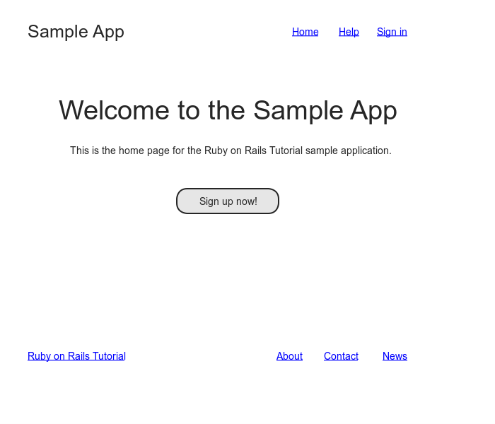
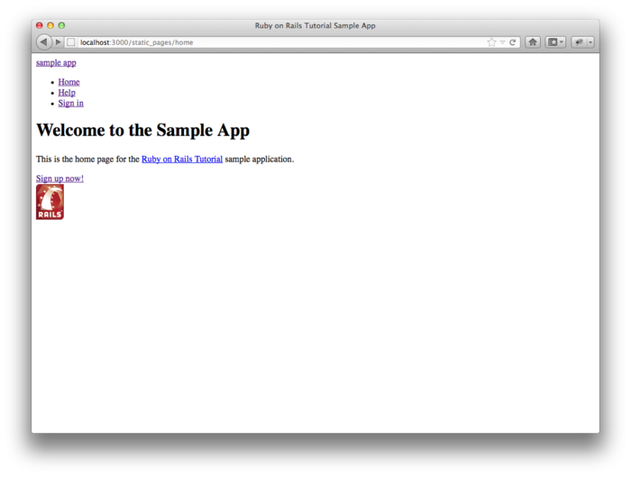
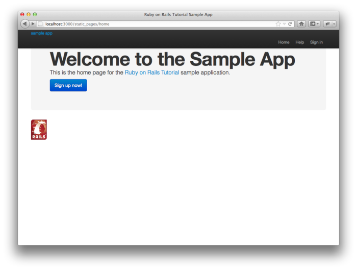
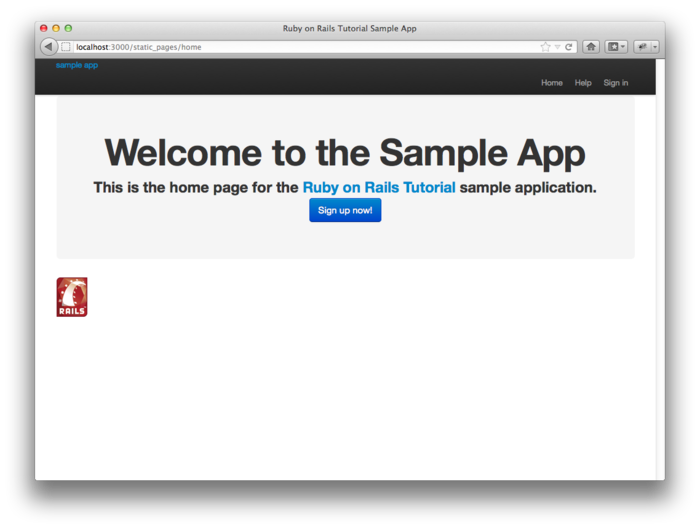
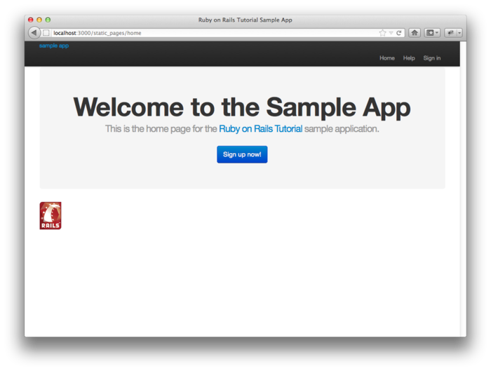
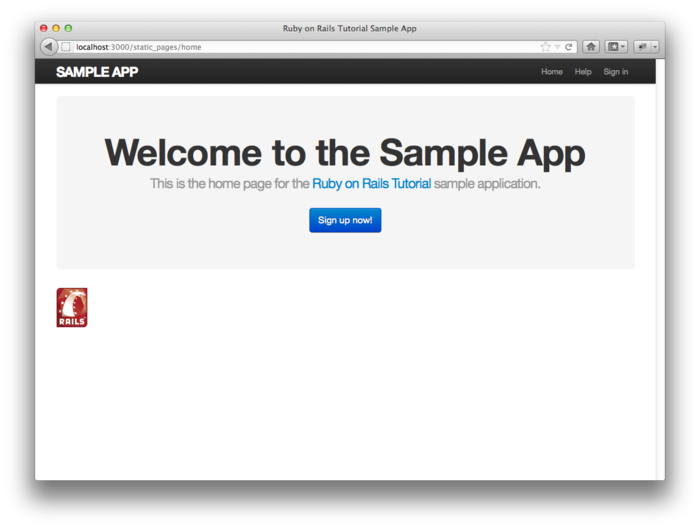

[第四章](chapter4.html)对 Ruby 做了简单的介绍，我们讲解了如何在应用程序中引入样式表，不过，就像在 [4.3.4 节](chapter4.html#sec-4-3-4)中说过的，这个样式表现在还是空的。本章我们会做些修改，把 Bootstrap 框架引入应用程序中，然后再添加一些自定义的样式。[1](#fn-1) 我们还会把已经创建的页面（例如“首页”和“关于”页面）添加到布局中（[5.1 节](#sec-5-1)）。在这个过程中，我们会介绍局部视图（partial）、Rails 路由和 asset pipeline，还会介绍 Sass（[5.2 节](#sec-5-2)）。我们还会用最新的 RSpec 技术重构[第三章](chapter3.html)中的测试。最后，我们还会向前迈出很重要的一步：允许用户在我们的网站中注册。

<h2 id="sec-5-1">5.1 添加一些结构</h2>

本书是关于 Web 开发而不是 Web 设计的，不过在一个看起来很垃圾的应用程序中开发会让人提不起劲，所以本书我们要向布局中添加一些结构，再加入一些 CSS 构建基本的样式。除了使用自定义的 CSS 之外，还会使用 [Bootstrap](http://twitter.github.com/bootstrap/)，Twitter 开发的开源 Web 设计框架。我们还要按照一定的方式组织代码，即使用局部视图来保持布局文件的结构清晰，避免大量的代码混杂在布局文件中。

开发 Web 应用程序时，尽早的对用户界面有个统筹安排往往会对你有所帮助。在本书后续内容中，我会经常插入网页的构思图（mockup）（在 Web 领域经常称之为“线框图（wireframe）”），这是对应用程序最终效果的草图设计。[2](#fn-2) 本章大部分内容都是在开发 [3.1 节](chapter3.html#sec-3-1)中介绍的静态页面，页面中包含一个网站 LOGO、导航条头部和网站底部。这些网页中最重要的一个是“首页”，它的构思图如图 5.1 所示。图 5.7 是最终实现的效果。你会发现二者之间的某些细节有所不同，例如，在最终实现的页面中我们加入了一个 Rails LOGO——这没什么关系，因为构思图没必要画出每个细节。

图 5.1：示例程序“首页”的构思图

和之前一样，如果你使用 Git 做版本控制的话，现在最好创建一个新分支：


$ git checkout -b filling-in-layout


<h3 id="sec-5-1-1">5.1.1 网站导航</h3>

在示例程序中加入链接和样式的第一步，要修改布局文件 `application.html.erb`（上次使用是在代码 4.3 中），添加一些 HTML 结构。我们要添加一些区域，一些 CSS class，以及网站导航。布局文件的内容参见代码 5.1，对各部分代码的说明紧跟其后。如果你迫不及待的想看到结果，请查看图 5.2。（注意：结果（还）不是很让人满意。）

**代码 5.1** 添加一些结构后的网站布局文件  `app/views/layouts/application.html.erb`


<!DOCTYPE html>
<html>
  <head>
    <title><%= full_title(yield(:title)) %></title>
    <%= stylesheet_link_tag    "application", media: "all" %>
    <%= javascript_include_tag "application" %>
    <%= csrf_meta_tags %>
    <!--[if lt IE 9]>
    
    <![endif]-->
  </head>
  <body>
    <header class="navbar navbar-fixed-top">
      

        

          <%= link_to "sample app", '#', id: "logo" %>
          <nav>
            <ul class="nav pull-right">
              <li><%= link_to "Home",    '#' %></li>
              <li><%= link_to "Help",    '#' %></li>
              <li><%= link_to "Sign in", '#' %></li>
            </ul>
          </nav>
        

      

    </header>
    

      <%= yield %>
    

  </body>
</html>


需要特别注意一下 Hash 风格从 Ruby 1.8 到 Ruby 1.9 的转变（参见 [4.3.3 节](chapter4.html#sec-4-3-3)）。即把


<%= stylesheet_link_tag "application", :media => "all" %>


换成


<%= stylesheet_link_tag "application", media: "all" %>


有一点很重要需要注意一下，因为旧的 Hash 风格使用范围还很广，所以两种用法你都要能够识别。

我们从上往下看一下代码 5.1 中新添加的元素。[3.1 节](chapter3.html#sec-3-1)简单的介绍过，Rails 3 默认会使用 HTML5（如 `<!DOCTYPE html>` 所示），因为 HTML5 标准还很新，有些浏览器（特别是较旧版本的 IE 浏览器）还没有完全支持，所以我们加载了一些 JavaScript 代码（称作“[HTML5 shim](http://code.google.com/p/html5shim/)”）来解决这个问题：


<!--[if lt IE 9]>

<![endif]-->


如下有点古怪的句法


<!--[if lt IE 9]>


只有当 IE 浏览器的版本小于 9 时（`if lt IE 9`）才会加载其中的代码。这个奇怪的 `[if lt IE 9]` 句法不是 Rails 提供的，其实它是 IE 浏览器为了解决兼容性问题而特别支持的[条件注释](http://en.wikipedia.org/wiki/Conditional_comment)（conditional comment）。这就带来了一个好处，因为这说明我们只会在 IE9 以前的版本中加载 HTML5 shim，而其他的 Firefox、Chrome 和 Safari 等浏览器则不会受到影响。

后面的区域是一个 `header`，包含网站的 LOGO（纯文本）、一些小区域（使用 `div` 标签）和一个导航列表元素：


<header class="navbar navbar-fixed-top">
  

    

      <%= link_to "sample app", '#', id: "logo" %>
      <nav>
        <ul class="nav pull-right">
          <li><%= link_to "Home",    '#' %></li>
          <li><%= link_to "Help",    '#' %></li>
          <li><%= link_to "Sign in", '#' %></li>
        </ul>
      </nav>
    

  

</header>


`header` 标签的意思是放在网页顶部的内容。我们为 `header` 标签指定了两个 CSS class[3](#fn-3)，`navbar` 和 `navbar-fixed-top`，用空格分开：


<header class="navbar navbar-fixed-top">


所有的 HTML 元素都可以指定 class 和 id，它们不仅是个标注，在 CSS 样式中也有用（[5.1.2 节](#sec-5-1-2)）。class 和 id 之间主要的区别是，class 可以在同一个网页中多次使用，而 id 只能使用一次。这里的 `navbar` 和 `navbar-fixed-top` 在 Bootstrap 框架中有特殊的意义，我们会在 [5.1.2 节](#sec-5-1-2)中安装并使用 Bootstrap。`header` 标签内是一些 `div` 标签：



  



`div` 标签是常规的区域，除了把文档分成不同的部分之外，没有特殊的意义。在以前的 HTML 中，`div` 标签被用来划分网站中几乎所有的区域，但是 HTML5 增加了 `header`、`nav` 和 `section` 元素，用来划分大多数网站中都有用到的区域。本例中，每个 `div` 也都指定了一个 CSS class。和 `header` 标签的 class 一样，这些 class 在 Bootstrap 中也有特殊的意义。

在这些 `div` 之后，有一些 ERb 代码：


<%= link_to "sample app", '#', id: "logo" %>
<nav>
  <ul class="nav pull-right">
    <li><%= link_to "Home",    '#' %></li>
    <li><%= link_to "Help",    '#' %></li>
    <li><%= link_to "Sign in", '#' %></li>
  </ul>
</nav>


这里使用了 Rails 中的 `link_to` 帮助方法来创建链接（在 [3.3.2 节](chapter3.html#sec-3-3-2)中我们是直接创建 `a` 标签来实现的）。`link_to` 的第一个参数是链接文本，第二个参数是链接地址。在 [5.3.3 节](#sec-5-3-3)中我们会指定链接地址为设置好的路由，这里我们用的是 Web 设计中经常使用的占位符 `#`。第三个参数是可选的，为一个 Hash，本例使用这个参数为 LOGO 添加了一个 `logo` id。（其他三个链接没有使用这个 Hash 参数，没关系，因为这个参数是可选的。）Rails 帮助方法经常这样使用 Hash 参数，可以让我们仅使用 Rails 的帮助方法就能灵活的添加 HTML 属性。

第二个 `div` 中是个导航链接列表，使用无序列表标签 `ul`，以及列表项目标签 `li`：


<nav>
  <ul class="nav pull-right">
    <li><%= link_to "Home",    '#' %></li>
    <li><%= link_to "Help",    '#' %></li>
    <li><%= link_to "Sign in", '#' %></li>
  </ul>
</nav>


上面代码中的 `nav` 标签以前是不需要的，它的目的是显示导航链接。`ul` 标签指定的 `nav` 和 `pull-right` class 在 Bootstrap 中有特殊的意义。 Rails 处理这个布局文件并执行其中的 ERb 代码后，生成的列表如下面的代码所示：


<nav>
  <ul class="nav pull-right">
    <li><a href="#">Home</a></li>
    <li><a href="#">Help</a></li>
    <li><a href="#">Sign in</a></li>
  </ul>
</nav>


布局文件的最后一个 `div` 是主内容区域：



  <%= yield %>



和之前一样，`container` class 在 Bootstrap 中有特殊的意义。[3.3.4 节](chapter3.html#sec-3-3-4)已经介绍过，`yield` 会把各页面中的内容插入网站的布局中。

除了网站的底部（在 [5.1.3 节](#sec-5-1-3)添加）之外，布局现在就完成了，访问一下“首页”就能看到结果了。为了利用后面添加的样式，我们要向 `home.html.erb` 视图中加入一些元素。（参见代码 5.2。）

**代码 5.2** “首页”的代码，包含一个到注册页面的链接  `app/views/static_pages/home.html.erb`



  <h1>Welcome to the Sample App</h1>

  <h2>
    This is the home page for the
    <a href="http://railstutorial.org/">Ruby on Rails Tutorial</a>
    sample application.
  </h2>

  <%= link_to "Sign up now!", '#', class: "btn btn-large btn-primary" %>

<%= link_to image_tag("rails.png", alt: "Rails"), 'http://rubyonrails.org/' %>


上面代码中第一个 `link_to` 创建了一个占位链接，指向[第七章](chapter7.html)中会加入的用户注册页面


<a href="#" class="btn btn-large btn-primary">Sign up now!</a>


`div` 标签中的 `hero-unit` class 在 Bootstrap 中有特殊的意义，注册按钮的 `btn`、`btn-large` 和 `btn-primary` 也是一样。

第二个 `link_to` 用到了 `image_tag` 帮助方法，第一个参数是图片的路径；第二个参数是可选的，一个 Hash，本例中这个 Hash 参数使用一个 Symbol 键设置了图片的 `alt` 属性。为了更好的理解，我们来看一下生成的 HTML：[4](#fn-4)





`alt` 属性的内容会在图片无法加载时显示，也会在针对视觉障碍人士的屏幕阅读器中显示。人们有时懒得加上 `alt` 属性，可是在 HTML 标准中却是必须的。幸运的是，Rails 默认会加上 `alt` 标签，如果你没有在调用 `image_tag` 时指定的话，Rails 就会使用图片的文件名（不包括扩展名）。本例中，我们自己设定了 `alt` 文本，显示一个首字母大写的“Rails”。

现在我们终于可以看到劳动的果实了（如图 5.2）。你可能会说，这不是很美观啊。或许吧。不过也可以小小的高兴一下，我们已经为 HTML 结构指定了合适的 class，可以用来添加 CSS。

顺便说一下，你可能会奇怪 `rails.png` 这个图片为什么可以显示出来，它是怎么来的呢？其实每个 Rails 应用程序都有这个图片，存放在 ` app/assets/images/` 目录下。因为我们使用的是 `image_tag` 帮助方法，Rails 会通过 asset pipeline 找到这个图片。（[5.2 节](#sec-5-2)）

图 5.2：没有定义 CSS 的“首页”（[/static_pages/home](http://localhost:3000/static_pages/home)）

<h3 id="sec-5-1-2">5.1.2 Bootstrap 和自定义的 CSS</h3>

在 [5.1.1 节](#sec-5-1-1)我们为很多 HTML 元素指定了 CSS class，这样我们就可以使用 CSS 灵活的构建布局了。[5.1.1 节](#sec-5-1-1)中已经说过，很多 class 在 Bootstrap 中都有特殊的意义。Bootstrap 是 Twitter 开发的框架，可以方便的把精美的 Web 设计和用户界面元素添加到使用 HTML5 开发的应用程序中。本节，我们会结合 Bootstrap 和一些自定义的 CSS 为示例程序添加样式。

首先要安装 Bootstrap，在 Rails 程序中可以使用 bootstrap-sass 这个 gem，参见代码 5.3。Bootstrap 框架本身使用 LESS 来动态的生成样式表，而 Rails 的 asset pipeline 默认支持的是（非常类似的）Sass，bootstrap-sass 会将 LESS 转换成 Sass 格式，而且 Bootstrap 中必要的文件都可以在当前的应用程序中使用。[5](#fn-5)

**代码 5.3** 把 bootstrap-sass 加入 `Gemfile`


source 'https://rubygems.org'

gem 'rails', '3.2.8'
gem 'bootstrap-sass', '2.0.4'
.
.
.


像往常一样，运行 `bundle install` 安装 Bootstrap：


$ bundle install


然后重启 Web 服务器，改动才能在应用程序中生效。（在大多数系统中可以使用 Ctrl-C 结束服务器，然后再执行 `rails server` 命令。）

要向应用程序中添加自定义的 CSS，首先要创建一个 CSS 文件：


app/assets/stylesheets/custom.css.scss


（使用你喜欢的文本编辑器或者 IDE 创建这个文件。）文件存放的目录和文件名都很重要。其中目录


app/assets/stylesheets


是 asset pipeline 的一部分（[5.2 节](#sec-5-2)），这个目录中的所有样式表都会自动的包含在网站的 `application.css` 中。`custom.css.scss` 文件的第一个扩展名是 `.css`，说明这是个 CSS 文件；第二个扩展名是 `.scss`，说明这是个“Sassy CSS”文件。asset pipeline 会使用 Sass 处理这个文件。（在 [5.2.2 节](#sec-5-2-2)中才会使用 Sass，bootstrap-sass 有了它才能运作。）创建了自定义 CSS 所需的文件后，我们可以使用 `@import` 引入 Bootstrap，如代码 5.4 所示。

**代码 5.4** 引入 Bootstrap  `app/assets/stylesheets/custom.css.scss`


@import "bootstrap";


这行代码会引入整个 Bootstrap CSS 框架，结果如图 5.3 所示。（或许你要通过 Ctrl-C 来重启服务器。）可以看到，文本的位置还不是很合适，LOGO 也没有任何样式，不过颜色搭配和注册按钮看起来还不错。

图 5.3：使用 Bootstrap CSS 后的示例程序

下面我们要加入一些整站都会用到的 CSS，用来样式化网站布局和各单独页面，如代码 5.5 所示。代码 5.5 中定义了很多样式规则。为了说明 CSS 规则的作用，我们经常会加入一些 CSS 注释，放在 `/*...*/` 之中。代码 5.5 的 CSS 加载后的效果如图 5.4 所示。

**代码 5.5** 添加全站使用的 CSS  `app/assets/stylesheets/custom.css.scss`


@import "bootstrap";

/* universal */

html {
  overflow-y: scroll;
}

body {
  padding-top: 60px;
}

section {
  overflow: auto;
}

textarea {
  resize: vertical;
}

.center {
  text-align: center;
}

.center h1 {
  margin-bottom: 10px;
}


图 5.4：添加一些空白和其他的全局性样式

注意代码 5.5 中的 CSS 格式是很统一的。一般来说，CSS 规则是通过 class、id、HTML 标签或者三者结合在一起来定义的，后面会跟着一些样式声明。例如：


body {
  padding-top: 60px;
}


把页面的上内边距设为 60 像素。我们在 `header` 标签上指定了 `navbar-fixed-top` class，Bootstrap 就把这个导航条固定在页面的顶部。所以页面的上内边距会把主内容区和导航条隔开一段距离。下面的 CSS 规则：


.center {
  text-align: center;
}


把 `.center` class 的样式定义为 `text-align: center;`。`.center` 中的点号说明这个规则是样式化一个 class。（我们会在代码 5.7 中看到，`#` 是样式化一个 id。）这个规则的意思是，任何 class 为 `.center` 的标签（例如 `div`），其中包含的内容都会在页面中居中显示。（代码 5.2 中有用到这个 class。）

虽然 Bootstrap 中包含了很精美的文字排版样式，我们还是要为网站添加一些自定义的规则，如代码 5.6 所示。（并不是所有的样式都会应用于“首页”，所有规则都会在网站中的某个地方用到。）代码 5.6 的效果如图 5.5 所示。

**代码 5.6** 添加一些精美的文字排版样式  `app/assets/stylesheets/custom.css.scss`


@import "bootstrap";
.
.
.

/* typography */

h1, h2, h3, h4, h5, h6 {
  line-height: 1;
}

h1 {
  font-size: 3em;
  letter-spacing: -2px;
  margin-bottom: 30px;
  text-align: center;
}

h2 {
  font-size: 1.7em;
  letter-spacing: -1px;
  margin-bottom: 30px;
  text-align: center;
  font-weight: normal;
  color: #999;
}

p {
  font-size: 1.1em;
  line-height: 1.7em;
}


图 5.5：添加了一些文字排版样式

最后，我们还要为只包含文本“sample app”的网站 LOGO 添加一些样式。代码 5.7 中的 CSS 样式会把文字变成全大写字母，还修改了文字大小、颜色和位置。（我们使用的是 id，因为我们希望 LOGO 在页面中只出现一次，不过你也可以使用 class。）

**代码 5.7** 添加网站 LOGO 的样式  `app/assets/stylesheets/custom.css.scss`


@import "bootstrap";
.
.
.

/* header */

#logo {
  float: left;
  margin-right: 10px;
  font-size: 1.7em;
  color: #fff;
  text-transform: uppercase;
  letter-spacing: -1px;
  padding-top: 9px;
  font-weight: bold;
  line-height: 1;
}

#logo:hover {
  color: #fff;
  text-decoration: none;
}


其中 `color: #fff;` 会把 LOGO 文字的颜色变成白色。HTML 中的颜色代码是由 3 个 16 进制数组成的，分别代表了三原色中的红、绿、蓝。`#ffffff` 是 3 中颜色都为最大值的情况，代表了纯白色。`#fff` 是 `#ffffff` 的简写形式。CSS 标准中为很多常用的 HTML 颜色定义了别名，例如 `white` 代表的是 `#fff`。代码 5.7 中的样式效果如图 5.6 所示。

图 5.6：样式化 LOGO 后的示例程序

<h3 id="sec-5-1-3">5.1.3 局部视图</h3>

虽然代码 5.1 中的布局达到了目的，但它的内容看起来有点混乱。HTML shim 就占用了三行，而且使用了只针对 IE 的奇怪句法，所以如果能把它打包放在一个单独的地方就好了。头部的 HTML 自成一个逻辑单元，所以也可以把这部分打包放在某个地方。在 Rails 中我们可以使用局部视图来实现这种想法。先来看一下定义了局部视图之后的布局文件（参见代码 5.8）。

**代码 5.8** 定义了 HTML shim 和头部局部视图之后的网站布局  `app/views/layouts/application.html.erb`


<!DOCTYPE html>
<html>
  <head>
    <title><%= full_title(yield(:title)) %></title>
    <%= stylesheet_link_tag    "application", media: "all" %>
    <%= javascript_include_tag "application" %>
    <%= csrf_meta_tags %>
    <%= render 'layouts/shim' %>
  </head>
  <body>
    <%= render 'layouts/header' %>
    

      <%= yield %>
    

  </body>
</html>


代码 5.8 中，我们把加载 HTML shim 的那几行代码换成了对 Rails 帮助函数 `render` 的调用：


<%= render 'layouts/shim' %>


这行代码会寻找一个名为 `app/views/layouts/_shim.html.erb` 的文件，执行文件中的代码，然后把结果插入视图。[6](#fn-6)（回顾一下，执行 Ruby 表达式并将结果插入到模板中要使用 `<%=...%>`。）注意文件名 `_shim.html.erb` 的开头是个下划线，这个下划线是局部视图的命名约定，可以在目录中快速定位所有的局部视图。

当然，若要局部视图起作用，我们要写入相应的内容。本例中的 HTML shim 局部视图只包含三行代码，如代码 5.9 所示。

**代码 5.9** HTML shim 局部视图  `app/views/layouts/_shim.html.erb`


<!--[if lt IE 9]>

<![endif]-->


类似的，我们可以把头部的内容移入局部视图，如代码 5.10 所示，然后再次调用 `render` 把这个局部视图插入布局中。

**代码 5.10** 网站头部的局部视图  `app/views/layouts/_header.html.erb`


<header class="navbar navbar-fixed-top">
  

    

      <%= link_to "sample app", '#', id: "logo" %>
      <nav>
        <ul class="nav pull-right">
          <li><%= link_to "Home",    '#' %></li>
          <li><%= link_to "Help",    '#' %></li>
          <li><%= link_to "Sign in", '#' %></li>
        </ul>
      </nav>
    

  

</header>


现在我们已经知道怎么创建局部视图了，让我们来加入和头部对应的网站底部吧。你或许已经猜到了，我们会把这个局部视图命名为 `_footer.html.erb`，放在布局目录中（参见代码 5.11）。[7](#fn-7)

**代码 5.11** 网站底部的局部视图  `app/views/layouts/_footer.html.erb`


<footer class="footer">
  <small>
    <a href="http://railstutorial.org/">Rails Tutorial</a>
    by Michael Hartl
  </small>
  <nav>
    <ul>
      <li><%= link_to "About",   '#' %></li>
      <li><%= link_to "Contact", '#' %></li>
      <li><a href="http://news.railstutorial.org/">News</a></li>
    </ul>
  </nav>
</footer>


和头部类似，在底部我们使用 `link_to` 创建到“关于”页面和“联系”页面的链接，地址暂时使用占位符 `#`。（和 `header` 一样，`footer` 标签也是 HTML5 新增加的。）

按照 HTML shim 和头部局部视图采用的方式，我们也可以在布局视图中渲染底部局部视图。（参见代码 5.12。）

**代码 5.12** 网站的布局，包含底部局部视图  `app/views/layouts/application.html.erb`


<!DOCTYPE html>
<html>
  <head>
    <title><%= full_title(yield(:title)) %></title>
    <%= stylesheet_link_tag    "application", media: "all" %>
    <%= javascript_include_tag "application" %>
    <%= csrf_meta_tags %>
    <%= render 'layouts/shim' %>
  </head>
  <body>
    <%= render 'layouts/header' %>
    

      <%= yield %>
      <%= render 'layouts/footer' %>
    

  </body>
</html>


当然，如果没有样式的话，底部还是很丑的（样式参见代码 5.13）。添加样式后的效果如图 5.7 所示。

**代码 5.13** 添加底部所需的 CSS  `app/assets/stylesheets/custom.css.scss`


.
.
.

/* footer */

footer {
  margin-top: 45px;
  padding-top: 5px;
  border-top: 1px solid #eaeaea;
  color: #999;
}

footer a {
  color: #555;
}

footer a:hover {
  color: #222;
}

footer small {
  float: left;
}

footer ul {
  float: right;
  list-style: none;
}

footer ul li {
  float: left;
  margin-left: 10px;
}


图 5.7：添加底部后的“首页”（[/static_pages/home](http://localhost:3000/static_pages/home)）

<h2 id="sec-5-2">5.2 Sass 和 asset pipeline</h2>

Rails 3.0 与较新版之间的主要不同之一是 asset pipeline，这个功能可以明显提高如 CSS、JavaScript和图片等静态资源文件（asset）的生成效率，降低管理成本。本节我们会概览一下 asset pipeline，然后再介绍如何使用 Sass 这个生成 CSS 很强大的工具，Sass 现在是 asset pipeline 默认的一部分。

<h3 id="sec-5-1-1">5.1.1 Asset pipeline</h3>

Asset pipeline 对 Rails做了很多改动，但对 Rails 开发者来说只有三个特性需要了解：资源目录，清单文件（manifest file），还有预处理器引擎（preprocessor engine）。[8](#fn-8) 我们会一个一个的介绍。

#### 资源目录

在 Rails 3.0 之前（包括 3.0），静态文件分别放在如下的 `public/` 目录中：

- `public/stylesheets`
- `public/javascripts`
- `public/images`

这些文件夹中的文件通过请求 http://example.com/stylesheets 等地址直接发送给浏览器。（Rails 3.0 之后的版本也会这么做。）

从 Rails 3.1 开始，静态文件可以存放在三个标准的目录中，各有各的用途：

- `app/assets`：存放当前应用程序用到的资源文件
- `lib/assets`：存放开发团队自己开发的代码库用到的资源文件
- `vendor/assets`：存放第三方代码库用到的资源文件

你可能猜到了，上面的目录中都会有针对不同资源类型的子目录。例如：


$ ls app/assets/
images javascripts stylesheets


现在我们就可以知道 [5.1.2 节](#sec-5-1-2)中 `custom.css.scss` 存放位置的用意：因为 `custom.css.scss` 是应用程序本身用到的，所以把它存放在 `app/assets/stylesheets` 中。

#### 清单文件

当你把资源文件存放在适当的目录后，要通过清单文件告诉 Rails怎么把它们合并成一个文件（使用 [Sprockets](https://github.com/sstephenson/sprockets) gem。只适用于 CSS 和 JavaScript，而不会处理图片。）举个例子说明一下，让我们看一下应用程序默认的样式表清单文件（参见代码 5.14）。

**代码 5.14** 应用程序的样式表清单文件  `app/assets/stylesheets/application.css`


/*
 * This is a manifest file that'll automatically include all the stylesheets
 * available in this directory and any sub-directories. You're free to add
 * application-wide styles to this file and they'll appear at the top of the
 * compiled file, but it's generally better to create a new file per style
 * scope.
 *= require_self
 *= require_tree .
*/


这里的关键代码是几行 CSS 注释，Sprockets 通过这些注释加载相应的文件：


/*
 * .
 * .
 * .
 *= require_self
 *= require_tree .
*/


上面代码中的


*= require_tree .


会把 `app/assets/stylesheets` 目录中的所有 CSS 文件都引入应用程序的样式表中。

下面这行：


*= require_self


会把 `application.css` 这个文件中的 CSS 也加载进来。

Rails 提供的默认清单文件可以满足我们的要求，所以本书不会对其做任何修改。Rails 指南中有一篇专门[介绍 asset pipeline 的文章](http://guides.rubyonrails.org/asset_pipeline.html)，该文有你需要知道的更为详细的内容。

#### 预处理器引擎

准备好资源文件后，Rails 会使用一些预处理器引擎来处理它们，通过清单文件将其合并，然后发送给浏览器。我们通过扩展名告诉 Rails 要使用哪个预处理器。三个最常用的扩展名是：Sass 文件的 `.scss`，CoffeeScript 文件的 `.coffee`，ERb 文件的 `.erb`。我们在 [3.3.3 节](chapter3.html#sec-3-3-3)介绍过 ERb，[5.2.2 节](#sec-5-2-2)会介绍 Sass。本教程不需要使用 CoffeeScript，这是一个很小巧的语言，可以编译成 JavaScript。（RailsCast 中[关于 CoffeeScript 的视频](http://railscasts.com/episodes/267-coffeescript-basics)是个很好的入门教程。）

预处理器引擎可以连接在一起使用，因此


foobar.js.coffee


只会使用 CoffeeScript 处理器，而


foobar.js.erb.coffee


会使用 CoffeeScript 和 ERb 处理器（按照扩展名的顺序从右向左处理，所以 CoffeeScript 处理器会先执行）。

#### 在生产环境中的效率问题

Asset pipeline 带来的好处之一是，它会自动优化资源文件，在生产环境中使用效果极佳。CSS 和 JavaScript 的传统组织方式是将不同功能的代码放在不同的文件中，而且代码的格式是对人类友好的（有很多缩进）。虽然这对编程人员很友好，但在生产环境中使用却效率低下，加载大量的文件会明显增加页面加载时间（这是影响用户体验最主要的因素之一）。使用 asset pipeline，生产环境中应用程序所有的样式都会集中到一个 CSS 文件中（`application.css`），所有 JavaScript 代码都会集中到一个 JavaScript 文件中（`javascript.js`），而且还会压缩这些文件（包括 `lib/assets` 和 `vendor/assets` 中的相关文件），把不必要的空格删除，减小文件大小。这样我们就最好的平衡了两方面的需求：编程人员使用格式友好的多个文件，生产环境中使用优化后的单个文件。

<h3 id="sec-5-2-2">5.2.2 句法强大的样式表</h3>

Sass 是一种编写 CSS 的语言，它从多方面增强了 CSS 的功能。本节我们会介绍其中两个最主要的，嵌套和变量。（还有一个是 mixin，会在 [7.1.1 节](chapter7.html#sec-7-1-1)中介绍。）

如 [5.1.2 节](#sec-5-1-2)中的简单介绍，Sass 支持一种名为 SCSS 的格式（扩展名为 `.scss`），这是 CSS 句法的一个扩展集。SCSS 只是为 CSS 添加了一些功能，而没有定义全新的句法。[9](#fn-9) 也就是说，所有合法的 CSS 文件都是合法的 SCSS 文件，这对已经定义了样式的项目来说是件好事。在我们的程序中，因为要使用 Bootstrap，从一开始就使用了 SCSS。Rails 的 asset pipeline 会自动使用 Sass 预处理器处理扩展名为 `.scss` 的文件，所以 `custom.css.scss` 文件会首先经由 Sass 预处理器处理，然后引入程序的样式表中，再发送给浏览器。

#### 嵌套

样式表中经常会定义嵌套元素的样式，例如，在代码 5.1 中，定义了 `.center` 和 `.centr h1` 两个样式：


.center {
  text-align: center;
}

.center h1 {
  margin-bottom: 10px;
}


使用 Sass 可将其改写成


.center {
  text-align: center;
  h1 {
    margin-bottom: 10px;
  }
}


上面代码中的 `h1` 会自动嵌入 `.center` 中。

嵌套还有另一种形式，句法稍有不同。在代码 5.7 中，有如下的代码


#logo {
  float: left;
  margin-right: 10px;
  font-size: 1.7em;
  color: #fff;
  text-transform: uppercase;
  letter-spacing: -1px;
  padding-top: 9px;
  font-weight: bold;
  line-height: 1;
}

#logo:hover {
  color: #fff;
  text-decoration: none;
}


其中 LOGO 的 id `#logo` 出现了两次，一次是单独出现的，另一次是和 `hover` 伪类一起出现的（鼠标悬停其上时的样式）。如过要嵌套第二个样式，我们需要引用父级元素 `#logo`，在 SCSS 中，使用 `&` 符号实现：


#logo {
  float: left;
  margin-right: 10px;
  font-size: 1.7em;
  color: #fff;
  text-transform: uppercase;
  letter-spacing: -1px;
  padding-top: 9px;
  font-weight: bold;
  line-height: 1;
  &:hover {
    color: #fff;
    text-decoration: none;
  }
}


把 SCSS 转换成 CSS 时，Sass 会把 `&:hover` 编译成 `#logo:hover`。

这两种嵌套方式都可以用于代码 5.13 中的底部样式上，转换后的样式如下：


footer {
  margin-top: 45px;
  padding-top: 5px;
  border-top: 1px solid #eaeaea;
  color: #999;
  a {
    color: #555;
    &:hover {
      color: #222;
    }
  }
  small {
    float: left;
  }
  ul {
    float: right;
    list-style: none;
    li {
      float: left;
      margin-left: 10px;
    }
  }
}


自己动手转换一下代码 5.13 是个不错的练习，转换之后你应该验证一下 CSS 是否还能正常使用。

#### 变量

Sass 允许我们自定义变量来避免重复，这样也可以写出更具表现力的代码。例如，代码 5.6 和代码 5.13 中都重复使用了同一个颜色代码：


h2 {
  .
  .
  .
  color: #999;
}
.
.
.
footer {
  .
  .
  .
  color: #999;
}


上面代码中的 `#999` 是淡灰色（ligh gray），我们可以为它定义一个变量：


$lightGray: #999;


然后我们就可以这样写 SCSS：


$lightGray: #999;
.
.
.
h2 {
  .
  .
  .
  color: $lightGray;
}
.
.
.
footer {
  .
  .
  .
  color: $lightGray;
}


因为像 `$lightGray` 这样的变量名比 `#999` 更具说明性，所以为没有重复使用的值定义变量往往也是很有用的。Bootstrap 框架定义了很多颜色变量，[Bootstrap 页面中有这些变量的 LESS 形式](http://bootstrapdocs.com/v2.0.4/docs/less.html)。这个页面中的变量使用的是 LESS 句法，而不是 Sass 句法，不过 bootstrap-sass gem 为我们提供了对应的 Sass 形式。二者之间的对应关系也不难猜出，LESS 使用 `@` 符号定义变量，而 Sass 使用 `$` 符号。在 Bootstrap 的变量页面我们可以看到为淡灰色定义的变量：


@grayLight: #999;


也就是说，在 bootstrap-sass gem 中会有一个对应的 SCSS 变量 `$grayLight`。我们可以用它换掉自己定义的 `$lightGray` 变量：


h2 {
  .
  .
  .
  color: $grayLight;
}
.
.
.
footer {
  .
  .
  .
  color: $grayLight;
}


使用 Sass 提供的嵌套和定义变量功能后得到的完整 SCSS 文件如代码 5.15 所示。这段代码中使用了 Sass 形式的颜色变量（参照 Bootstrap 变量页面中定义的 LESS 形式的颜色变量）和内置的颜色名称（例如，`white` 代表 `#fff`）。特别注意一下 `footer` 标签样式明显的改进。

译者注：一般不建议在 CSS 中使用颜色名称，因为不同的浏览器和不同的系统对同一个颜色的渲染有所不同，没有使用十六进制的颜色代码准确。

**代码 5.15** 使用嵌套和变量转后后的 SCSS 文件  `app/assets/stylesheets/custom.css.scss`


@import "bootstrap";

/* mixins, variables, etc. */

$grayMediumLight: #eaeaea;

/* universal */

html {
  overflow-y: scroll;
}

body {
  padding-top: 60px;
}

section {
  overflow: auto;
}

textarea {
  resize: vertical;
}

.center {
  text-align: center;
  h1 {
    margin-bottom: 10px;
  }
}

/* typography */

h1, h2, h3, h4, h5, h6 {
  line-height: 1;
}

h1 {
  font-size: 3em;
  letter-spacing: -2px;
  margin-bottom: 30px;
  text-align: center;
}

h2 {
  font-size: 1.7em;
  letter-spacing: -1px;
  margin-bottom: 30px;
  text-align: center;
  font-weight: normal;
  color: $grayLight;
}

p {
  font-size: 1.1em;
  line-height: 1.7em;
}

/* header */

#logo {
  float: left;
  margin-right: 10px;
  font-size: 1.7em;
  color: white;
  text-transform: uppercase;
  letter-spacing: -1px;
  padding-top: 9px;
  font-weight: bold;
  line-height: 1;
  &:hover {
    color: white;
    text-decoration: none;
  }
}

/* footer */

footer {
  margin-top: 45px;
  padding-top: 5px;
  border-top: 1px solid $grayMediumLight;
  color: $grayLight;
  a {
    color: $gray;
    &:hover {
      color: $grayDarker;
    }
  }
  small {
    float: left;
  }
  ul {
    float: right;
    list-style: none;
    li {
      float: left;
      margin-left: 10px;
    }
  }
}


Sass 提供了很多功能，可以用来简化样式表，不过代码 5.15 只用到了最主要的功能，这是个好的开端。更多功能请查看 [Sass 网站](http://sass-lang.com/)。

<h2 id="sec-5-3">5.3 布局中的链接</h2>

我们已经为网站的布局定义了看起来还不错的样式，下面要把链接中暂时使用的占位符 `#` 换成真正的链接地址。当然，我们可以像下面这样手动加入链接：


<a href="/static_pages/about">About</a>


不过这样不太符合 Rails 风格。一者，“关于”页面的地址如果是 /about 而不是 /static_pages/about 就好了；再者，Rails 习惯使用具名路由（named route）来指定链接地址，相应的代码如下：


<%= link_to "About", about_path %>


使用这种方式能更好的表达链接与 URI 和路由的对应关系，如[表格 5.1](#table-5-1) 所示。本章完结之前除了最后一个链接之外，其他的链接都会设定好。（[第八章](chapter8.html)会添加最后一个。）

<table id="table-5-1" class="tabular">
  <tbody>
    <tr>
      <th class="align_left"><strong>页面</strong></th>
      <th class="align_left"><strong>URI</strong></th>
      <th class="align_right"><strong>对应的路由</strong></th>
    </tr>
    <tr class="top_bar">
      <td class="align_left">“首页”</td>
      <td class="align_left">/</td>
      <td class="align_right"><code>root_path</code></td>
    </tr>
    <tr>
      <td class="align_left">“关于”</td>
      <td class="align_left">/about</td>
      <td class="align_right"><code>about_path</code></td>
    </tr>
    <tr>
      <td class="align_left">“关于”</td>
      <td class="align_left">/help</td>
      <td class="align_right"><code>help_path</code></td>
    </tr>
    <tr>
      <td class="align_left">“练习”</td>
      <td class="align_left">/contact</td>
      <td class="align_right"><code>contact_path</code></td>
    </tr>
    <tr>
      <td class="align_left">“注册”</td>
      <td class="align_left">/signup</td>
      <td class="align_right"><code>signup_path</code></td>
    </tr>
    <tr>
      <td class="align_left">“登录”</td>
      <td class="align_left">/signin</td>
      <td class="align_right"><code>signin_path</code></td>
    </tr>
  </tbody>
</table>

表格 5.1：网站中链接的路由和 URI 地址的映射关系

继续之前，让我们先添加一个“联系”页面（[第三章](chapter3.html)的一个练习题），测试如代码 5.16 所示，形式和代码 3.18 差不多。注意，和应用程序的代码一样，代码 5.16 中 Hash 使用的也是 Ruby 1.9 风格。

**代码 5.16** “联系”页面的测试  `spec/requests/static_pages_spec.rb`


require 'spec_helper'

describe "Static pages" do
  .
  .
  .
  describe "Contact page" do

    it "should have the h1 'Contact'" do
      visit '/static_pages/contact'
      page.should have_selector('h1', text: 'Contact')
    end

    it "should have the title 'Contact'" do
      visit '/static_pages/contact'
      page.should have_selector('title',
                    text: "Ruby on Rails Tutorial Sample App | Contact")
    end
  end
end


你应该看一下这个测试是否是失败的：


$ bundle exec rspec spec/requests/static_pages_spec.rb


这里采用的步骤和 [3.2.2 节](chapter3.html#sec-3-2-2)中添加“关于”页面的步骤是一致的：先更新路由设置（参见代码 5.17），然后在 StaticPages 控制器中添加 `contact` 动作（参见代码 5.18），最后再编写“联系”页面的视图（参见代码 5.19）。

**代码 5.17** 添加“联系”页面的路由设置  `config/routes.rb`


SampleApp::Application.routes.draw do
  get "static_pages/home"
  get "static_pages/help"
  get "static_pages/about"
  get "static_pages/contact"
  .
  .
  .
end


**代码 5.18** 添加“联系”页面所需的动作  `app/controllers/static_pages_controller.rb`


class StaticPagesController < ApplicationController
  .
  .
  .
  def contact
  end
end


**代码 5.19** “联系”页面的视图  `app/views/static_pages/contact.html.erb`


<% provide(:title, 'Contact') %>
<h1>Contact</h1>

  Contact Ruby on Rails Tutorial about the sample app at the
  <a href="http://railstutorial.org/contact">contact page</a>.



再看一下测试是否可以通过：


$ bundle exec rspec spec/requests/static_pages_spec.rb


<h3 id="sec-5-3-1">5.3.1 路由测试</h3>

静态页面的集成测试编写完之后，再编写路由测试就简单了：只需把硬编码的地址换成[表格 5.1](#table-5-1)中相应的具名路由就可以了。也就是说，要把


visit '/static_pages/about'


修改为


visit about_path


其他的页面也这样做，修改后的结果如代码 5.20 所示。

**代码 5.20** 具名路由测试  `spec/requests/static_pages_spec.rb`


require 'spec_helper'

describe "Static pages" do

  describe "Home page" do

    it "should have the h1 'Sample App'" do
      visit root_path
      page.should have_selector('h1', text: 'Sample App')
    end

    it "should have the base title" do
      visit root_path
      page.should have_selector('title',
                        text: "Ruby on Rails Tutorial Sample App")
    end

    it "should not have a custom page title" do
      visit root_path
      page.should_not have_selector('title', text: '| Home')
    end
  end

  describe "Help page" do

    it "should have the h1 'Help'" do
      visit help_path
      page.should have_selector('h1', text: 'Help')
    end

    it "should have the title 'Help'" do
      visit help_path
      page.should have_selector('title',
                        text: "Ruby on Rails Tutorial Sample App | Help")
    end
  end

  describe "About page" do

    it "should have the h1 'About'" do
      visit about_path
      page.should have_selector('h1', text: 'About Us')
    end

    it "should have the title 'About Us'" do
      visit about_path
      page.should have_selector('title',
                    text: "Ruby on Rails Tutorial Sample App | About Us")
    end
  end

  describe "Contact page" do

    it "should have the h1 'Contact'" do
      visit contact_path
      page.should have_selector('h1', text: 'Contact')
    end

    it "should have the title 'Contact'" do
      visit contact_path
      page.should have_selector('title',
                    text: "Ruby on Rails Tutorial Sample App | Contact")
    end
  end
end


和往常一样，现在应该看一下测试是否是失败的（红色）：


$ bundle exec rspec spec/requests/static_pages_spec.rb


顺便说一下，很多人都会觉得代码 5.20 有很多重复，也很啰嗦，我们会在 [5.3.4 节](#sec-5-3-4)进行重构。

<h3 id="sec-5-3-2">5.3.2 Rails 路由</h3>

我们已经编写了所有 URI 地址的测试，现在就要实现这些地址了。如 [3.1.2 节](chapter3.html#sec-3-1-2)所说，Rails 使用 `config/routes.rb` 文件设置 URI 地址的映射关系。如果你看一下默认的路由文件，会发内容很杂乱，不过还是有点帮助的，因为有很多注释，说明了各路由的映射关系。我建议你找个时间通读一下路由文件，也建议你阅读一下 Rails 指南中《[详解 Rails 路由](http://guides.rubyonrails.org/routing.html)》一文，更深入的了解一下路由。

定义具名路由，要把


get 'static_pages/help'


修改为


match '/help', to: 'static_pages#help'


这样在 /help 地址上就有了一个可访问的页面，也定义了一个名为 `help_path` 的具名路由，该函数会返回相应页面的地址。（其实把 `match` 换成 `get` 效果是一样的，不过使用 `match` 更符合约定。）

其他页面也要做类似修改，结果如代码 5.21 所示。不过“首页”有点特殊，参见代码 5.23。

**代码 5.21** 静态页面的路由  `config/routes.rb`


SampleApp::Application.routes.draw do
  match '/help',    to: 'static_pages#help'
  match '/about',   to: 'static_pages#about'
  match '/contact', to: 'static_pages#contact'
  .
  .
  .
end


如果认真阅读代码 5.21，或许会发现它的作用。例如，你会发现


match '/about', to: 'static_pages#about'


会匹配 /about 地址，并将其分发到 StaticPages 控制器的 `about` 动作上。之前的设置意图更明显，我们用


get 'static_pages/about'


也可以得到相同的页面，不过 /about 的地址形式更简洁。而且，如前面提到的，`match '/about'` 会自动创建具名路由函数，可以在控制器和视图中使用：


about_path => '/about'
about_url  => 'http://localhost:3000/about'


注意，`about_url` 返回的结果是完整的 URI 地址 http://localhost:3000/about（部署后，会用实际的域名替换 `localhost:3000`，例如 `example.com`）。如 [5.3 节](#sec-5-3)的用法，如果只想返回 /about，使用 `about_path` 就可以了。本书基本上都会使用惯用的 `path` 形式，不过在页面转向时会使用 `url` 形式，因为 HTTP 标准要求转向后的地址为完整的 URI，不过大多数浏览器都可以正常使用这两种形式。

设置了这些路由之后，“帮助”页面、“关于”页面和“联系”页面的测试应该可以通过了：


$ bundle exec rspec spec/requests/static_pages_spec.rb


不过“首页”的测试还是失败的。

要设置“首页”的路由，可以使用如下的代码：


match '/', to: 'static_pages#home'


不过没必要这么做。Rails 在路由设置文件的下部为根地址 `/`（斜线）提供了特别的设置方式（参见代码 5.22）。

**代码 5.22** 注释掉的根路由设置说明  `config/routes.rb`


SampleApp::Application.routes.draw do
  .
  .
  .
  # You can have the root of your site routed with "root"
  # just remember to delete public/index.html.
  # root :to => "welcome#index"
  .
  .
  .
end


按照上述说明，把根地址 `/` 映射到“首页”上（参见代码 5.23）。

**代码 5.23** 添加根地址的路由设置  `config/routes.rb`


SampleApp::Application.routes.draw do
  root to: 'static_pages#home'

  match '/help',    to: 'static_pages#help'
  match '/about',   to: 'static_pages#about'
  match '/contact', to: 'static_pages#contact'
  .
  .
  .
end


上面的代码会把根地址 `/` 映射到 /static_pages/home 页面上，同时生成了两个 URI 地址帮助方法，如下所示：


root_path => '/'
root_url  => 'http://localhost:3000/'


我们应该按照代码 5.22 中注释的提示，删掉 `public/index.html` 文件，避免访问根目录时显示默认的首页（如图 1.3）。你当然可以直接把这个文件丢进垃圾桶，不过，如果使用 Git 做版本控制的话，可以使用 `git rm` 命令，删除文件的同时也告知 Git 系统做了这个删除操作：


$ git rm public/index.html


至此，所有静态页面的路由都设置好了，而且所有测试应该都可以通过了：


$ bundle exec rspec spec/requests/static_pages_spec.rb


下面，我们要在布局中插入这些链接。

<h3 id="sec-5-3-3">5.3.3 具名路由</h3>

现在要在布局中使用上一小节设置的路由帮助方法，把 `link_to` 函数的第二个参数设为相应的具名路由。例如，要把


<%= link_to "About", '#' %>


改为


<%= link_to "About", about_path %>


其他链接以此类推。

先从头部局部视图 `_header.html.erb` 开始，这个视图中包含了到“首页”和“帮助”页面的链接。既然要对头部视图做修改，顺便就按照网页的惯例为 LOGO 添加一个到“首页”的链接吧（参见代码 5.24）。

**代码 5.24** 头部局部视图，包含一些链接  `app/views/layouts/_header.html.erb`


<header class="navbar navbar-fixed-top">
  

    

      <%= link_to "sample app", root_path, id: "logo" %>
      <nav>
        <ul class="nav pull-right">
          <li><%= link_to "Home",    root_path %></li>
          <li><%= link_to "Help",    help_path %></li>
          <li><%= link_to "Sign in", '#' %></li>
        </ul>
      </nav>
    

  

</header>


[第八章](chapter8.html)才会为“注册”页面设置具名路由，所以现在还是用占位符 `#` 代替页面的地址。

还有一个包含链接的文件是底部局部视图 `_footer.html.erb`，有到“关于”页面和“联系”页面的链接（参见代码 5.25）。

**代码 5.25** 底部局部视图，包含一些链接  `app/views/layouts/_footer.html.erb`


<footer class="footer">
  <small>
    <a href="http://railstutorial.org/">Rails Tutorial</a>
    by Michael Hartl
  </small>
  <nav>
    <ul>
      <li><%= link_to "About",   about_path %></li>
      <li><%= link_to "Contact", contact_path %></li>
      <li><a href="http://news.railstutorial.org/">News</a></li>
    </ul>
  </nav>
</footer>


如此一来，[第三章](chapter3.html)创建的所有静态页面的链接都加入布局了，以“关于”页面为例，输入 /about 网址，就会进入网站的“关于”页面（如图 5.8）。

顺便说一下，要注意，虽然我们没有编写测试检测布局中是否包含这些链接，不过如果没有设置路由的话，前面的测试也会失败，不信你可以把代码 5.21 中的路由注释掉再运行测试来验证一下。检查链接是否指向正确页面的测试代码参见 [5.6 节](#sec-5-6)。

图 5.8：“关于”页面 [/about](http://localhost:3000/about)

<h3 id="sec-5-3-4">5.3.4 简化 RSpec 测试代码</h3>

在 [5.3.1 节](#sec-5-3-1)中说过，静态页面的测试有点啰嗦，也有些重复（参见代码 5.20）。本节我们就使用一些最新的 RSpec 特性，把测试变得简洁一些、优雅一些。

先看一下如何改进下面的代码：


describe "Home page" do

  it "should have the h1 'Sample App'" do
    visit root_path
    page.should have_selector('h1', text: 'Sample App')
  end

  it "should have the base title" do
    visit root_path
    page.should have_selector('title',
                      text: "Ruby on Rails Tutorial Sample App")
  end

  it "should not have a custom page title" do
    visit root_path
    page.should_not have_selector('title', text: '| Home')
  end
end


我们注意到，三个测试用例都访问了根地址，使用 `before` 块可以消除这个重复：


describe "Home page" do
  before { visit root_path }

  it "should have the h1 'Sample App'" do
    page.should have_selector('h1', text: 'Sample App')
  end

  it "should have the base title" do
    page.should have_selector('title',
                      text: "Ruby on Rails Tutorial Sample App")
  end

  it "should not have a custom page title" do
    page.should_not have_selector('title', text: '| Home')
  end
end


上面的代码使用


before { visit root_path }


在每个测试用例运行之前访问根地址。（`before` 方法还可以使用别名 `before(:each)` 调用。）

还有个代码在每个用例中都出现了，我们使用了


it "should have the h1 'Sample App'" do


同时还使用了


page.should have_selector('h1', text: 'Sample App')


二者虽然形式不同，要表达的意思却是相同的。而且两个用例都引用了 `page` 变量。我们可以告诉 RSpec，`page` 就是要测试的对象（subject），这样就可以避免多次使用 `page`：


subject { page }


然后再使用 `it` 方法的另一种形式，把测试代码和描述文本合二为一：


it { should have_selector('h1', text: 'Sample App') }


因为指明了 `subject { page }`，所以调用 `should` 时就会自动使用 Capybara 提供的 `page` 变量（参见 [3.2.1 节](chapter3.html#sec-3-2-1)）。

使用这些技巧可以把“首页”的测试变得简洁一些：


  subject { page }

  describe "Home page" do
    before { visit root_path }

    it { should have_selector('h1', text: 'Sample App') }
    it { should have_selector 'title',
                        text: "Ruby on Rails Tutorial Sample App" }
    it { should_not have_selector 'title', text: '| Home' }
  end


这样代码看起来就舒服多了，不过标题的测试还有点长。其实，代码 5.20 中大多数标题都是这样的长标题：


"Ruby on Rails Tutorial Sample App | About"


[3.5 节](chapter3.html#sec-3-5)的练习题建议定义一个 `base_title` 变量，再使用字符串插值来消除这个重复（参见代码 3.30）。我们可以更进一步，定义一个和代码 4.2 中 `full_title` 类似的方法。

为此我们要新建 `spec/support` 目录，然后在目录中新建 RSpec 通用函数文件 `utilities.rb`（参见代码 5.26）。

**代码 5.26** RSpec 通用函数文件，包含 `full_title` 方法  `spec/support/utilities.rb`


def full_title(page_title)
  base_title = "Ruby on Rails Tutorial Sample App"
  if page_title.empty?
    base_title
  else
    "#{base_title} | #{page_title}"
  end
end


其实这就是代码 4.2 中那个帮助方法的复制，不过，定义两个独立的方法可以捕获标题公共部分中的错误，不过这样也不太靠得住，更好的（也更强大的）方法是直接测试原来那个 `full_title` 帮助方法，参见 [5.6 节](#sec-5-6)中的练习。

RSpec 会自动加载 `spec/support` 目录中的文件，所以我们就可以按照如下的方式编写“首页”的测试：


  subject { page }

  describe "Home page" do
    before { visit root_path }

    it { should have_selector('h1',    text: 'Sample App') }
    it { should have_selector('title', text: full_title('')) }
  end


下面我们用类似“首页”的方法来简化“帮助”页面、“关于”页面和“联系”页面的测试了，结果如代码 5.27 所示。

**代码 5.27** 简化后的静态页面测试  `spec/requests/static_pages_spec.rb`


require 'spec_helper'

describe "Static pages" do

  subject { page }

  describe "Home page" do
    before { visit root_path }

    it { should have_selector('h1',    text: 'Sample App') }
    it { should have_selector('title', text: full_title('')) }
    it { should_not have_selector 'title', text: '| Home' }
  end

  describe "Help page" do
    before { visit help_path }

    it { should have_selector('h1',    text: 'Help') }
    it { should have_selector('title', text: full_title('Help')) }
  end

  describe "About page" do
    before { visit about_path }

    it { should have_selector('h1',    text: 'About') }
    it { should have_selector('title', text: full_title('About Us')) }
  end

  describe "Contact page" do
    before { visit contact_path }

    it { should have_selector('h1',    text: 'Contact') }
    it { should have_selector('title', text: full_title('Contact')) }
  end
end


现在应该验证一下测试代码是否还可以通过：


$ bundle exec rspec spec/requests/static_pages_spec.rb


代码 5.27 中的 RSpec 测试比代码 5.20 简化多了，其实，还可以变得更简洁，详见 [5.6 节](#sec-5-6)。在示例程序接下来的开发过程中，只要可以，我们都会使用这种简洁的方式。

<h2 id="sec-5-4">5.2 用户注册：第一步</h2>

为了完结本章的目标，本节我们要设置“注册”页面的路由，为此要创建第二个控制器。这是允许用户注册最重要的一步，用户模型会在[第六章](chapter6.html)构建，整个注册功能则会在[第七章](chapter7.html)完成。

<h3 id="sec-5-4-1">5.4.1 Users 控制器</h3>

创建第一个控制器 StaticPages 是很久以前的事了，还是在 [3.1.2 节](chapter3.html#sec-3-1-2)中。现在我们要创建第二个了，Users 控制器。和之前一样，我们使用 `generate` 命令创建所需的控制器骨架，包含用户注册页面所需的动作。遵照 Rails 的 REST 架构约定，我们把这个动作命名为 `new`，传递给 `generate controller` 就可以自动创建这个动作了（参见代码 5.28）。

**代码 5.28** 生成 User 控制器（包含 `new` 动作）


$ rails generate controller Users new --no-test-framework
      create  app/controllers/users_controller.rb
       route  get "users/new"
      invoke  erb
      create    app/views/users
      create    app/views/users/new.html.erb
      invoke  helper
      create    app/helpers/users_helper.rb
      invoke  assets
      invoke    coffee
      create      app/assets/javascripts/users.js.coffee
      invoke    scss
      create      app/assets/stylesheets/users.css.scss


这个命令会创建 Users 控制器，还有其中的 `new` 动作（参见代码 5.29）和一个占位用的视图文件（参见代码 5.30）。

**代码 5.29** 默认生成的 Users 控制器，包含 `new` 动作  `app/controllers/users_controller.rb`


class UsersController < ApplicationController
  def new
  end

end


**代码 5.30** 默认生成的 `new` 动作视图  `app/views/users/new.html.erb`


<h1>Users#new</h1>

Find me in app/views/users/new.html.erb



<h3 id="sec-5-4-2">5.4.2 “注册”页面的 URI 地址</h3>

[5.4.1 节](#sec-5-4-1)中生成的代码会在 /users/new 地址上对应了一个页面，不过如[表格 5.1](#table-5-1)所示，我们希望“注册”页面的地址是 /signup。为此，和 [5.3 节](#sec-5-3)一样，首先要编写集成测试，可以通过下面的命令生成：


$ rails generate integration_test user_pages


然后，按照代码 5.27 中静态页面测试代码的形式，我们要编写测试检测“注册”页面中是否有 `h1` 和 `title` 标签，如代码 5.31 所示。

**代码 5.31** Users 控制器的测试代码，包含“注册”页面的测试用例  `spec/requests/user_pages_spec.rb`


require 'spec_helper'

describe "User pages" do

  subject { page }

  describe "signup page" do
    before { visit signup_path }

    it { should have_selector('h1',    text: 'Sign up') }
    it { should have_selector('title', text: full_title('Sign up')) }
  end
end


和之前一样，可以执行 `rspec` 命令运行测试：


$ bundle exec rspec spec/requests/user_pages_spec.rb


不过有一点你要知道，你还可以指定整个目录来运行所有的 request 测试：


$ bundle exec rspec spec/requests/


同理，你可能还想知道怎么运行全部测试：


$ bundle exec rspec spec/


为了测试全面，在本书后续内容中，我们一般都会使用这个命令运行所有的测试。顺便说一下，你要知道，你也可以使用 Rake 的 `spec` 任务运行测试（你可能见过其他人使用）：


$ bundle exec rake spec


（事实上，你可以只输入 `rake`，因为 `rake` 的默认任务就是运行测试。）

我们已经为 Users 控制器生成了 `new` 动作，如要测试通过，需要正确设置路由，还要有相应内容的视图文件。我们按照代码 5.21 的方式，为“注册”页面加入 `match '/signup'` 路由设置（参见代码 5.32）。

**代码 5.32** “注册”页面的路由设置  `config/routes.rb`


SampleApp::Application.routes.draw do
  get "users/new"

  root to: 'static_pages#home'

  match '/signup',  to: 'users#new'

  match '/help',    to: 'static_pages#help'
  match '/about',   to: 'static_pages#about'
  match '/contact', to: 'static_pages#contact'
  .
  .
  .
end


注意，我们保留了 `get "users/new"` 设置，这是控制器生成命令（代码 5.28）自动添加的路由，如要路由可用，这个设置还不能删除，不过这不符合 REST 约定（[表格 2.2](chapter2.html#table-2-2)），会在 [7.1.2 节](chapter7.html#sec-7-1-2)删除。

要让测试通过，视图中还要有相应的 `h1` 和 `title`（参见代码 5.33）。

**代码 5.33** “注册”页面视图  `app/views/users/new.html.erb`


<% provide(:title, 'Sign up') %>
<h1>Sign up</h1>

Find me in app/views/users/new.html.erb



现在，代码 5.31 中“注册”页面的测试应该可以通过了。下面要做的就是为“首页”中的注册按钮加上链接。和其他的具名路由一样，`match '/signup'` 会生成 `signup_path` 方法，代码 5.34 用来链接到“注册”页面。

**代码 5.34** 把按钮链接到“注册”页面  `app/views/static_pages/home.html.erb`



  <h1>Welcome to the Sample App</h1>

  <h2>
    This is the home page for the
    <a href="http://railstutorial.org/">Ruby on Rails Tutorial</a>
    sample application.
  </h2>

  <%= link_to "Sign up now!", signup_path, class: "btn btn-large btn-primary" %>

<%= link_to image_tag("rails.png", alt: "Rails"), 'http://rubyonrails.org/' %>


至此，除了没有设置“登录/退出”路由之外（[第八章](chapter)会实现），我们已经完成了添加链接和设置路由的任务。注册用户的页面（[/signup](http://localhost:3000/signup)）如图 5.9 所示。

图 5.9：“注册”页面 [/signup](http://localhost:3000/signup)

现在测试应该可以通过了：


$ bundle exec rspec spec/


<h2 id="sec-5-5">5.5 小结</h2>

本章，我们为应用程序定义了一些样式，也设置了一些路由。本书剩下的内容会不断的充实这个示例程序：先添加用户注册、登录和退出的功能，然后实现微博功能，最后是关注用户功能。

如果使用 Git 的话，现在你应该把本章所做的改动合并到主分支中：


$ git add .
$ git commit -m "Finish layout and routes"
$ git checkout master
$ git merge filling-in-layout


还可以把代码推送到 GitHub 上：


$ git push


最后，你可以把应用程序部署到 Heroku：


$ git push heroku


然后在生成环境中就得到了一个可以运行的示例程序：


$ heroku open


如果遇到问题，运行


$ heroku logs


试着使用 Heroku 的日志文件排错。

<h2 id="sec-5-6">5.6 练习</h2>

1. 测试静态页面的代码 5.27 已经简化了，但还有一些重复的地方。RSpec 提供了一种名为“共享用例（shared example）”的辅助功能，可以消除这些重复。按照代码 5.35 的形式，添加没有编写的“帮助”页面、“关于”页面和“联系”页面的测试。注意，代码 3.30 中用到的 `let` 方法只要需要就会用给定的值创建一个局部变量（例如，引用这个变量时），相比之下，实例变量只在赋值时才被创建。
1. 或许你已经注意到了，对布局中链接的测试，只测试了路由设置，而没有测试链接是否指向了正确的页面。实现这个测试的方法之一是使用 RSpec 集成测试中的 `visit` 和 `click_link` 函数。加入代码 5.36 中的测试来验证一下链接的地址是否正确。
1. 不要使用代码 5.26 中的 `full_title` 方法，另外编写一个用例，测试原来那个帮助方法，可参照代码 5.37。（需要新建 `spec/helpers` 目录和 `application_helper_spec.rb` 文件。）然后用代码 5.38 中的代码将其引入（`require`）测试。运行测试验证一下新代码是否可以正常使用。注意：代码 5.37 用到了正则表达式（regular expression），[6.2.4 节](chapter6.html#sec-6-2-4)会做介绍。（感谢 [Alex Chaffee](http://alexchaffee.com/) 的建议，并提供了本题用到的代码。）

**代码 5.35** 用 RSpec “共享用例”来消除重复  `spec/requests/static_pages_spec.rb`


require 'spec_helper'

describe "Static pages" do

  subject { page }

  shared_examples_for "all static pages" do
    it { should have_selector('h1',    text: heading) }
    it { should have_selector('title', text: full_title(page_title)) }
  end

  describe "Home page" do
    before { visit root_path }
    let(:heading)    { 'Sample App' }
    let(:page_title) { '' }

    it_should_behave_like "all static pages"
    it { should_not have_selector 'title', text: '| Home' }
  end

  describe "Help page" do
    .
    .
    .
  end

  describe "About page" do
    .
    .
    .
  end

  describe "Contact page" do
    .
    .
    .
  end
end


**代码 5.36** 测试布局中的链接  `spec/requests/static_pages_spec.rb`


require 'spec_helper'

describe "Static pages" do
  .
  .
  .
  it "should have the right links on the layout" do
    visit root_path
    click_link "About"
    page.should have_selector 'title', text: full_title('About Us')
    click_link "Help"
    page.should # fill in
    click_link "Contact"
    page.should # fill in
    click_link "Home"
    click_link "Sign up now!"
    page.should # fill in
    click_link "sample app"
    page.should # fill in
  end
end


**代码 5.37** 对 `full_title` 帮助方法的测试  `spec/helpers/application_helper_spec.rb`


require 'spec_helper'

describe ApplicationHelper do

  describe "full_title" do
    it "should include the page title" do
      full_title("foo").should =~ /foo/
    end

    it "should include the base title" do
      full_title("foo").should =~ /^Ruby on Rails Tutorial Sample App/
    end

    it "should not include a bar for the home page" do
      full_title("").should_not =~ /\|/
    end
  end
end


**代码 5.38** 使用一个简单的引用代替测试中的 `full_title` 方法  `spec/support/utilities.rb`


include ApplicationHelper


  <a class="prev_page" href="chapter4.html">&laquo; 第四章 Rails 背后的 Ruby</a>
  <a class="next_page" href="chapter6.html">第六章 用户模型 &raquo;</a>

1. 感谢读者 [Colm Tuite](https://twitter.com/colmtuite) 使用 Bootstrap 重写了本书原来的示例程序；
1. 本书中的所有构思图都是通过 [Mockingbird](http://gomockingbird.com/)这个在线应用制作的；
1. 这些 class 和 Ruby 的类一点关系都没有；
1. 你大概注意到了 `img` 标签的格式，不是 `...</img>` 而是 ``。这样的标签叫做自关闭标签;
1. 在 asset pipeline 中当然也可以使用 LESS，详见 [less-rails-bootstrap gem](http://rubygems.org/gems/less-rails-bootstrap)；
1. 很多 Rails 程序员都会使用 `shared` 目录存放需要在不同视图中共用的局部视图。我倾向于在 `shared` 目录中存放辅助的局部视图，而把每个页面中都会用到的局部视图放在`layouts` 目录中。 （我们会在[第七章](chapter7.html)创建 `shared` 目录。）在我看来，这样用比较符合逻辑，不过，都放在 `shared` 目录里对运作没有影响；
1. 你可能想知道为什么要使用 `footer` 标签和 `.footer` class。理由就是，这样的标签对于人类来说更容易理解，而那个 class 是因为 Bootstrap 里在用，所以不得不用。如果愿意的话，用 `div` 标签代替 `footer` 也没什么问题；
1. 本节架构的依据是 Michael Erasmus 的《[The Rails 3 Asset Pipeline in (about) 5 Minutes](http://2beards.net/2011/11/the-rails-3-asset-pipeline-in-about-5-minutes/)》一文。更多内容，请阅读 Rails 指南中的《[Asset Pipeline](http://guides.rubyonrails.org/asset_pipeline.html)》；
1. Sass 仍然支持较早的 `.sass` 格式，这个格式相对来说更简洁，花括号更少，但是对现存项目不太友好，已经熟悉 CSS 的人学习难度也相对更大。
