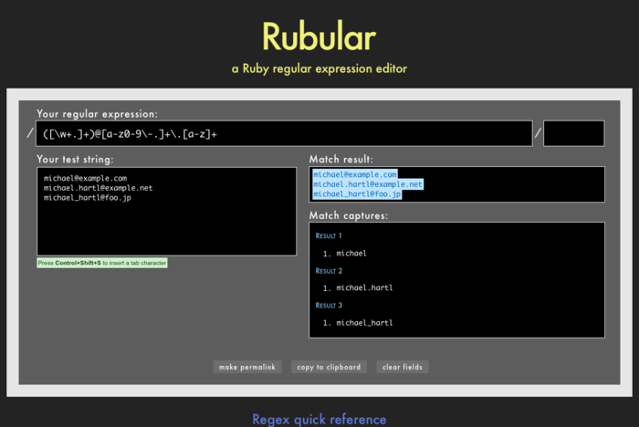
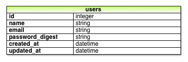
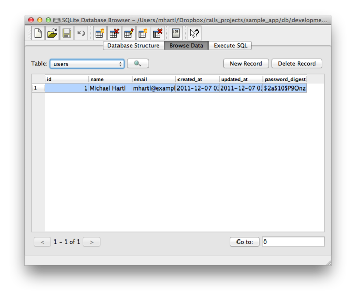

[第五章](chapter5.html)的末尾我们创建了一个临时的用户注册页面（[5.4 节](chpater5.html#sec-5-4)），本教程接下来的四章会逐步丰富这个页面的功能。第一个关键的步骤是为网站的用户创建一个数据模型，以及存储数据的方式。[第七章](chapter7.html)会实现用户注册功能，并创建用户资料页面。用户可以注册后，我们就要实现登录和登出功能（[第八章](chapter8.html)）。[第九章](chapter9.html)（[9.2.1 节](chapter9.html#sec-9-2-1)）会介绍如何保护页面避免被无权限的人员访问。第六章到第九章的内容结合在一起，我们就开发出了一个功能完整的 Rails 登录和用户验证系统。或许你知道已经有很多开发好了的 Rails 用户验证方案，[旁注 6.1](#box-6-1)解释了为什么，至少在初学阶段，自己开发一个用户验证系统或许是更好的方法。

这一章很长，内容很多，你也许会觉得有些挑战性，特别是对数据模型新手来说。不过学完本章后，我们会开发出一个可用于实际应用程序的系统，包括数据验证、存储和用户信息获取等功能。

    <h4>旁注6.1 为什么要自己开发用户验证系统</h4>
    
基本上所有的 Web 应用程序都会需要某种登录和用户验证系统。所以 Web 框架大都有很多验证系统的实现方案，Rails 当然也不例外。用户验证及授权系统有很多，包括 Clearance、Authlogic、Devise 和 CanCan（还有一些不是专门针对 Rails 的基于 OpenID 和 OAuth 开发的系统）。所以你就肯定会问，为什么还要重复制造轮子，为什么不直接用现有的解决方案，而要自己开发呢？

    
首先，实践已经证明，大多数网站的用户验证系统都要对第三方代码库做一些定制和修改，这往往比重新开发一个验证系统工作量更大。再者，现有的方案就像一个“黑盒”，你无法了解其中到底有些什么功能，而自己开发的话就能更好的理解实现的过程。而且，Rails 最近的更新（参见[6.3 节](#sec-6-3)），使开发验证系统变得很简单。最后，如果后续开发要用第三方代码库的话，因为自己开发过，所以你可以更好的理解它的实现过程，便于定制功能。

和之前一样，如果你一直使用 Git 做版本控制，现在最好为本章创建一个从分支：


$ git checkout master
$ git checkout -b modeling-users


（第一个命令是要确保处在主分支，这样创建的 `modeling-users` 从分支才会基于 `master` 分支的当前状态。如果你已经处在主分支的话，可以跳过第一个命令。）

<h2 id="sec-6-1">6.1 用户模型</h2>

接下来的三章最终是要实现网站的“注册”页面（构思图如图 6.1 所示），在此之前我们要解决用户的存储问题，因为现在还没有地方存储用户信息。因此，实现用户注册功能的第一步是要创建一个数据结构，获取并存储用户的信息。

图 6.1：用户注册页面的构思图

在 Rails 中，数据模型的默认数据结构叫做模型（model，MVC 中的 M，参见[1.2.6 节](chapter1.html#sec-1-2-6)）。Rails 为解决数据持久化提供的默认解决方案是使用数据库存储需要长期使用的数据。和数据库交互默认的代码库是 Active Record[1](#fn-1)。Active Record 提供了一系列的方法，直接用于创建、保存、查询数据对象，而无需使用关系数据库所用的结构化查询语言（structured query language， SQL）[2](#fn-2)。Rails 还支持数据库迁移（migration）功能，允许我们使用纯 Ruby 代码定义数据结构，而不用学习数据定义语言（data definition language, DDL）。Active Record 把你和数据库层完全隔开了。本教程开发的应用程序在本地使用的是 SQLite 数据库，部署后使用 PostgreSQL 数据库（由 Heroku 提供，参见 [1.4 节](chapter1.html#sec-1-4)）。这就引入了一个更深层次的话题，那就是在不同的环境中，即便使用的是不同类型的数据库，我们也无需关心 Rails 是如何存储数据的。

<h3 id="sec-6-1-1">6.1.1 数据库迁移</h3>

回顾一下 [4.4.5 节](chapter4.html#sec-4-4-5)的内容，在我们自己创建的 `User` 类中已经使用了用户对象，有 `name` 和 `email` 两个属性。那是个很有用的例子，但没有实现持久性最关键的要求：在 Rails 控制台中创建的用户对象，退出控制台后就会消失。本节的目的就是创建一个用户模型，持久化存储数据。

和 [4.4.5 节](chapter4.html#sec-4-4-5)中的 `User` 类一样，我们先把用户模型设计为只有两个属性，分别是 `name` 和 `email`。Email 地址稍后会作为用户登录的用户名。[3](#fn-3)（[6.3 节](#sec-6-3)会添加用户密码相关的属性）代码 4.9 使用 Ruby 的 `attr_accessor` 方法创建了这两个属性：


class User
  attr_accessor :name, :email
  .
  .
  .
end


在 Rails 中不用这样定义属性。如前面提到的，Rails 默认使用关系型数据库存储数据，数据库中的表（table）是由记录行（row）组成的，每行中都有相应的数据属性列（column）。例如，要存储用户的名字和 Email 地址，我们要创建 `users` 表，表中包含 `name` 列和 `email` 列（每一行代表一个用户）。这样命名列，Active Record 就能找到用户对象的属性了。

让我们看一下 Active Record 是怎么找到的。（如果下面这些讨论对你来说太抽象了，请耐心的看下去。[6.1.3 节](#sec-6-1-3)在控制台中的操作示例，以及图 6.3 和图 6.6 中的数据库浏览器截图应该会让你更清楚的立即这些内容。）代码 5.28 使用下面的命令生成了 Users 控制器和 `new` 动作：


$ rails generate controller Users new --no-test-framework


有类似的命令可以创建模型：`generate model`。代码 6.1 所示为生成 `User` 模型，以及 `name` 和 `email` 属性所用的命令。

**代码 6.1** 生成用户模型


$ rails generate model User name:string email:string
      invoke active record
      create db/migrate/[timestamp]_create_users.rb
      create app/models/user.rb
      invoke rspec
      create spec/models/user_spec.rb


（注意，和控制器的命令习惯不同，模型的名字是单数：控制器是 Users，而模型是 User。）我们提供了可选的参数 `name:string` 和 `email:string`，告诉 Rails 我们需要的两个属性是什么，以及各自的类型（两个都是字符串）。你可以把这两个参数与代码 3.4 和代码 5.28 中的动作名称对比一下，看看有什么不同。

代码 6.1 中的 `generate` 命令带来的结果之一是创建了一个数据库迁移文件。迁移是一种精确修改数据库结构的方式，可以根据需求修改数据模型。本例中 User 模型的迁移文件是直接通过 `generate model` 命令生成的。迁移文件会创建 `users` 表，包含两个列，即 `name` 和 `email`，如代码 6.2 所示。（我们会在 [6.2.5 节](#sec-6-2-5)以及 [6.3 节](#sec-6-3)介绍如何手动创建迁移文件。）

**代码 6.2** User 模型的迁移文件（创建 `users` 表） `db/migrate/[timestamp]_create_users.rb`


class CreateUsers < ActiveRecord::Migration
  def change
    create table :users do |t|
      t.string :name
      t.string :email
      t.timestamps
    end
  end
end


注意一下迁移文件名的前面有个时间戳（timestamp），这是该文件被创建时的时间。早期迁移文件名的前缀是个递增的数字，在协作团队中如果多个编程人员生成了相同序号的迁移文件就可能会发生冲突。除非两个迁移文件在同一秒钟生成这种小概率事件发生了，否则使用时间戳基本可以避免冲突的发生。迁移文件的代码中有一个名为 `change` 的方法，这个方法定义要对数据库做哪些修改。代码 6.2 中，`change` 方法使用 Rails 提供的 `create_table` 方法在数据库中新建一个表，用来存储用户数据。`create_table` 后跟着一个块，指定了一个块参数 `t`（代表这个表对象）。在块中，`create_table` 方法通过 `t` 对象创建了 `name` 和 `email` 两个列，均为 `string` 类型。[4](#fn-4) 这里使用的表名是复数形式（`users`），不过模型名是单数形式（User），这是 Rails 在用词上的一个约定，即模型表现的是单个用户的特性，而数据库表却存储了很多用户。块中最后一行 `t.timestamps` 是个特殊的方法，它会自动创建两个列，`created_at` 和 `updated_at`，这两个列分别记录创建用户的时间戳和更新用户数据的时间戳。（[6.1.3 节](#sec-6-1-3)会介绍使用这两个列的例子。）这个迁移文件表示的完整数据模型如图 6.2 所示。

图 6.2：代码 6.2 生成的用户数据模型

我们可以使用如下的 `rake` 命令（参见[旁注 2.1](chapter2.html#box-2-1)）来执行这个迁移（也叫“向上迁移”）：


$ bundle exec rake db:migrate


（你可能还记得，我们在 [2.2 节](chapter2.html#sec-2-2)中使用过这个命令。）第一次运行 `db:migrate` 命令时会新建 `db/development.sqlite3`，这是 SQLite[5](#fn-5) 数据库文件。若要查看数据库结构，可以使用 SQLite 数据库浏览器打开 `db/development.sqlite3` 文件（如图 6.3 所示）。和图 6.2 中的模型对比之后，你会发现 `id` 列在迁移文件中没有定义。在 [2.2 节](chapter2.html#sec-2-2) 中介绍过，Rails 把这个列作为行的唯一标识符。

图 6.3：用 SQLite 数据库浏览器查看刚创建的 users 表

大多数迁移，包括本教程中的所有迁移，都是可逆的，也就是说可以通过一个简单的 Rake 命令“向下迁移”，撤销之前的迁移操作，这个命令是 `db:rollback`：


$ bundle exec rake db:rollback


（另外还有一个撤销迁移的方法请查看[旁注 3.1](chapter3.html#box-3-1)。）这个命令会调用 `drop_table` 方法把 users 表从数据库中删除。我们之所以可以这么做，是因为 `change` 方法知道 `create_table` 的反操作是 `drop_table`，所以回滚时就会直接调用 `drop_table` 方法。对于一些无法自动逆转的操作，例如删除列，就不能依赖 `change` 方法了，我们要分别定义 `up` 和 `down` 方法。关于迁移的更多内容请查看 Rails 指南。

如果你执行了上面的回滚操作，在继续阅读之前请再迁移回来：


$ bundle exec rake db:migrate


<h3 id="sec-6-1-2">6.1.2 模型文件</h3>

我们介绍了怎样使用代码 6.1 生成的迁移文件（参见代码 6.2）创建用户模型，在图 6.3 中看到了执行迁移操作后的结果，即修改了 `db/development/sqlite3`，新建 `users` 表，并创建了 `id`、`name`、`email`、`created_at` 和 `updated_at` 这几个列。代码 6.1 同时也生成了模型文件，本节的目的就是来理解一下这个模型。

我们先从 User 模型的代码说起。模型文件存放在 `app/models` 目录下，名为 `user.rb`。这个文件的内容很简单（参见代码 6.3）。（注意：如果使用 Rails 3.2.2 或之前的版本，是没有 `attr_accessible` 那行代码的，你需要手动加入。）

**代码 6.3** 刚创建的 User 模型文件 `app/models/user.rb`


class User < ActiveRecord::Base
  attr_accessible :name, :email
end


在 [4.4.2 节](chapter4.html#sec-4-4-2)中介绍过，`class User < ActiveRecord::Base` 的意思是 `User` 类继承自 `ActiveRecord::Base` 类，所以 User 模型就自动获得了 `ActiveRecord::Base` 提供的功能。当然了，只知道这种继承关系没什么用，我们并不知道 `ActiveRecord::Base` 做了什么。稍后我们会介绍一下这个类。在继续阅读之前，还有两件事要做。

#### 模型注解

虽然不是必须的，不过你会发现使用 annotate 注解一下 Rails 模型是很有用的。

**代码 6.4** 把 annotate 加入 `Gemfile`


source 'https://rubygems.org'
.
.
.
group :development do
gem 'sqlite3', '1.3.5'
gem 'rspec-rails', '2.9.0'
gem 'annotate', '˜> 2.4.1.beta'
group :test do
.
.
.
end


（我们把 annotate 加入 `group :development` 中（类似的分组还有 `group :test`），因为在生产环境中不需要这个 gem。）然后执行 `bundle install` 命令安装：


$ bundle install


安装后就得到一个名为 `annotate` 的命令，可以在模型文件中加入一些注释，说明数据模型的结构：


$ bundle exec annotate --position before
Annotated (1): User


注解后的模型文件如代码 6.5 所示。

**代码 6.5** 注解后的 User 模型文件 `app/models/user.rb`


# == Schema Information
#
# Table name: users
#
# id         :integer not null, primary key
# name       :string(255)
# email      :string(255)
# created_at :datetime
# updated_at :datetime
#
class User < ActiveRecord::Base
  attr_accessible :name, :email
end


我发现，在模型文件中加入数据结构的说明可以提醒我这个模型包含了哪些属性，不过为了行文方便，后续的模型代码会省略这些注解。（注意，如果要保持注解的时效性，每次修改数据模型后都要执行 `annotate` 命令。）

#### 可访问的属性

再看一下 User 模型文件，这次集中在 `attr_accessible` 这一行上（参见代码 6.6）。这行代码告诉 Rails，模型中哪些属性是可以访问的，即哪些属性可以被网站的用户修改（例如，在浏览器中提交表单发送请求）。

**代码 6.6** `name` 和 `email` 属性是可访问的 `app/models/user.rb`


class User < ActiveRecord::Base
  attr_accessible :name, :email
end


上述代码的作用和你想象的可能有些差别。默认情况下，模型中所有的属性都是可访问的，代码 6.6 的作用是确保普通用户能且只能访问 `name` 和 `email` 属性。[第七章](chapter7.html)会介绍这么做的重要意义，即使用 `attr_accessible` 可以避免 mass assignment 漏洞，这是 Rails 应用程序最常见的安全漏洞之一。

<h3 id="sec-6-1-3">6.1.3 创建用户对象</h3>

我们已经做了充足的准备工作，现在可以和刚创建的 User 模型交互一下，来了解 Active Record 的功能。和 [第四章](chapter4.html)一样，我们使用的工具是 Rails 控制台。因为我们还不想改动数据库，所以我们要在沙盒模式（sandbox）中启动控制台：


$ rails console --sandbox
Loading development environment in sandbox
Any modifications you make will be rolled back on exit
>>


如提示信息所说，“Any modifications you make will be rolled back on exit”，在沙盒模式下使用控制台，退出当前会话后，对数据库做的所有改动都回回归到原来的状态。

[4.4.5 节](chapter4.html#sec-4-4-5)中的控制台会话，需要手动加载自己编写的 `User` 类才能使用 `User.new` 创建用户对象。创建模型后，情况就不一样了。[4.4.4 节](chapter4.html#sec-4-4-4)中介绍过，Rails 控制台会自动加载 Rails 环境，当然也会自动加载模型。也就是说，现在无需加载额外的代码就可以直接创建用户对象了：


>> User.new
=> #<User id: nil, name: nil, email: nil, created_at: nil, updated_at: nil>


上述的的控制台显示了用户对象的默认值，列出了与图 6.2 和代码 6.5 一致的属性。如果不为 `User.new` 制定参数，创建的对象所有属性值都是 `nil`。在 [4.4.5 节](chapter4.html#sec-4-4-5)中，自己编写的 `User` 类可以接受一个 Hash 参数用来初始化对象的属性，这种方式是受 Active Record 启发的，在 Active Record 的对象中也可以使用相同的方式指定初始值：


>> user = User.new(name: "Michael Hartl", email: "mhartl@example.com")
=> #<User id: nil, name: "Michael Hartl", email: "mhartl@example.com", created_at: nil, updated_at: nil>


我们看到 `name` 和 `email` 属性的值都已经设定了。

如果查看开发日志的话，会发现没有什么新内容。这是因为 `User.new` 方法并没有改动数据库，只是在内存中创建了一个用户对象。如果要把用户对象保存到数据库中，要在 `user` 对象上调用 `save` 方法：


>> user.save
=> true


如果保存成功，`save` 方法会返回 `true`；否则返回 `false`。（现在所有的保存操作都会成功（译者注：因为还没加入数据验证），[6.2 节](#sec-6-2)会看到保存失败的例子。）保存成功后，日志文件中就会出现一行 SQL 语句：`INSERT INTO "users"`。Active Record 提供了很多方法用来和数据库交互，所以你根本不需要直接使用SQL 语句，今后我也不会介绍 SQL 相关的知识。如果你想学习 SQL，可以查看日志文件。

你可能注意到了，刚创建时用户对象的 `id`、`created_at` 和 `updated_at` 属性值都是 `nil`，下面看一下保存之后有什么变化：


>> user
=> #<User id: 1, name: "Michael Hartl", email: "mhartl@example.com", created_at: "2011-12-05 00:57:46", updated_at: "2011-12-05 00:57:46">


如上述代码所示，`id` 的值变成 `1` 了，那两个自动创建的时间戳属性也变成了当前的时间。[6](#fn-6) 现在这两个时间戳是一样的，[6.1.5 节](#sec-6-1-5)会看到二者不同的情况。

和 [4.4.5 节](chapter4.html#sec-4-4-5)中的 `User` 类一样，User 模型的实例也可以使用点号获取属性：


>> user.name
=> "Michael Hartl"
>> user.email
=> "mhartl@example.com"
>> user.updated_at
=> Tue, 05 Dec 2011 00:57:46 UTC +00:00


在[第七章](chapter7.html)中会介绍，虽然一般习惯把创建和保存分成如上所示的两步分别操作，不过 Active Record 也允许我们使用 `User.create` 方法把这两步合成一步：


>> User.create(name: "A Nother", email: "another@example.org")
=> #<User id: 2, name: "A Nother", email: "another@example.org", created_at: "2011-12-05 01:05:24", updated_at: "2011-12-05 01:05:24">
>> foo = User.create(name: "Foo", email: "foo@bar.com")
=> #<User id: 3, name: "Foo", email: "foo@bar.com", created_at: "2011-12-05 01:05:42", updated_at: "2011-12-05 01:05:42">


注意，`User.create` 的返回值不是 `true` 或 `false`，而是返回创建的用户对象，直接复制给变量（例如上面第二个命令中的 `foo` 变量）.

`create` 的反操作是 `destroy`：


>> foo.destroy
=> #<User id: 3, name: "Foo", email: "foo@bar.com", created at: "2011-12-05 01:05:42", updated_at: "2011-12-05 01:05:42">


奇怪的是，`destroy` 和 `create` 一样，返回值是销毁的对象。我不觉得什么地方会用到 `destroy` 的返回值。更奇怪的事情是，销毁的对象还在内存中：


>> foo
=> #<User id: 3, name: "Foo", email: "foo@bar.com", created_at: "2011-12-05 01:05:42", updated_at: "2011-12-05 01:05:42">


那么我们怎么知道对象是否真的被销毁了呢？对于已经保存而没有销毁的对象，怎样从数据库中获取呢？要回答这些问题，我们要先学习如何使用 Active Record 查找用户对象。

<h3 id="sec-6-1-4">6.1.4 查找用户对象</h3>

Active Record 为查找对象提供了好几种方法。我们要使用这些方法来查找刚创建的第一个用户，同时也验证一下第三个用户（`foo`）是否被销毁了。先看一下还存在的用户：


>> User.find(1)
=> #<User id: 1, name: "Michael Hartl", email: "mhartl@example.com", created_at: "2011-12-05 00:57:46", updated_at: "2011-12-05 00:57:46">


我们把用户的 id 传递给 `User.find` 方法，Active Record 会返回 id 为1 的用户对象。

下面来看一下 id 为 3 的用户是否还在数据库中：


>> User.find(3)
=> #ActiveRecord::RecordNotFound: Couldn't find User with ID=3


因为在 [6.1.3 节](#sec-6-1-3)中销毁了第三个用户，所以 Active Record 无法在数据库中找到，抛出了一个异常，说明在查找过程中出现了问题。因为 id 不存在，所以 `find` 方法才会抛出 `ActiveRecord::RecordNotFound` 异常。[8](#fn-8)

除了 `find` 方法之外，Active Record 还支持指定属性来查找用户：


>> User.find_by_email("mhartl@example.com")
=> #<User id: 1, name: "Michael Hartl", email: "mhartl@example.com", created_at: "2011-12-05 00:57:46", updated_at: "2011-12-05 00:57:46">


`find_by_email` 方法是 Active Record 根据 `users` 表中的 `email` 列自动定义的（你可能猜到了，Active Record 还定义了 `find_by_name` 方法）。因为我们会把 Email 地址当成用户名使用，所以在实现用户登录功能时，这种查找用户的方式会很有用（参见[第七章](chapter7.html)）。你也许会担心如果用户数量过多，使用 `find_by_email` 的效率不高。事实的确如此，我们会在 [6.2.5 节](#sec-6-2-5)介绍这个问题，以及解决方法，即使用数据库索引。

最后我们还要介绍几个常用的用户查找方法。首先是 `first` 方法：


>> User.first
=> #<User id: 1, name: "Michael Hartl", email: "mhartl@example.com", created_at: "2011-12-05 00:57:46", updated_at: "2011-12-05 00:57:46">


很明显，`first` 会返回数据库中的第一个用户。还有 `all` 方法：


>> User.all
=> [#<User id: 1, name: "Michael Hartl", email: "mhartl@example.com", created_at: "2011-12-05 00:57:46", updated_at: "2011-12-05 00:57:46">,
#<User id: 2, name: "A Nother", email: "another@example.org", created_at: "2011-12-05 01:05:24", updated_at: "2011-12-05 01:05:24">]


`all` 方法会返回一个数组，包含数据库中的所有用户。

<h3 id="sec-6-1-5">6.1.5 更新用户对象</h3>

创建对象后，一般都会进行更新操作。更新有两种基本的方式，其一，我们可以分别为各属性赋值，在 [4.4.5 节](chapter4.html#sec-4-4-5)中就是这么做的：


>> user # Just a reminder about our user's attributes
=> #<User id: 1, name: "Michael Hartl", email: "mhartl@example.com", created_at: "2011-12-05 00:57:46", updated_at: "2011-12-05 00:57:46">
>> user.email = "mhartl@example.net"
=> "mhartl@example.net"
>> user.save
=> true


注意，最后一个命令是必须的，我们要把改动写入数据库。我们可以执行 `reload` 命令来看一下没保存的话是什么情况。`reload` 命令会使用数据库中的数据重新加载对象：


>> user.email
=> "mhartl@example.net"
>> user.email = "foo@bar.com"
=> "foo@bar.com"
>> user.reload.email
=> "mhartl@example.net"


现在我们已经更新了用户数据，如在 [6.1.3 节](#sec-6-1-3)中所说，自动创建的那两个时间戳属性就不一样了：


>> user.created_at
=> "2011-12-05 00:57:46"
>> user.updated_at
=> "2011-12-05 01:37:32"


更新数据的第二种方式是使用 `update_attributes` 方法：


>> user.update_attributes(name: "The Dude", email: "dude@abides.org")
=> true
>> user.name
=> "The Dude"
>> user.email
=> "dude@abides.org"


`update_attributes` 方法可接受一个指定对象属性的 Hash 作为参数，如果操作成功，会执行更新和保存两个命令（保存成功时返回值为 `true`）。需要注意，如果使用 `attr_accessible` 定义了某些属性是可访问的，那么就只有这些可访问的属性才能使用 `update_attributes` 方法更新。如果模型突然拒绝更新某些属性的话，你就可以检查一下这些属性是否在 `attr_accessible` 方法中。

<h2 id="sec-6-2">6.2 用户数据验证</h2>

[6.1 节](#sec-6-1)创建的 User 模型现在已经有了可以使用的 `name` 和 `email` 属性，不过可能还很简单：任何字符串（包括空字符串）都可以使用。名字和 Email 地址的格式显然要复杂一些。例如，`name` 不应该是空白的，`email` 应该符合 Email 地址的特定格式。而且，我们要把 Email 地址当成用户名用来登录，那么某个 Email 地址在数据库中就应该是唯一的。

总之，`name` 和 `email` 不是什么字符串都可以接受的，我们要对二者可接受的值做个限制。Active Record 通过数据验证机制（validation）实现这种限制。本节，我们会介绍几种常用的数据验证：存在性、长度、格式和唯一性。在 [6.3.4 节](#sec-6-3-4)还会介绍一种常用的数据验证：二次确认。[7.3 节](chapter7.html#sec-7-3)会看到，如果提交了不合要求的数据，数据验证机制会显示一些很有用的错误提示信息。

<h3 id="sec-6-2-1">6.2.1 用户模型测试</h3>

和示例程序其他的功能一样，我们会使用 TDD 方式添加 User 模型的数据验证功能。因为生成 User 模型时没有指定相应的旗标（代码 5.28 中有指定），代码 6.1 中的命令会自动为 User 模型生成一个初始化的测试文件，不过文件中没有什么内容（参见代码 6.7）。

**代码 6.7** 几乎没什么内容的 User 模型测试文件 `spec/models/user_spec.rb`


require 'spec_helper'
describe User do
  pending "add some examples to (or delete) #{__FILE__}"
end


上述代码使用了 `pending` 方法，提示我们应该编写一些真正有用的测试。我们可以运行 User 模型的测试看一下现在的情况：


$ bundle exec rspec spec/models/user_spec.rb
*

Finished in 0.01999 seconds
1 example, 0 failures, 1 pending

Pending:
  User add some examples to (or delete)
  /Users/mhartl/rails projects/sample app/spec/models/user_spec.rb
  (Not Yet Implemented)


在大多数系统中，有待实现的测试都会显示为黄色，介于通过（绿色）和失败（红色）之间。

我们会按照提示的建议，编写一些 RSpec 测试用例，如代码 6.8 所示。

**代码 6.8** 对 `:name` 和 `:email` 属性的测试 `spec/models/user_spec.rb`


require 'spec_helper'

describe User do

  before { @user = User.new(name: "Example User", email: "user@example.com") }

  subject { @user }

  it { should respond_to(:name) }
  it { should respond_to(:email) }
end


`before` 块，在代码 5.27 中用过，会在各测试用例之前执行块中的代码，本例中这个块的作用是为 `User.new` 传入一个合法的初始 Hash 参数，创建 `@user` 实例变量。接下来的


subject { @user }


把 `@user` 设为这些测试用例默认的测试对象。在 [5.3.4 节](chapter5.html#sec-5-3-4)中设定的测试对象是 `page` 变量。

代码 6.8 中的两个测试用例对 `name` 和 `email` 属性的存在性进行了测试：


it { should respond_to(:name) }
it { should respond_to(:email) }


其实，这两个测试用例使用的是 Ruby 的 `respond_to?` 方法，这个方法可以接受一个 Symbol 参数，如果对象可以响应指定的方法或属性就返回 `true`，否则返回 `false`：


$ rails console --sandbox
>> user = User.new
>> user.respond_to?(:name)
=> true
>> user.respond_to?(:foobar)
=> false


（在 [4.2.3 节](chapter4.html#sec-4-2-3)中介绍过，Ruby 使用问号标明返回值是布尔值的方法。）这些测试使用了 RSpec 关于布尔值的约定，所以如下的代码


@user.respond_to?(:name)


在 RSpec 中可以写成


@user.should respond_to(:name)


因为指定了 `subject { @user }`，我们还可以省略 `@user`：


it { should respond_to(:name) }


为 User 模型添加新方法或新属性时可以采用这种测试方式，而且使用这种方式还能清晰的列出 `User` 实例对象可以响应的所有的方法。

现在你可以看一下测试是不是失败的：


$ bundle exec rspec spec/


虽然我们在 [6.1 节](#sec-6-1)使用 `rake db:migrate` 创建了开发数据库，测试还是失败的，因为测试数据库还不知道数据模型（其实测试数据库还不存在）。我们要执行 `db:test:prepare` 命令创建一个测试数据库，赋予正确的数据结构，这样测试才能通过：


$ bundle exec rake db:test:prepare


上述 Rake 命令会把开发数据库 `db/development.sqlite3` 中的数据模型复制到测试数据库 `db/test.sqlite3` 中。执行数据库迁移之后经常会忘记执行这个 Rake 命令。而且，有时测试数据库会损坏，这时就有必要重新设置一下。如果测试突然无法通过，你可以执行 `rake db:test:prepare` 命令，试一下能否解决。

<h3 id="sec-6-2-2">6.2.2 验证存在性</h3>

存在性验证算是最基本的验证了，它只是检查给定的属性是否存在。本节我们就会确保在用户存入数据库之前，名字和 Email 地址字段都是存在的。[7.3.2 节](chapter7.html#sec-7-3-2)会介绍如何把这个限制应用在创建用户的注册表单中。

我们先来编写检查 `name` 属性是否存在的测试。虽然 TDD 的第一步是写一个失败测试（参见 [3.2.1 节](chapter3.html#sec-3-2-1)），不过此时我们还没有完全理解数据验证是怎么实现的，无法编写合适的测试，所以我们暂时先把数据验证加进来，在控制台中实操一下，理解一下验证机制。然后我们会把验证代码注释掉，编写失败测试，再把注视去掉，看一下测试是否还是可以通过。这么做对这样简单的测试来说可能有点小题大做，不过我见过很多“简单”的测试并没有检查真正要测试的内容。要保证测试检测真正需要检测的内容，最好谨慎一点。（这种加注释的方法在为没有测试的应用程序编写测试时也经常用到。）

验证 `name` 属性是否存在的方法是使用 `validates` 方法，传入 `presence: true` 参数，如代码 6.9 所示。参数 `presence: true` 是只有一个元素的可选 Hash 参数。我们在 [4.3.4 节](chapter4.html#sec-4-3-4)中介绍过，如果方法的最后一个参数是 Hash 的话，可以省略 Hash 的花括号。（如 [5.1.1 节](chapter5.html#sec-5-1-1)中提到的，这样的可选 Hash 在 Rails 中很普遍。）

**代码 6.9** 验证 `name` 属性的存在性 `app/models/user.rb`


class User < ActiveRecord::Base
  attr_accessible :name, :email

  validates :name, presence: true
end


代码 6.9 看起来很神奇，其实和 `attr_accessible` 一样，`validates` 只不过是一个方法而已。加上括号后等效的代码如下：


class User < ActiveRecord::Base
  attr_accessible(:name, :email)

  validates(:name, presence: true)
end


下面在控制台中看一下，为 User 模型添加这个验证之后的效果：[9](#fn-9)


$ rails console --sandbox
>> user = User.new(name: "", email: "mhartl@example.com")
>> user.save
=> false
>> user.valid?
=> false


`user.save` 的返回值是 `false`，说明存储失败了。最后一个命令使用了 `valid?` 方法，如果对象没有通过任何一个验证就会返回 `false`，如果全部验证都通过了则返回 `true`。这个例子只有一个验证，所以我们知道是哪个验证失败了，不过看一下失败的提示信息还是会有点收获的：


>> user.errors.full_messages
=> ["Name can't be blank"]


（错误提示信息暗示了 Rails 中属性存在性验证使用的是 `blank?` 方法，在 [4.4.3 节](chapter4.html#sec-4-4-3)的末尾用过这个方法。）

现在来编写测试用例。为了保证测试是失败的，我们要把验证用到的代码注释掉，如代码 6.10 所示。

**代码 6.10** 注释掉验证代码，保证测试是失败的 `app/models/user.rb`


class User < ActiveRecord::Base
  attr_accessible :name, :email

  # validates :name, presence: true
end


对存在性验证的测试用例如代码 6.11 所示。

**代码 6.11** 验证 `name` 属性的失败测试 `spec/models/user_spec.rb`


require 'spec_helper'

describe User do

  before do
    @user = User.new(name: "Example User", email: "user@example.com")
  end

  subject { @user }

  it { should respond_to(:name) }
  it { should respond_to(:email) }

  it { should be_valid }

  describe "when name is not present" do
    before { @user.name = " " }
    it { should_not be_valid }
  end
end


如下这个新加入的测试是为了保证测试的全面，确保 `@user` 对象开始时是合法的：


it { should be_valid }


这是 [6.2.1 节](#sec-6-2-1)中介绍的 RSpec 对布尔值约定的又一个实例：只要对象可以响应返回值为布尔值的方法 `foo?`，就有一个对应的 `be_foo` 可以在测试中使用。所以在本例中，我们可以把如下的测试


@user.valid?


写成


@user.should be_valid


和之前一样，因为指定了 `subject { @user }`，所以就可以省略 `@user` 了：


it { should be_valid }


第二个测试用例先把用户的名字设为不合法的值（空格），然后测试 `@user` 对象是否是不合法的：


describe "when name is not present" do
  before { @user.name = " " }
  it { should_not be_valid }
end


这段代码使用 `before` 块把用户的名字设为一个不合法的值（空格），然后检查用户对象是否为不合法的。

现在你可以看一下测试是否是失败的：


$ bundle exec rspec spec/models/user_spec.rb
...F
4 examples, 1 failure


现在去掉验证代码前的注释（把代码 6.10 变回代码 6.9），测试就可以通过了：


$ bundle exec rspec spec/models/user_spec.rb
...
4 examples, 0 failures


接着，我们还要验证 Email 地址的存在性，测试代码和对 `name` 属性的测试类似，参见代码 6.12。

**代码 6.12** 对 `email` 属性存在性的测试 `spec/models/user_spec.rb`


require 'spec_helper'

describe User do

  before do
    @user = User.new(name: "Example User", email: "user@example.com")
  end
  .
  .
  .
  describe "when email is not present" do
    before { @user.email = " " }
    it { should_not be_valid }
  end
end


验证的实现几乎也一样，如代码 6.13 所示。

**代码 6.13** 验证 `name` 和 `email` 属性的存在性 `app/models/user.rb`


class User < ActiveRecord::Base
  attr_accessible :name, :email

  validates :name, presence: true
  validates :email, presence: true
end


现在所有的测试应该都可以通过了，我们也就完成了存在性验证。

<h3 id="sec-6-2-3">6.2.3 长度验证</h3>

我们已经对 User 模型可接受的数据做了一些限制，现在必须为用户提供一个名字，不过我们应该做的更进一步。用户的名字会在示例程序中显示，所以最好限制一下它的字符长度。有了 [6.2.2 节](#sec-6-2-2)的基础，这一步就简单了。

我们先来编写测试。最大长度并没有比较科学的方法来选定，我们就使用 50 作为长度的上限吧，那么我们就要确保 51 个字符超长了（参见代码 6.14）。

**代码 6.14** 对名字长度的测试 `spec/models/user_spec.rb`


require 'spec_helper'

describe User do
  before do
    @user = User.new(name: "Example User", email: "user@example.com")
  end
  .
  .
  .
  describe "when name is too long" do
    before { @user.name = "a" * 51 }
    it { should_not be_valid }
  end


为了方便，在代码 6.14 中我们使用字符串连乘生成了一个有 51 个字符的字符串。在控制台中可以看到连乘是什么：


>> "a" * 51
=> "aaaaaaaaaaaaaaaaaaaaaaaaaaaaaaaaaaaaaaaaaaaaaaaaaaa"
>> ("a" * 51).length
=> 51


代码 6.14 中的测试应该会失败。为了让测试通过，我们要知道怎么使用限制长度的参数 `:length`，以及限制上限的 `:maximum` 参数。验证相关的代码如代码 6.15 所示。

**代码 6.15** 为 `name` 属性添加长度验证 `app/models/user.rb`


class User < ActiveRecord::Base
  attr_accessible :name, :email

  validates :name, presence: true, length: { maximum: 50 }
  validates :email, presence: true
end


现在测试应该可以通过了。既然测试又通过了，我们要实现另一个更具挑战性的验证了，即对 Email 格式的验证。

<h3 id="sec-6-2-4">6.2.4 格式验证</h3>

对 `name` 属性的验证只需做一些简单的限制就好，任何非空、长度小于 51 个字符的字符串就可以。不过 `email` 属性则需要更复杂的限制。目前我们只是拒绝空的 Email 地址，本节我们要限制 Email 地址符合常用的形式，类似 `user@example.com` 这种。

这里我们用到的测试和验证不是十全十美的，只是刚刚好可以接受大多数的合法 Email 地址，并拒绝大多数不合法的 Email 地址。我们会先对一些合法的 Email 集合和不合法的 Email 集合进行测试。我们使用 `%w[]` 来创建集合，集合中的元素都是字符串形式，如下面的控制台会话所示：


>> %w[foo bar baz]
=> ["foo", "bar", "baz"]
>> addresses = %w[user@foo.COM THE US-ER@foo.bar.org first.last@foo.jp]
=> ["user@foo.COM", "THE US-ER@foo.bar.org", "first.last@foo.jp"]
>> addresses.each do |address|
?> puts address
>> end
user@foo.COM
THE US-ER@foo.bar.org


在上面这个控制台会话中，我们使用 `each` 方法（参见 [4.3.2 节](chapter4.html#sec-4-3-2)）遍历 `address` 数组中的元素。使用 `each` 方法可以编写一些简单的 Email 格式验证测试用例（参见代码 6.16）。

**代码 6.16** 对 Email 格式验证的测试 `spec/models/user_spec.rb`


require 'spec_helper'

describe User do

  before do
    @user = User.new(name: "Example User", email: "user@example.com")
  end
  .
  .
  .
  describe "when email format is invalid" do
    it "should be invalid" do
      addresses = %w[user@foo,com user at foo.org example.user@foo. foo@bar baz.com foo@bar+baz.com]
      addresses.each do |invalid_address|
        @user.email = invalid_address
        @user.should_not be_valid
      end
    end
  end

  describe "when email format is valid" do
    it "should be valid" do
      addresses = %w[user@foo.COM A-US-ER@f.b.org frst.lst@foo.jp a+b@baz.cn]
      addresses.each do |valid_address|
        @user.email = valid_address
        @user.should be_valid
      end
    end
  end
end


如前所说，这些测试并不完美，不过我们测试了一些常用的合法的 Email 格式，例如 `user@foo.COM`、`THE_US-ER@foo.bar.org`（包含大写字母、下划线，以及子域名）和 `first.last@foo.jp`（用户名是合成的 `first.last`，顶级域名是两个字母形式的 `jp`），也测试了一些不合法的 Email 格式。

在应用程序中，我们会使用正则表达式定义要验证的 Email 格式，然后通过 `validates` 方法的 `:format` 参数指定合法的格式（参见代码 6.17）。

**代码 6.17** 使用正则表达式验证 Email 格式 `app/models/user.rb`


class User < ActiveRecord::Base
  attr_accessible :name, :email

  validates :name, presence: true, length: { maximum: 50 }
  VALID_EMAIL_REGEX = /\A[\w+\-.]+@[a-z\d\-.]+\.[a-z]+\z/i
  validates :email, presence: true, format: { with: VALID_EMAIL_REGEX }
end


我们把这个正则表达式定义为常量 `VALID_EMAIL_REGEX`，Ruby 中的常量都是以大写字母开头的。


VALID_EMAIL_REGEX = /\A[\w+\-.]+@[a-z\d\-.]+\.[a-z]+\z/i
validates :email, presence: true, format: { with: VALID_EMAIL_REGEX }


使用上面的代码可以确保只有匹配这个正则表达式的 Email 地址才是合法的。（因为 `VALID_EMAIL_REGEX` 以大写字母开头，是个常量，所以其值是不能改变的。）

那么，这个正则表达式是怎么编写出来的呢？正则表达式中的文本匹配模式是由简练的语言编写的（很多人会觉得很难读懂），学习如何编写正则表达式是一门艺术，为了便于理解，我会把 `VALID_EMAIL_REGEX` 拆分成几块来讲解（如[表格 6.1](#table-6-1)所示）。[10](#fn-10) 要想认真学习正则表达式，我推荐使用 Rubular 正则表达式编辑器（如图 6.4），这个工具在学习的过程中是必备的。[11](#fn-11)Rubular 网站的界面很友好，便于编写所需的正则表达式，网站中还有一个便捷的快速语法参考。我建议你使用 Rubylar 来理解[表格 6.1](#table-6-1)中的正则表达式片段。读的再多也不比不上在 Rubular 中实操几次。（注意：如果你在 Rubular 中输入代码 6.17 中用到的正则表达式，要把 `\A` 和 `\z` 去掉。）

<table id="table-6-1" class="tabular">
  <tbody>
    <tr>
      <th class="align_left"><strong>表达式</strong></th>
      <th class="align_left"><strong>含义</strong></th>
    </tr>
    <tr class="top_bar">
      <td class="align_left"><tt class="verb">/\A[\w+\-.]+@[a-z\d\-.]+\.[a-z]+\z/i</tt></td>
      <td class="align_left">完整的正则表达式</td>
    </tr>
    <tr>
      <td class="align_left"><tt class="verb">/</tt></td>
      <td class="align_left">正则表达式开始</td>
    </tr>
    <tr>
      <td class="align_left"><tt class="verb">\A</tt></td>
      <td class="align_left">匹配字符串的开头</td>
    </tr>
    <tr>
      <td class="align_left"><tt class="verb">[\w+\-.]+</tt></td>
      <td class="align_left">一个或多个字母、加号、连字符、或点号</td>
    </tr>
    <tr>
      <td class="align_left"><tt class="verb">@</tt></td>
      <td class="align_left">匹配 @ 符号</td>
    </tr>
    <tr>
      <td class="align_left"><tt class="verb">[a-z\d\-.]+</tt></td>
      <td class="align_left">一个或多个小写字母、数字、连字符或点号</td>
    </tr>
    <tr>
      <td class="align_left"><tt class="verb">\.</tt></td>
      <td class="align_left">匹配点号</td>
    </tr>
    <tr>
      <td class="align_left"><tt class="verb">[a-z]+</tt></td>
      <td class="align_left">一个或多个小写字母</td>
    </tr>
    <tr>
      <td class="align_left"><tt class="verb">\z</tt></td>
      <td class="align_left">匹配字符串结尾</td>
    </tr>
    <tr>
      <td class="align_left"><tt class="verb">/</tt></td>
      <td class="align_left">结束正则表达式</td>
    </tr>
    <tr>
      <td class="align_left"><tt class="verb">i</tt></td>
      <td class="align_left">不区分大小写</td>
    </tr>
  </tbody>
</table>

表格 6.1：拆分代码 6.17 中匹配 Email 地址的正则表达式

图 6.4：强大的 Rubular 正则表达式编辑器

顺便说一下，在官方标准中却是有一个正则表达式可以匹配所有的合法 Email 地址，但没必要使用这么复杂的正则表达式，代码 6.17 中使用的正则表达式就很好，甚至可能比官方的更好。[12](#fn-12)

现在，测试应该都可以通过了。（其实，对合法 Email 地址的测试一直都是可以通过的，因为正则表达式很容易出错，进行合法 Email 格式测试只是为了检测 `VALID_EMAIL_REGEX` 是否可用。）那么就只剩一个限制要实现了：确保 Email 地址的唯一性。

<h3 id="sec-6-2-5">6.2.5 唯一性验证</h3>

确保 Email 地址的唯一性（这样才能作为用户名），要使用 `validates` 方法的 `unique` 参数。提前说明，实现的过程中存在一个很大的陷阱，所以不要轻易的跳过本小节，要认真的阅读。

和之前一样，先来编写测试。之前的模型测试，只是使用 `User.new` 在内存中创建一个对戏那个，而做唯一性测试则要把数据存入数据库中。[13](#fn-13) 对相同 Email 地址的（第一个）测试如代码 6.18 所示。

**代码 6.18** 拒绝相同 Email 地址的测试 `spec/models/user_spec.rb`


require 'spec_helper'

describe User do

  before do
    @user = User.new(name: "Example User", email: "user@example.com")
  end
  .
  .
  .
  describe "when email address is already taken" do
    before do
      user_with_same_email = @user.dup
      user_with_same_email.save
    end

    it { should_not be_valid }
  end
end


我们使用 `@user.dup` 方法创建一个和 `@user` Email 地址一样的用户对象，然后存储这个用户，因为数据库中的 `@user` 已经占用了这个 Email 地址，所以不能成功存入，无法得到一个合法的用户记录。

代码 6.19 中的代码可以让代码 6.18 中的测试通过。

**代码 6.19** 验证 Email 地址的唯一性 `app/models/user.rb`


class User < ActiveRecord::Base
  .
  .
  .
  validates :email, presence: true, format: { with: VALID_EMAIL_REGEX }, uniqueness: true
end


这还不行，Email 地址是不区分大小写的，也就说 `foo@bar.com` 和 `FOO@BAR.COM` 或 `FoO@BAr.coM` 是等下ode，所以验证时也要考虑这种情况。代码 6.20 是针对这中问题的测试代码。

**代码 6.20** 拒绝相同 Email 地址的测试，不区分大小写 `spec/models/user_spec.rb`


require 'spec_helper'

describe User do

  before do
    @user = User.new(name: "Example User", email: "user@example.com")
  end
  .
  .
  .
  describe "when email address is already taken" do
    before do
      user_with_same_email = @user.dup
      user_with_same_email.email = @user.email.upcase
      user_with_same_email.save
    end

    it { should_not be_valid }
  end
end


上面的代码，在字符串上调用了 `upcase` 方法（参照 [4.3.2 节](chapter4.html#sec-4-3-2)）。这个测试和前面对相同 Email 地址的测试类似，只是把 Email 地址转换成全部大小字母的形式。如果觉得太抽象，那就在控制台中实操一下吧：


$ rails console --sandbox
>> user = User.create(name: "Example User", email: "user@example.com")
>> user.email.upcase
=> "USER@EXAMPLE.COM"
>> user_with_same_email = user.dup
>> user_with_same_email.email = user.email.upcase
>> user_with_same_email.valid?
=> true


现在 `user_with_same_email.valid?` 的返回值是 `true`，因为唯一性验证还是区分大小写的。我们希望得到的结果是 `false`。幸好 `uniqueness` 可以指定 `:case_sensitive` 选项，正好可以解决这个问题，如代码 6.21 所示。

**代码 6.21** 验证 Email 地址的唯一性，不区分大小写 `app/models/user.rb`


class User < ActiveRecord::Base
  .
  .
  .
  validates :email, presence: true,
                    format: { with: VALID_EMAIL_REGEX },
                    uniqueness: { case_sensitive: false }
end


注意，我们直接把 `true` 换成了 `case_sensitive: false`，Rails 会自动指定 `:uniqueness` 的值为 `true`。至此，应用程序虽还有不足，但基本可以保证 Email 地址的唯一性了，所有的测试都可以通过了。

#### 唯一性验证的不足

现在还有一个小问题，在此衷心的提醒你：**唯一性验证无法真正保证唯一性。**

不会吧，哪里出了问题呢？下面我来解释一下。

1. Alice 用 alice@wonderland.com 注册；
2. Alice 不小心按了两次提交按钮，连续发送了两次请求；
3. 然后就会发生下面的事情：请求 1 在内存中新建了一个用户对象，通过验证；请求 2 也一样。请求 1 创建的用户存入了数据库，请求 2 创建的用户也存入了数据库。
4. 结果是，尽管有唯一性验证，数据库中还是有两条用户记录的 Email 地址是一样的。

相信我，上面这种难以置信的过程是可能会发生的，只要有一定的访问量，在任何 Rails 网站中都可能发生。幸好解决的办法很容易实现，只需在数据库层也加上唯一性限制。我们要做的是在数据库中为 `email` 列建立索引，然后为索引加上唯一性限制。

为 `email` 列建立索引就要改变数据库模型，在 Rails 中可以通过迁移实现（参见 [6.1.1 节](#sec-6-1-1)）。在 [6.1.1 节](#sec-6-1-1) 中我们看到，生成 User 模型时会自动创建一个迁移文件（参见代码 6.2），现在我们是要改变已经存在的模型结构，那么使用 `migration` 命令直接创建迁移文件就可以了：


$ rails generate migration add_index_to_users_email


和 User 模型的迁移不一样，实现 Email 唯一性的迁移操作没有事先定义的模板可用，所以我们要手动把代码 6.22 中的内容写入迁移文件。[14](#fn-14)

**代码 6.22** 确保 Email 唯一性的迁移文件 `db/migrate/[timestamp]_add_index_to_users_email.rb`


class AddIndexToUsersEmail < ActiveRecord::Migration
  def change
    add_index :users, :email, unique: true
  end
end


上述代码调用了 Rails 中的 `add_index` 方法，为 `users` 表的 `email` 列建立索引。索引本身并不能保证唯一性，所以还要指定 `unique: true`。

然后执行数据库迁移操作：


$ bundle exec rake db:migrate


（如果失败的话，就退出所有打开的控制台沙盒会话，这些会话可能会锁定数据库，拒绝进行迁移操作。）如果你想看一下操作执行后的效果，请打开 `db/schema.rb` 文件，会发现多了一行：


add_index "users", ["email"], :name => "index_users_on_email", :unique => true


为了保证 Email 地址的唯一性，还要做些修改：存入数据库之前把 Email 地址转换成全小写字母的形式，因为不是所有数据库适配器的索引都是区分大小写的。[15](#fn-15) 为此，我们要使用回调函数（callback），在 Active Record 对象生命周期的特定时刻调用（参阅 Rails API 中关于回调函数的文档）。本例中，我们要使用的回调函数是 `before_save`，在用户存入数据库之前强行把 Email 地址转换成全小写字母形式，如代码 6.23 所示。

**代码 6.23** 把 Email 地址转换成全小写形式，确保唯一性 `app/models/user.rb`


class User < ActiveRecord::Base
  attr_accessible :name, :email

  before_save { |user| user.email = email.downcase }
  .
  .
  .
end


在代码 6.23 中，`before_save` 后跟有一个块，块中的代码调用了字符串的 `downcase` 方法，把用户的 Email 地址转换成小写字母形式。这些代码有些深度，此时你只需相信这些代码可以达到目的就行了。如果你有所怀疑，可以把代码 6.19 中的唯一性验证代码注释掉，创建几个 Email 地址一样的用户，看一下得到存储时得到的错误信息。（[8.2.1 节](chapter8.html#sec-8-2-1) 还会用到这种方法。）

至此，上面 Alice 遇到的问题就解决了，数据库会存储请求 1 创建的用户，不会存储请求 2 创建的用户，因为它违反了唯一性限制。（在 Rails 的日志中会显示一个错误，不过无大碍。其实我们可以捕获抛出的 `ActiveRecord::StatementInvalid` 异常（Insoshi 就这么做了），不过本教程不会涉及异常处理。）为 `email` 列建立索引同时也解决了 [6.1.4 节](#sec-6-1-4)中提到的 `find_by_email` 的效率问题（参阅[旁注 6.2](#box-6-2)）。

    
创建数据库列时，要考虑是否会用这个列进行查询。例如，代码 6.2 中的迁移，创建了 `email` 列，<a href="/chapter7.html">第七章</a>中实现的用户登录功能，会通过提交的 Email 地址查询对应的用户记录。按照现有的数据模型，使用 Email 地址查找用户的唯一方式是遍历数据库中所有的用户记录，对比提交的 Email 地址和记录中的 `email` 列，看看是否一致。在数据库的术语中，这叫做“全表扫描（full-table scan）”，对一个有上千用户的网站而言，这可不是一件轻松的事。

    
为 `email` 列建立索引则可以解决这个问题。我们可以将数据库索引比拟成书籍的索引。如果要在一本书中找出某个字符串（例如 `"foobar"`）出现的所有位置，我们需要翻看书中的每一页。但是如果有索引的话，只需在索引中找到 `"foobar"` 条目，就能看到所有包含 `"foobar"` 的页码。数据库索引基本上也是这种原理。

<h2 id="sec-6-3">6.3 加上安全密码</h2>

本节我们要加入用户所需的最后一个常规属性：安全密码，用来验证用户的身份。实现的方式是，用户记着自己的密码，而在数据库中存储着加密后的密码。稍后我们还会加入基于密码的用户身份验证机制，[第八章](chapter8.html)会利用这个机制实现用户登录功能。

验证用户身份的方法是，获取用户提交的密码，进行加密，再和数据库中存储的加密密码对比，如果二者一致，用户提交的就是正确的密码，用户的身份也就验证了。我们要对比的是加密后的密码，而不是原始的密码文本，所以验证用户身份时不用在数据库中存储用户的密码，这样可以规避一个很大的安全漏洞。

<h3 id="sec-6-3-1">6.3.1 加密密码</h3>

我们先要对 User 数据结构做些改动，向 `users` 表中加入 `password_digest` 列（如图 6.5 所示）。digest 这个词是加密哈希函数中的一个术语。之所以要使用 `password_digest` 命名这个列，是因为 [6.3.4 节](#sec-6-3-4)实现的功能会用到这个列。适当的加密后，即便攻击者设法获取了数据库拷贝也无法黑掉网站。

图 6.5：加入 `password_digest` 属性后的 User 模型

我们要使用目前最先进的哈希函数 bcrypt 对密码进行不可逆的加密，得到密码的哈希值。如果要在程序中使用 bcrypt，需要把 `bcrypt-ruby` 这个 gem 加入 `Gemfile`，如代码 6.24 所示。

**代码 6.24** 把 `bcrypt-ruby` 加入 `Gemfile`


source 'https://rubygems.org'

gem 'rails', '3.2.3'
gem 'bootstrap-sass', '2.0.0'
gem 'bcrypt-ruby', '3.0.1'
.
.
.


然后运行 `bundle install` 安装：


$ bundle install


既然我们规划的 `users` 表中有一列是 `password_digest`，那么用户对象就应该可以响应 `password_digest` 方法，按照这个思路我们就可以编写出如代码 6.25 所示的测试。

**代码 6.25** 确保 `users` 表中有 `password_digest` 列 `spec/models/user_spec.rb`


require 'spec_helper'

describe User do

  before do
    @user = User.new(name: "Example User", email: "user@example.com")
  end

  subject { @user }

  it { should respond_to(:name) }
  it { should respond_to(:email) }
  it { should respond_to(:password_digest) }
  .
  .
  .
end


为了让测试通过，首先要生成一个合适的迁移文件，添加 `password_digest` 列：


$ rails generate migration add_password_digest_to_users password_digest:string


上述命令的第一个参数是迁移的名字，第二个参数指明要添加列的名字和数据类型。（可以和代码 6.1 中生成 `users` 表的代码对比一下。）迁移的名字可以随便起，但一般会已 `_to_users` 结尾，Rails 会自动生成一个向 `users` 表中增加列的迁移。我们还提供了第二个参数，Rails 就得到了足够的信息，会为我们生成整个迁移文件，如代码 6.26 所示。

**代码 6.26** 向 `users` 表中添加 `password_digest` 列的迁移 `db/migrate/[ts]_add_password_digest_to_users.rb`


class AddPasswordDigestToUsers < ActiveRecord::Migration
  def change
    add_column :users, :password_digest, :string
  end
end


上述代码中调用 `add_column` 方法向 `users` 表添加 `password_digest` 列。

在开发数据库中执行迁移操作，再准备好测试数据库，代码 6.25 中的测试就可以通过了：


$ bundle exec rake db:migrate
$ bundle exec rake db:test:prepare
$ bundle exec rspec spec/


<h3 id="sec-6-3-2">6.3.2 密码和密码确认</h3>

如图 6.1 中的构思图所示，我们希望用户进行密码确认，这在 Web 中是很普遍的做法，可以减小误输入带来的风险。虽然在控制器层可以实现这个想法，不过在模型层实现更好，Active Record 可以确保密码确认万无一失。为此，我们要把 `password` 和 `password_confirmation` 两列加入 User 模型，在记录存入数据库之前比较这两列的值是否一样。和之前见过的属性不一样，`password` 是虚拟的属性，只是临时存在于内存中，而不会存入数据库中。

我们先编写检查是否可以响应 `password` 和 `password_confirmation` 方法的测试，如代码 6.27 所示。

**代码 6.27** 测试 `password` 和 `password_confirmation` 属性 `spec/models/user_spec.rb`


require 'spec_helper'

describe User do

  before do
    @user = User.new(name: "Example User",
                     email: "user@example.com",
                     password: "foobar",
                     password_confirmation: "foobar")
  end

  subject { @user }

  it { should respond_to(:name) }
  it { should respond_to(:email) }
  it { should respond_to(:password_digest) }
  it { should respond_to(:password) }
  it { should respond_to(:password_confirmation) }
  it { should be_valid }
  .
  .
  .
end


注意，我们在 `User.new` 的初始化参数 Hash 中加入了 `password` 和 `password_confirmation`：


before do
  @user = User.new(name: "Example User",
                   email: "user@example.com",
                   password: "foobar",
                   password_confirmation: "foobar")
end


我们当然不想让用户输入空白的密码，那么再编写一个验证密码存在性的测试：


describe "when password is not present" do
  before { @user.password = @user.password_confirmation = " " }
  it { should_not be_valid }
end


因为稍后会测试密码不一致的情形，所以存在性验证就把密码和密码确认两项都设为了空格字符串。这里用到了 Ruby 中一行进行多个赋值操作的特性。在控制台中，如果要把 `a` 和`b` 都赋值为 `3`，可以这么做：


>> a = b = 3
>> a
=> 3
>> b
=> 3


我们就使用这种方法把密码和密码确认两个属性都设为了 `" "`：


@user.password = @user.password_confirmation = " "


我们还要确保密码和密码确认的值是相同的，这种情况 `it { should be_valid }` 已经覆盖了。那么再编写针对二者不同时的测试就可以了：


describe "when password doesn't match confirmation" do
  before { @user.password_confirmation = "mismatch" }
  it { should_not be_valid }
end


原则上来说，这样就可以了，不过还有一些情形没有考虑到。如果密码确认得知是空格怎么办？如果密码确认是空字符串或一些空格，密码是合法的，二者的值就是不同的，一致性验证会捕获这种情形。如果密码和密码确认都是空字符串或空格，存在性验证会捕获这种情形。可是还有另一种情形：密码确认的值是 `nil`。这种情形不可能发生在 Web 中，但在控制台中却可能会出现：


$ rails console
>> User.create(name: "Michael Hartl", email: "mhartl@example.com",
?>             password: "foobar", password_confirmation: nil)


如果密码确认的值是 `nil`，Rails 就不会进行一致性验证，也就是说，在控制台中创建用户可以不指定密码确认的值。（当然了，现在我们还没有加入验证的代码，上述代码肯定是可以顺利执行的。）为了避免这种情况的发生，我们要编写能够捕获这种情况的测试：


describe "when password confirmation is nil" do
  before { @user.password_confirmation = nil }
  it { should_not be_valid }
end


（这种情况可能是 Rails 的小 bug，或许会在未来的版本中修正，不管怎样，多添加一个测试也没什么坏处。）

把上述代码放在一起，就是代码 6.28 中的（失败）测试了。我们在 [6.3.4 节](#sec-6-3-4)中会让测试通过。

**代码 6.28** 对 `password` 和 `password_confirmation` 的测试 `spec/models/user_spec.rb`


require 'spec_helper'

describe User do
  before do
    @user = User.new(name: "Example User",
                     email: "user@example.com",
                     password: "foobar",
                     password_confirmation: "foobar")
  end

  subject { @user }

  it { should respond_to(:name) }
  it { should respond_to(:email) }
  it { should respond_to(:password_digest) }
  it { should respond_to(:password) }
  it { should respond_to(:password_confirmation) }

  it { should be_valid }
  .
  .
  .
  describe "when password is not present" do
    before { @user.password = @user.password_confirmation = " " }
    it { should_not be_valid }
  end

  describe "when password doesn't match confirmation" do
    before { @user.password_confirmation = "mismatch" }
    it { should_not be_valid }
  end

  describe "when password confirmation is nil" do
    before { @user.password_confirmation = nil }
    it { should_not be_valid }
  end
end


<h3 id="sec-6-3-3">6.3.3 用户身份验证</h3>

实现密码机制的最后一步，是找到一种方法，使用 Email 地址和密码取回用户对象。这个方法很自然的可以分成两步，首先，通过 Email 地址找到用户记录；然后再用密码进行身份验证。

第一步很简单，如 [6.1.4 节](#sec-6-1-4)中介绍过的，我们可以调用 `find_by_email` 方法，通过 Email 地址查找用户记录：


user = User.find_by_email(email)


接下来的第二步，可以使用 `authenticate` 方法验证用户的密码。在[第八章](chapter8.html)中会使用类似下面的代码获取当前登录的用户：


current_user = user.authenticate(password)


如果提交的密码和用户的密码一致，上述代码就会返回一个用户对象，否则返回 `false`。

和之前一样，要通过 RSpec 测试表明，要定义 `authenticate` 方法后才能实现用户身份验证功能。这个测试比前面见过的要高深一些，我们分段来看。如果你刚接触 RSpec，可能要多读几遍本节的内容。首先，用户对象应该能够响应 `authenticate` 方法：


it { should respond_to(:authenticate) }


然后测试密码是否正确：


describe "return value of authenticate method" do
  before { @user.save }
  let(:found_user) { User.find_by_email(@user.email) }

  describe "with valid password" do
    it { should == found_user.authenticate(@user.password) }
  end

  describe "with invalid password" do
    let(:user_for_invalid_password) { found_user.authenticate("invalid") }

    it { should_not == user_for_invalid_password }
    specify { user_for_invalid_password.should be_false }
  end
end


`before` 块中的代码先把用户存入数据库，然后在 `let` 块中调用 `find_by_email` 方法取出用户：


let(:found_user) { User.find_by_email(@user.email) }


在前几章的练习题中用过很多次 `let` 了，但这是第一次在正文中出现。[旁注 6.3](#box-6-3)较为深入的介绍了 `let` 方法。接下来的两个 `describe` 块测试了 `@user` 和 `found_user` 是否为同一个用户。测试代码中使用双等号 `==` 测试对象是否相同（参见 [4.3.1 节](chapter4.html#sec-4-3-1)）。注意，下面的测试中


describe "with invalid password" do
  let(:user_for_invalid_password) { found_user.authenticate("invalid") }

  it { should_not == user_for_invalid_password }
  specify { user_for_invalid_password.should be_false }
end


再次用到了 `let` 方法，还用到了 `specify` 方法。`specify` 是 `it` 方法的别名，如果你觉得某个地方用 `it` 读起来怪怪的，就可以换用 `specify`。本例中，“it should not equal wrong user”读起来很顺，不过“user: user for invalid password should be false”有点累赘，换用“specify: user for invalid password should be false”感觉就好些。

    <h4>旁注 6.3 `let` 方法</h4>
    
我们可以使用 RSpec 提供的 `let` 方法便捷的在测试中定义局部变量。`let` 方法的句法看起来有点怪，不过和变量赋值语句的作用是一样的。`let` 方法的参数是一个 Symbol，后面可以跟着一个块，块中代码的返回值会赋给名为 Symbol 代表的局部变量。也就是说：

    <pre>let(:found_user) { User.find_by_email(@user.email) }</pre>
    
定义了一个名为 `found_user` 的变量，其值等于 `find_by_email` 的返回值。在这个测试用例的任何一个 `before` 或 `it` 块中都可以使用这个变量。使用 `let` 方法定义变量的一个好处是，它可以记住（memoize）变量的值。（memoize 是个行业术语，不是“memorize”的误拼写。）对上面的代码而言，因为 `let` 的备忘功能，`found_user` 的值会被记住，因此不管调用多少次 User 模型测试，`find_by_email` 方法只会运行依次。

最后，安全起见，我们还要编写一个密码长度测试，大于 6 个字符才能通过：


describe "with a password that's too short" do
  before { @user.password = @user.password_confirmation = "a" * 5 }
  it { should be_invalid }
end


把上面的代码放在一起后，如代码 6.29 所示。

**代码 6.29** 对 `authenticate` 方法的测试 `spec/models/user_spec.rb`


require 'spec_helper'

describe User do
  before do
    @user = User.new(name: "Example User",
                     email: "user@example.com",
                     password: "foobar",
                     password_confirmation: "foobar")
  end

  subject { @user }
  .
  .
  .
  it { should respond_to(:authenticate) }
  .
  .
  .
  describe "with a password that's too short" do
    before { @user.password = @user.password_confirmation = "a" * 5 }
    it { should be_invalid }
  end

  describe "return value of authenticate method" do
    before { @user.save }
    let(:found_user) { User.find_by_email(@user.email) }

    describe "with valid password" do
      it { should == found_user.authenticate(@user.password) }
    end

    describe "with invalid password" do
      let(:user_for_invalid_password) { found_user.authenticate("invalid") }

      it { should_not == user_for_invalid_password }
      specify { user_for_invalid_password.should be_false }
    end
  end
end


如[旁注 6.3](#box-6-3)中介绍的，`let` 方法会记住变量的值，所以嵌套中的第一个 `describe` 块通过 `let` 方法把 `find_by_email` 的结果赋值给 `found_user` 之后，在后续的 `describe` 块中就无需再次查询数据库了。

<h3 id="sec-6-3-4">6.3.4 用户的安全密码</h3>

在较旧版本的 Rails 中，添加一个安全的密码是很麻烦也很费时的事，本书的第一版[16](#fn-16)（针对 Rails 3.0）中就从零起开发了一个用户身份验证系统。熟知用户身份验证系统的开发者完全没必要在此浪费时间，所以在 Rails 的最新版中已经集成了用户身份验证功能。所以，我们只需要几行代码就可以为用户添加一个安全的密码，还可以让前几小节的测试通过。

首先，要把 `password` 和 `password_confirmation` 属性设为可访问的（参见 [6.1.2 节](#sec-6-1-2)），然后才能使用如下的初始化参数创建用户对象；


@user = User.new(name: "Example User",
                 email: "user@example.com",
                 password: "foobar",
                 password_confirmation: "foobar")


按照代码 6.6 中的做法，我们要把这两个属性对应的 Symbol 加到可访问的属性列表中：


attr_accessible :name, :email, :password, :password_confirmation


接着，我们要添加密码属性的存在性和长度验证。密码的长度验证使用和代码 6.15 中的 `:maximum` 对应的 `:minimum`：


validates :password, presence: true, length: { minimum: 6 }


然后，我们要添加 `password` 和 `password_confirmation` 属性，二者都要填写一些内容（非空格），而且要相等；还要定义 `authenticate` 方法，对比加密后的密码和 `password_digest` 是否一致，验证用户的身份。这些步骤本来很麻烦，不过在最新版的 Rails 中已经集成好了，只需调用一个方法就可以了，这个方法是 `has_secure_password`：


has_secure_password


只要数据库中有 `password_digest` 列，在模型文件中加入 `has_secure_password` 方法后就能验证用户身份了。（如果你觉得 `has_secure_password` 方法太过神奇，不妨阅读一下 `secure_password.rb` 文件中的代码，里面有很多注释，代码本身也不难理解。你会发现代码中还包含对 `password_digest` 的验证，在[第七章](chapter7.html)中会介绍，这既是好事也是坏事。）

最后，还要对密码确认一项做存在性验证：


validates :password_confirmation, presence: true


把以上的代码放在一起就得到了如代码 6.30 所示的 User 模型，同时也实现了安全的密码机制。

**代码 6.30** 最终实现的安全的密码机制 `app/models/user.rb`


class User < ActiveRecord::Base
  attr_accessible :name, :email, :password, :password_confirmation
  has_secure_password

  before_save { |user| user.email = email.downcase }

  validates :name, presence: true, length: { maximum: 50 }
  VALID_EMAIL_REGEX = /\A[\w+\-.]+@[a-z\d\-.]+\.[a-z]+\z/i
  validates :email, presence: true,
                    format: { with: VALID_EMAIL_REGEX },
                    uniqueness: { case_sensitive: false }
  validates :password, presence: true, length: { minimum: 6 }
  validates :password_confirmation, presence: true
end


现在你可以看一下测试是否可以通过了：


$ bundle exec rspec spec/


<h3 id="sec-6-3-5">6.3.5 创建用户</h3>

至此，基本的 User 模型已经架构好了，接下来我们要在数据库中存入一个用户记录，为 [7.1 节](chapter7.html#sec-7-1)开发的用户资料显示页面做准备，同时也可以看一下前几节所做工作的实际效果。测试通过并不意味着工作做完了，如果开发数据库中有一条用户记录的话，或许能给我们带来一点成就感。

因为现在还不能在网页中注册（[第七章](chapter7.html)会实现），我们要在控制台中手动创建新用户。和 [6.1.3 节](#sec-6-1-3)不一样，本节使用的不是沙盒模式下的控制台，因为我们真的要在数据库中保存一条记录：


$ rails console
>> User.create(name: "Michael Hartl", email: "mhartl@example.com",
?>             password: "foobar", password_confirmation: "foobar")
=> #<User id: 1, name: "Michael Hartl", email: "mhartl@example.com",
created_at: "2011-12-07 03:38:14", updated_at: "2011-12-07 03:38:14",
password_digest: "$2a$10$P9OnzpdCON80yuMVk3jGr.LMA16VwOExJgjlw0G4f21y...">


在 SQLite 数据库浏览器中打开开发数据库（`db/development.sqlite3`），会发现上述命令执行后存入的记录（如图 6.6），各列对应了图 6.5 中数据模型相应的属性。

图 6.6：SQLite 数据库（`db/development.sqlite3`）中的一条记录

再回到控制台中，读取 `password_digest` 属性的值，看一下代码 6.3 中 `has_secure_password` 方法的作用：


>> user = User.find_by_email("mhartl@example.com")
>> user.password_digest
=> "$2a$10$P9OnzpdCON80yuMVk3jGr.LMA16VwOExJgjlw0G4f21yZIMSH/xoy"


这是初始化用户时提供的原始密码（`"foobar"`）对应的加密形式。下面再来验证一下 `authenticate` 方法是否可以正常使用，先提供不正确的密码，再提供正确的密码，结果如下：


>> user.authenticate("invalid")
=> false
>> user.authenticate("foobar")
=> #<User id: 1, name: "Michael Hartl", email: "mhartl@example.com", created_at: "2011-12-07 03:38:14", updated_at: "2011-12-07 03:38:14",
password_digest: "$2a$10$P9OnzpdCON80yuMVk3jGr.LMA16VwOExJgjlw0G4f21y...">


正常情况下，如果密码不正确，`authenticate` 方法会返回 `false`；如果密码正确，则会返回对应的用户对象。

## 6.4 小结

本章从零开始，建立了一个运作良好的 User 模型，包含 `name`、`email` 以及几个密码相关的属性，通过数据验证对属性的取值做了限定。而且，已经可以使用密码对用户进行身份验证了。在较旧版本的 Rails 中，实现这些功能需要编写大量的代码，不过在最新版中，使用强大的 `validates` 和 `has_secure_password` 方法，只需十行代码就可以构建完整的 User 模型了。

在接下来的[第七章](chapter7.html)中，我们会创建一个注册表单用来新建用户，还会创建一个页面用来显示用户的信息。[第八章](chapter8.html)则会使用 [6.3 节](#sec-6-3)实现的身份验证机制让用户可以登录网站。

如果你使用 Git，而且一直都没做提交的话，现在最好提交一下以上所做的改动：


$ git add .
$ git commit -m "Make a basic User model (including secure passwords)"


然后合并到主分支中：


$ git checkout master
$ git merge modeling-users


## 6.5 练习

1. 为代码 6.23 中把 Email 地址转换成小写字母形式的功能编写一个测试，测试代码可以参考代码 6.31。把代码 6.23 中的 `before_save` 一行注释掉，看一下代码 6.31 的测试是否可以通过。

2. 把代码 6.23 中 `before_save` 一行改成代码 6.32 的形式，运行测试看一下这样改写是否可行。

3. 通读 Rails API 中关于 `ActiveRecord::Base` 的内容，了解一下这个类的作用。

4. 细读 Rails API 中关于 `validates` 方法的内容，学习这个方法其他的用法和选项。

5. 花点时间熟悉一下 Rubular。

**代码 6.31** 对代码 6.23 中 Email 变小写的测试  `spec/models/user_spec.rb`


require 'spec_helper'

describe User do
  .
  .
  .
  describe "email address with mixed case" do
    let(:mixed_case_email) { "Foo@ExAMPle.CoM" }

    it "should be saved as all lower-case" do
      @user.email = mixed_case_email
      @user.save
      @user.reload.email.should == mixed_case_email.downcase
    end
  end
  .
  .
  .
end


**代码 6.32** `before_save` 回调函数的另一种写法  `app/models/user.rb`


class User < ActiveRecord::Base
  attr_accessible :name, :email, :password, :password_confirmation
  has_secure_password

  before_save { self.email.downcase! }
  .
  .
  .
end


  <a class="prev_page" href="chapter5.html">&laquo; 第五章 完善布局</a>
  <a class="next_page" href="chapter7.html">第七章 用户注册 &raquo;</a>

1. Active Record 这个名字来自“Active Record 模式”，出自 Martin Fowler 的《[企业应用架构模式](http://book.douban.com/subject/4826290/)》一书。
2. SQL 读作 ess-cue-ell，不过也经常读作 sequel。
3. 把 Email 作为用户名，以后如果需要和用户联系就方便了。
4. 不要管 `t` 对象是怎么实现的，作为抽象层的东西，我们无需过多关系它的具体实现。你只要相信它可以完成指定的工作就行了。
5. SQLite 读作 ess-cue-ell-ite，不过倒是经常使用错误的读音 sequel-ite。
6. 你可能对 `"2011-12-05 00:57:46"` 这个时间感到好奇，为什么作者半夜还在写书呢？其实不然，这个时间戳是[标准协时](http://zh.wikipedia.org/wiki/%E5%8D%8F%E8%B0%83%E4%B8%96%E7%95%8C%E6%97%B6)（Coordinated Universal Time, UTC），类似与[格林尼治平时](http://zh.wikipedia.org/wiki/%E6%A0%BC%E6%9E%97%E5%B0%BC%E6%B2%BB%E5%B9%B3%E6%97%B6)（Greenwich Mean Time, GMT）。以下摘自[美国国家标准技术研究所时间和频率司的 FQA 网页](http://www.nist.gov/pml/div688/utcnist.cfm#cut)。问：为什么标准协时的缩写是 UTC 而不是 CUT？答：标准协时是在 1970 年由国际电信联盟（ITU）的专家顾问团设计的，ITU 觉得应该使用一个通用的缩写形式避免混淆，因为各方无法达成共识，最终 ITU 没有采用英文缩写 CUT 或法文缩写 TUC ，而是折中选择了 UTC。
7. 注意 `user.updated_at` 的值，上面说过了，这是 UTC 时间。
8. 异常和异常处理是高级 Ruby 话题，本书基本不会涉及这二者。不过异常是 Ruby 语言中很重要的一部分，建议你通过 [1.1.1 节](chapter1.html#sec-1-1-)中推荐的书籍学习。
9. 如果控制台中命令的输出没什么实际意义，我就会省略掉。例如 `User.new` 的输出。
10. 注意，在[表格 6.1](#table-6-1) 中，当我说到“字母”时，我的实际意思是指“小写字母”，因为后面的 `i` 已经指定了不区分大小写的模式，所以也没必要分的这么细了。
11. 如果你和我一样觉得 Rubular 很有用，我建议你向作者 [Michael Lovitt](http://lovitt.net/) 适当的[捐献一些钱](http://dwz.cn/donate-to-rubular)，以感谢他的辛勤劳动。
12. 你知道吗，根据 Email 标准，`"Michael Hartl"@example.com` 虽有引号和空格，但也是合法的 Email 地址，很不可思议吧。如果你的 Email 地址不知包含字母、数字、下划线、点号，我建议你赶快注册一个常规的吧。注意，`VALID_EMAIL_REGEX` 还允许使用加号，因为在 Gmail 中加号有特殊的用途（或许其他电子邮件服务提供商也有用到）：若要分拣出来自 example.com 的邮件，可以使用 `username+example@gmail.com` 这样的地址，Gmail 会将这些邮件发送到 `username@gmail.com` 地址，然后将这些邮件归置到 `example` 过滤器中。
13. 如本节介绍中所说的，这里就要用到测试数据库 `db/test.sqlite3` 了。
14. 当然，我们可以直接编辑代码 6.2，不过，需要先回滚在迁移回来。这不是 Rails 的风格，正确的做法是每次修改数据库结构都要使用迁移。
15. 我在本地的 SQLite 以及 Heroku 的 PostgreSQL 中做个实验，证明这么做其实是必须的。
16. <http://railstutorial.org/book?version=3.0>
