User 模型可以正常使用了，接下来要实现的功能大多数网站都离不开：用户注册。在 [7.2 节](#sec-7-2)我们会创建一个表单，提交用户注册时填写的信息，然后在 [7.4 节](#sec-7-4)中使用提交的数据创建新用户，把相应的属性值存入数据库。注册功能实现后，还要创建一个用户资料页面，显示用户的个人信息，这是实现用户资源 REST 架构（参见 [2.2.2 节](chapter2.html#sec-2-2-2)）的第一步。和之前一样，开发的过程中要编写测试，结合 RSpec 和 Capybara 写出简洁有效的集成测试。

创建资料页面之前，数据库中先要有用户记录。这有点类似“先有鸡还是先有蛋”的问题：网站还没实现注册功能，数据库中怎么会有用户记录呢？其实这个问题在 [6.3.5 节](chapter6.html#sec-6-3-5)中已经解决了，我们在控制台中向数据库中存储了一个用户记录。如果你跳过了那一节，现在赶快往回翻，完成相应的操作。

如果你一直坚持使用版本控制系统，现在要新建一个从分支了：


$ git checkout master
$ git checkout -b sign-up


<h2 id="sec-7-1">7.1 显示用户信息</h2>

本节要实现的用户资料页面是完整页面的一小部分，只显示用户的名字和头像，构思图如图 7.1 所示。[1](#fn-1) 最终完成的用户资料页面会显示用户的头像、基本信息和一些微博，构思图如图 7.2 所示。[2](#fn-2) （在图 7.2 中，我们第一次用到了“lorem ipsum”占位文字，[这些文字背后的故事](http://www.straightdope.com/columns/read/2290/what-does-the-filler-text-lorem-ipsum-mean)很有意思，用空的话你可以了解一下。）整个资料页面会和整个示例程序一起在 [第十一章](chapter11.html)完成。

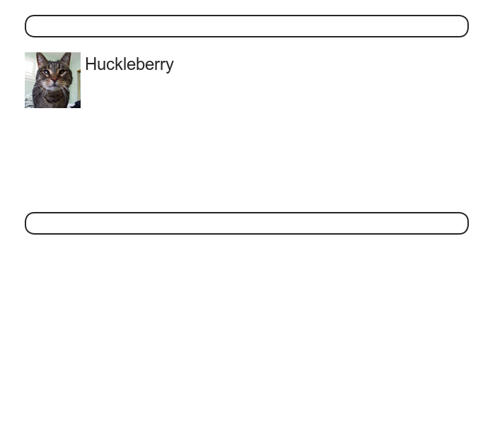

图 7.1：本节要实现的用户资料页面构思图

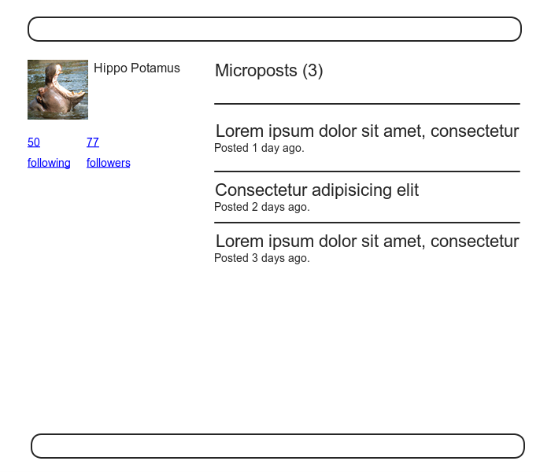

图 7.2：最终实现的用户资料页面构思图

<h3 id="sec-7-1-1">7.1.1 调试信息和 Rails 环境</h3>

本节要实现的用户资料页面是第一个真正意义上的动态页面。虽然视图的代码不会动态改变，不过每个用户资料页面显示的内容却是动态的从数据库中读取的。添加动态页面之前，最好做些准备工作，现在我们能做的就是在网站布局中加入一些调试信息（参见代码 7.1）。代码 7.1 使用 Rails 内置的 `debug` 方法和 `params` 变量（[7.1.2 节](#sec-7-1-2)会详细介绍），在每一页中都显示一些对开发有所帮助的信息。

**代码 7.1** 把调试信息加入网站的布局中  `app/views/layouts/application.html.erb`


<!DOCTYPE html>
<html>
  .
  .
  .
  <body>
    <%= render 'layouts/header' %>
    

      <%= yield %>
      <%= render 'layouts/footer' %>
      <%= debug(params) if Rails.env.development? %>
    

  </body>
</html>


我们要在[第五章](chapter5.html)中创建的自定义样式表文件中加入一些样式规则（参见代码 7.2），美化一下这些调试信息。

**代码 7.2** 添加美化调试信息的样式，使用了一个 Sass mixin  `app/assets/stylesheets/custom.css.scss`


@import "bootstrap";

/* mixins, variables, etc. */

$grayMediumLight: #eaeaea;

@mixin box_sizing {
  -moz-box-sizing: border-box;
  -webkit-box-sizing: border-box;
  box-sizing: border-box;
}
.
.
.

/* miscellaneous */

.debug_dump {
  clear: both;
  float: left;
  width: 100%;
  margin-top: 45px;
  @include box_sizing;
}


上面的代码用到了 Sass 的 mixin 功能，创建的这个 mixin 名为 `box-sizing`。mixin 可以打包一系列的样式规则，供多次使用。预处理器处理时，会把


.debug_dump {
  .
  .
  .
  @include box_sizing;
}


转换成


.debug_dump {
  .
  .
  .
  -moz-box-sizing: border-box;
  -webkit-box-sizing: border-box;
  box-sizing: border-box;
}


在 [7.2.2 节](#sec-7-2-2)中还会再次用到这个 mixin。美化后的调试信息如图 7.3 所示。

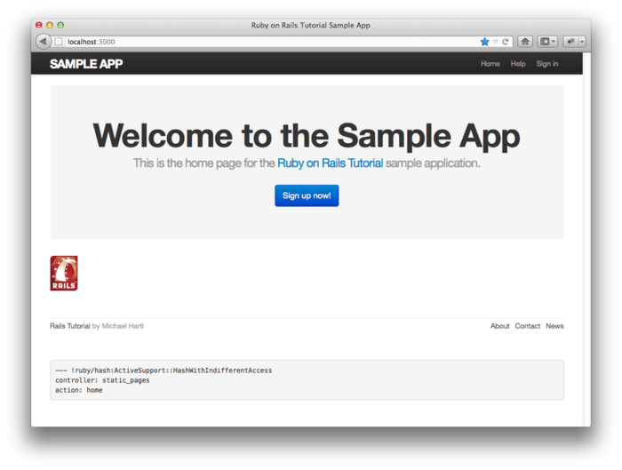

图 7.3：显示有调试信息的示例程序首页（[/](http://localhost:3000/)）

图 7.3 中显示的调试信息给出了当前页面的一些信息：


---
controller: static_pages
action: home


这是 `params` 变量的 YAML[3](#fn-3) 形式，和 Hash 类似，显示了当前页面的控制器名和动作名。在 [7.1.2 节](#sec-7-1-2)中会介绍其他调试信息的意思。

我们不想让部署后的示例程序显示这个调试信息，所以代码 7.1 中用如下的代码做了限制，只在“开发环境”中显示：


if Rails.env.development?


“开发环境”是 Rails 定义的三个环境之一（详细介绍参见[旁注 7.1](#box-7-1)）[4](#fn-4)，只有在“开发环境”中 `Rails.env.development?` 才会返回 `true`，所以下面的 ERb 代码


<%= debug(params) if Rails.env.development? %>


不会在“生产环境”和“测试环境”中执行。（在“测试环境”中显示调试信息虽然没有坏处，但也没什么好处，所以最好只在“开发环境”中显示。）

  <h4>旁注 7.1 Rails 的三个环境</h4>
  
Rails 定义了三种环境，分别是“生产环境”、“开发环境”和“测试环境”。Rails 控制台默认使用的是“开发环境”：

  <pre>
  $ rails console
  Loading development environment
  >> Rails.env
  => "development"
  >> Rails.env.development?
  => true
  >> Rails.env.test?
  => false
  </pre>
  
如前所示，Rails 对象有一个 <code>env</code> 属性，属性上还可以调用各环境对应的布尔值方法，例如，<code>Rails.env.test?</code>，在“测试环境”中的返回值是 <code>true</code>，而在其他两个环境中的返回值则是 <code>false</code>。

  
如果需要在其他环境中使用控制台（例如，在“测试环境”中进行调试），只需把环境名称传递给 <code>console</code> 命令即可：

  <pre>
  $ rails console test
  Loading test environment
  >> Rails.env
  => "test"
  >> Rails.env.test?
  => true
  </pre>
  
Rails 本地服务器和控制台一样，默认使用“开发环境”，不过也可以在其他环境中运行：

  <pre>
  $ rails server --environment production
  </pre>
  
如果要在“生产环境”中运行应用程序，先要提供生产环境数据库。在“生产环境”中执行 <code>rake db:migrate</code> 命令可以生成“生产环境”所需的数据库：

  <pre>$ bundle exec rake db:migrate RAILS_ENV=production</pre>
  
（我发现在控制台、服务器和迁移命令中指定其他环境的方法不一样，这可能会产生混淆，所以我特意演示了三个命令的用法。）

  
顺便说一下，把应用程序部署到 Heroku 后，可以使用如下的命令进入远端的控制台：

  <pre>
  $ heroku run console
  Ruby console for yourapp.herokuapp.com
  >> Rails.env
  => "production"
  >> Rails.env.production?
  => true
  </pre>
  
Heroku 是用来部署网站的平台，自然会在“生产环境”中运行应用程序。

<h3 id="sec-7-1-2">7.1.2 Users 资源</h3>

在[第六章](chapter6.html)末尾，我们在数据库中存储了一个用户记录，在 [6.3.5 节](chapter6.html#sec-6-3-5)查看过，用户的 id 是 1，现在我们就来创建一个页面，显示这个用户的信息。我们会遵从 Rails 使用的 REST 架构，把数据视为资源（resource），可以创建、显示、更新和删除，这四个操作分别对应了 HTTP 标准中的 `POST`、`GET`、`PUT` 和 `DELETE` 请求方法（参见[旁注 3.2](chapter3.html#box-3-2)）。

按照 REST 约定，资源一般是由资源名加唯一标识符表示的。对 User 而言，我们把它看做一个资源，若要查看 id 为 1 的用户，就要向 /users/1 地址发送一个 `GET` 请求。REST 架构解析时，会自动把这个 `GET` 请求分发到 `show` 动作上，因此这里没必要指明用哪个动作。

在 [2.2.1 节](chapter2.html#sec-2-2-1)中曾经见过，id 为 1 的用户对应的地址是 /users/1，现在访问这个地址的话会显示错误提示信息（如图 7.4）。

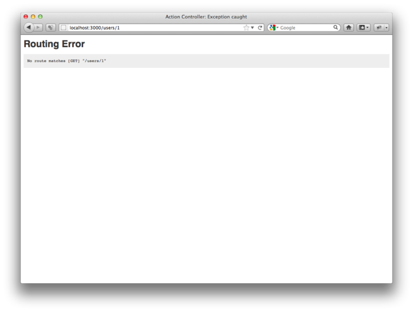

图 7.4：/users/1 地址显示的错误

我们只需在路由文件 `config/routes.rb` 中添加如下的一行代码就可以正常访问 REST 架构对应的 URI 地址了：


resources :users


修改后的路由文件如代码 7.3 所示。

**代码 7.3** 在路由文件中添加用户资源设置  `config/routes.rb`


SampleApp::Application.routes.draw do
  resources :users

  root to: 'static_pages#home'

  match '/signup',  to: 'users#new'
  .
  .
  .
end


你可能发现了，我们把下面这行代码 5.23 中出现的代码删掉了：


get "users/new"


这是因为 `resources :users` 不仅使 /users/1 地址可以访问了，而且还为示例程序的 Users 资源提供了符合 REST 架构的一系列动作[5](#fn-5)，以及用来获取相应 URI 地址的具名路由（named route，参见 [5.3.3 节](chapter5.html#sec-5-3-3)）。最终得到的 URI、动作和具名路由的对应关系如[表格 7.1](#table-7-1) 所示（可以和[表格 2.2](chapter2.html#table-2-2) 对比一下）。接下来的三章会介绍 `show` 之外的所有动作，并不断完善，把 Users 打造成完全符合 REST 架构的资源。

<table id="table-7-1" class="tabular">
    <tbody>
        <tr>
            <th class="align_left"><strong>HTTP 请求</strong></th>
            <th class="align_left"><strong>URI</strong></th>
            <th class="align_left"><strong>动作</strong></th>
            <th class="align_left"><strong>具名路由</strong></th>
            <th class="align_left"><strong>作用</strong></th>
        </tr>
        <tr class="top_bar">
            <td class="align_left"><tt>GET</tt></td>
            <td class="align_left">/users</td>
            <td class="align_left"><code>index</code></td>
            <td class="align_left"><code>users_path</code></td>
            <td class="align_left">显示所有用户的页面</td>
        </tr>
        <tr>
            <td class="align_left"><tt>GET</tt></td>
            <td class="align_left">/users/1</td>
            <td class="align_left"><code>show</code></td>
            <td class="align_left"><code>user_path(user)</code></td>
            <td class="align_left">显示某个用户的页面</td>
        </tr>
        <tr>
            <td class="align_left"><tt>GET</tt></td>
            <td class="align_left">/users/new</td>
            <td class="align_left"><code>new</code></td>
            <td class="align_left"><code>new_user_path</code></td>
            <td class="align_left">创建（注册）新用户的页面</td>
        </tr>
        <tr>
            <td class="align_left"><tt>POST</tt></td>
            <td class="align_left">/users</td>
            <td class="align_left"><code>create</code></td>
            <td class="align_left"><code>users_path</code></td>
            <td class="align_left">创建新用户</td>
        </tr>
        <tr>
            <td class="align_left"><tt>GET</tt></td>
            <td class="align_left">/users/1/edit</td>
            <td class="align_left"><code>edit</code></td>
            <td class="align_left"><code>edit_user_path(user)</code></td>
            <td class="align_left">编辑 id 为 <code>1</code>的用户页面</td>
        </tr>
        <tr>
            <td class="align_left"><tt>PUT</tt></td>
            <td class="align_left">/users/1</td>
            <td class="align_left"><code>update</code></td>
            <td class="align_left"><code>user_path(user)</code></td>
            <td class="align_left">更新用户信息</td>
        </tr>
        <tr>
            <td class="align_left"><tt>DELETE</tt></td>
            <td class="align_left">/users/1</td>
            <td class="align_left"><code>destroy</code></td>
            <td class="align_left"><code>user_path(user)</code></td>
            <td class="align_left">删除用户</td>
        </tr>
    </tbody>
</table>

表格 7.1：Users 资源对应的路由

添加代码 7.3 之后，路由就生效了，但是页面还不存在（如图 7.5）。下面我们就来为页面添加一些内容，[7.1.4 节](#sec-7-1-4)还会添加更多的内容。

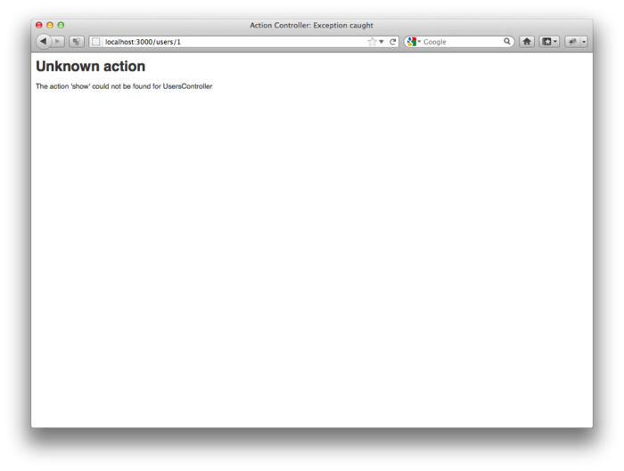

图 7.5：/users/1 地址生效了，但是页面不存在

用户资料页面的视图存放在应用程序特定的目录中，即 `app/views/users/show.html.erb`。这个视图和自动生成的 `new.html.erb`（参见代码 5.28）不同，现在不存在，要手动创建。新建 `show` 视图后请写入代码 7.4 中的代码。

**代码 7.4** 用户资料页面的临时视图  `app/views/users/show.html.erb`


<%= @user.name %>, <%= @user.email %>


在上面的代码中，我们假设 `@user` 变量是存在的，使用 ERb 代码显示用户的名字和 Email 地址。这和最终实现的视图有点不一样，在最终的视图中不会公开显示用户的 Email 地址。

我们要在 Users 控制器的 `show` 动作中定义 `@user` 变量，用户资料页面才能正常渲染。你可能猜到了，我们要在 User 模型上调用 `find` 方法，从数据库中取出用户记录，如代码 7.5 所示。

**代码 7.5** 含有 `show` 动作的 Users 控制器 `app/controllers/users_controller.rb`


class UsersController < ApplicationController

  def show
    @user = User.find(params[:id])
  end

  def new
  end
end


在上面的代码中，我们使用 `params` 获取用户的 id。当我们向 Users 控制器发送请求时，`params[:id]` 会返回用户的 id，即 1，所以这就和 [6.1.4 节](chapter6.html#sec-6-1-4)中直接调用 `User.find(1)` 的效果一样。（严格来说，`params[:id]` 返回的是字符串 `"1"`，`find` 方法会自动将其转换成整数形式。）

定义了视图和动作之后，/users/1 地址就可以正常显示了（如图 7.6）。留意一下调试信息，其内容证实了 `params[:id]` 的值和前面分析的一样：


---
action: show
controller: users
id: '1'


所以，代码 7.5 中的 `User.find(params[:id])` 才会取回 id 为 1 的用户记录。

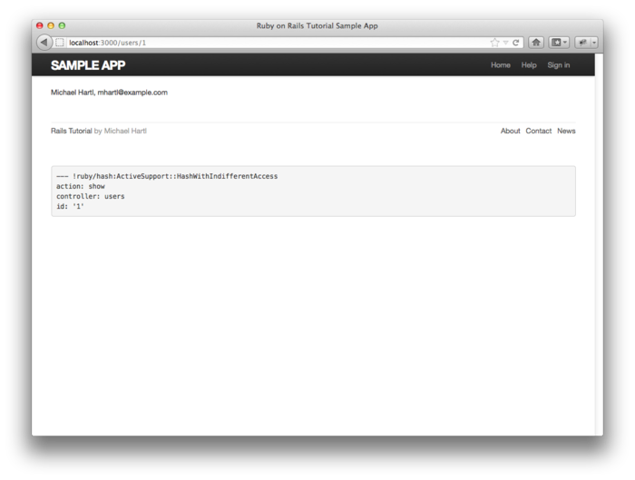

图 7.6：设置 Users 资源后的用户资料页面 [/users/1](http://localhost:3000/users/1)

### 7.1.3 使用预构件测试用户资料页面

至此，用户资料页面已经可以正常访问了，接下来我们要实现图 7.1 所示的构思了。与创建静态页面和 User 模型一样，开发的过程会践行 TDD 思想。

在 [5.4.2 节](chapter5.html#sec-5-4-2)中，我们使用集成测试对 Users 资源相关的页面进行了测试，以“注册”页面为例，测试先访问 `signup_path`，然后检测页面中 `h1` 和 `title` 标签的内容是否正确。代码 7.6 是对代码 5.31 的补充。（注意，我们删除了 [5.3.4 节](chapter5.html#sec-5-3-4)用到的 `full_title` 帮助方法，因为标题已经测试过了。）

**代码 7.6** 补充用户相关页面的测试 `spec/requests/user_pages_spec.rb`


require 'spec_helper'

describe "User pages" do

  subject { page }

  describe "signup page" do
    before { visit signup_path }

    it { should have_selector('h1',    text: 'Sign up') }
    it { should have_selector('title', text: 'Sign up') }
  end
end


为了测试用户资料页面，先要有一个 User 模型对象，代码 7.5 中的 `show` 动作才能执行查询操作：


describe "profile page" do
  # Code to make a user variable
  before { visit user_path(user) }

  it { should have_selector('h1',    text: user.name) }
  it { should have_selector('title', text: user.name) }
end


我们要把上面代码中的注释换成相关的代码才行。在注释后面，调用 `user_path` 具名路由（参见[表格 7.1](#table-7-1)）访问用户资源页面的地址，然后检测页面中 `h1` 和 `title` 标签是否都包含用户的名字。

一般情况下，创建 User 模型需要调用 Active Record 提供的 `User.create` 方法，不过经验告诉我们，使用预构件（factory）创建用户对象更方便，存入数据库也更容易。

我们要使用 [Factory Girl](http://github.com/thoughtbot/factory_girl) 来生成预构件，这个 gem 是由 thoughtbot 公司的达人开发的。和 RSpec 类似，Factory Girl 也定义了一套领域专属语言（Domain-specific Language, DSL），用来生成 Active Record 对象。Factory Girl 的句法很简单，使用块和方法定义对象的属性值。本章还没有显出预构件的优势，不过后续的内容会多次使用预构件的高级更能，到时你就可以看到它的强大之处了。例如，在 [9.3.3 节](chapter9.html#sec-9-3-3)中，需要生成一批 Email 地址各不相同的用户对象，用预构件就可以很轻松的完成这种操作。

和其他的 gem 一样，我们要在 Bundler 的 `Gemfile` 加入如代码 7.7 所示的代码来安装 Factory Girl。（因为只有测试时才会用到 Factory Girl，所以把它归入测试组中。）

**代码 7.7** 把 Factory Girl 加入 `Gemfile`


source 'https://rubygems.org'
  .
  .
  .
  group :test do
    .
    .
    .
    gem 'factory_girl_rails', '4.1.0'
  end
  .
  .
  .
end


然后和往常一样，运行以下命令安装：


$ bundle install


Factory Girl 生成的预构件都保存在 `spec/factories.rb` 中，RSpec 会自动加载这个文件。用户相关的预构件如代码 7.8 所示。

**代码 7.8** 模拟 User 模型对象的预构件 `spec/factories.rb`


FactoryGirl.define do
  factory :user do
    name     "Michael Hartl"
    email    "michael@example.com"
    password "foobar"
    password_confirmation "foobar"
  end
end


`factory` 方法的 `:user` 参数说明，块中的代码定义了一个 User 模型对象。

加入代码 7.8 之后，就可以在测试中使用 `let` 方法（参见[旁注 6.3](chapter6.html#box-6-3)）和 Factory Girl 提供的 `FactoryGirl` 方法来生成 User 对象：


let(:user) { FactoryGirl.create(:user) }


修改后的测试如代码 7.9 所示。

**代码 7.9** 用户资料页面的测试 `spec/requests/user_pages_spec.rb`


require 'spec_helper'

describe "User pages" do

  subject { page }

  describe "profile page" do
    let(:user) { FactoryGirl.create(:user) }
    before { visit user_path(user) }

    it { should have_selector('h1',    text: user.name) }
    it { should have_selector('title', text: user.name) }
  end
  .
  .
  .
end


现在你应该看一下测试是否是失败的（红色）：


$ bundle exec rspec spec/


加入代码 7.10 之后，测试就可以通过了（绿色）。

**代码 7.10** 在用户资料页面视图中加入标题和标头 `app/views/users/show.html.erb`


<% provide(:title, @user.name) %>
<h1><%= @user.name %></h1>


再次运行 RSpec，确认代码 7.9 中的测试是否可以通过：


$ bundle exec rspec spec/


使用 Factory Girl 后，明显可以察觉测试变慢了，这不是 Factory Girl 导致的，而是有意为之，并不是 bug。变慢的原因在于 [6.3.1 节](chapter6.html#sec-6-3-1)中用来加密密码的 BCrypt，其加密算法设计如此，因为慢速加密的密码很难破解。慢速加密的过程会延长测试的运行时间，不过我们可以做个简单的设置改变这种情况。BCrypt 使用耗时因子（cost factor）设定加密过程的耗时，耗时因子的默认值倾向于安全性而不是速度，在生产环境这种设置很好，但测试时的关注点却有所不同：测试追求的是速度，而不用在意测试数据库中用户的密码强度。我们可以在测试配置文件 `config/environments/test.rb` 中加入几行代码来解决速度慢的问题：把耗时因子的默认值修改为最小值，提升加密的速度，如代码 7.11 所示。即使测试量很少，修改设置之后速度的提升也是很明显的，所以我建议每个读者都在 `test.rb` 文件中加入代码 7.11 的内容。

**代码 7.11** 为测试环境重新设置 BCrypt 耗时因子 `config/environments/test.rb`


SampleApp::Application.configure do
  .
  .
  .
  # Speed up tests by lowering BCrypt's cost function.
  require 'bcrypt'
  silence_warnings do
    BCrypt::Engine::DEFAULT_COST = BCrypt::Engine::MIN_COST
  end
end


<h3 id="sec-7-1-4">7.1.4 添加 Gravatar 头像和侧边栏</h3>

上一小节创建了一个略显简陋的用户资料页面，这一小节要再添加一些内容：用户头像和侧边栏。构建视图时，我们关注的是显示的内容，而不是页面底层的结构，所以我们暂时不测试视图，等遇到容易出错的页面结构时，例如 [9.3.3 节](chapter9.html#sec-9-3-3)中的分页导航，再使用 TDD 理念。

首先，我们要在用户资料页面中添加一个“全球通用识别”的头像，这个头像也称作 Gravatar[6](#fn-6)，由 Tom Preston-Werner（GitHub 的联合创始人）开发，后被 Automattic（开发 WordPress 的公司）收购。Gravatar 是一个免费服务，用户只需上传图片并将其关联到 Email 地址上即可。使用 Gravatar 可以简单的在网站中加入用户头像，开发者不必再分心去处理图片上传、剪裁和存储，只要使用用户的 Email 地址构成头像的 URI 地址，关联的头像就可以显示出来了。[7](#fn-7)

我们计划定义一个名为 `gravatar_for` 的方法，返回指定用户的 Gravatar 头像，如代码 7.12 所示。

**代码 7.12** 显示用户名字和 Gravatar 头像的用户资料页面视图 `app/views/users/show.html.erb`


<% provide(:title, @user.name) %>
<h1>
  <%= gravatar_for @user %>
  <%= @user.name %>
</h1>


现在看一下测试是不是失败的：


$ bundle exec rspec spec/


因为还没定义 `gravatar_for` 方法，所以用户资料页面会显示错误提示。（测试视图最大的作用大概就是可以捕获这种错误，所以一定要掌握视图测试的量。）

默认情况下，所有帮助方法文件中定义的方法都可以直接用在任意的视图中，不过为了便于管理，我们会把 `gravatar_for` 放在 Users 控制器对应的帮助文件中。Gravatar 的首页中有介绍说，头像的 URI 地址要使用 MD5 加密的 Email 地址。在 Ruby 中，MD5 加密算法由 `Digest` 库的 `hexdigest` 方法实现：


>> email = "MHARTL@example.COM".
>> Digest::MD5::hexdigest(email.downcase)
=> "1fda4469bcbec3badf5418269ffc5968"


Email 地址不区分大小写，而 MD5 加密算法却区分，所以，我们要先调用 `downcase` 方法把 Email 地址转换成小写形式，然后再传递给 `hexdigest` 方法。我们定义的 `gravatar_for` 方法如代码 7.13 所示。

**代码 7.13** 定义 `gravatar_for` 帮助方法 `app/helpers/users_helper.rb`


module UsersHelper

  # Returns the Gravatar (http://gravatar.com/) for the given user.
  def gravatar_for(user)
    gravatar_id = Digest::MD5::hexdigest(user.email.downcase)
    gravatar_url = "https://secure.gravatar.com/avatar/#{gravatar_id}"
    image_tag(gravatar_url, alt: user.name, class: "gravatar")
  end
end


`gravatar_for` 方法的返回值是 Gravatar 头像的 `img` 元素，`img` 标签的 class 设为 `gravatar`，`alt` 属性值是用户的名字（对视觉障碍人士使用的屏幕阅读器很友好）。现在你可以验证一下测试是否可以通过：


$ bundle exec rspec spec/


用户资料页面的效果如图 7.7 所示，页面中显示的头像是 Gravatar 的默认图片，因为 `user@example.com` 不是真的 Email 地址（example.com 这个域名是专门用来举例的）。

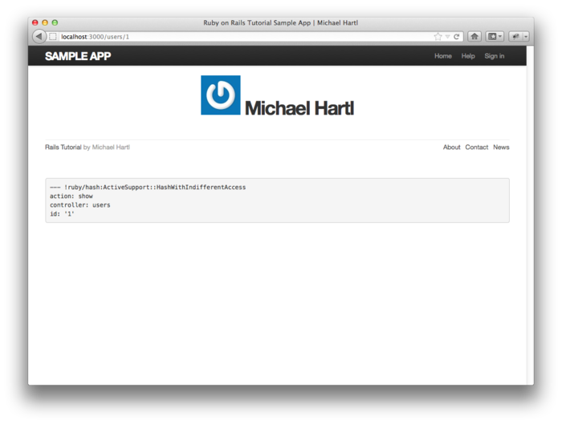

图 7.7：显示默认 Gravatar 头像的用户资料页面 [/users/1](http://localhost:3000/users/1)

我们调用 `update_attributes` 方法（参见 [6.1.5 节](chapter6.html#sec-6-1-5)）更新一下数据库中的用户记录，然后就可以显示用户真正的头像了：


$ rails console
>> user = User.first
>> user.update_attributes(name: "Example User",
?>                        email: "example@railstutorial.org",
?>                        password: "foobar",
?>                        password_confirmation: "foobar")
=> true


上面的代码，把用户的 Email 地址设为 `example@railstutorial.org`，我已经把这个 Email 地址的头像设为了本书网站的 LOGO。修改后的结果如图 7.8 所示。

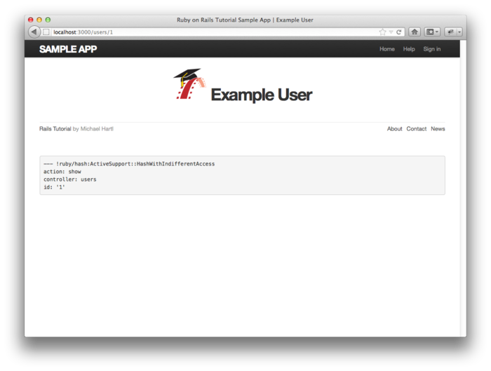

图 7.8：显示用户真实头像的用户资料页面 [/users/1](http://localhost:3000/users/1)

我们还要添加一个侧边栏，才能完整的实现图 7.1 中的构思。我们要使用 `aside` 标签定义侧边栏，`aside` 中的内容一般是对主体内容的补充，不过也可以自成一体。我们要把 `aside` 标签的 class 设为 `row span4`，这也是 Bootstrap 会用到的。在用户资料页面中添加侧边栏用到的代码如代码 7.14 所示。

**代码 7.14** 为用户资料页面添加侧边栏 `app/views/users/show.html.erb`


<% provide(:title, @user.name) %>

  <aside class="span4">
    <section>
      <h1>
        <%= gravatar_for @user %>
        <%= @user.name %>
      </h1>
    </section>
  </aside>



添加了 HTML 结构和 CSS class 后，我们再用 SCSS 为资料页面定义样式，如代码 7.15 所示。（注意：因为 asset pipeline 使用了 Sass 预处理器，所以样式中才可以使用嵌套。）最终的效果如图 7.9 所示。

**代码 7.15** 用户资料页面的样式，包括侧边栏的样式 `app/assets/stylesheets/custom.css.scss`


.
.
.

/* sidebar */

aside {
  section {
    padding: 10px 0;
    border-top: 1px solid $grayLighter;
    &:first-child {
      border: 0;
      padding-top: 0;
    }
    span {
      display: block;
      margin-bottom: 3px;
      line-height: 1;
    }
    h1 {
      font-size: 1.6em;
      text-align: left;
      letter-spacing: -1px;
      margin-bottom: 3px;
    }
  }
}

.gravatar {
  float: left;
  margin-right: 10px;
}


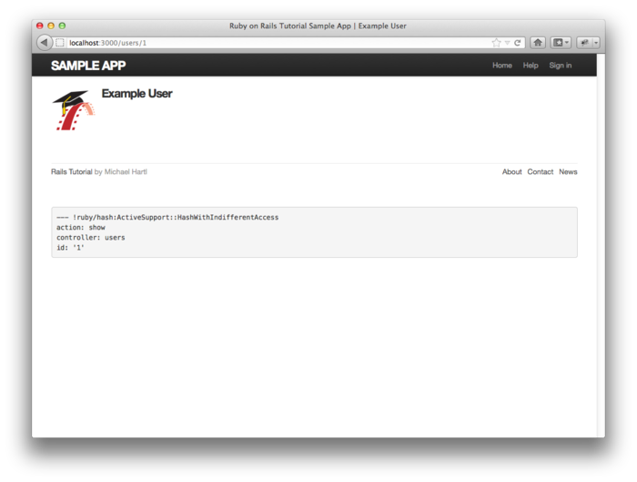

图 7.9：添加侧边栏并定义了样式之后的用户资料页面 [/users/1](http://localhost:3000/users/1)

<h2 id="sec-7-2">7.2 注册表单</h2>

用户资料页面已经可以访问了，但内容还不完整。下面我们要为网站创建一个注册表单。如图 5.9 和图 7.10 所示，“注册”页面还没有什么内容，无法注册新用户。本节会实现如图 7.11 所示的注册表单，添加注册功能。

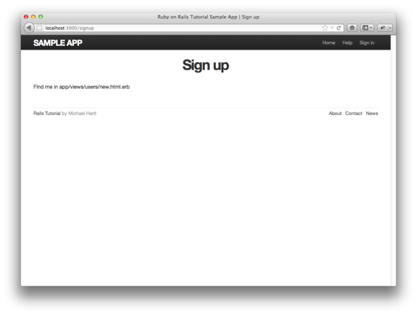

图 7.10：“注册”页面现在的样子 [/signup](http://localhost:3000/signup)

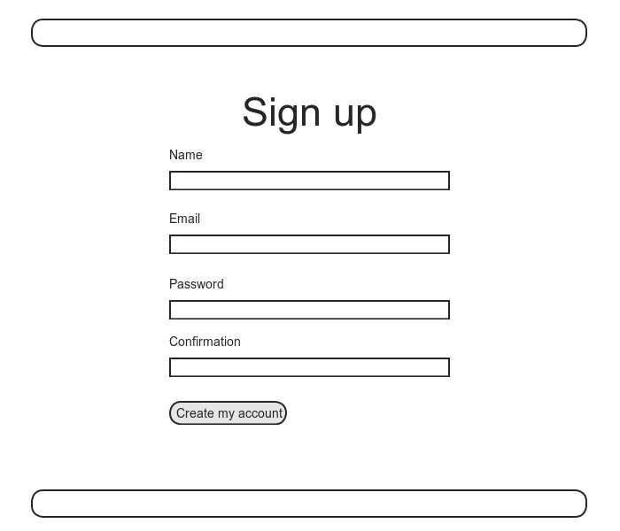

图 7.11：“注册”页面的构思图

因为我们要实现通过网页创建用户的功能，现在就把 [6.3.5 节](chapter6.html#sec-6-3-5)在控制台中创建的用户删除吧。最简单的方法是使用 `db:reset` 命令：


$ bundle exec rake db:reset


还原数据库后，在有些系统中还要重新准备测试数据库：


$ bundle exec rake db:test:prepare


在某些系统中还要重启 Web 服务器，还原数据库的操作才能生效。[8](#fn-8)

<h3 id="sec-7-2-1">7.2.1 测试用户注册功能</h3>

在 WEb 框架没有完全支持测试之前，测试是件很痛苦的事，也很容易出错。例如，手动测试“注册”页面时，我们要在浏览器中访问这个页面，然后分别提交不合法的和合法的数据，检查在这两种情况下应用程序的表现是否正常。而且，每次修改程序后，都要重复上述的操作。使用 RSpec 和 Capybara 之后，以前需要手动进行的测试，现在可以编写测试用例自动执行了。

前面的章节已经介绍过 Capybara 访问网页时使用的很直观的句法，其中用的最多的就是访问某个页面的 `visit` 方法。Capybara 的功能可不仅限于此，它还可以填写如图 7.11 所示的表单字段，然后点击提交按钮，句法如下：


visit signup_path
fill_in "Name", with: "Example User"
.
.
.
click_button "Create my account"


现在我们要分别提交不合法的和合法的注册数据，验证注册功能是否可以正常使用。我们要用到的测试相对高级一些，所以我们会慢慢地分析。如果你想查看最终的测试代码（以及测试文件的位置），可以直接跳到代码 7.16。先来测试没有正确填写信息的注册表单，我们访问“注册”页面，什么也不填，直接点击注册按钮（调用 `click_button` 方法），这个操作模拟的就是提交不合法数据的情况：


visit signup_path
click_button "Create my account"


上面的代码，等同于手动访问注册页面，然后提交空白的不合法注册信息。相对的，我们要调用 `fill_in` 方法填写合法信息，以此来模拟提交合法数据的情况：


visit signup_path
fill_in "Name",         with: "Example User"
fill_in "Email",        with: "user@example.com"
fill_in "Password",     with: "foobar"
fill_in "Confirmation", with: "foobar"
click_button "Create my account"


我们测试的最终目的，是要检测点击“Create my account”按钮之后，程序的表现是否正常，即当提交合法的数据时，创建新用户；当提交不合法的数据时，不创建新用户。检测是是否创建了新用户，我们要看用户的数量是否发生了变化，在测试中，我们使用每个 Active Record 对象都可以响应的 `count` 方法来获取对象的数量，以用户为例，即：


$ rails console
>> User.count
=> 0


现在 `User.count` 的返回值是 0，因为本节开头我们还原了数据库。提交不合法数据时，我们希望用户的数量是不变的；提交合法数据时，我们希望用户的数量增加 1 个。在 RSpec 中，上面的设想要结合 `expect` 和 `to`，或者和 `not_to` 方法来表述。我们先从不合法的数据开始，因为这种情况比较简单。我们先访问“注册”页面，然后点击提交按钮，希望用户的数量不变：


visit signup_path
expect { click_button "Create my account" }.not_to change(User, :count)


注意，通过花括号我们可以看出，`expect` 把 `click_button` 包含在一个块中（参见 [4.3.2 节](chapter4,html#sec-4-3-2)），这是为 `change` 方法做的特殊处理。`change` 方法可接受两个参数，第一个参数是对象名，第二个是 Symbol。`change` 方法会在 `expect` 块中的代码执行前后，分别计算在第一个参数上调用第二参数代表的方法返回的结果。也就是说，如下的代码


expect { click_button "Create my account" }.not_to change(User, :count)


会在执行


click_button "Create my account"


前后，两次计算


User.count


的结果。

本例，我们用 `not_to` 方法表示不愿看到用户数量发生变化。把点击按钮的代码放入块中，相当于把


initial = User.count
click_button "Create my account"
final = User.count
initial.should == final


替换成简单的一行代码


expect { click_button "Create my account" }.not_to change(User, :count)


这样读起来更顺口，代码也更简洁。

提交合法数据的情况和上述不合法数据的情况类似，不过用户数量不是不变，而是增加了 1 个：


visit_signup path
fill_in "Name", with: "Example User"
fill_in "Email", with: "user@example.com"
fill_in "Password", with: "foobar"
fill_in "Confirmation", with: "foobar"
expect do
  click_button "Create my account"
end.to change(User, :count).by(1)


这里使用了 `to` 方法，我们希望点击提交按钮后，这些合法的数据可以用来创建一个新用户。我们把上面两种情况放入一个 `describe` 块中，再把共用的代码放入 `before` 块中，最终得到的注册功能测试代码如代码 7.16 所示。我们还做了一项重构，用 `let` 方法定义了 `submit` 变量，表示注册按钮的文本。

**代码 7.16** 测试用户注册功能的代码  `spec/requests/user_pages_spec.rb`


require 'spec_helper'

describe "User pages" do

  subject { page }
  .
  .
  .
  describe "signup" do

    before { visit signup_path }

    let(:submit) { "Create my account" }

    describe "with invalid information" do
      it "should not create a user" do
        expect { click_button submit }.not_to change(User, :count)
      end
    end

    describe "with valid information" do
      before do
        fill_in "Name",         with: "Example User"
        fill_in "Email",        with: "user@example.com"
        fill_in "Password",     with: "foobar"
        fill_in "Confirmation", with: "foobar"
      end

      it "should create a user" do
        expect { click_button submit }.to change(User, :count).by(1)
      end
    end
  end
end


后续几节还会添加更多的测试，不过现在这个测试已经可以检测相当多的功能表现是否正常了。若要使这个测试通过，先得创建包含正确元素的注册页面，提交注册信息后页面要转向正确的地址，而且如果数据是合法的，还要创建一个新用户，并存入数据库中。

当然了，现在测试还是失败的：


$ bundle exec rspec spec/


<h3 id="sec-7-2-2">7.2.2 使用 <code>form_for</code></h3>

我们已经为用户注册功能编写了适当的测试代码，接下来要创建用户注册表单了。在 Rails 中，创建表单可以使用 `form_for` 帮助方法，指定其参数为 Active Record 对象，然后使用对象的属性构建表单的字段。注册表单的视图如代码 7.17 所示。（熟悉 Rails 2.x 的读者要注意一下，这里 `form_for` 使用的是 `<%=...%>` 形式，而 Rails 2.x 使用的是 `<%...%>` 形式。）

**代码 7.17** 用户注册表单  `app/views/users/new.html.erb`


<% provide(:title, 'Sign up') %>
<h1>Sign up</h1>

  

    <%= form_for(@user) do |f| %>

      <%= f.label :name %>
      <%= f.text_field :name %>

      <%= f.label :email %>
      <%= f.text_field :email %>

      <%= f.label :password %>
      <%= f.password_field :password %>

      <%= f.label :password_confirmation, "Confirmation" %>
      <%= f.password_field :password_confirmation %>

      <%= f.submit "Create my account", class: "btn btn-large btn-primary" %>
    <% end %>
  



我们来分析一下这些代码。在上面的代码中，我们使用了关键词 `do`，说明 `form_for` 后面可以跟着块，而且可以传入一个块参数 `f`，代表这个表单：


<%= form_for(@user) do |f| %>
  .
  .
  .
<% end %>


我们一般无需了解 Rails 帮助方法的内部实现，但是对于 `form_for` 来说，我们要知道 `f` 对象的作用是什么：调用表单字段（例如，文本字段、单选按钮、密码字段）对应的方法时，生成的表单字段元素可以用来设定 `@user` 对象的属性。也就是说：


<%= f.label :name %>
<%= f.text_field :name %>


生成的 HTML 是一个有标号（label）的文本字段，可以用来设定 User 模型的 `name` 属性。（[7.2.3 节](#sec-7-2-3)会看到生成的 HTML）看过生成的 HTML 才能理解为什么字段可以设定属性。在此之前，还有个问题要解决，因为没有定义 `@user` 变量，页面无法显示。和其他未定义的实例变量一样，`@user` 的值现在是 `nil`。所以如果运行测试的话，会看到针对注册页面结构的测试（检测 `h1` 和 `title` 的内容）是失败的：


$ bundle exec rspec spec/requests/user pages spec.rb -e "signup page"


（上述命令中的 `-e` 参数指定只运行描述文本包含“signup page”字符串的测试用例。如果改成“signup”，则会运行代码 7.16 中的所有测试。）

要使这个测试通过，同时也让页面可以正常显示，我们要在 `new.html.erb` 视图对应的 `new` 动作中定义 `@user` 变量。`form_for` 方法的参数需要一个 User 对象，而且我们要创建新用户，所以我们可以使用 `User.new` 方法，如代码 7.18 所示。

**代码 7.18** 在 `new` 动作中定义 `@user` 变量 `app/controllers/users_controller.rb`


class UsersController < ApplicationController
  .
  .
  .
  def new
    @user = User.new
  end
end


定义 `@user` 变量后，注册页面的测试就可以通过了：


$ bundle exec rspec spec/requests/user pages spec.rb -e "signup page"


再添加代码 7.19 中的样式，表单的效果如图 7.12 所示。注意，我们再次用到了代码 7.2 中的 `box-sizing` 这个 mixin。

**代码 7.19** 注册表单的样式  `app/assets/stylesheets/custom.css.scss`


.
.
.

/* forms */

input, textarea, select, .uneditable-input {
  border: 1px solid #bbb;
  width: 100%;
  padding: 10px;
  height: auto !important;
  margin-bottom: 15px;
  @include box_sizing;
}


图 7.12：注册用户的表单 [/signup](http://localhost:3000/signup)

<h3 id="sec-7-2-3">7.2.3 表单的 HTML</h3>

如图 7.12 所示，“注册”页面现在可以正常显示了，说明代码 7.17 中的 `form_for` 方法生成了合法的 HTML。生成的表单 HTML（可以使用 Firebug 或浏览器的“查看源文件”菜单查看）如代码7.20 所示。某些细节现在无需关心，我们只解说最重要的结构。

**代码 7.20** 图 7.12 中表单的 HTML


<form accept-charset="UTF-8" action="/users" class="new_user"
      id="new_user" method="post">

  <label for="user_name">Name</label>
  <input id="user_name" name="user[name]" size="30" type="text" />

  <label for="user_email">Email</label>
  <input id="user_email" name="user[email]" size="30" type="text" />

  <label for="user_password">Password</label>
  <input id="user_password" name="user[password]" size="30"
         type="password" />

  <label for="user_password_confirmation">Confirmation</label>
  <input id="user_password_confirmation"
         name="user[password_confirmation]" size="30" type="password" />

  <input class="btn btn-large btn-primary" name="commit" type="submit"
         value="Create my account" />
</form>


（上面的代码省略了“鉴别权标（authenticity token）”相关的 HTML。Rails 使用鉴别权标来防止跨站请求伪造（cross-site request forgery, CSRF）攻击。如果你对鉴别权标感兴趣，可以阅读一下 Stack Overflow 网站中的《[Understand Rails Authenticity Token!](http://stackoverflow.com/questions/941594/understand-rails-authenticity-token)》一文，这篇文章介绍了鉴别权标的工作原理及重要意义。）

下面看一下表单的字段。比较代码 7.17 和代码 7.20 之后，我们可以看到，如下的 ERb 代码


<%= f.label :name %>
<%= f.text_field :name %>


生成的 HTML 是


<label for="user_name">Name</label>
<input id="user_name" name="user[name]" size="30" type="text" />


下面的 ERb 代码


<%= f.label :password %>
<%= f.password_field :password %>


生成的 HTML 是


<label for="user_password">Password</label> 
<input id="user_password" name="user[password]" size="30" type="password" />


如图 7.13 所示，文本字段（`type="text"`）会直接显示填写的内容，而密码字段（`type="password"`）基于安全考虑会遮盖输入的内容。

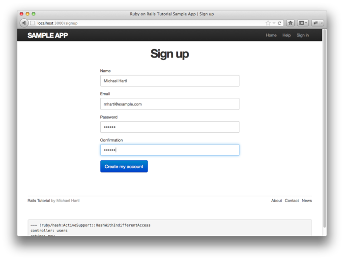

图 7.13：填写了文本字段和密码字段的表单

在 [7.4 节](#sec-7-4)中我们会介绍，之所以可以创建用户，全赖于 `input` 元素的 `name` 属性：


<input id="user_name" name="user[name]" - - - />
.
.
.
<input id="user_password" name="user[password]" - - - />


Rails 会以 `name` 属性的值为键，用户输入的内容为值，构成一个名为 `params` 的 Hash，用来创建用户。另外一个重要的标签是 `form`。我们使用 `@user` 对象来创建 `form`元素，因为每个 Ruby 对象都知道它所属的类（参见 [4.4.1 节](chapter4.html#sec-4-4-1)），所以 Rails 知道 `@user` 所属的类是 `User`；而且，`@user` 代表的是新创建的用户，Rails 知道要使用 `POST` 请求方法，这正是创建新对象所需的 HTTP 请求（参见[旁注 3.2](chapter3.html#box-3-2)）：


<form action="/users" class="new_user" id="new_user" method="post">


先不看 `class` 和 `id` 属性，我们现在关注的是 `action="/users"` 和 `method="post"`。设定这两个属性后，Rails 就会向 /users 地址发送一个 `POST` 请求。接下来的两节会介绍这个请求产生的效果。

<h2 id="sec-7-3">7.3 注册失败</h2>

虽然上一节大概的介绍了图 7.12 中表单的 HTML 结构（参见代码 7.20），不过注册失败时才能更好的理解这个表单的作用。本节，我们会在注册表单中填写一些不合法的数据，提交表单后，页面不会转向其他页面，而是返回“注册”页面，显示一些错误提示信息，页面的构思图如图7.14 所示。

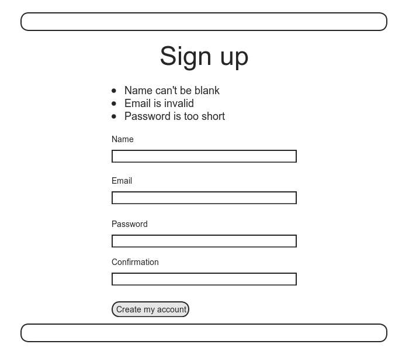

图7.14：注册失败后的页面构思图

<h3 id="sec-7-3-1">7.3.1 可正常使用的表单</h3>

首先，要确保当前的注册表单可以正常使用。我们可以直接在浏览器中提交表单试试，也可以运行提交不合法数据的测试检测：


$ bundle exec rspec spec/requests/user_pages_spec.rb \
-e "signup with invalid information"


回顾一下 [7.1.2 节](#sec-7-1-2)中的内容，在 `routes.rb` 中设置 `resources :users` 之后（参见代码 7.3），Rails 应用程序就可以响应[表格 7.1](#table-7-1)中符合 REST 架构的 URI 地址了。一般来说，发送到 /users 地址的 `POST` 请求是由 `create` 动作处理的。在 `create` 动作中，我们可以调用 `User.new` 方法，使用提交的数据创建一个新用户对象，尝试存入数据库，失败后再重新渲染“注册”页面，允许访客重新填写注册信息。我们先来看一下生成的 `form` 元素：


<form action="/users" class="new_user" id="new_user" method="post">


在 [7.2.3 节](#sec-7-2-3)中介绍过，这个表单会向 /users 地址发送 `POST` 请求。

添加代码 7.21 之后，代码 7.16 中对不合法数据的测试就可以通过了。代码 7.21 中再次调用了 `render` 方法，第一使用时是为了插入局部视图（参见[5.1.3 节](chapter5.html#sec-5-1-3)），不过如你所见，在控制器的动作中也可以使用这个方法。同时，我们也借此代码介绍了 `if-else` 分支结构的用法：根据 `@user.save` 的返回值分别处理用户存储成功和失败这两种情况（存储成功时返回值为 `true`，失败时返回值为 `false`）。

**代码 7.21** 处理存储失败的 `create` 动作（还不能处理存储成功的情况）  `app/controllers/users_controller.rb`


class UsersController < ApplicationController
  .
  .
  .
  def create
    @user = User.new(params[:user])
    if @user.save
      # Handle a successful save.
    else
      render 'new'
    end
  end
end


我们要实际的操作一下，提交一些不合法的注册数据，这样才能更好的理解代码 7.21 的作用，结果如图 7.15 所示，底部完整的调试信息如图 7.16 所示。

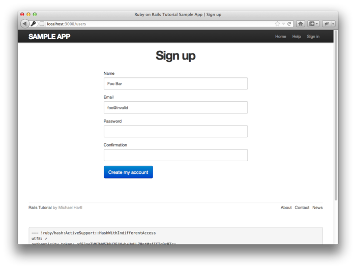

图 7.15：注册失败

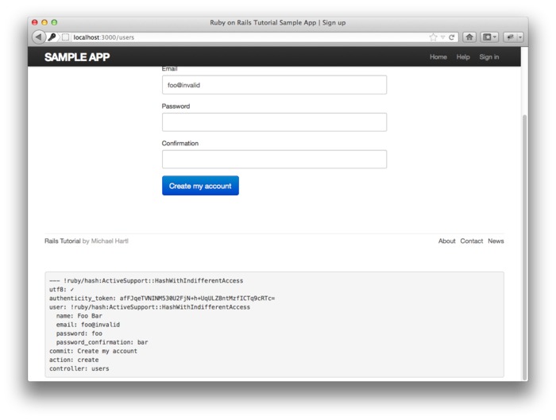

图 7.16：注册失败时的调试信息

下面我们来分析一下调试信息的 `params` Hash，以便对 Rails 处理表单的过程有个更清晰地认识：


---
user:
  name: Foo Bar
  password_confirmation: foo
  password: bar
  email: foo@invalid
commit: Create my account
action: create
controller: users


在 [7.1.2 节](#sec-7-1-2)中就说过，`params` Hash 中包含了每次请求的信息，例如向 /users/1 发送的请求，`params[:id]` 的值就是用户的 id，即 1。提交表单发送 `POST` 请求时，`params` 则是一个嵌套的 Hash。嵌套 Hash 在 [4.3.3 节](chapter4.html#sec-4-3-3)中使用控制台介绍 `params` 时用过。上面的调试信息说明，提交表单后，Rails 会构建一个名为 `user` 的 Hash，其键是 `input` 标签的 `name` 属性值（参见代码 7.17），键对应的值是用户填写的字段文本。例如，


<input id="user_email" name="user[email]" size="30" type="text" />


该字段的 `name` 属性的值是 `user[email]`，它代表的就是 `user` Hash 的 `email` 元素。虽然调试信息中的键是字符串形式，不过在内部，Rails 使用的却是 Symbol 形式。`params[:user]` 这个嵌套的 Hash，实际上就是 `User.new` 方法创建用户所需的参数值。（我们在 [4.4.5 节](chapter4.html#sec-4-4-5)中介绍过 `User.new` 的用法，代码 7.21 再次用到了这个方法。）也就是说，如下的代码


@user = User.new(params[:user])


等同于


@user = User.new(name: "Foo Bar", email: "foo@invalid",
                 password: "foo", password confirmation: "bar")


在 [7.4 节](#sec-7-4)中会介绍，注册成功时也是这样构建 `User.new` 所需参数的。定义 `@user` 变量后，只需调用 `@user.save` 就可以完成整个注册过程了。注册失败时，`@user` 也有它的作用，注意一下图 7.15，其中一些表单字段已经预先填好了，这是因为 `form_for` 使用 `@user` 的属性自动填写了相应的字段。例如，`@user.name` 的值是 `"foo"`，那么


<%= form_for(@user) do |f| %>
  <%= f.label :name %>
  <%= f.text_field :name %>
  .
  .
  .


生成的 HTML 就会是


<form action="/users" class="new_user" id="new_user" method="post">

  <label for="user_name">Name</label> 
  <input id="user_name" name="user[name]" size="30" type="text" value="Foo"/>
  .
  .
  .


`input` 标签的 `value` 属性值为 `"foo"`，所以字段中才会显示有这个文本。

现在表单已经可以正常使用，不会出错了，针对不合法数据的测试也可以通过了：


$ bundle exec rspec spec/requests/user_pages_spec.rb \
-e "signup with invalid information"


译者注：本小节所说的表单“不出错”，是指表单可以正常提交数据了，“错误”当然还是有的，因为我们提交的是不合法的数据，无法创建新用户，表单会提示哪些字段出错了。这也就是下一小节的内容。

<h3 id="sec-7-3-2">7.3.2 注册时的错误提示信息</h3>

注册失败时的错误提示信息虽不强制要求显示，但如果显示，可以提示访客哪里出错了。在 Rails 中，错误提示信息是基于 User 模型的数据验证机制实现的。举个例子，我们试着用不合法的 Email 地址和长度较短的密码创建用户看看会发生什么：


$ rails console
>> user = User.new(name: "Foo Bar", email: "foo@invalid",
?>                 password: "dude", password_confirmation: "dude")
>> user.save
=> false
>> user.errors.full_messages
=> ["Email is invalid", "Password is too short (minimum is 6 characters)"]


如上所示，`errors.full_message` 对象是一个错误信息组成的数组。和上面的控制台对话类似，代码 7.21 中的代码也无法保存用户，会生成一个附属在 `@user` 对象上的错误信息数组。如果要在注册页面显示这些错误，我们需要渲染一个错误信息局部视图，如代码 7.22 所示。

（最好先为这些错误信息编写测试，我们会把这个任务留作练习，详情参见 [7.6 节](#sec-7-6)。）注意，这个局部视图只是暂时使用，我们会在 [10.3.2 节](chapter10.html#sec-10-3-3)中编写最终版本。

**代码 7.22** 在注册表单前显示的错误提示信息  `app/views/users/new.html.erb`


<% provide(:title, 'Sign up') %>
<h1>Sign up</h1>

  

    <%= form_for(@user) do |f| %>
      <%= render 'shared/error_messages' %>
      .
      .
      .
    <% end %>
  



注意，在上面的代码中渲染的局部视图名为 `shared/error_messages`，这里用到了 Rails 的一个约定：如果局部视图要在多个控制器重使用，则把它存放在专门的 `shared` 目录下。（这个约定 [9.1.1 节](chapter9.html#9-1-1)还会再介绍）我们除了要新建 `_error_messages.html.erb` 文件之外，还要新建 `app/views/shared` 文件夹。错误提示信息局部视图的内容如代码 7.23 所示。

**代码 7.23** 显示表单错误提示信息的局部视图  `app/views/shared/_error_messages.html.erb`


<% if @user.errors.any? %>
  

    

      The form contains <%= pluralize(@user.errors.count, "error") %>.
    

    <ul>
    <% @user.errors.full_messages.each do |msg| %>
      <li>* <%= msg %></li>
    <% end %>
    </ul>
  

<% end %>


这个局部视图的代码使用了几个之前没用过的 Rails/Ruby 结构，还有两个新方法。第一个新方法是 `count`，它的返回值是错误信息的数量：


>> user.errors.count
=> 2


第二个新方法是 `any?`，它和 `empty?` 的作用相反：


>> user.errors.empty?
=> false
>> user.errors.any?
=> true


第一次使用 `empty?` 方法是在 [4.2.3 节](chapter4.html#sec-4-2-3)，用在字符串上；从上面的代码可以看出，`empty?` 也可用在 Rails 错误信息对象上，如果对象为空就返回 `true`，否则返回 `false`。`any?` 方法就是取反 `empty?` 的返回值，如果对象中有内容就返回 `true`，没内容则返回 `false`。（顺便说一下，`count`、`empty?` 和 `any?` 都可以用在 Ruby 数组上，在 [10.2 节](chapter10.html#sec-10-2)中会好好地介绍这三个方法。）

还有一个比较新的方法是 `pluralize`，在控制台中默认不可用，不过我们可以引入 `ActionView::Helpers::TextHelper` 模块加载这个方法：[9](#fn-9)


>> include ActionView::Helpers::TextHelper
>> pluralize(1, "error")
=> "1 error"
>> pluralize(5, "error")
=> "5 errors"


如上所示，`pluralize` 方法的第一个参数是整数，返回值是这个数字和第二个参数文本组合在一起正确的单复数形式。`pluralize` 方法是由功能强大的转置器（inflector）实现的，转置器知道怎么处理大多数单词的单复数变换，甚至是一些不规则的变换方式：


>> pluralize(2, "woman")
=> "2 women"
>> pluralize(3, "erratum")
=> "3 errata"


所以，使用 `pluralize` 方法后，如下的代码


<%= pluralize(@user.errors.count, "error") %>


返回值就是 `"0 errors"`、`"1 error"` 或 `"2 errors"`等，单复数形式取决于错误的数量。这样就可以避免类似 `"1 errors"` 这种低级的错误了（这是网络中常见的错误之一）。注意，代码 7.21 中还为一个 `div` 标签指定了 `error_explanation` id，可用来样式化错误提示信息。（在 [5.1.2 节](chapter5.html#sec-5-1-2)中介绍过，CSS 中以 `#` 开头的规则是用来给 id 添加样式的。）出错时，Rails 还会自动把有错误的字段包含在一个 class 为 `field_with_errors` 的 `div` 元素中。我们可以利用这个 id 和 class 为错误提示信息添加样式，所需的 SCSS 如代码 7.24 所示。代码 7.24 中使用 Sass 的 `@extend` 函数引入了 `control-group` 和 `error` 两个样式规则集合。添加样式后，如果提交失败，错误信息和出错的字段就会显示为红色，如图 7.17 所示。错误信息的文本是基于模型数据验证自动生成的，所以如果你修改了验证规则（例如，Email 地址的格式，密码的最小长度），错误信息就会自动变化，符合修改后的规则。

**代码 7.24** 错误提示信息的样式  `app/assets/stylesheets/custom.css.scss`


.
.
.

/* forms */
.
.
.
#error_explanation {
  color: #f00;
  ul {
    list-style: none;
    margin: 0 0 18px 0;
  }
}

.field_with_errors {
  @extend .control-group;
  @extend .error;
 }


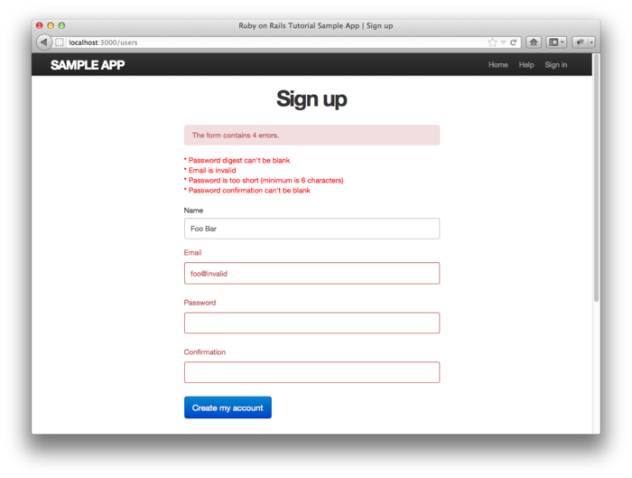

图 7.17：注册失败时显示的错误提示信息

我们可以通过下面的方法模拟代码 7.16 中针对不合法数据的测试过程，来看一下本节编程的效果：在浏览器中，访问“注册”页面，什么也不填，直接点击“Create my account”按钮。结果如图 7.18 所示。既然“注册”页面可以正常使用了，相应的测试也应该可以通过了。


$ bundle exec rspec spec/requests/user_pages_spec.rb \
> -e "signup with invalid information"


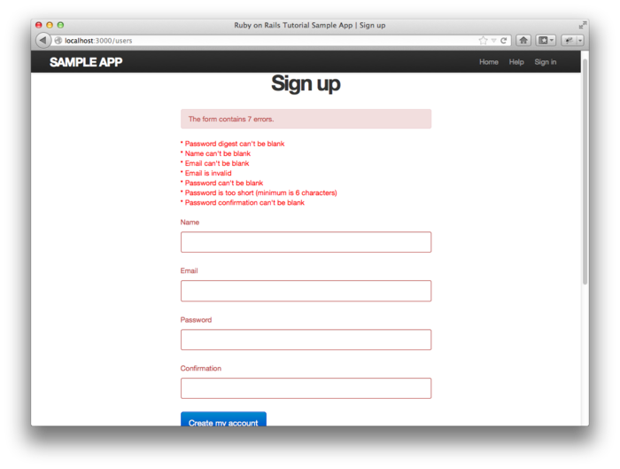

图 7.18：访问“注册”页面后直接点击“Create my account”按钮的效果

不过，图 7.18 中显示的错误提示信息还有一个小瑕疵：未填写密码的提示信息是“Password digest can't be blank”，如果显示“Password can't be blank”就好了。之所以会这么显示，是 `has_secure_password` 方法（[6.3.4 节](chapter6.html#sec-6-3-4)中介绍过）中的数据验证导致的。这个问题会在 [7.6 节](#sec-7-6)的练习中解决。

<h2 id="sec-7-4">7.4 注册成功</h2>

上一节已经处理了提交不合法数据的情况，本节我们要完成注册表单的功能，如果提交的数据合法，就把用户存入数据库。我们先尝试着保存用户，如果保存成功，用户的数据就会存入数据库中，然后网页会转向刚注册用户的资料页面，页面中会显示一个欢迎信息，构思图如图 7.19 所示。如果保存用户失败了，就交由上一节实现的功能处理。

图 7.19：注册成功后显示的页面构思图

<h3 id="sec-7-4-1">7.4.1 完整的注册表单</h3>

要完成注册表单的功能，我们要把代码 7.21 中的注释部分换成相应的处理代码。现在，对提交合法数据的测试还是失败的：


$ bundle exec rspec spec/requests/user_pages_spec.rb \
> -e "signup with valid information"


测试之所以会失败，是因为 Rails 处理动作的默认方式是渲染视图，可是 `create` 动作还没有（也不应该有）对应的视图。相反的，我们要转向其他的页面，最合理的转向页面是刚创建用户的资料页面。检测是否转向正确页面的测试留作练习（参见 [7.6 节](#sec-7-6)），`create` 动作的代码如代码 7.25 所示。

**代码 7.25** `create` 动作的代码，处理了保存和转向操作 `app/controllers/users_controller.rb`


class UsersController < ApplicationController
  .
  .
  .
  def create
    @user = User.new(params[:user])
    if @user.save
      redirect_to @user
    else
      render 'new'
    end
  end
end


注意，转向地址我们直接写了 `@user`，而没用 `user_path`，Rails 会自动转向到用户的资料页面。

加入了代码 7.25 后，注册表单就可以正常使用了，你可以运行测试验证一下：


$ bundle exec rspec spec/


<h3 id="sec-7-4-2">7.4.2 Flash 消息</h3>

验证合法数据是否能够正确提交之钱，我们还要加入一个 Web 应用程序大都会实现的功能：在转向后的页面中显示一个消息（这里我们要显示的是一个欢迎新用户的消息），如果访问了其他页面或者刷新了页面，这个消息便会消失。在 Rails 中这种功能是通过 `flash` 变量实现的，`flash` 就像闪存一样，只是暂时存储数据。`flash` 变量的值其实是一个 Hash，你可能还记得，[4.3.3 节](chapter4.html#sec-4-3-3)中我们在控制台中遍历了一个名为 `flash` 的 Hash：


$ rails console
>> flash = { success: "It worked!", error: "It failed." }
=> {:success=>"It worked!", error: "It failed."}
>> flash.each do |key, value|
?> puts "#{key}"
?> puts "#{value}"
>> end
success
It worked!
error
It failed.


我们可以把显示 Flash 消息的代码加入应用程序的布局，这样整个网站在需要的时候就会显示消息了，如代码 7.26 所示。（代码 7.26 混合了 HTML 和 ERb 代码，有点乱，[7.6 节](#sec-7-6)中的练习会对此进行重构。）

**代码 7.26** 把 `flash` 消息相关的代码加入网站的布局中 `app/views/layouts/application.html.erb`


<!DOCTYPE html>
<html>
  .
  .
  .
  <body>
    <%= render 'layouts/header' %>
    

      <% flash.each do |key, value| %>
        
"><%= value %>

      <% end %>
      <%= yield %>
      <%= render 'layouts/footer' %>
      <%= debug(params) if Rails.env.development? %>
    

    .
    .
    .
  </body>
</html>


代码 7.26 会为每一个 Flash 消息插入一个 `div` 标签，并且把 CSS class 指定为消息的类型。例如，如果 `flash[:success] = "Welcome to the Sample App!"`，那么下面的代码


<% flash.each do |key, value| %>
  
"><%= value %>

<% end %>


生成的 HTML 如下



Welcome to the Sample App!



（注意，键 `:success` 是 Symbol，在插入模板之前，ERb 会自动将其转换成字符串 `"success"`。）我们遍历了所有可能出现的 Flash 消息，这样当消息存在时才能显示。在 [8.1.5 节](chapter8.html#8-1-5) 中会使用 `flash[:error]` 显示登录失败消息。[10](#fn-10)

检测页面中是否显示了正确的 Flash 消息的测试留作练习（参见 [7.6 节](#sec-7-6)）。在 `create` 动作中给 `flash[:success]` 赋值一个欢迎信息后（如代码 7.27 所示），这个测试就可以通过了。

**代码 7.27** 注册成功后显示 Flash 信息 `app/controllers/users_controller.rb`


class UsersController < ApplicationController
  .
  .
  .
  def create
    @user = User.new(params[:user])
    if @user.save
      flash[:success] = "Welcome to the Sample App!"
      redirect_to @user
    else
      render 'new'
    end
  end
end


<h3 id="sec-7-4-3">7.4.3 首次注册</h3>

现在我们可以注册一下看看到目前为止所实现的功能，用户的名字使用“Rails Tutorial”，Email 地址使用“example@railstutorial.org”。注册成功后，页面中显示了一个友好的欢迎信息，信息的样式是由 [5.1.2 节](chapter5.html#sec-5-1-2)中加入的 Bootstrap 框架提供的 `.success` class 实现的，如图 7.20 所示。（如果你无法注册，提示 Email 地址已经使用，请确保你运行了 [7.2 节](#sec-7-2)中的 `rake db:reset` 命令。）然后刷新页面，Flash 消息就会消失了，如图 7.21 所示。

我们还可以检查一下数据库，确保真的创建了新用户：


$ rails console
>> User.find_by_email("example@railstutorial.org")
=> #<User id: 1, name: "Rails Tutorial", email: "example@railstutorial.org",
created at: "2011-12-13 05:51:34", updated at: "2011-12-13 05:51:34",
password digest: "$2a$10$A58/j7wwh3aAffGkMAO9Q.jjh3jshd.6akhDKtchAz/R...">


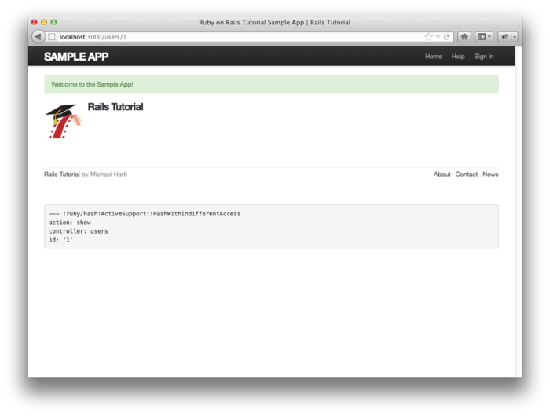

图 7.20：注册成功后显示的页面，页面中有一个 Flash 消息

图 7.21：刷新页面后 Flash 消息就不见了

<h3 id="sec-7-4-4">7.4.4 部署到生产环境，并开启 SSL</h3>

创建了 User 模型、实现了注册功能之后，现在可以把示例程序部署到生产环境中了。（如果你没有按照[第三章](chapter3.html)章头介绍中的内容设置生产环境的话，现在最好回过头去设置一下。）部署的时候我们还会开启对安全套接层（Secure Sockets Layer, SSl）[11](#fn-11)协议的支持，确保注册过程的安全。其实我们会全站都开启 SSL，这样用户的登录（参见[第八章](chapter8.html)）也会很安全了，而且还可以避免会话劫持（session hijacking）的发生（参见 [8.2.2 节](chapter8.html#sec-8-2-2)）。

在部署之前，你应该把本章实现的功能合并到 `master` 分支：


$ git add .
$ git commit -m "Finish user signup"
$ git checkout master
$ git merge sign-up


然后我们要设置一下，强制在生产环境中使用 SSL，这里我们要编辑的文件是 `config/environments/production.rb`，添加的设置如代码 7.28 所示。

**代码 7.28** 设置程序在生产环境中开启 SSL `config/environments/production.rb`


SampleApp::Application.configure do
  .
  .
  .
  # Force all access to the app over SSL, use Strict-Transport-Security,
  # and use secure cookies.
  config.force_ssl = true
  .
  .
  .
end


我们要把这次修改提交到 Git 仓库中，然后再推送到 Heroku，所做的设置才能生效：


$ git commit -a -m "Add SSL in production"
$ git push heroku


然后，我们还要在生产环境中运行数据库迁移，告知 Heroku 我们建立了 User 模型：[12](#fn-12)


$ heroku run rake db:migrate


（执行这个命令后，你可能会得到一些功能废弃的警告提示，现在可以直接忽视这些警告。）

最后一步，我们要在远程服务器上架设 SSL。在生产环境中架设对 SSL 的支持很麻烦，也很容易出错，而且还要为域名购买 SSL 签名证书。幸好，使用 Heroku 提供的二级域名可以直接使用 Heroku 的 SSL 签名证书，这算是 Heroku 平台的一个特性。如果你要为自己的域名（例如 `example.com`）开启 SSL，就无法享受这个便利的服务了，还要自行克服一些设置上的麻烦，具体的步骤在 [Heroku 关于 SSL 的文档](http://devcenter.heroku.com/articles/ssl)中有说明。

以上所有工作得到的最终结果是，在生产服务器上可以正常使用注册表单了，如图 7.22 所示：


$ heroku open


注意，在图 7.22 中，通常显示为 `http://` 的地方现在显示的是 `https://`，就是这个额外的“s”，证明我们正在使用 SSL。

现在你可以打开注册页面注册一个新用户了。如果遇到问题，运行 `heroku logs`，尝试着使用 Heroku 的日志文件排错。

图 7.22：线上正常运作的注册页面

<h2 id="sec-7-5">7.5 小结</h2>

实现注册功能对示例程序来说算是取得了很大的进展。虽然现在还没实现真正有用的功能，不过我们却为后续功能的开发奠定了坚实的基础。[第八章](chapter8.html)，我们会实现用户登录、退出功能，完成整个身份验证机制。[第九章](chapter9.html)，我们会实现更新用户个人信息的功能。我们还会实现管理员删除用户的功能，这样才算是完整的实现了[表格 7.1](#table-7-1) 中所列的用户资源相关的 REST 动作。最后，我们还会在各动作中实现权限验证功能，提升网站的安全。

<h2 id="sec-7-6">7.6 练习</h2>

1. 以代码 7.29 为蓝本，验证一下在 [7.1.4 节](#sec-7-1-4)中定义的 `gravatar_for` 帮助方法是否可以接受名为 `size` 的可选参数，允许在试图中使用类似 `gravatar_for user, size: 40` 这样的形式。
2. 编写测试检测代码 7.22 中实现的错误提示信息。可以参照代码 7.31。
3. 使用代码 7.30 把未填写密码的错误提示信息“Password digest can’t be blank”换成更易看懂的“Password can’t be blank”。（我们利用了 Rails 中对应用程序国际化的支持，而没有做 hack。）注意，为了避免重复显示错误提示信息，你需要把 User 模型中密码的 `presence: true` 验证删除。
4. 采取先编写测试的方式，或者等到程序出错后再补救，验证一下代码 7.32 中的测试可以确保 `create` 动作中保存用户之后顺利的转到了用户资料页面。
5. 我们前面说过，代码 7.26 中 Flash 消息相关的代码有点乱，我们要换用代码 7.33 中的代码，运行测试看一下使用 `content_tag` 帮助方法之后效果是否一样。

**代码 7.29** 重新定义 `gravatar_for` 方法，允许接受可选的 `size` 参数 `app/helpers/users_helper.rb`


module UsersHelper

  # Returns the Gravatar (http://gravatar.com/) for the given user.
  def gravatar_for(user, options = { size: 50 })
    gravatar_id = Digest::MD5::hexdigest(user.email.downcase)
    size = options[:size]
    gravatar_url = "https://secure.gravatar.com/avatars/#{gravatar_id}.png?s=#{size}"
    image_tag(gravatar_url, alt: user.name, class: "gravatar")
  end
end


**代码 7.30** 让未填写密码时显示一个更好的错误提示信息 `config/locales/en.yml`


en:
  activerecord:
    attributes:
      user:
        password digest: "Password"


**代码 7.31** 错误提示信息测试的参考 `spec/requests/user_pages_spec.rb`


  .
  .
  .
  describe "signup" do
    before { visit signup_path }
    .
    .
    .
    describe "with invalid information" do
      .
      .
      .
      describe "after submission" do
        before { click_button submit }

        it { should have_selector('title', text: 'Sign up') }
        it { should have_content('error') }
      end
      .
      .
      .


**代码 7.32** 对 `create` 动作中保存用户操作的测试 `spec/requests/user_pages_spec.rb`


    .
    .
    .
    describe "with valid information" do
      .
      .
      .
      describe "after saving the user" do
        before { click_button submit }
        let(:user) { User.find_by_email('user@example.com') }

        it { should have_selector('title', text: user.name) }
        it { should have_selector('div.alert.alert-success', text: 'Welcome') }
      end
      .
      .
      .


**代码 7.33** 使用 `content_for` 编写的 Flash 消息视图代码 `app/views/layouts/application.html.erb`


<!DOCTYPE html>
  <html>
  .
  .
  .
  <% flash.each do |key, value| %>
    <%= content_tag(:div, value, class: "alert alert-#{key}") %>
  <% end %>
  .
  .
  .
</html>


  <a class="prev_page" href="chapter6.html">&laquo; 第六章 用户模型</a>
  <a class="next_page" href="chapter8.html">第八章 登录和退出 &raquo;</a>

1. [Mockingbird](http://gomockingbird.com/) 不支持插入额外的图片，图 7.1 中的图片是我使用 [Adobe Fireworks](http://www.adobe.com/products/fireworks/) 加上的。
2. 图中的河马原图在此 <http://www.flickr.com/photos/43803060@N00/24308857/>
3. Rails 的调试信息是 [YAML](http://www.yaml.org/)（YAML Ain’t Markup Language）格式的，这种格式对机器和人类都很友好。
4. 你还可以自己定义其他的环境，详细方法可以参照 Railscasts 的《[Adding an Environment](http://railscasts.com/episodes/72-adding-an-environment)》。
5. 这句话的意思是，路由已经设置好了，但相应的页面还无法正常访问。例如，/users/1/edit 已经映射到 Users 控制器的 `edit` 动作上了，但是 `edit` 动作还不存在，所以访问这个地址就会显示一个错误页面。
6. 在印度教中，avatar 是神的化身，可以是一个人，也可以是一种动物。由此引申到其他领域，特别是在虚拟世界中，avatar 就代表一个人。你可能看过《[阿凡达](http://movie.douban.com/subject/1652587/)》这部电影了，所以你可能也已经知道 avatar 的意思了。
7. 如果你的应用程序需要处理图片及其他文件的上传，我推荐你使用 [Paperclip](http://github.com/thoughtbot/paperclip) 这个 gem。
8. 有点搞不懂是吧，其实我也不知道原因。
9. 我之所以知道要引入 `ActionView::Helpers::TextHelper` 模块，是因为我在 [Rails API](http://api.rubyonrails.org/v3.2.0/classes/ActionView/Helpers/TextHelper.html#method-i-pluralize) 中查了 `pluralize` 的文档。
10. 其实我们真正想用的是 `flash.now`，`flash` 和 `flash.now` 之间还是有细微差别的，后续会介绍。
11. 严格来说，SSL 现在的称呼是 TLS（Transport Layer Security，安全传输层协议），不过人们已经习惯了 SSL 这个名字。
12. 想把 Heroku 当做实际生产环境的读者可能会对 [Kumade](https://github.com/thoughtbot/kumade) 感兴趣，这个 gem 可以自动处理数据库迁移等操作。
