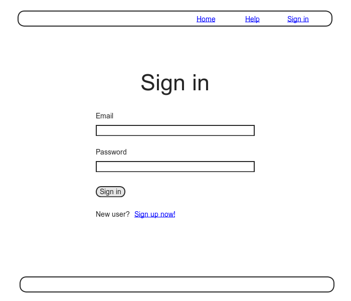
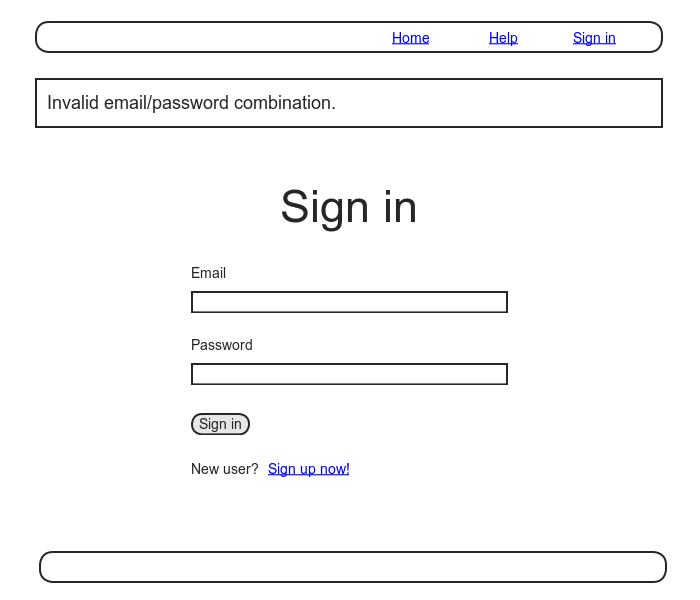
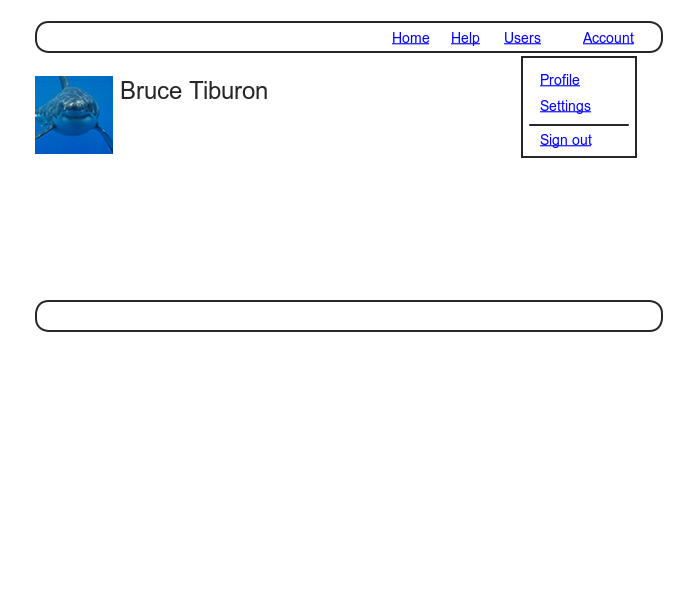
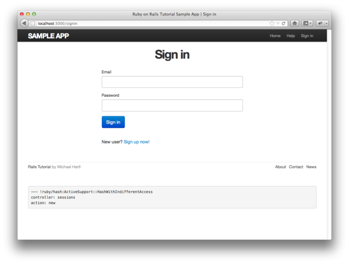
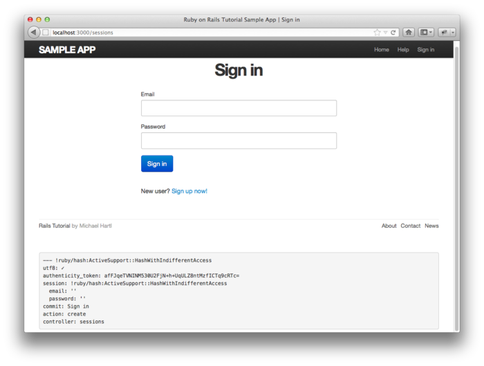
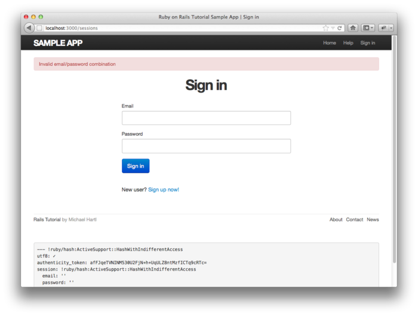
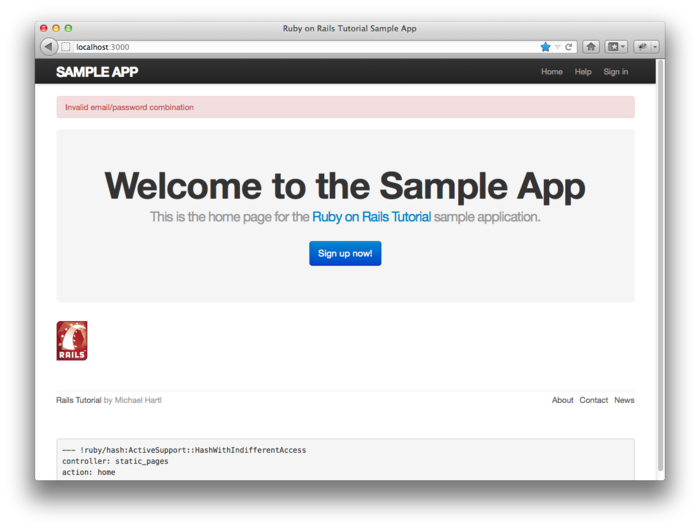
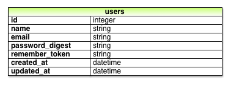
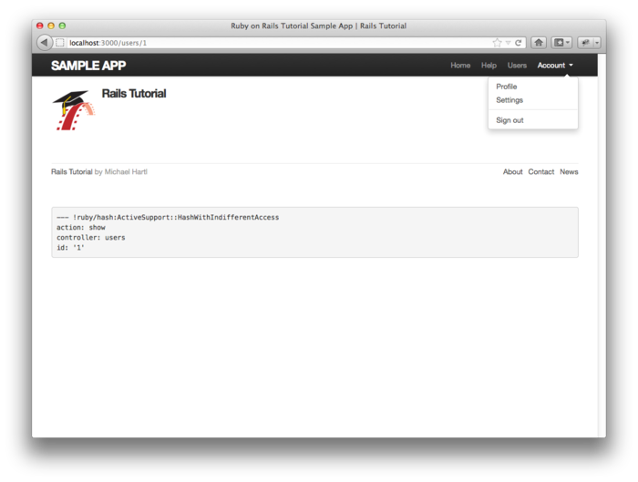
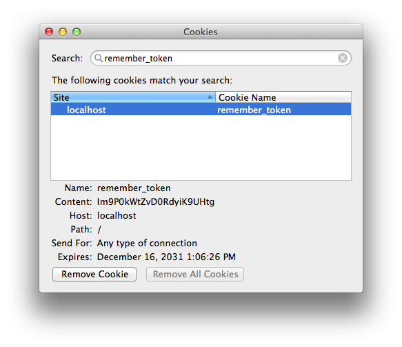

[第七章](chapter7.html)已经实现了注册新用户的功能，本章我们要为已注册的用户提供登录和退出功能。实现登录功能之后，就可以根据登录状态和当前用户的身份定制网站的内容了。例如，本章我们会更新网站的头部，显示“登录”或“退出”链接，以及到个人资料页面的链接；在第十章中，会根据当前登录用户的 id 创建关联到这个用户的微博；在第十一章，我们会实现当前登录用户关注其他用户的功能，实现之后，在首页就可以显示被关注用户发表的微博了。

实现登录功能之后，还可以实现一种安全机制，即根据用户的身份限制可以访问的页面，例如，在[第九章](chapter9.html)中会介绍如何实现只有登录后才能访问编辑用户资料的页面。登录系统还可以赋予管理员级别的用户特别的权限，例如删除用户（也会在[第九章](chapter9.html)中实现）等。

实现验证系统的核心功能之后，我们会简要的介绍一下 Cucumber 这个流行的行为驱动开发（Behavior-driven Development, BDD）系统，使用 Cucumber 重新实现之前的一些 RSpec 集成测试，看一下这两种方式有何不同。

和之前的章节一样，我们会在一个新的从分支中工作，本章结束后再将其合并到主分支中：

```sh
$ git checkout -b sign-in-out
```

<h2 id="sec-8-1">8.1 session 和登录失败</h2>

[session](http://en.wikipedia.org/wiki/Session_(computer_science\)) 是两个电脑（例如运行有网页浏览器的客户端电脑和运行 Rails 的服务器）之间的半永久性连接，我们就是利用它来实现登录过程中常见问题的。网络中常见的 session 处理方式有好几种：可以在用户关闭浏览器后清除 session；也可以提供一个“记住我”单选框让用户选择持久性的 session，直到用户退出后 session 才会失效。<sup>[1](#fn-1)</sup> 在示例程序中我们选择使用第二中处理方式，即用户登录后，会永久的记住登录状态，直到用户点击“退出”链接之后才清除 session。（在 [8.2.1 节](#sec-8-2-1)中会介绍“永久”到底有多久。）

很显然，我们可以把 session 视作一个符合 REST 架构的资源，在登录页面中准备一个新的 session，登录后创建这个 session，退出则会销毁 session。不过 session 和 Users 资源有所不同，Users 资源使用数据库（通过 User 模型）持久的存储数据，而 Sessions 资源是利用 [cookie](http://en.wikipedia.org/wiki/HTTP_cookie) 来存储数据的。cookie 是存储在浏览器中的少量文本。实现登录功能基本上就是在实现基于 cookie 的验证机制。在本节及接下来的一节中，我们会构建 Sessions 控制器，创建登录表单，还会实现控制器中相关的动作。在 [8.2 节](#sec-8-2)中会加入处理 cookie 所需的代码。

<h3 id="sec-8-1-1">8.1.1 Sessions 控制器</h3>

登录和退出功能其实是由 Sessions 控制器中相应的动作处理的，登录表单在 `new` 动作中处理（本节的内容），登录的过程就是向 `create` 动作发送 `POST` 请求（[8.1 节](#sec-8-1)和 [8.2 节](#sec-8-2)），退出则是向 `destroy` 动作发送 `DELETE` 请求（[8.2.6 节](#sec-8-2-6)）。（HTTP 请求和 REST 动作之间的对应关系可以参看[表格 7.1](chapter7.html#sec-7-1)。）首先，我们要生成 Sessions 控制器，以及验证系统所需的集成测试：

```sh
$ rails generate controller Sessions --no-test-framework
$ rails generate integration_test authentication_pages
```

参照 [7.2 节](chapter7.html#sec-7-2)中的“注册”页面，我们要创建一个登录表单生成新的 session。注册表单的构思图如图 8.1 所示。

“登录”页面的地址由 `singin_path`（稍后定义）获取，和之前一样，我们要先编写适量的测试，如代码 8.1 所示。（可以和代码 7.6 中对“注册”页面的测试比较一下。）



图 8.1：注册表单的构思图

**代码 8.1** 对 `new` 动作和对应视图的测试<br />`spec/requests/authentication_pages_spec.rb`

```ruby
require 'spec_helper'

describe "Authentication" do

  subject { page }

  describe "signin page" do
    before { visit signin_path }

    it { should have_selector('h1',    text: 'Sign in') }
    it { should have_selector('title', text: 'Sign in') }
  end
end
```

现在测试是失败的：

```sh
$ bundle exec rspec spec/
```

要让代码 8.1 中的测试通过，首先，我们要为 Sessions 资源设置路由，还要修改“登录”页面具名路由的名称，将其映射到 Sessions 控制器的 `new` 动作上。和 Users 资源一样，我们可以使用 `resources` 方法设置标准的 REST 动作：

```ruby
resources :sessions, only: [:new, :create, :destroy]
```

因为我们没必要显示或编辑 session，所以我们对动作的类型做了限制，为 `resources` 方法指定了 `:only` 选项，只创建 `new`、`create` 和 `destroy` 动作。最终的结果，包括登录和退出具名路由的设定，如代码 8.2 所示。

**代码 8.2** 设置 session 相关的路由<br />`config/routes.rb`

```ruby
SampleApp::Application.routes.draw do
  resources :users
  resources :sessions, only: [:new, :create, :destroy]

  match '/signup', to: 'users#new'
  match '/signin', to: 'sessions#new'
  match '/signout', to: 'sessions#destroy', via: :delete
  .
  .
  .
end
```

注意，设置退出路由那行使用了 `via :delete`，这个参数指明 `destroy` 动作要使用 `DELETE` 请求。

代码 8.2 中的路由设置会生成类似[表格 7.1](chapter7.html#table-7-1) 所示的URI 地址和动作的对应关系，如[表格 8.1](#table-8-1) 所示。注意，我们修改了登录和退出具名路由，而创建 session 的路由还是使用默认值。

为了让代码 8.1 中的测试通过，我们还要在 Sessions 控制器中加入 `new` 动作，相应的代码如代码 8.3 所示（同时也定义了 `create` 和 `destroy` 动作）。

<table id="table-8-1" class="tabular">
  <tbody>
    <tr>
      <th class="align_left"><strong>HTTP 请求</strong></th>
      <th class="align_left"><strong>URI 地址</strong></th>
      <th class="align_left"><strong>具名路由</strong></th>
      <th class="align_left"><strong>动作</strong></th>
      <th class="align_left"><strong>目的</strong></th>
    </tr>
    <tr class="top_bar">
      <td class="align_left"><tt>GET</tt></td>
      <td class="align_left">/signin</td>
      <td class="align_left"><code>signin_path</code></td>
      <td class="align_left"><code>new</code></td>
      <td class="align_left">创建新 session 的页面（登录）</td>
    </tr>
    <tr>
      <td class="align_left"><tt>POST</tt></td>
      <td class="align_left">/sessions</td>
      <td class="align_left"><code>sessions_path</code></td>
      <td class="align_left"><code>create</code></td>
      <td class="align_left">创建 session</td>
    </tr>
    <tr>
      <td class="align_left"><tt>DELETE</tt></td>
      <td class="align_left">/signout</td>
      <td class="align_left"><code>signout_path</code></td>
      <td class="align_left"><code>destroy</code></td>
      <td class="align_left">删除 session（退出）</td>
    </tr>
  </tbody>
</table>

表格 8.1：代码 8.2 中的设置生成的符合 REST 架构的路由关系

**代码 8.3** 没什么内容的 Sessions 控制器<br />`app/controllers/sessions_controller.rb`

```ruby
class SessionsController < ApplicationController
  def new
  end

  def create
  end

  def destroy
  end
end
```

接下来还要创建“登录”页面的视图，因为“登录”页面的目的是创建新 session，所以创建的视图位于 `app/views/sessions/new.html.erb`。在视图中我们要显示网页的标题和一个一级标头，如代码 8.4 所示。

**代码 8.4** “登录”页面的视图<br />`app/views/sessions/new.html.erb`

```erb
<% provide(:title, "Sign in") %>
<h1>Sign in</h1>
```

现在代码 8.1 中的测试应该可以通过了，接下来我们要编写登录表单的结构。

```sh
$ bundle exec rspec spec/
```

<h3 id="sec-8-1-2">8.1.2 测试登录功能</h3>

对比图 8.1 和图 7.11 之后，我们发现登录表单和注册表单外观上差不过，只是少了两个字段，只有 Email 地址和密码字段。和注册表单一样，我们可以使用 Capybara 填写表单再点击按钮进行测试。

在测试的过程中，我们不得不向程序中加入相应的功能，这也正式 TDD 带来的好处之一。我们先来测试填写不合法数据的登录过程，构思图如图 8.2 所示。



图 8.2：注册失败页面的构思图

从图 8.2 我们可以看出，如果提交的数据不正确，我们会重新渲染“注册”页面，还切会显示一个错误提示消息。这个错误提示是 Flash 消息，我们可以通过下面的测试验证：

```ruby
it { should have selector('div.alert.alert-error', text: 'Invalid') }
```

（在[第七章](chapter7.html)练习中的代码 7.32 中出现过类似的代码。）我们要查找的元素是：

```text
div.alert.alert-error
```

我们之前介绍过，这里的点号代表 CSS 中的 class（参见 [5.1.2 节](chapter5.html#sec-5-1-2)），你也许猜到了，这里我们要查找的是同时具有 `alert` 和 `alert-error` class 的 `div` 元素。而且我们还检测了错误提示消息中是否包含了 `"Invalid"` 这个词。所以，上述的测试代码是检测下面是否有下面这种元素的：

```html
<div class="alert alert-error">Invalid...</div>
```

代码 8.5 显示的是包含了测试标题和测试 Flash 消息的测试代码。我们可以看出，这些代码缺少了一个很重要的部分，会在 [8.1.5 节](#sec-8-1-5)中说明。

**代码 8.5** 登录失败时的测试<br />`spec/requests/authentication_pages_spec.rb`

```ruby
require 'spec_helper'

describe "Authentication" do
  .
  .
  .
  describe "signin" do
    before { visit signin_path }

    describe "with invalid information" do
      before { click_button "Sign in" }

      it { should have_selector('title', text: 'Sign in') }
      it { should have_selector('div.alert.alert-error', text: 'Invalid') }
    end
  end
end
```

测试了登录失败的情况，下面我们要测试登录成功的情况了。我们要测试登录成功后是否转向了用户资料页面（从页面的标题判断，标题中应该包含用户的名字），还要测试网站的导航中是否有以下三个变化：

1. 出现了指向用户资料页面的链接
2. 出现了“退出”链接
3. “登录”链接消失了

（对“设置（Settings）”链接的测试会在 [9.1 节](chapter9.html#9-1)中实现，对“所有用户（Users）”链接的测试会在 [9.3 节](chapter9.html#sec-9-3)中实现。）如上变化的构思图如图 8.3 所示。<sup>[2](#fn-2)</sup>注意，退出和个人资料链接出现在“账户（Account）”下拉菜单中。在 [8.2.4 节](#sec-8-2-4)中会介绍如何通过 Bootstrap 实现这种下拉菜单。



图 8.3：登录成功后显示的用户资料页面构思图

对登录成功时的测试代码如代码 8.6 所示。

**代码 8.6** 登录成功时的测试<br />`spec/requests/authentication_pages_spec.rb`

```ruby
require 'spec_helper'

describe "Authentication" do
  .
  .
  .
  describe "signin" do
    before { visit signin_path }
    .
    .
    .
    describe "with valid information" do
      let(:user) { FactoryGirl.create(:user) }
      before do
       fill_in "Email", with: user.email
       fill_in "Password", with: user.password
       click_button "Sign in"
      end

      it { should have_selector('title', text: user.name) }
      it { should have_link('Profile', href: user_path(user)) }
      it { should have_link('Sign out', href: signout_path) }
      it { should_not have_link('Sign in', href: signin_path) }
    end
  end
end
```

在上面的代码中用到了 `have_link` 方法，它的第一参数是链接的文本，第二个参数是可选的 `:href`，指定链接的地址，因此如下的代码

```ruby
it { should have_link('Profile', href: user_path(user)) }
```

确保了页面中有一个 `a` 元素，链接到指定的 URI 地址。这里我们要检测的是一个指向用户资料页面的链接。

<h3 id="sec-8-1-3">8.1.3 登录表单</h3>

写完测试之后，我们就可以创建登录表单了。在代码 7.17 中，注册表单使用了 `form_for` 帮助函数，并指定其参数为 `@user` 变量：

```erb
<%= form_for(@user) do |f| %>
.
.
.
<% end %>
```

注册表单和登录表单的区别在于，程序中没有 Session 模型，因此也就没有和 `@user` 类似的变量。也就是说，在构建登录表单时，我们要给 `form_for` 提供更多的信息。一般来说，如下的代码

```erb
form_for(@user)
```

Rails 会自动向 /users 地址发送 `POST` 请求。对于登录表单，我们则要明确的指定资源的名称已经相应的 URI 地址：

```erb
form_for(:session, url: sessions_path)
```

（第二种方法是，不用 `form_for`，而用 `form_tag`。`form_tag` 也是 Rails 程序常用的方法，不过换用 `form_tag` 之后就和注册表单有很多不同之处了，我现在是想使用相似的代码构建登录表单。使用 `form_tag` 构建登录表单会留作练习（参见 [8.5 节](#sec-8-5)）。）

使用上述这种 `form_for` 形式，我们可以参照代码 7.17 中的注册表单，很容易的就能编写一个符合图 8.1 的登录表单，如代码 8.7 所示。

**代码 8.7** 注册表单的代码<br />`app/views/sessions/new.html.erb`

```erb
<% provide(:title, "Sign in") %>
<h1>Sign in</h1>

<div class="row">
  <div class="span6 offset3">
    <%= form_for(:session, url: sessions_path) do |f| %>

      <%= f.label :email %>
      <%= f.text_field :email %>

      <%= f.label :password %>
      <%= f.password_field :password %>

      <%= f.submit "Sign in", class: "btn btn-large btn-primary" %>
    <% end %>

    <p>New user? <%= link_to "Sign up now!", signup_path %></p>
  </div>
</div>
```

注意，为了访客的便利，我们还加入了到“注册”页面的链接。代码 8.7 中的登录表单效果如图 8.4 所示。



图 8.4：登录表单（[/signup](http://localhost:3000/signin)）

时间久了你就不会老是查看 Rails 生成的 HTML（你会完全信任所用的帮助函数可以正确的完成任务），不过现在还是来看一下登录表单的 HTML 吧（如代码 8.8 所示）。

**代码 8.8** 代码 8.7 中登录表单生成的 HTML

```html
<form accept-charset="UTF-8" action="/sessions" method="post">
  <div>
    <label for="session_email">Email</label>
    <input id="session_email" name="session[email]" size="30" type="text" />
  </div>
  <div>
    <label for="session_password">Password</label>
    <input id="session_password" name="session[password]" size="30"
           type="password" />
  </div>
  <input class="btn btn-large btn-primary" name="commit" type="submit"
         value="Sign in" />
</form>
```

你可以对比一下代码 8.8 和代码 7.20。你可能已经猜到了，提交登录表单后会生成一个 `params` Hash，其中 `params[:session][:email]` 和 `params[:session][:password]` 分别对应了 Email 和密码字段。

<h3 id="sec-8-1-4">8.1.4 分析表单提交</h3>

和创建用户类似，创建 session 时先要处理提交不合法数据的情况。我们已经编写了对提交不合法数据的测试（参见代码 8.5），也添加了有几处难理解但还算简单的代码让测试通过了。下面我们就来分析一下表单提交的过程，然后为登录失败添加失败提示信息（如图 8.2）。然后，以此为基础，验证提交的 Email 和密码，处理登录成功的情况（参见 [8.2 节](#sec-8-2)）。

首先，我们来编写 Sessions 控制器的 `create` 动作，如代码 8.9 所示，现在只是直接渲染登录页面。在浏览器中访问 /sessions/new，然后提交空表单，显示的页面如图 8.5 所示。



图 8.5：代码 8.9 中的 `create` 动作显示的登录失败后的页面

**代码 8.9** Sessions 控制器中 `create` 动作的初始版本<br />`app/controllers/sessions_controller.rb`

```ruby
class SessionsController < ApplicationController
  .
  .
  .
  def create
    render 'new'
  end
  .
  .
  .
end
```

仔细的查看一下图 8.5 中显示的调试信息，你会发现，如在 [8.1.3 节](#sec-8-1-3)末尾说过的，表单提交后会生成 `params` Hash，Email 和密码都至于 `:session` 键之中：

```yaml
---
session:
  email: ''
  password: ''
commit: Sign in
action: create
controller: sessions
```

和注册表单类似，这些参数是一个嵌套的 Hash，在代码 4.6 中见过。`params` 包含了如下的嵌套 Hash：

```ruby
{ session: { password: "", email: "" } }
```

也就是说

```ruby
params[:session]
```

本身就是一个 Hash：

```ruby
{ password: "", email: "" }
```

所以，

```ruby
params[:session][:email]
```

就是提交的 Email 地址，而

```ruby
params[:session][:password]
```

就是提交的密码。

也就是说，在 `create` 动作中，`params` 包含了使用 Email 和密码验证用户身份所需的全部数据。幸运的是，我们已经定义了身份验证过程中所需的两个方法，即由 Active Record 提供的 `User.find_by_email`（参见 [6.1.4 节](chapter6.html#sec-6-1-4)），以及由 `has_secure_password` 提供的 `authenticate` 方法（参见 [6.3.3 节](chapter6.html#sec-6-3-3)）。我们之前介绍过，如果提交的数据不合法，`authenticate` 方法会返回 `false`。基于以上的分析，我们计划按照如下的方式实现用户登录功能：

```ruby
def create
  user = User.find_by_email(params[:session][:email])
  if user && user.authenticate(params[:session][:password])
    # Sign the user in and redirect to the user's show page.
  else
    # Create an error message and re-render the signin form.
  end
end
```

`create` 动作的第一行，使用提交的 Email 地址从数据库中取出相应的用户。第二行是 Ruby 中经常使用的语句形式：

```ruby
user && user.authenticate(params[:session][:password])
```

我们使用 `&&`（逻辑与）检测获取的用户是否合法。因为除了 `nil` 和 `false` 之外的所有对象都被视作 `true`，上面这个语句可能出现的结果如[表格 8.2](#table-8-2)所示。我们可以从表格 8.2 中看出，当且仅当数据库中存在提交的 Email 和提交了对应的密码时，这个语句才会返回 `true`。

<table id="table-8-2" class="tabular">
  <tbody>
    <tr>
      <th class="align_left"><strong>用户</strong></th>
      <th class="align_left"><strong>密码</strong></th>
      <th class="align_left"><strong>a &amp;&amp; b</strong></th>
    </tr>
    <tr class="top_bar">
      <td class="align_left">不存在</td>
      <td class="align_left"><em>任意值</em></td>
      <td class="align_left"><code>nil &amp;&amp; [anything] == false</code></td>
    </tr>
    <tr>
      <td class="align_left">存在</td>
      <td class="align_left">错误的密码</td>
      <td class="align_left"><code>true &amp;&amp; false == false</code></td>
    </tr>
    <tr>
      <td class="align_left">存在</td>
      <td class="align_left">正确的密码</td>
      <td class="align_left"><code>true &amp;&amp; true == true</code></td>
    </tr>
  </tbody>
</table>

表格 8.2：`user && user.authenticate(...)` 可能出现的结果

<h3 id="sec-8-1-5">8.1.5 显示 Flash 消息</h3>

在 [7.3.2 节](chapter7.html#sec-7-3-2)中，我们使用 User 模型的数据验证信息来显示注册失败时的提示信息。这些错误提示信息是关联在某个 Active Record 对象上的，不过这种方式不可以用在 session 上，因为 session 不是 Active Record 模型。我们要采取的方法是，在登录失败时，把错误提示信息赋值给 Flash 消息。代码 8.10 显示的是我们首次尝试实现这种方法所用的代码，其中有个小小的错误。

**代码 8.10** 尝试处理登录失败（有个小小的错误）<br />`app/controllers/sessions_controller.rb`

```ruby
class SessionsController < ApplicationController

  def new
  end

  def create
    user = User.find_by_email(params[:session][:email])
    if user && user.authenticate(params[:session][:password])
      # Sign the user in and redirect to the user's show page.
    else
      flash[:error] = 'Invalid email/password combination' # Not quite right!
      render 'new'
    end
  end

  def destroy
  end
end
```

布局中已经加入了显示 Flash 消息的局部视图，所以无需其他修改，上述 Flash 错误提示消息就会显示出来，而且因为使用了 Bootstrap，这个错误消息的样式也很美观（如图 8.6）。



图 8.6：登录失败后显示的 Flash 消息

不过，就像代码 8.10 中的注释所说，这些代码还有问题。显示的页面开起来很正常啊，那么，问题出现在哪儿呢？问题的关键在于，Flash 消息在一个请求的生命周期内是持续存在的，而重新渲染页面（使用 `render` 方法）和代码 7.27 中的转向不同，它不算新的请求，我们会发现这个 Flash 消息存在的时间比设想的要长很多。例如，我们提交了不合法的登录信息，Flash 消息生成了，然后在注册页面中显示出来（如图 8.6），这时如果我们点击链接转到其他页面（例如“首页”），这就算是表单提交后的第一次请求，所以页面中还是会显示这个 Flash 消息（如图 8.7）。



图 8.7：仍然显示有 Flash 消息的页面

Flash 消息没有按预期消失算是程序的一个 bug，在修正之前，我们最好编写一个测试来捕获这个错误。现在，登录失败时的测试是可以通过的：

```sh
$ bundle exec rspec spec/requests/authentication_pages_spec.rb \
> -e "signin with invalid information"
```

不过有错误的程序测试应该是失败的，所以我们要编写一个能够捕获这种错误的测试。幸好，捕获这种错误正是集成测试的拿手好戏，相应的代码如下：

```ruby
describe "after visiting another page" do
  before { click_link "Home" }
  it { should_not have_selector('div.alert.alert-error') }
end
```

提交不合法的登录信息之后，这个测试用例会点击网站中的“首页”链接，期望显示的页面中没有 Flash 错误消息。添加上述测试用例的测试文件如代码 8.11 所示。

**代码 8.11** 登录失败时的合理测试<br />`spec/requests/authentication_pages_spec.rb`

```ruby
require 'spec_helper'

describe "Authentication" do
  .
  .
  .
  describe "signin" do
    before { visit signin_path }

    describe "with invalid information" do
      before { click_button "Sign in" }

      it { should have_selector('title', text: 'Sign in') }
      it { should have_selector('div.alert.alert-error', text: 'Invalid') }

      describe "after visiting another page" do
        before { click_link "Home" }
        it { should_not have_selector('div.alert.alert-error') }
      end
    end
    .
    .
    .
  end
end
```

新添加的测试和预期一致，是失败的：

```sh
$ bundle exec rspec spec/requests/authentication_pages_spec.rb \
> -e "signin with invalid information"
```

要让这个测试通过，我们要用 `flash.now` 替换 `flash`。`flash.now` 就是专门用来在重新渲染的页面中显示 Flash 消息的，在发送新的请求之后，Flash 消息便会消失。正确的 `create` 动作代码如代码 8.12 所示。

**代码 8.12** 处理登录失败所需的正确代码<br />`app/controllers/sessions_controller.rb`

```ruby
class SessionsController < ApplicationController

  def new
  end

  def create
    user = User.find_by_email(params[:session][:email])
    if user && user.authenticate(params[:session][:password])
      # Sign the user in and redirect to the user's show page.
    else
      flash.now[:error] = 'Invalid email/password combination'
      render 'new'
    end
  end

  def destroy
  end
end
```

现在登录失败时的所有测试应该都可以通过了：

```sh
$ bundle exec rspec spec/requests/authentication_pages_spec.rb \
> -e "with invalid information"
```

<h2 id="sec-8-2">8.2 登录成功</h2>

上一节处理了登录失败的情况，这一节我们要处理登录成功的情况了。实现用户登录的过程是本书目前为止最考验 Ruby 编程能力的部分，所以你要坚持读完本节，最好准备，付出大量的脑力劳动。幸好，第一步还算是简单的，完成 Sessions 控制器的 `create` 动作没什么难的，不过还是需要一点小技巧。

我们需要把代码 8.12 中处理登录成功分支中的注释换成具体的代码，我们要使用 `sign_in` 方法实现登录操作，然后转向到用户的资料页面，所需的代码如代码 8.13 所示。这就是我们使用的技巧，使用还没定义的方法 `sign_in`。本节后面的内容会定义这个方法。

**代码 8.13** 完整的 `create` 动作代码（还不能正常使用）<br />`app/controllers/sessions_controller.rb`

```ruby
class SessionsController < ApplicationController
  .
  .
  .
  def create
    user = User.find_by_email(params[:session][:email])
    if user && user.authenticate(params[:session][:password])
      sign_in user
      redirect_to user
    else
      flash.now[:error] = 'Invalid email/password combination'
      render 'new'
    end
  end
  .
  .
  .
end
```

<h3 id="sec-8-2-1">8.2.1 “记住我”</h3>

现在我们要开始实现登录功能了，第一步是实现“记住我”这个功能，即用户登录的状态会被“永远”记住，直到用户点击“退出”链接为止。实现登录功能用到的函数已经超越了传统的 MVC 架构，其中一些函数要同时在控制器和视图中使用。在[4.2.5 节](chapter4.html#sec-4-2-5)中介绍过，Ruby 支持模块（module）功能，打包一系列函数，在不同的地方引入。我们会利用模块来打包用户身份验证相关的函数。我们当然可以创建一个新的模块，不过 Sessions 控制器已经提供了一个名为 `SessionsHelper` 的模块，而且这个模块中的帮助方法会自动引入 Rails 程序的视图中。所以，我们就直接使用这个现成的模块，然后在 Application 控制器中引入，如代码 8.14 所示。

**代码 8.14** 在 Application 控制器中引入 Sessions 控制器的帮助方法模块<br />`app/controllers/application_controller.rb`

```ruby
class ApplicationController < ActionController::Base
  protect_from_forgery
  include SessionsHelper
end
```

默认情况下帮助函数只可以在视图中使用，不能在控制器中使用，而我们需要同时在控制器和视图中使用帮助函数，所以我们就手动引入帮助函数所在的模块。

因为 HTTP 是无状态的协议，所以如果应用程序需要实现登录功能的话，就要找到一种方法记住用户的状态。维持用户登录状态的方法之一，是使用常规的 Rails session（通过 `session` 函数），把用户的 id 保存在“记忆权标（remember token）”中：

```ruby
session[:remember_token] = user.id
```

`session` 对象把用户 id 存在浏览器的 cookie 中，这样网站的所有页面就都可以获取到了。浏览器关闭后，cookie 也随之失效。在网站中的任何页面，只需调用 `User.find(session[:remember_token])` 就可以取回用户对象了。Rails 在处理 session 时，会确保安全性。倘若用户企图伪造用户 id，Rails 可以通过每个 session 的 session id 检测到。

根据示例程序的设计目标，我们计划要实现的是持久保存的 session，也就是即使浏览器关闭了，登录状态依旧存在，所以，登入的用户要有一个持久保存的标识符才行。为此，我们要为每个用户生成一个唯一而安全的记忆权标，长期存储，不会随着浏览器的关闭而消失。

记忆权标要附属到特定的用户对象上，而且要保存起来以待后用，所以我们就可以把它设为 User 模型的属性（如图 8.8）。我们先来编写 User 模型的测试，如代码 8.15 所示。



图 8.8：User 模型，添加了 `remember_token` 属性

**代码 8.15** 记忆权标的第一个测试<br />`spec/models/user_spec.rb`

```ruby
require 'spec_helper'

describe User do
  .
  .
  .
  it { should respond_to(:password_confirmation) }
  it { should respond_to(:remember_token) }
  it { should respond_to(:authenticate) }
  .
  .
  .
end
```

要让这个测试通过，我们要生成记忆权标属性，执行如下命令：

```sh
$ rails generate migration add_remember_token_to_users
```

然后按照代码 8.16 修改生成的迁移文件。注意，因为我们要使用记忆权标取回用户，所以我们为 `remember_token` 列加了索引（参见 [旁注 6.2](chapter6.html#box-6-2)）。

**代码 8.16** 为 `users` 表添加 `remember_token` 列的迁移<br />`db/migrate/[timestamp]_add_remember_token_to_users.rb`

```ruby
class AddRememberTokenToUsers < ActiveRecord::Migration
  def change
    add_column :users, :remember_token, :string
    add_index :users, :remember_token
  end
end
```

然后，还要更新开发数据据和测试数据库：

```sh
$ bundle exec rake db:migrate
$ bundle exec rake db:test:prepare
```

现在，User 模型的测试应该可以通过了：

```sh
$ bundle exec rspec spec/models/user_spec.rb
```

接下来我们要考虑记忆权标要保存什么数据，这有很多种选择，其实任何足够长的随机字符串都是可以的。因为用户的密码是经过加密处理的，所以原则上我们可以直接把用户的 `password_hash` 值拿来用，不过这样做可能会向潜在的攻击者暴露用户的密码。以防万一，我们还是用 Ruby 标准库中 `SecureRandom` 模块提供的 `urlsafe_base64` 方法来生成随机字符串吧。`urlsafe_base64` 方法生成的是 Base64 字符串，可以放心的在 URI 中使用（因此也可以放心的在 cookie 中使用）。<sup>[3](#fn-3)</sup>写作本书时，`SecureRandom.urlsafe_base64` 创建的字符串长度为 16，由 A-Z、a-z、0-9、下划线（_）和连字符（-）组成，每一位字符都有 64 中可能的情况，所以两个记忆权标相等的概率就是 1/64<sup>16</sup>=2<sup>-96</sup>≈10<sup>-29</sup>，完全可以忽略。

我们会使用回调函数来创建记忆权标，回调函数在 [6.2.5 节](chapter6.html#sec-6-2-5) 中实现 Email 属性的唯一性验证时介绍过。和 [6.2.5 节](chapter6.html#sec-6-2-5) 中的用法一样，我们还是要使用 `before_save` 回调函数，在保存用户之前创建 `remember_token` 的值。<sup>[4](#fn)</sup>要测试这个过程，我们可以先保存测试用用户对象，然后检查 `remember_token` 是否为非空。这样做，如果以后需要改变记忆权标的生成方式，就无需再修改这个测试了。测试代码如代码 8.17 所示。

**代码 8.17** 测试合法的（非空）记忆权标值<br />`spec/models/user_spec.rb`

```ruby
require 'spec_helper'

describe User do

  before do
    @user = User.new(name: "Example User", email: "user@example.com",
                   password: "foobar", password_confirmation: "foobar")
  end

  subject { @user }
  .
  .
  .
  describe "remember token" do
    before { @user.save }
    its(:remember_token) { should_not be_blank }
  end
end
```

代码 8.17 中用到了 `its` 方法，它和 `it` 很像，不过测试对象是参数中指定的属性而不是整个测试的对象。也就是说，如下的代码：

```ruby
its(:remember_token) { should_not be_blank }
```

等同于

```ruby
it { @user.remember_token.should_not be_blank }
```

程序所需的代码会涉及到一些新的知识。其一，我们添加了一个回调函数来生成记忆权标：

```ruby
before_save :create_remember_token
```

当 Rails 执行到这行代码时，会寻找一个名为 `create_remember_token` 的方法，然后在保存用户之前执行这个方法。其二，`create_remember_token` 只会在 User 模型内部使用，所以就没必要把它开放给用户之外的对象了。在 Ruby 中，我们可以使用 `private` 关键字（译者注：其实 `private` 是方法而不是关键字，请参阅《Ruby 编程语言》P233）限制方法的可见性：

```ruby
pivate

  def create_remember_token
    # Create the token.
  end
```

在类中，`private` 之后定义的方法都会被设为私有方法，所以，如果执行下面的操作

```sh
$ rails console
>> User.first.create_remember_token
```

就会抛出 `NoMethodError` 异常。

其三，在 `create_remember_token` 方法中，要给用户的属性赋值，需要在 `remember_token` 前加上 `self` 关键字：

```ruby
def create_remember_token
  self.remember_token = SecureRandom.urlsafe_base64
end
```

（提示：如果你使用的是 Ruby 1.8.7，就要把 `SecureRandom.urlsafe_base64` 换成 `SecureRandom_hex`。）

Active Record 是把模型的属性和数据库表中的列对应的，如果不指定 `self` 的话，我们就只是创建了一个名为 `remember_token` 的局部变量而已，这可不是我们期望得到的结果。加上 `self` 之后，赋值操作就会把值赋值给用户的 `remember_token` 属性，保存用户时，随着其他的属性一起存入数据库。

把上述的分析结合起来，最终得到的 User 模型文件如代码 8.18 所示。

**代码 8.18** 生成记忆权标的 `before_save` 回调函数<br />` app/models/user.rb`

```ruby
class User < ActiveRecord::Base
  attr_accessible :name, :email, :password, :password_confirmation
  has_secure_password

  before_save { |user| user.email = email.downcase }
  before_save :create_remember_token
  .
  .
  .
  private

    def create_remember_token
      self.remember_token = SecureRandom.urlsafe_base64
    end
```

顺便说一下，我们为 `create_remember_token` 方法增加了一层缩进，这样可以更好的突出这些方法是在 `private` 之后定义的。

译者注：如果按照 bbatsov 的《[Ruby 编程风格指南](https://github.com/bbatsov/ruby-style-guide)》（[中译版]( https://github.com/ruby-china/ruby-style-guide/blob/master/README-zhCN.md)）来编写 Ruby 代码的话，就没必要多加一层缩进。

因为 `SecureRandom.urlsafe_base64` 方法创建的字符串不可能为空值，所以对 User 模型的测试现在应该可以通过了：

```sh
$ bundle exec rspec spec/models/user_spec.rb
```

<h3 id="sec-8-2-2">8.2.2 定义 <code>sign_in</code> 方法</h3>

本小节我们要开始实现登录功能了，首先来定义 `sign_in` 方法。上一小节已经说明了，我们计划实现的身份验证方式是，在用户的浏览器中存储记忆权标，在网站的页面与页面之间通过这个记忆权标获取数据库中的用户记录（会在 [8.2.3 节](#sec-8-2-3)]实现）。实现这一设想所需的代码如代码 8.19 所示，这段代码使用了两个新内容：`cookies` Hash 和 `current_user` 方法。

**代码 8.19** 完整但还不能正常使用的 `sign_in` 方法<br />`app/helpers/sessions_helper.rb`

```ruby
module SessionsHelper
  def sign_in(user)
    cookies.permanent[:remember_token] = user.remember_token
    self.current_user = user
  end
end
```

上述代码中用到的 `cookies` 是由 Rails 提供的，我们可以把它看成 Hash，其中每个元素又都是一个 Hash，包含两个元素，`value` 指定 cookie 的文本，`expires` 指定 cookie 的失效日期。例如，我们可以使用下述代码实现登录功能，把 cookie 的值设为用户的记忆权标，失效日期设为 20 年之后：

```ruby
cookies[:remember_token] = { value: user.remember_token,
                             expires: 20.years.from_now.utc }
```

（这里使用了 Rails 提供的时间帮助方法，详情参见[旁注 8.1](#box-8-1)。）

<div id="box-8-1" class="aside">
  <h4>旁注 8.1 cookie 在 <code>20.years.from_now</code> 之后失效</h4>
  <p>在 <a href="chapter4.html#sec-4-4-2">4.4.2 节</a>中介绍过，你可以向任何的 Ruby 类，甚至是内置的类中添加自定义的方法，我们就向 <code>String</code> 类添加了 <code>palindrome?</code> 方法（而且还发现了 <code>"deified"</code> 是回文）。我们还介绍过，Rails 为 <code>Object</code> 类添加了 <code>blank?</code> 方法（所以，<code>"".blank?</code>、<code>" ".blank?</code> 和 <code>nil.blank?</code> 的返回值都是 <code>true</code>）。代码 8.19 中处理 cookie 的代码又是一例，使用了 Rails 提供的时间帮助方法，这些方法是添加到 `Fixnum` 类（数字的基类）中的。</p>
  <pre>
  $ rails console
  >> 1.year.from_now
  => Sun, 13 Mar 2011 03:38:55 UTC +00:00
  >> 10.weeks.ago
  => Sat, 02 Jan 2010 03:39:14 UTC +00:00
  </pre>
  <p>Rails 还添加了其他的帮助函数，如：</p>
  <pre>
  >> 1.kilobyte
  => 1024
  >> 5.megabytes
  => 5242880
  </pre>
  <p>这几个帮助函数可用于限制上传文件的大小，例如，图片最大不超过 <code>5.megabytes</code>。</p>
  <p>这种为内置类添加方法的特性很灵便，可以扩展 Ruby 的功能，不过使用时要小心一些。其实 Rails 的很多优雅之处正式基于 Ruby 语言的这一特性。</p>
</div>

因为开发者经常要把 cookie 的失效日期设为 20 年后，所以 Rails 特别提供了 `permanent` 方法，前面处理 cookie 的代码可以改写成：

```ruby
cookies.permanent[:remember_token] = user.remember_token
```

Rails 的 `permanent` 方法会自动把 cookie 的失效日期设为 20 年后。

设定了 cookie 之后，在网页中我们就可以使用下面的代码取回用户：

```ruby
User.find_by_remember_token(cookies[:remember_token])
```

其实浏览器中保存的 cookie 并不是 Hash，赋值给 `cookies` 只是把值以文本的形式保存在浏览器中。这正体现了 Rails 的智能，无需关心具体的处理细节，专注地实现应用程序的功能。

你可能听说过，存储在用户浏览器中的验证 cookie 在和服务器通讯时可能会导致程序被会话劫持，攻击者只需复制记忆权标就可以伪造成相应的用户登录网站了。Firesheep 这个 Firefox 扩展可以查看会话劫持，你会发现很多著名的大网站（包括 Facebook 和 Twitter）都存在这种漏洞。避免这个漏洞的方法就是整站开启 SSL，详情参见 [7.4.4 节](chapter7.html#sec-7-4-4)。

<h3 id="sec-8-2-3">8.2.3 获取当前用户</h3>

上一小节已经介绍了如何在 cookie 中存储记忆权标以待后用，这一小节我们要看一下如何取回用户。我们先回顾一下 `sign_in` 方法：

```ruby
module SessionsHelper

  def sign_in(user)
    cookies.permanent[:remember_token] = user.remember_token
    self.current_user = user
  end
end
```

现在我们关注的是方法定义体中的第二行代码：

```ruby
self.current_user = user
```

这行代码创建了 `current_user` 方法，可以在控制器和视图中使用，所以你既可以这样用：

```ruby
<%= current_user.name %>
```

也可以这样用：

```ruby
redirect_to current_user
```

这行代码中的 `self` 也是必须的，原因在分析代码 8.18 时已经说过，如果没有 `self`，Ruby 只是定义了一个名为 `current_user` 的局部变量。

在开始编写 `current_user` 方法的代码之前，请仔细看这行代码：

```ruby
self.current_user = user
```

这是一个赋值操作，我们必须先定义相应的方法才能这么用。Ruby 为这种赋值操作提供了一种特别的定义方式，如代码 8.20 所示。

**代码 8.20** 实现 `current_user` 方法对应的赋值操作<br />`app/helpers/sessions_helper.rb`

```ruby
module SessionsHelper

  def sign_in(user)
    .
    .
    .
  end

  def current_user=(user)
    @current_user = user
  end
end
```

这段代码看起来很奇怪，因为大多数的编程语言并不允许在方法名中使用等号。其实这段代码定义的 `current_user=` 方法是用来处理 `current_user` 赋值操作的。也就是说，如下的代码

```ruby
self.current_user = ...
```

会自动转换成下面这种形式

```ruby
current_user=(...)
```

就是直接调用 `current_user=` 方法，接受的参数是赋值语句右侧的值，本例中是要登录的用户对象。`current_user=` 方法定义体内只有一行代码，即设定实例变量 `@current_user` 的值，以备后用。

在常见的 Ruby 代码中，我们还会定义 `current_user` 方法，用来读取 `@current_user` 的值，如代码 8.21 所示。

**代码 8.21** 尝试定义 `current_user` 方法，不过我们不会使用这种方式

```ruby
module SessionsHelper

  def sign_in(user)
    .
    .
    .
  end

  def current_user=(user)
    @current_user = user
  end

  def current_user
    @current_user # Useless! Don't use this line.
  end
end
```

上面的做法其实就是实现了 `attr_accessor` 方法的功能（[4.4.5 节](chapter4.html#sec-4-4-5)介绍过）。<sup>[5](#fn-5)</sup>如果按照代码 8.21 来定义 `current_user` 方法，会出现一个问题：程序不会记住用户的登录状态。一旦用户转到其他的页面，session 就失效了，会自动登出用户。若要避免这个问题，我们要使用代码 8.19 中生成的记忆权标查找用户，如代码 8.22 所示。

**代码 8.22** 通过记忆权标查找当前用户<br />`app/helpers/sessions_helper.rb`

```ruby
module SessionsHelper
  .
  .
  .
  def current_user=(user)
    @current_user = user
  end

  def current_user
    @current_user ||= User.find_by_remember_token(cookies[:remember_token])
  end
end
```

代码 8.22 中使用了一个常见但不是很容易理解的 `||=`（“or equals”）操作符（[旁注 8.2](#box-8-2)中有详细介绍）。使用这个操作符之后，当且仅当 `@current_user` 未定义时才会把通过记忆权标获取的用户赋值给实例变量 `@current_user`。<sup>[6](#fn-6)</sup>也就是说，如下的代码

```ruby
@current_user ||= User.find_by_remember_token(cookies[:remember_token])
```

只在第一次调用 `current_user` 方法时调用 `find_by_remember_token` 方法，如果后续再调用的话就直接返回 `@current_user` 的值，而不必再查询数据库。<sup>[7](#fn-7)</sup>这种方式的优点只有当在一个请求中多次调用 `current_user` 方法时才能显现。不管怎样，只要用户访问了相应的页面，`find_by_remember_token` 方法都至少会执行一次。

<div id="box-8-2" class="aside">
  <h4>旁注 8.2 <code>||=</code> 操作符简介</h4>
  <p><code>||=</code> 操作符非常能够体现 Ruby 的特性，如果你打算长期进行 Ruby 编程的话就要好好学习它的用法。初学时会觉得 <code>||=</code> 很神秘，不过通过和其他操作符类比之后，你会发现也不是很难理解。</p>
  <p>我们先来看一下改变已经定义的变量时经常使用的结构。在很多程序中都会把变量自增一，如下所示</p>
  <pre>
  x = x + 1
  </pre>
  <p>大多数语言都为这种操作提供了简化的操作符，在 Ruby 中，可以按照下面的方式重写（C、C++、Perl、Python、Java 等也如此）：</p>
  <pre>
  x += 1
  </pre>
  <p>其他操作符也有类似的简化形式：</p>
  <pre>
  $ rails console
  >> x = 1
  => 1
  >> x += 1
  => 2
  >> x *= 3
  => 6
  >> x -= 7
  => -1
  </pre>
  <p>上面的举例可以概括为，<code>x = x O y</code> 和 <code>x O=y</code> 是等效的，其中 <code>O</code> 表示操作符。</p>
  <p>在 Ruby 中还经常会遇到这种情况，如果变量的值为 `nil` 则赋予其他的值，否则就不改变这个变量的值。[4.2.3 节](chapter4.html#sec-4-2-3) 中介绍过 <code>||</code> 或操作符，所以这种情况可以用如下的代码表示：</p>
  <pre>
  >> @user
  => nil
  >> @user = @user || "the user"
  => "the user"
  >> @user = @user || "another user"
  => "the user"
  </pre>
  <p>因为 <code>nil</code> 表示的布尔值是 <code>false</code>，所以第一个赋值操作等同于 <code>nil || "the user"</code>，这个语句的计算结果是 <code>"the user"</code>；类似的，第二个赋值操作等同于 <code>"the user" || "another user"</code>，这个语句的计算结果还是 <code>"the user"</code>，因为 <code>"the user"</code> 表示的布尔值是 <code>true</code>，这个或操作在执行了第一个表达式之后就终止了。（或操作的执行顺序是从左至右，只要出现真值就会终止语句的执行，这种方式称作“短路计算（short-circuit evaluation）”。）</p>
  <p>和上面的控制台会话对比之后，我们可以发现 <code>@user = @user || value</code> 符合 <code>x = x O y</code> 的形式，只需把 <code>O</code> 换成 <code>||</code>，所以就得到了下面这种简写形式：</p>
  <pre>
  >> @user ||= "the user"
  => "the user"
  </pre>
  <p>不难理解吧！</p>
  <p><strong>译者注：</strong>这里对 <code>||=</code> 的分析和 Peter Cooper 的分析有点差异，我推荐你看以下 Ruby Inside 中的《<a href="http://www.rubyinside.com/what-rubys-double-pipe-or-equals-really-does-5488.html">What Ruby’s ||= (Double Pipe / Or Equals) Really Does</a>》一文。</p>
</div>

<h3 id="sec-8-2-4">8.2.4 改变导航链接</h3>

本小节我们要完成的是实现登录、退出功能的最后一步，根据登录状态改变布局中的导航链接。如图 8.3 所示，我们要在登录和退出后显示不同的导航，要添加指向列出所有用户页面的链接、到用户设置页面的链接（[第九章](chapter9.html)加入），还有到当前登录用户资料页面的链接。加入这些链接之后，代码 8.6 中的测试就可以通过了，这是本章到目前位置测试首次变绿通过。

在网站的布局中改变导航链接需要用到 ERb 的 if-else 分支结构：

```erb
<% if signed_in? %>
# Links for signed-in users
<% else %>
# Links for non-signed-in-users
<% end %>
```

若要上述代码起作用，先要用 `signed_in?` 方法。我们现在就来定义。

如果 session 中存有当前用户的话，就可以说用户已经登录了。我们要判断 `current_user` 的值是不是 `nil`，这里需要用到取反操作符，用感叹号 ! 表示，一般读作“bang”。只要 `current_user` 的值不是 `nil`，就说明用户登录了，如代码 8.23 所示。

**代码 8.23** 定义 `signed_in?` 帮助方法<br />`app/helpers/sessions_helper.rb`

```ruby
module SessionsHelper

  def sign_in(user)
    cookies.permanent[:remember_token] = user.remember_token
    self.current_user = user
  end

  def signed_in?
    !current_user.nil?
  end
  .
  .
  .
end
```

定义了 `signed_in?` 方法后就可以着手修改布局中的导航了。我们要添加四个新链接，其中两个的链接地址先不填（[第九章](chapter.html)再填）：

```erb
<%= link_to "Users", '#' %>
<%= link_to "Settings", '#' %>
```

退出链接的地址使用代码 8.2 中定义的 `signout_path`：

```erb
<%= link_to "Sign out", signout_path, method: "delete" %>
```

（注意，我们还为退出链接指定了类型为 Hash 的参数，指明点击链接后发送的是 HTTP `DELETE` 请求。<sup>[8](#fn-8)</sup>）最后，我们还要添加一个到资料页面的链接：

```erb
<%= link_to "Profile", current_user %>
```

这个链接我们本可以写成

```erb
<%= link_to "Profile", user_path(current_user) %>
```

不过我们可以直接把链接地址设为 `current_user`，Rails 会自动将其转换成 `user_path(current_user)`。

在添加导航链接的过程中，我们还要使用 Bootstrap 实现下来菜单的效果，具体的实现方式可以参阅 Bootstrap 的文档。添加导航链接的所需的代码如代码 8.24 所示。注意其中和 Bootstrap 下来菜单有关的 CSS id 和 class。

**代码 8.24** 根据登录状态改变导航链接<br />`app/views/layouts/_header.html.erb`

```erb
<header class="navbar navbar-fixed-top">
  <div class="navbar-inner">
    <div class="container">
      <%= link_to "sample app", root_path, id: "logo" %>
      <nav>
        <ul class="nav pull-right">
          <li><%= link_to "Home", root_path %></li>
          <li><%= link_to "Help", help_path %></li>
          <% if signed_in? %>
            <li><%= link_to "Users", '#' %></li>
            <li id="fat-menu" class="dropdown">
              <a href="#" class="dropdown-toggle" data-toggle="dropdown">
                Account <b class="caret"></b>
              </a>
              <ul class="dropdown-menu">
                <li><%= link_to "Profile", current_user %></li>
                <li><%= link_to "Settings", '#' %></li>
                <li class="divider"></li>
                <li>
                  <%= link_to "Sign out", signout_path, method: "delete" %>
                </li>
              </ul>
            </li>
          <% else %>
            <li><%= link_to "Sign in", signin_path %></li>
          <% end %>
        </ul>
      </nav>
    </div>
  </div>
</header>
```

实现下拉菜单还要用到 Bootstrap 中的 JavaScript 代码，我们可以编辑应用程序的 JavaScript 文件，通过 asset pipeline 引入所需的文件，如代码 8.25 所示。

**代码 8.25** 把 Bootstrap 的 JavaScript 代码加入 `application.js`<br />`app/assets/javascripts/application.js`

```javascript
//= require jquery
//= require jquery_ujs
//= require bootstrap
//= require_tree .
```

引入文件的功能是由 Sprockets 实现的，而文件本身是由 [5.1.2 节](chapter5.html#sec-5-1-2)中添加的 `bootstrap-sass` gem 提供的。

添加了代码 8.24 之后，所有的测试应该都可以通过了：

```sh
$ bundle exec rspec spec/
```

不过，如果你在浏览器中试用的话，网站还不能正常使用。这是因为“记住我”这个功能要求用户记录的记忆权标属性不为空，而现在这个用户是在 [7.4.3 节](chapter7.html#sec-7-4-3)中创建的，远在实现生成记忆权标的回调函数之前，所以记忆权标还没有值。为了解决这个问题，我们要再次保存用户，触发代码 8.18 中的 `before_save` 回调函数，生成用户的记忆权标：

```sh
$ rails console
>> User.first.remember_token
=> nil
>> User.all.each { |user| user.save(validate: false) }
>> User.first.remember_token
=> "Im9P0kWtZvD0RdyiK9UHtg"
```

我们遍历了数据库中的所有用户，以防之前创建了多个用户。注意，我们向 `save` 方法传入了一个参数。如果不指定这个参数的话，就无法保存，因为我们没有指定密码及密码确认的值。在实际的网站中，我们根本就无法获知用户的密码，但是我们还是要执行保存操作，这时就要指定 `validate: false` 参数跳过 Active Record 的数据验证（更多内容请阅读 Rails API 中关于 save 的文档）。

做了上述修正之后，登录的用户就可以看到代码 8.24 中添加的新链接和下拉菜单了，如图 8.9 所示。



图 8.9：登录后显示了新链接和下拉菜单

现在你可以验证一下是否可以登录，然后关闭浏览器，再打开看一下是否还是登入的状态。如果需要，你还可以直接查看浏览器的 cookies，如图 8.10 所示。



图 8.10：查看浏览器中的记忆权标 cookie

<h3 id="sec-8.2.5">8.2.5 注册后直接登录</h3>

虽然现在基本完成了用户身份验证功能，但是新注册的用户可能还是会困惑，为什么注册后没有登录呢。在实现退出功能之前，我们还要实现注册后直接登录的功能。我们要先编写测试，在身份验证的测试中加入一行代码，如代码 8.26 所示。这段代码要用到[第七章](chapter7.html)一个练习中的“after saving the user” `describe` 块（参见代码 7.32），如果之前你没有做这个练习的话，现在请添加相应的测试代码。

**代码 8.26** 测试刚注册的用户是否会自动登录<br />`spec/requests/user_pages_spec.rb`

```ruby
require 'spec_helper'

describe "User pages" do
  .
  .
  .
  describe "with valid information" do
    .
    .
    .
    describe "after saving the user" do
      .
      .
      .
      it { should have_link('Sign out') }
    end
  end
end
```

我们检测页面中有没有退出链接，来验证用户注册后是否登录了。

有了 [8.2 节](#sec-8-2)中定义的 `sign_in` 方法，要让这个测试通过就很简单了：在用户保存到数据库中之后加上 `sign_in @user` 就可以了，如代码 8.27 所示。

**代码 8.27** 用户注册后直接登录<br />`app/controllers/users_controller.rb`

```ruby
class UsersController < ApplicationController
  .
  .
  .
  def create
    @user = User.new(params[:user])
    if @user.save
      sign_in @user
      flash[:success] = "Welcome to the Sample App!"
      redirect_to @user
    else
      render 'new'
    end
  end
end
```

<h3 id="sec-8-2-6">8.2.6 退出</h3>

在 [8.1 节](#sec-8-1)中介绍过，我们要实现的身份验证机制会记住用户的登录状态，直到用户点击退出链接为止。本小节，我们就要实现退出功能。

目前为止，Sessions 控制器的动作完全遵从了 REST 架构，`new` 动作用于登录页面，`create` 动作实现登录的过程。我们还要添加一个 `destroy` 动作，删除 session，实现退出功能。针对退出功能的测试，我们可以检测点击退出链接后，页面中是否有登录链接，如代码 8.28 所示。

**代码 8.28** 测试用户退出<br />`spec/requests/authentication_pages_spec.rb`

```ruby
require 'spec_helper'

describe "Authentication" do
  .
  .
  .
  describe "signin" do
    .
    .
    .
    describe "with valid information" do
      .
      .
      .
      describe "followed by signout" do
        before { click_link "Sign out" }
        it { should have_link('Sign in') }
      end
    end
  end
end
```

登录功能是由 `sign_in` 方法实现的，对应的，我们会使用 `sign_out` 方法实现退出功能，如代码 8.29 所示。

**代码 8.29** 销毁 session，实现退出功能<br />`app/controllers/sessions_controller.rb`

```ruby
class SessionsController < ApplicationController
  .
  .
  .
  def destroy
    sign_out
    redirect_to root_path
  end
end
```

和其他身份验证相关的方法一样，我们会在 Sessions 控制的帮助方法模块中定义 `sign_out` 方法。方法本身的实现很简单，我们先把当前用户设为 `nil`，然后在 cookies 上调用 `delete` 方法从 session 中删除记忆权标，如代码 8.30 所示。（其实这里没必要把当前用户设为 `nil`，因为在 `destroy` 动作中我们加入了转向操作。现在加了这行代码是为了防止以后退出时不进行转向操作。）

**代码 8.30** Sessions 帮助方法模块中定义的 `sign_out` 方法<br />`app/helpers/sessions_helper.rb`

```ruby
module SessionsHelper

  def sign_in(user)
    cookies.permanent[:remember_token] = user.remember_token
    self.current_user = user
  end
  .
  .
  .
  def sign_out
    self.current_user = nil
    cookies.delete(:remember_token)
  end
end
```

现在，注册、登录和退出三个功能都实现了，测试也应该可以通过了：

```sh
$ bundle exec rspec spec/
```

有一点需要注意，我们的测试覆盖了身份验证机制的大多数功能，但不是全部。例如，我们没有测试“记住我”到底记住了多久，也没测试是否设置了记忆权标。我们当然可以加入这些测试，不过经验告诉我们，直接测试 cookie 的值不可靠，而且要依赖具体的实现细节，而实现的方法在不同的 Rails 版本中可能会有所不同，即便应用程序可以使用，测试却会失败。所以我们只关注抽象的功能（验证用户是否可以登录，是否可以保持登录状态，以及是否可以退出），编写的测试没必要针对实现的细节。

<h2 id="sec-8-3">8.3 Cucumber 简介（选读）</h2>

前面两节基本完成了示例程序的身份验证系统，这一节我们将介绍如何使用 Cucumber 编写登录测试。Cucumber 是一个流行的行为驱动开发（Behavior-driven Development, BDD）工具，在 Ruby 社区中占据着一定的地位。本节的内容是选读的，你可以直接跳过，不会影响后续内容。

Cucumber 使用纯文本的故事（story）描述应用程序的行为，很多 Rails 开发者发现使用 Cucumber 处理客户案例时十分方便，因为非技术人员也能读懂这些行为描述，Cucumber 测试可以用于和客户沟通，甚至经常是由客户来编写的。当然，使用不是纯 Ruby 代码组成的测试框架有它的局限性，而且我还发现纯文本的故事很啰嗦。不管怎样，Cucumber 在 Ruby 测试工具中还是有其存在意义的，我特别欣赏它对抽象行为的关注，而不是死盯底层的具体实现。

因为本书着重介绍的是 RSpec 和 Capybara，所以本节对 Cucumber 的介绍很浅显，也不完整，很多内容都没做详细说明，我只是想让你体验一下如何使用 Cucumber，如果你感觉不错，可以阅读专门介绍 Cucumber 的书籍深入学习。（一般我会推荐你阅读 David Chelimsky 的《The RSpec Book》，Ryan Bigg 和 Yehuda Katz 的《Rails 3 in Action》，以及 Matt Wynne 和 Aslak Hellesøy 的《The Cucumber Book》。）

<h3 id="sec-8-3-1">8.3.1 安装和设置</h3>

若要安装 Cucumber，需要在 `Gemfile` 的 `:test` 组中加入 `cucumber-rails` 和 `database_cleaner` 这两个 gem，如代码 8.31 所示。

**代码 8.31** 在 `Gemfile` 中加入 `cucumber-rails`

```ruby
.
.
.
group :test do
  .
  .
  .
  gem 'cucumber-rails', '1.2.1', require: false
  gem 'database_cleaner', '0.7.0'
end
.
.
.
```

然后和之前一样运行一下命令安装：

```sh
$ bundle install
```

如果要在程序中使用 Cucumber，我们先要生成一些所需的文件和文件夹：

```sh
$ rails generate cucumber:install
```

这个命令会在根目录中创建 `features` 文件夹，Cucumber 相关的文件都会存在这个文件夹中。

<h3 id="sec-8-3-2">8.3.2 功能和步骤定义</h3>

Cucumber 中的功能就是希望应用程序实现的行为，使用一种名为 Gherkin 的纯文本语言写就。使用 Gherkin 编写的测试和写的很好的 RSpec 测试用例差不多，不过因为 Gherkin 是纯文本，所以特别适合那些不是很懂 Ruby 代码而可以理解英语的人使用。

下面我们要编写一些 Cucumber 功能，实现代码 8.5 和代码 8.6 中针对登录功能的部分测试用例。首先，我们在 `features` 文件夹中新建名为 `signing_in.feature` 的文件。

Cucumber 的功能由一个简短的描述文本开始，如下所示：

```gherkin
Feature: Signing in
```

然后再添加一定数量相对独立的场景（scenario）。例如，要测试登录失败的情况，我们可以按照如下的方式编写场景：

```gherkin
  Scenario: Unsuccessful signin
    Given a user visits the signin page
    When he submits invalid signin information
    Then he should see an error message
```

类似的，测试登录成功时，我们可以加入如下的场景：

```gherkin
  Scenario: Successful signin
    Given a user visits the signin page
      And the user has an account
      And the user submits valid signin information
    Then he should see his profile page
      And he should see a signout link
```

把上述的文本放在一起，就组成了代码 8.32 所示的 Cucumber 功能文件。

**代码 8.32** 测试用户登录功能<br />`features/signing_in.feature`

```gherkin
Feature: Signing in

  Scenario: Unsuccessful signin
    Given a user visits the signin page
    When he submits invalid signin information
    Then he should see an error message

  Scenario: Successful signin
    Given a user visits the signin page
      And the user has an account
      And the user submits valid signin information
    Then he should see his profile page
      And he should see a signout link
```

然后使用 `cucumber` 命令运行这个功能：

```sh
$ bundle exec cucumber features/
```

上述命令和执行 RSpec 测试的命令类似：

```sh
$ bundle exec rspec spec/
```

提示一下，Cucumber 和 RSpec 一样，可以通过 Rake 命令执行：

```sh
$ bundle exec rake cucumber
```

（鉴于某些原因，我经常使用的命令是 `rake cucumber:ok`。）

我们只是写了一些纯文本，所以毫无意外，Cucumber 场景现在不会通过。若要让测试通过，我们要新建一个步骤定义文件，把场景中的纯文本和 Ruby 代码对应起来。步骤定义文件存放在 `features/step_definition` 文件夹中，我盟要将其命名为 `authentication_steps.rb`。

以 `Feature` 和 `Scenario` 开头的行基本上只被视作文档，其他的行则都要和 Ruby 代码对应。例如，功能文件中下面这行

```gherkin
Given a user visits the signin page
```

对应到步骤定义中的

```ruby
Given /ˆa user visits the signin page$/ do
  visit signin_path
end
```

在功能文件中，`Given` 只是普通的字符串，而在步骤定义中 `Given` 则是一个方法，可以接受一个正则表达式作为参数，后面还可以跟着一个块。`Given` 方法的正则表达式参数是用来拼配功能文件中某个特定行的，块中的代码则是实现描述的行为所需的 Ruby 代码。本例中的“a user visits the signin page”是由下面这行代码实现的：

```ruby
visit signin_path
```

你可能觉得这行代码很眼熟，不错，这就是前面用过的 Capybara 提供的方法，Cucumber 的步骤定义文件会自动引入 Capybara。接下来两行的代码实现也同样眼熟。如下的场景步骤：

```gherkin
When he submits invalid signin information
Then he should see an error message
```

对应到步骤定义文件中的

```ruby
When /ˆhe submits invalid signin information$/ do
  click_button "Sign in"
end

Then /ˆhe should see an error message$/ do
  page.should have_selector('div.alert.alert-error')
end
```

上面这段代码的第一步还是用了 Capybara，第二步则结合了 Capybara 的 `page` 和 RSpec。很明显，之前我们使用 RSpec 和 Capybara 编写的测试，在 Cucumber 中也是有用武之地的。

场景中接下来的步骤也可以做类似的处理。最终的步骤定义文件如代码 8.33 所示。你可以一次只添加一个步骤，然后执行下面的代码，直到测试都通过为止：

```sh
$ bundle exec cucumber features/
```

**代码 8.33** 使登录功能通过的步骤定义<br />`features/step_definitions/authentication_steps.rb`

```ruby
Given /ˆa user visits the signin page$/ do
  visit signin_path
end

When /ˆhe submits invalid signin information$/ do
  click_button "Sign in"
end

Then /ˆhe should see an error message$/ do
  page.should have_selector('div.alert.alert-error')
end

Given /ˆthe user has an account$/ do
  @user = User.create(name: "Example User", email: "user@example.com",
                      password: "foobar", password_confirmation: "foobar")
end

When /ˆthe user submits valid signin information$/ do
  fill_in "Email", with: @user.email
  fill_in "Password", with: @user.password
  click_button "Sign in"
end

Then /ˆhe should see his profile page$/ do
  page.should have_selector('title', text: @user.name)
end

Then /ˆhe should see a signout link$/ do
  page.should have_link('Sign out', href: signout_path)
end
```

添加了代码 8.33，Cucumber 测试应该就可以通过了：

```sh
$ bundle exec cucumber features/
```

<h3 id="sec-8-3-3">8.3.3 小技巧：自定义 RSpec 匹配器</h3>

编写了一些简单的 Cucumber 场景之后，我们来和相应的 RSpec 测试用例对比一下。先看一下代码 8.32 中的 Cucumber 功能和代码 8.33 中的步骤定义，然后再看一下如下的 RSpec 集成测试：

```ruby
describe "Authentication" do

  subject { page }


  describe "signin" do
    before { visit signin_path }

    describe "with invalid information" do
      before { click_button "Sign in" }

      it { should have_selector('title', text: 'Sign in') }
      it { should have_selector('div.alert.alert-error', text: 'Invalid') }
    end

    describe "with valid information" do
      let(:user) { FactoryGirl.create(:user) }
      before do
        fill_in "Email", with: user.email
        fill_in "Password", with: user.password
        click_button "Sign in"
      end

      it { should have_selector('title', text: user.name) }
      it { should have_selector('a', 'Sign out', href: signout_path) }
    end
  end
end
```

由此你大概就可以看出 Cucumber 和集成测试各自的优缺点了。Cucumber 功能可读性很好，但是却和测试代码分隔开了，同时削弱了功能和测试代码的作用。我觉得 Cucumber 测试读起来很顺口，但是写起来怪怪的；而集成测试读起来不太顺口，但是很容易编写。

Cucumber 把功能描述和步骤定义分开，可以很好的实现抽象层面的行为。例如，下面这个描述

```gherkin
Then he should see an error message
```

表达的意思是，期望看到一个错误提示信息。如下的步骤定义则检测了能否实现这个期望：

```ruby
Then /ˆhe should see an error message$/ do
  page.should have_selector('div.alert.alert-error', text: 'Invalid')
end
```

Cucumber 这种分离方式特别便捷的地方在于，只有步骤定义是依赖具体实现的，所以假如我们修改了错误提示信息所用的 CSS class，功能描述文件是不需要修改的。

那么，如果你只是向检测页面中是否显示有错误提示信息，就不想在多个地方重复的编写下面的测试：

```ruby
should have_selector('div.alert.alert-error', text: 'Invalid')
```

如果你真的这么做了，就把测试和具体的实现绑死了，一旦改变了实现方式，就要到处修改测试。在 RSpec 中，可以自定义匹配器来解决这个问题，我们可以直接这么写：

```ruby
should have_error_message('Invalid')
```

我们可以在 [5.3.4 节](chapter5.html#sec-5-3-4) 中定义 `full_title` 测试帮助方法的文件中定义这个匹配器，代码如下：

```ruby
RSpec::Matchers.define :have_error_message do |message|
  match do |page|
    page.should have_selector('div.alert.alert-error', text: message)
  end
end
```

我们还可以为一些常用的操作定义帮助方法，例如：

```ruby
def valid_signin(user)
  fill_in "Email", with: user.email
  fill_in "Password", with: user.password
  click_button "Sign in"
end
```

最终的文件如代码 8.34 所示（把 [5.6 节](chapter5.html#sec-5-6)中的代码 5.37 和代码 5.38 合并了）。我觉得这种方法比 Cucumber 的步骤定义还要灵活，特别是当匹配器和帮助方法可以接受一个参数时，例如 `valid_signin(user)`。我们也可以用步骤定义中的正则表达式匹配来实现这种功能，不过太过繁杂。

**代码 8.34** 添加一个帮助函数和一个 RSpec 自定义匹配器<br />`spec/support/utilities.rb`

```ruby
include ApplicationHelper

def valid_signin(user)
  fill_in "Email", with: user.email
  fill_in "Password", with: user.password
  click_button "Sign in"
end

RSpec::Matchers.define :have_error_message do |message|
  match do |page|
    page.should have_selector('div.alert.alert-error', text: message)
  end
end
```

添加了代码 8.34 之后，我们就可以直接写

```ruby
it { should have_error_message('Invalid') }
```

和

```ruby
describe "with valid information" do
  let(:user) { FactoryGirl.create(:user) }
  before { valid_signin(user) }
  .
  .
  .
```

还有很多测试用例把测试和具体的实现绑缚在一起了，我们会在 [8.5 节](#sec-8-5)的练习中彻底的搜查现有的测试组件，使用自定义匹配器和帮助方法解耦测试和具体实现。

<h2 id="sec-8-4">8.4 小结</h2>

本章我们介绍了很多基础知识，也为稍显简陋的应用程序实现了注册和登录功能。实现了用户身份验证功能后，我们就可以根据登录状态和用户的身份限制对特定页面的访问权限。在实现限制访问的过程中，我们会为用户添加编辑个人信息的功能，还会为管理员添加删除用户的功能。这些是[第九章](chapter9.html)的主要内容。

在继续阅读之前，先把本章的改动合并到主分支吧：

```sh
$ git add .
$ git commit -m "Finish sign in"
$ git checkout master
$ git merge sign-in-out
```

然后再推送到 GitHub 和 Heroku 生成环境服务器：

```sh
$ git push
$ git push heroku
$ heroku run rake db:migrate
```

如果之前你在生产服务器中注册过用户，我建议你按照 [8.2.4 节](#sec-8-2-4)中介绍的方法，为各用户生成记忆权标，这时不能用本地的控制台，而要用 Heroku 的控制台：

```sh
$ heroku run console
>> User.all.each { |user| user.save(validate: false) }
```

<h2 id="sec-8-5">8.5 练习</h2>

1. 重构登录表单，把 `form_for` 换成 `form_tag`，确保测试还是可以通过的。提示：可以参照 Railscasts 第 270 集《[Authentication in Rails 3.1](http://railscasts.com/episodes/270-authentication-in-rails-3-1)》，特别留意一下 `params` Hash 结构的变化。
2. 参照 [8.3.3 节](#sec-8-3-3)中的示例，遍览用户和身份验证相关的集成测试，在 `spec/support/utilities.rb` 中定义帮助函数，解耦测试和具体实现。附加题：把这些帮助方法放到不同的文件和模块中，然后在引入相应的模块。

<div class="navigation">
  <a class="prev_page" href="chapter7.html">&laquo; 第七章 用户注册</a>
  <a class="next_page" href="chapter9.html">第九章 更新、显示和删除用户 &raquo;</a>
</div>

1. 另外一个常见的 session 处理方式是，在一定时间之后失效。这种方式特别适合包含敏感信心的网站，例如银行和交易账户。
2. 图片来自 <http://www.flickr.com/photos/hermanusbackpackers/3343254977/>
3. 我选择这么生成记忆权标是因为看了 Railscasts 第 274 集《[Remember Me & Reset Password](http://railscasts.com/episodes/274-remember-me-reset-password)》。
4. Active Record 支持的其他回调函数[在 Rails 指南中](http://guides.rubyonrails.org/active_record_validations_callbacks.html#callbacks-overview)有介绍。
5. 其实这两种方式是完全等效的，`attr_accessor` 会自动创建取值和设定方法。
6. 一般来说，这句话的意思是把初始值为 `nil` 的变量附上了是新值，不过 `||=` 也会把初始值为 `false` 的变量附上新值。
7. 这也是一种备忘（memoization），详情参见[旁注 6.3](chapter6.html#sec-6-3)。
8. 浏览器其实并不能发送 `DELETE` 请求，Rails 是通过 JavaScript 伪造的。
