本章我们要完成[表格 7.1](chapter7.html#table-7-1)所示的Users 资源，添加 `edit`、`update`、`index` 和 `destroy` 动作。首先我们要实现更新用户个人资料的功能，实现这样的功能自然要依靠安全验证系统（基于[第八章](chapter8.html)中实现的权限限制））。然后要创建一个页面列出所有的用户（也需要权限限制），期间会介绍示例数据和分页功能。最后，我们还要实现删除用户的功能，从数据库中删除用户记录。我们不会为所有用户都提供这种强大的权限，而是会创建管理员，授权他们来删除用户。

在开始之前，我们要新建 `updating-users` 分支：

```sh
$ git checkout -b updating-users
```

<h2 id="sec-9-1">9.1 更新用户</h2>

编辑用户信息的方法和创建新用户差不多（参见[第七章](chapter7.html)），创建新用户的页面是在 `new` 动作中处理的，而编辑用户的页面则是在 `edit` 动作中；创建用户的过程是在 `create` 动作中处理了 `POST` 请求，而编辑用户要在 `update` 动作中处理 `PUT` 请求（HTTP 请求参见[旁注 3.2](chapter3.html#sec-3-2)）。二者之间最大的区别是，任何人都可以注册，但只有当前用户才能更新他自己的信息。所以我们就要限制访问，只有授权的用户才能编辑更新资料，我们可以利用[第八章](chapter8.html)实现的身份验证机制，使用”事前过滤器（before filter）“实现访问限制。

<h3 id="sec-9-1-1">9.1.1 编辑表单</h3>

我们先来创建编辑表单，其构思图如图 9.1 所示。<sup>[1](#fn-1)</sup>和之前一样，我们要先编写测试。注意构思图中修改 Gravatar 头像的链接，如果你浏览过 Gravatar 的网站，可能就知道上传和编辑头像的地址是 http://gravatar.com/emails，我们就来测试编辑页面中有没有一个链接指向了这个地址。<sup>[2](#fn-2)</sup>

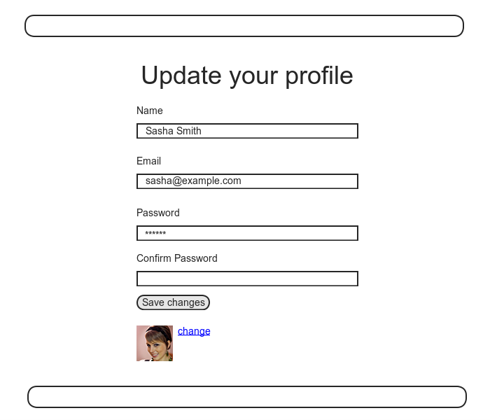

图 9.1：编辑用户页面的构思图

对编辑用户表单的测试和第七章练习中的代码 7.31 类似，同样也测试了提交不合法数据后是否会显示错误提示信息，如代码 9.1 所示。

**代码 9.1** 用户编辑页面的测试<br />`spec/requests/user_pages_spec.rb`

```ruby
require 'spec_helper'

describe "User pages" do
  .
  .
  .
  describe "edit" do
    let(:user) { FactoryGirl.create(:user) }
    before { visit edit_user_path(user) }

    describe "page" do
      it { should have_selector('h1', text: "Update your profile") }
      it { should have_selector('title', text: "Edit user") }
      it { should have_link('change', href: 'http://gravatar.com/emails') }
    end

    describe "with invalid information" do
      before { click_button "Save changes" }
      it { should have_content('error') }
    end
  end
end
```

程序所需的代码要放在 `edit` 动作中，我们在[表格 7.1](chapter7.html#table-7-1)中列出了，用户编辑页面的地址是 /users/1/edit（假设用户的 id 是 1）。我们介绍过用户的 id 是保存在 `params[:id]` 中的，所以我们可以按照代码 9.2 所示的方法查找用户。

**代码 9.2** Users 控制器的 `edit` 方法<br />`app/controllers/users_controller.rb`

```ruby
class UsersController < ApplicationController
  .
  .
  .
  def edit
    @user = User.find(params[:id])
  end
end
```

要让测试通过，我们就要编写编辑用户页面的视图，如代码 9.3 所示。仔细观察一下视图代码，它和代码 7.17 中创建新用户页面的视图代码很相似，这就暗示我们要进行重构，把重复的代码移入局部视图。重构会留作练习，详情参见 [9.6 节](#sec-9-6)。

**代码 9.3** 编辑用户页面的视图<br />`app/views/users/edit.html.erb`

```erb
<% provide(:title, "Edit user") %>
<h1>Update your profile</h1>

<div class="row">
  <div class="span6 offset3">
    <%= form_for(@user) do |f| %>
      <%= render 'shared/error_messages' %>

      <%= f.label :name %>
      <%= f.text_field :name %>

      <%= f.label :email %>
      <%= f.text_field :email %>

      <%= f.label :password %>
      <%= f.password_field :password %>

      <%= f.label :password_confirmation, "Confirm Password" %>
      <%= f.password_field :password_confirmation %>

      <%= f.submit "Save changes", class: "btn btn-large btn-primary" %>
    <% end %>

    <%= gravatar_for @user %>
    <a href="http://gravatar.com/emails">change</a>
  </div>
</div>
```

在这段代码中我们再次使用了 [7.3.2 节](chapter7.html#sec-7-3-2)中创建的 `error_messages` 局部视图。

添加了视图代码，再加上代码 9.2 中定义的 `@user` 变量，代码 9.1 中的测试应该就可以通过了：

```sh
$ bundle exec rspec spec/requests/user_pages_spec.rb -e "edit page"
```

编辑用户页面如图 9.2 所示，我们看到 Rails 会自动读取 `@user` 变量，预先填好了名字和 Email 地址字段。

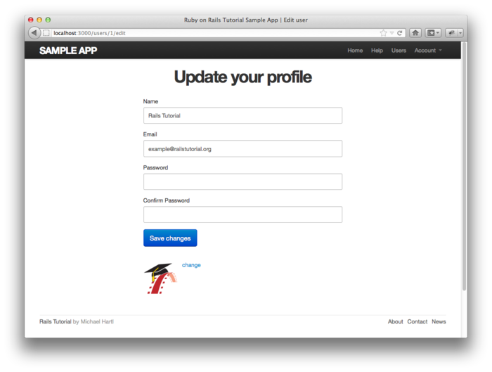

图 9.2：编辑用户页面，名字和 Email 地址字段已经自动填好了

查看一下编辑用户页面的源码，我们可以发现的确生成了一个 `form` 元素，参见代码 9.4。

**代码 9.4** 编辑表单的 HTML

```html
<form action="/users/1" class="edit_user" id="edit_user_1" method="post">
    <input name="_method" type="hidden" value="put" />
    .
    .
    .
</form>
```

留意一下其中的一个隐藏字段：

```html
<input name="_method" type="hidden" value="put" />
```

因为浏览器本身并不支持发送 `PUT` 请求（[表格 7.1](chapter7.html#table-7-1)中列出的 REST 动作要用），所以 Rails 就在 `POST` 请求中使用这个隐藏字段伪造了一个 `PUT` 请求。<sup>[3](#fn-3)</sup>

还有一个细节需要注意一下，代码 9.3 和代码 7.17 都使用了相同的 `form_for(@user)` 来构建表单，那么 Rails 是怎么知道创建新用户要发送 `POST` 请求，而编辑用户时要发送 `PUT` 请求的呢？这个问题的答案是，通过 Active Record 提供的 `new_record?` 方法可以检测用户是新创建的还是已经存在于数据库中的：

```sh
$ rails console
>> User.new.new_record?
=> true
>> User.first.new_record?
=> false
```

所以在使用 `form_for(@user)` 构建表单时，如果 `@user.new_record?` 返回 `true` 则发送 `POST` 请求，否则就发送 `PUT` 请求。

最后，我们还要在导航中添加一个指向编辑用户页面的链接（“设置（Settings）”）。因为只有登录之后才会显示这个页面，所以对“设置”链接的测试要和其他的身份验证测试放在一起，如代码 9.5 所示。（如果能再测试一下没登录时不会显示“设置”链接就更完美了，这会留作练习，参见 [9.6 节](#sec-9-6)。）

**代码 9.5** 添加检测“设置”链接的测试<br />`spec/requests/authentication_pages_spec.rb`

```ruby
require 'spec_helper'

describe "Authentication" do
    .
    .
    .
    describe "with valid information" do
      let(:user) { FactoryGirl.create(:user) }
      before { sign_in user }

      it { should have_selector('title', text: user.name) }
      it { should have_link('Profile', href: user_path(user)) }
      it { should have_link('Settings', href: edit_user_path(user)) }
      it { should have_link('Sign out', href: signout_path) }
      it { should_not have_link('Sign in', href: signin_path) }
      .
      .
      .
    end
  end
end
```

为了简化，代码 9.5 中使用 `sign_in` 帮助方法，这个方法的作用是访问登录页面，提交合法的表单数据，如代码 9.6 所示。

**代码 9.6** 用户登录帮助方法<br />`spec/support/utilities.rb`

```ruby
.
.
.
def sign_in(user)
  visit signin_path
  fill_in "Email", with: user.email
  fill_in "Password", with: user.password
  click_button "Sign in"
  # Sign in when not using Capybara as well.
  cookies[:remember_token] = user.remember_token
end
```

如上述代码中的注释所说，如果没有使用 Capybara 的话，填写表单的操作是无效的，所以我们就添加了一行，在不使用 Capybara 时把用户的记忆权标添加到 cookies 中：

```ruby
# Sign in when not using Capybara as well.
cookies[:remember_token] = user.remember_token
```

如果直接使用 HTTP 请求方法就必须要有上面这行代码，具体的用法在代码 9.47 中有介绍。（注意，测试中使用的 `cookies` 对象和真实的 cookies 对象是有点不一样的，代码 8.19 中使用的 `cookies.permanent` 方法不能在测试中使用。）你可能已经猜到了，`sing_in` 在后续的测试中还会用到，而且还可以用来去除重复代码（参见 [9.6 节](#sec-9-6)）。

在程序中添加“设置”链接很简单，我们就直接使用[表格 7.1](chapter7.html#table-7-1) 中列出的 `edit_user_path` 具名路由，其参数设为代码 8.22 中定义的 `current_user` 帮助方法：

```erb
<%= link_to "Settings", edit_user_path(current_user) %>
```

完整的代码如代码 9.7 所示。

**代码 9.7** 添加“设置”链接<br />`app/views/layouts/_header.html.erb`

```erb
<header class="navbar navbar-fixed-top">
  <div class="navbar-inner">
    <div class="container">
      <%= link_to "sample app", root_path, id: "logo" %>
      <nav>
        <ul class="nav pull-right">
          <li><%= link_to "Home", root_path %></li>
          <li><%= link_to "Help", help_path %></li>
          <% if signed_in? %>
            <li><%= link_to "Users", '#' %></li>
            <li id="fat-menu" class="dropdown">
              <a href="#" class="dropdown-toggle" data-toggle="dropdown">
                Account <b class="caret"></b>
              </a>
              <ul class="dropdown-menu">
                <li><%= link_to "Profile", current_user %></li>
                <li><%= link_to "Settings", edit_user_path(current_user) %></li>
                <li class="divider"></li>
                <li>
                  <%= link_to "Sign out", signout_path, method: "delete" %>
                </li>
              </ul>
            </li>
          <% else %>
            <li><%= link_to "Sign in", signin_path %></li>
          <% end %>
        </ul>
      </nav>
    </div>
  </div>
</header>
```

<h3 id="sec-9-1-2">9.1.2 编辑失败</h3>

本小节我们要处理编辑失败的情况，让代码 9.1 中对错误提示信息的测试通过。我们要在 Users 控制器的 `update` 动作中使用 `update_attributes` 方法，传入提交的 `params` Hash，更新用户记录，如代码 9.8 所示。如果提交了不合法的数据，更新操作会返回 `false`，交由 `else` 分支处理，重新渲染编辑用户页面。我们之前用过类似的处理方式，代码结构和第一个版本的 `create` 动作类似（参见代码 7.21）。

**代码 9.8** 还不完整的 `update` 动作<br />`app/controllers/users_controller.rb`

```ruby
class UsersController < ApplicationController
  .
  .
  .
  def edit
    @user = User.find(params[:id])
  end

  def update
    @user = User.find(params[:id])
    if @user.update_attributes(params[:user])
      # Handle a successful update.
    else
      render 'edit'
    end
  end
end
```

提交不合法信息后显示了错误提示信息（如图 9.3），测试就可以通过了，你可以运行测试组件验证一下：

```sh
$ bundle exec rspec spec/
```

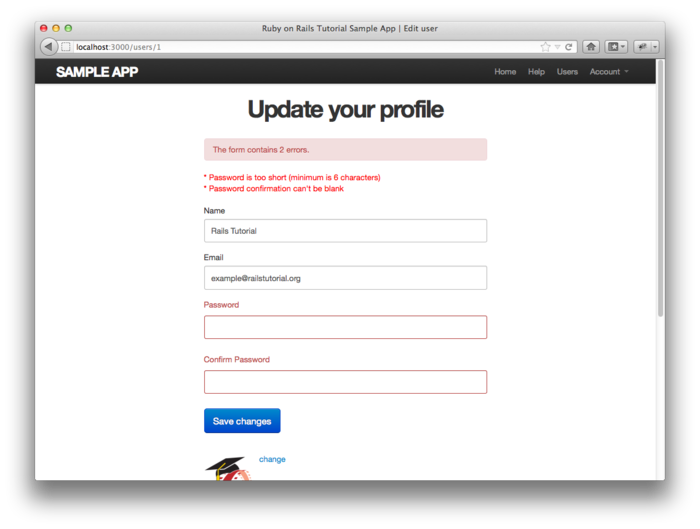

图 9.3：提交编辑表单后显示的错误提示信息

<h3 id="sec-9-1-3">9.1.3 编辑成功</h3>

现在我们要让编辑表单能够正常使用了。编辑头像的功能已经实现了，因为我们把上传头像的操作交由 Gravatar 处理了，如需更换头像，点击图 9.2 中的“change”链接就可以了，如图 9.4 所示。下面我们来实现编辑其他信息的功能。

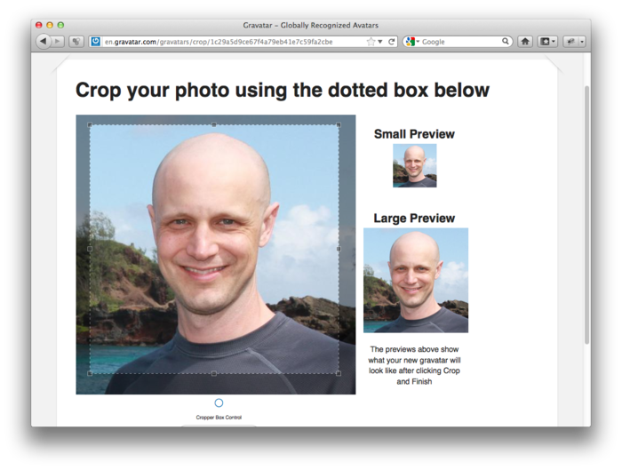

图 9.4：Gravatar 的剪切图片界面，上传了一个帅哥的图片

对 `update` 动作的测试和对 `create` 的测试类似。代码 9.9 介绍了如何使用 Capybara 在表单中填写合法的数据，还介绍了怎么测试提交表单的操作是否正确。测试的代码很多，你可以参考[第七章](chapter7.html)中的测试，试一下能不能完全理解。

**代码 9.9** 测试 Users 控制器的 `update` 动作<br />`spec/requests/user_pages_spec.rb`

```ruby
require 'spec_helper'

describe "User pages" do
  .
  .
  .
  describe "edit" do
    let(:user) { FactoryGirl.create(:user) }
    before { visit edit_user_path(user) }
    .
    .
    .
    describe "with valid information" do
      let(:new_name) { "New Name" }
      let(:new_email) { "new@example.com" }
      before do
        fill_in "Name",             with: new_name
        fill_in "Email",            with: new_email
        fill_in "Password",         with: user.password
        fill_in "Confirm Password", with: user.password
        click_button "Save changes"
      end

      it { should have_selector('title', text: new_name) }
      it { should have_selector('div.alert.alert-success') }
      it { should have_link('Sign out', href: signout_path) }
      specify { user.reload.name.should == new_name }
      specify { user.reload.email.should == new_email }
    end
  end
end
```

上述代码中出现了一个新的方法 `reload`，出现在检测用户的属性是否已经更新的测试中：

```ruby
specify { user.reload.name.should == new_name }
specify { user.reload.email.should == new_email }
```

这两行代码使用 `user.reload` 从测试数据库中重新加载 `user` 的数据，然后检测用户的名字和 Email 地址是否更新成了新的值。

要让代码 9.9 中的测试通过，我们可以参照最终版本的 `create` 动作（代码 8.27）来编写 `update` 动作，如代码 9.10 所示。我们在代码 9.8  的基础上加入了下面这三行。

```ruby
flash[:success] = "Profile updated"
sign_in @user
redirect_to @user
```

注意，用户资料更新成功之后我们再次登入了用户，因为保存用户时，重设了记忆权标（代码 8.18），之前的 session 就失效了（代码 8.22）。这也是一项安全措施，因为如果用户更新了资料，任何会话劫持都会自动失效。

**代码 9.10** Users 控制器的 `update` 动作<br />`app/controllers/users_controller.rb`

```ruby
class UsersController < ApplicationController
  .
  .
  .
  def update
    @user = User.find(params[:id])
    if @user.update_attributes(params[:user])
      flash[:success] = "Profile updated"
      sign_in @user
      redirect_to @user
    else
      render 'edit'
    end
  end
end
```

注意，现在这种实现方式，每次更新数据都要提供密码（填写图 9.2 中那两个空的字段），虽然有点烦人，不过却保证了安全。

添加了本小节的代码之后，编辑用户页面应该可以正常使用了，你可以运行测试组件再确认一下，测试应该是可以通过的：

```sh
$ bundle exec rspec spec/
```

<h2 id="sec-9-2">9.2 权限限制</h2>

[第八章](chapter8.html)中实现的身份验证机制有一个很好的作用，可以实现权限限制。身份验证可以识别用户是否已经注册，而权限限制则可以限制用户可以进行的操作。

虽然 [9.1 节](#sec-9-1)中已经基本完成了 `edit` 和 `update` 动作，但是却有一个安全隐患：任何人（甚至是未登录的用户）都可以访问这两个动作，而且登录后的用户可以更新所有其他用户的资料。本节我们要实现一种安全机制，限制用户必须先登录才能更新自己的资料，而不能更新他人的资料。没有登录的用户如果试图访问这些受保护的页面，会转向登录页面，并显示一个提示信息，构思图如图 9.5 所示。

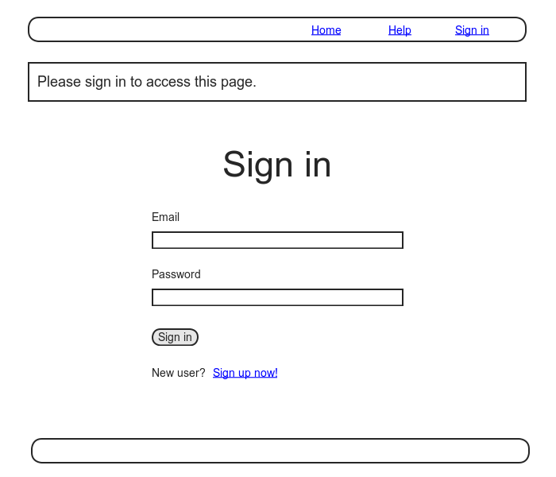

图 9.5：访问受保护页面转向后的页面构思图

<h3 id="sec-9-2-1">9.2.1 必须先登录</h3>

因为对 `edit` 和 `update` 动作所做的安全限制是一样的，所以我们就在同一个 RSpec `describe` 块中进行测试。我们从要求登录开始，测试代码要检测未登录的用户视图访问这两个动作时是否转向了登录页面，如代码 9.11 所示。

**代码 9.11** 测试 `edit` 和 `update` 动作是否处于被保护状态<br />`spec/requests/authentication_pages_spec.rb`

```ruby
require 'spec_helper'


describe "Authentication" do
  .
  .
  .
  describe "authorization" do

    describe "for non-signed-in users" do
      let(:user) { FactoryGirl.create(:user) }

      describe "in the Users controller" do

        describe "visiting the edit page" do
          before { visit edit_user_path(user) }

          it { should have_selector('title', text: 'Sign in') }
        end

        describe "submitting to the update action" do
          before { put user_path(user) }
          specify { response.should redirect_to(signin_path) }
        end
      end
    end
  end
end
```

代码 9.11 除了使用 Capybara 的 `visit` 方法之外，还第一次使用了另一种访问控制器动作的方法：如果需要直接发起某种 HTTP 请求，则直接使用 HTTP 动词对应的方法即可，例如本例中的 `put` 发起的就是 `PUT` 请求：

```ruby
describe "submitting to the update action" do
  before { put user_path(user) }
  specify { response.should redirect_to(signin_path) }
end
```

上述代码会向 /users/1 地址发送 `PUT` 请求，由 Users 控制器的 `update` 动作处理（参见[表格 7.1](chapter7.html#table-7-1)）。我们必须这么做，因为浏览器无法直接访问 `update` 动作，必须先提交编辑表单，所以 Capybara 也做不到。访问编辑资料页面只能测试 `edit` 动作是否有权限继续操作，而不能测试 `update` 动作的授权情况。所以，如果要测试 `update` 动作是否有权限进行操作只能直接发送 `PUT` 请求。（你可能已经猜到了，除了 `put` 方法之外，Rails 中的测试还支持 `get`、`post` 和 `delete` 方法。）

直接发送某种 HTTP 请求时，我们需要处理更底层的 `response` 对象。和 Capybara 提供的 `page` 对象不同，我们可以使用 `response` 测试服务器的响应。本例我们检测了 `update` 动作的响应是否转向了登录页面：

```ruby
specify { response.should redirect_to(signin_path) }
```

我们要使用 `before_filter` 方法实现权限限制，这个方法会在指定的动作执行之前，先运行指定的方法。为了实现要求用户先登录的限制，我们要定义一个名为 `signed_in_user` 的方法，然后调用 `before_filter :signed_in_user`，如代码 9.12 所示。

**代码 9.12** 添加 `signed_in_user` 事前过滤器<br />`app/controllers/users_controller.rb`

```ruby
class UsersController < ApplicationController
  before_filter :signed_in_user, only: [:edit, :update]
  .
  .
  .
  private

    def signed_in_user
      redirect_to signin_path, notice: "Please sign in." unless signed_in?
    end

end
```

默认情况下，事前过滤器会应用于控制器中的所有动作，所以在上述代码中我们传入了 `:only` 参数指定只应用在 `edit` 和 `update` 动作上。

注意，在代码 9.12 中我们使用了设定 `flash[:notice]` 的简便方式，把 `redirect_to` 方法的第二个参数指定为一个 Hash。这段代码等同于：

```ruby
flash[:notice] = "Please sign in."
redirect_to signin_path
```

（`flash[:error]` 也可以使用上述的简便方式，但 `flash[:success]` 却不可以。）

`flash[:notice]` 加上 `flash[:success]` 和 `flash[:error]` 就是我们要介绍的三种 Flash 消息，Bootstrap 为这三种消息都提供了样式。退出后再尝试访问 /users/1/edit，就会看到如图 9.6 所示的黄色提示框。

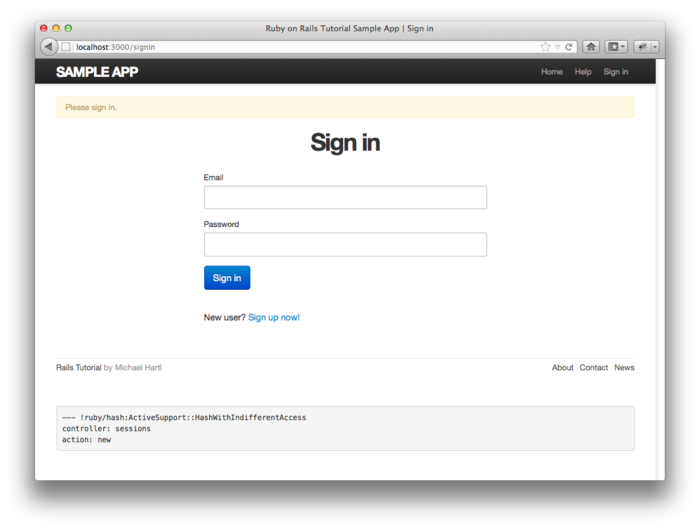

图 9.6：尝试访问受保护的页面后显示的登录表单

在尝试让代码 9.11 中检测权限限制的测试通过的过程中，我们却破坏了代码 9.1 中的测试。如下的代码

```ruby
describe "edit" do
  let(:user) { FactoryGirl.create(:user) }
  before { visit edit_user_path(user) }
  .
  .
  .
```

现在会失败，因为必须先登录才能正常访问编辑用户资料页面。解决这个问题的办法是，使用代码 9.6 中定义的 `sign_in` 方法登入用户，如代码 9.13 所示。

**代码 9.13** 为 `edit` 和 `update` 测试加入登录所需的代码<br />`spec/requests/user_pages_spec.rb`

```ruby
require 'spec_helper'

describe "User pages" do
  .
  .
  .
  describe "edit" do
    let(:user) { FactoryGirl.create(:user) }
    before do
      sign_in user
      visit edit_user_path(user)
    end
    .
    .
    .
  end
end
```

现在所有的测试应该都可以通过了：

```sh
$ bundle exec rspec spec/
```

<h3 id="sec-9-2-2">9.2.2 用户只能编辑自己的资料</h3>

当然，要求用户必须先登录还是不够的，用户必须只能编辑自己的资料。我们的测试可以这么编写，用其他用户的身份登录，然后访问 `edit` 和 `update` 动作，如代码 9.14 所示。注意，用户不应该尝试编辑其他用户的资料，我们没有转向登录页面，而是转到了网站的首页。

**代码 9.14** 测试只有自己才能访问 `edit` 和 `update` 动作<br />`spec/requests/authentication_pages_spec.rb`

```ruby
require 'spec_helper'

describe "Authentication" do
  .
  .
  .
  describe "authorization" do
    .
    .
    .
    describe "as wrong user" do
      let(:user) { FactoryGirl.create(:user) }
      let(:wrong_user) { FactoryGirl.create(:user, email: "wrong@example.com") }
      before { sign_in user }

      describe "visiting Users#edit page" do
        before { visit edit_user_path(wrong_user) }
        it { should_not have_selector('title', text: full_title('Edit user')) }
      end

      describe "submitting a PUT request to the Users#update action" do
        before { put user_path(wrong_user) }
        specify { response.should redirect_to(root_path) }
      end
    end
  end
end
```

注意，创建预构件的方法还可以接受第二个参数：

```ruby
FactoryGirl.create(:user, email: "wrong@example.com")
```

上述代码会用指定的 Email 替换默认值，然后创建用户。我们的测试要确保其他的用户不能访问原来那个用户的 `edit` 和 `update` 动作。

我们在控制器中加入了第二个事前过滤器，调用 `correct_user` 方法，如代码 9.15 所示。

**代码 9.15** 保护 `edit` 和 `update` 动作的 `correct_user` 事前过滤器<br />`app/controllers/users_controller.rb`

```ruby
class UsersController < ApplicationController
  before_filter :signed_in_user, only: [:edit, :update]
  before_filter :correct_user, only: [:edit, :update]
  .
  .
  .
  def edit
  end

  def update
    if @user.update_attributes(params[:user])
      flash[:success] = "Profile updated"
      sign_in @user
      redirect_to @user
    else
      render 'edit'
    end
  end
  .
  .
  .
  private

    def signed_in_user
      redirect_to signin_path, notice: "Please sign in." unless signed_in?
    end

    def correct_user
      @user = User.find(params[:id])
      redirect_to(root_path) unless current_user?(@user)
    end

end
```

上述代码中的 `correct_user` 方法使用了 `current_user?` 方法，我们要在 Sessions 帮助方法模块中定义一下，如代码 9.16。

**代码 9.16** 定义 `current_user?` 方法<br />`app/helpers/sessions_helper.rb`

```ruby
module SessionsHelper
  .
  .
  .
  def current_user
    @current_user ||= User.find_by_remember_token(cookies[:remember_token])
  end

  def current_user?(user)
    user == current_user
  end
  .
  .
  .
end
```

代码 9.15 同时也更新了 `edit` 和 `update` 动作的代码。之前在代码 9.2 中，我们是这样写的：

```ruby
def edit
  @user = User.find(params[:id])
end
```

`update` 代码类似。既然 `correct_user` 事前过滤器中已经定义了 `@user`，这两个动作中就不再需要再定义 `@user` 变量了。

在继续阅读之前，你应该验证一下测试是否可以通过：

```sh
$ bundle exec rspec spec/
```

<h3 id="sec-9-2-3">9.2.3 更友好的转向</h3>

程序的权限限制基本完成了，但是还有一点小小的不足：不管用户尝试访问的是哪个受保护的页面，登录后都会转向资料页面。也就是说，如果未登录的用户访问了编辑资料页面，会要求先登录，登录转到的页面是 /users/1，而不是 `/users/1/edit`。如果登录后能转到用户之前想访问的页面就更好了。

针对这种更友好的转向，我们可以这样编写测试，先访问编辑用户资料页面，转向登录页面后，填写正确的登录信息，点击“Sign in”按钮，然后显示的应该是编辑用户资料页面，而不是用户资料页面。相应的测试如代码 9.17 所示。

**代码 9.17** 测试更友好的转向<br />`spec/requests/authentication_pages_spec.rb`

```ruby
require 'spec_helper'

describe "Authentication" do
  .
  .
  .
  describe "authorization" do

    describe "for non-signed-in users" do
      let(:user) { FactoryGirl.create(:user) }

      describe "when attempting to visit a protected page" do
        before do
          visit edit_user_path(user)
          fill_in "Email", with: user.email
          fill_in "Password", with: user.password
          click_button "Sign in"
        end

        describe "after signing in" do
          it "should render the desired protected page" do
            page.should have_selector('title', text: 'Edit user')
          end
        end
      end
    end
    .
    .
    .
  end
end
```

下面我们来实现这个设想。<sup>[4](#fn-4)</sup>要转向用户真正想访问的页面，我们要在某个地方存储这个页面的地址，登录后再转向这个页面。我们要通过两个方法来实现这个过程，`store_location` 和 `redirect_back_or`，都在 Sessions 帮助方法模块中定义，如代码 9.18。

**代码 9.18** 实现更友好的转向所需的代码<br />`app/helpers/sessions_helper.rb`

```ruby
module SessionsHelper
  .
  .
  .
  def redirect_back_or(default)
    redirect_to(session[:return_to] || default)
    session.delete(:return_to)
  end

  def store_location
    session[:return_to] = request.fullpath
  end
end
```

地址的存储使用了 Rails 提供的 `session`，`session` 可以理解成和 [8.2.1 节](chapter8.html#sec-8-2-1)中介绍的 `cookies` 是类似的东西，会在浏览器关闭后自动失效。（在 [8.5 节](chapter8.html#sec-8-5)中介绍过，其实 `session` 的实现方法正是如此。）我们还使用了 `request` 对象的 `fullpath` 方法获取了所请求页面的完整地址。在 `store_locations` 方法中，把完整的请求地址存储在 `session[:return_to]` 中。

要使用 `store_location`，我们要把它加入 `signed_in_user` 事前过滤器中，如代码 9.19 所示。

**代码 9.19** 把 `store_location` 加入 `signed_in_user` 事前过滤器<br />`app/controllers/users_controller.rb`

```ruby
class UsersController < ApplicationController
  before_filter :signed_in_user, only: [:edit, :update]
  before_filter :correct_user, only: [:edit, :update]
  .
  .
  .
  def edit
  end
  .
  .
  .
  private

    def signed_in_user
      unless signed_in?
        store_location
        redirect_to signin_path, notice: "Please sign in."
      end
    end

    def correct_user
      @user = User.find(params[:id])
      redirect_to(root_path) unless current_user?(@user)
    end
end
```

实现转向操作，要在 Sessions 控制器的 `create` 动作中加入 `redirect_back_or` 方法，用户登录后转到适当的页面，如代码 9.20 所示。如果存储了之前请求的地址，`redirect_back_or` 方法就会转向这个地址，否则会转向参数中指定的地址。

**代码 9.20** 加入友好转向后的 `create` 动作<br />`app/controllers/sessions_controller.rb`

```ruby
class SessionsController < ApplicationController
  .
  .
  .
  def create
    user = User.find_by_email(params[:session][:email])
    if user && user.authenticate(params[:session][:password])
      sign_in user
      redirect_back_or user
    else
      flash.now[:error] = 'Invalid email/password combination'
      render 'new'
    end
  end
  .
  .
  .
end
```

`redirect_back_or` 方法在下面这行代码中使用了“或”操作符 `||`：

```ruby
session[:return_to] || default
```

如果 `session[:return_to]` 的值不是 `nil`，上面这行代码就会返回 `session[:return_to]` 的值，否则会返回 `default`。注意，在代码 9.18 中，成功转向后就会删除存储在 session 中的转向地址。如果不删除的话，在关闭浏览器之前，每次登录后都会转到存储的地址上。（对这一过程的测试留作练习，参见 [9.6 节](#sec-9-6)。）

加入上述代码之后，代码 9.17 中对友好转向的集成测试应该可以通过了。至此，我们也就完成了基本的用户身份验证和页面保护机制。和之前一样，在继续阅读之前，最好确认一下所有的测试是否都可以通过：

```sh
$ bundle exec rspec spec/
```

<h2 id="sec-9-3">9.3 列出所有用户</h2>

本节我们要添加计划中的倒数第二个用户动作，`index`。`index` 动作不会显示某一个用户，而是显示所有的用户。在这个过程中，我们要学习如何在数据库中生成示例用户数据，以及如何分页显示用户列表，显示任意数量的用户。用户列表、分页链接和“所有用户（Users）”导航链接的构思图如图 9.7 所示。<sup>[5](#fn-5)</sup>在 [9.4 节](#sec-9-4) 中，我们还会在用户列表中添加删除链接，这样就可以删除有问题的用户了。

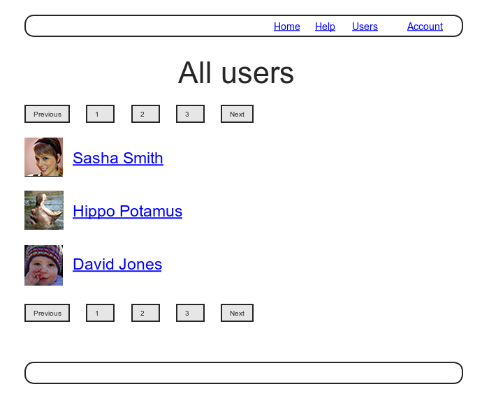

图 9.7：用户列表页面的构思图，包含了分页链接和“Users”导航链接

<h3 id="sec-9-3-1">9.3.1 用户列表</h3>

单个用户的资料页面是对外开放的，不过用户列表页面只有注册用户才能访问。我们先来编写测试。在测试中我们要检测 `index` 动作是被保护的，如果访问 `users_path` 会转向登录页面。和其他的权限限制测试一样，我们也会把这个测试放在身份验证的集成测试中，如代码 9.21 所示。

**代码 9.21** 测试 `index` 动作是否是被保护的<br />`spec/requests/authentication_pages_spec.rb`

```ruby
require 'spec_helper'

describe "Authentication" do
  .
  .
  .
  describe "authorization" do

    describe "for non-signed-in users" do
      .
      .
      .
      describe "in the Users controller" do
        .
        .
        .
        describe "visiting the user index" do
          before { visit users_path }
          it { should have_selector('title', text: 'Sign in') }
        end
      end
      .
      .
      .
    end
  end
end
```

若要这个测试通过，我们要把 `index` 动作加入 `signed_in_user` 事前过滤器，如代码 9.22 所示。

**代码 9.22** 访问 `index` 动作必须先登录<br />`app/controllers/users_controller.rb`

```ruby
class UsersController < ApplicationController
  before_filter :signed_in_user, only: [:index, :edit, :update]
  .
  .
  .
  def index
  end
  .
  .
  .
end
```

接下来，我们要测试用户登录后，用户列表页面要有特定的标题和标头，还要列出网站中所有的用户。为此，我们要创建三个用户预构件，以第一个用户的身份登录，然后检测用户列表页面中是否有一个列表，各用户的名字都包含在一个单独的 `li` 标签中。注意，我们要为每个用户分配不同的名字，这样列表中的用户才是不一样的，如代码 9.23 所示。

**代码 9.23** 用户列表页面的测试<br />`spec/requests/user_pages_spec.rb`

```ruby
require 'spec_helper'

describe "User pages" do

  subject { page }

  describe "index" do
    before do
      sign_in FactoryGirl.create(:user)
      FactoryGirl.create(:user, name: "Bob", email: "bob@example.com")
      FactoryGirl.create(:user, name: "Ben", email: "ben@example.com")
      visit users_path
    end

    it { should have_selector('title', text: 'All users') }
    it { should have_selector('h1', text: 'All users') }
    it "should list each user" do
      User.all.each do |user|
        page.should have_selector('li', text: user.name)
      end
    end
  end
  .
  .
  .
end
```

你可能还记得，我们在演示程序的相关代码中介绍过（参见代码 2.4），在程序中我们可以使用 `User.all` 从数据库中取回所有的用户，赋值给实例变量 `@users` 在视图中使用，如代码 9.24 所示。（你可能会觉得一次列出所有的用户不太好，你是对的，我们会在 [9.3.3 节](#sec-9-3-3)中改进。）

**代码 9.24** Users 控制器的 `index` 动作<br />`app/controllers/users_controller.rb`

```ruby
class UsersController < ApplicationController
  before_filter :signed_in_user, only: [:index, :edit, :update]
  .
  .
  .
  def index
    @users = User.all
  end
  .
  .
  .
end
```

要显示用户列表页面，我们要创建一个视图，遍历所有的用户，把单个用户包含在 `li` 标签中。我们要使用 `each` 方法遍历所有用户，显示用户的 Gravatar 头像和名字，然后把所有的用户包含在无序列表 `ul` 标签中，如代码 9.25 所示。在代码 9.25 中，我们用到了 [7.6 节](chapter7.html#sec-7-6)练习中代码 7.29 的成果，允许向 Gravatar 帮助方法传入第二个参数，指定头像的大小。如果你之前没有做这个练习题，在继续阅读之前请参照代码 7.29 更新 Users 控制器的帮助方法文件。

**代码 9.25** 用户列表页面的视图<br />`app/views/users/index.html.erb`

```erb
<% provide(:title, 'All users') %>
<h1>All users</h1>

<ul class="users">
  <% @users.each do |user| %>
    <li>
      <%= gravatar_for user, size: 52 %>
      <%= link_to user.name, user %>
    </li>
  <% end %>
</ul>
```

我们再添加一些 CSS（更确切的说是 SCSS）美化一下，如代码 9.26。

**代码 9.26** 用户列表页面的 CSS<br />`app/assets/stylesheets/custom.css.scss`

```scss
.
.
.
/* users index */

.users {
  list-style: none;
  margin: 0;
  li {
    overflow: auto;
    padding: 10px 0;
    border-top: 1px solid $grayLighter;
    &:last-child {
      border-bottom: 1px solid $grayLighter;
    }
  }
}
```

最后，我们还要在头部的导航中加入到用户列表页面的链接，链接的地址为 `users_path`，这是[表格 7.1](chapter7.html#table-7-1)中还没介绍的最后一个具名路由了。相应的测试（代码 9.27）和程序所需的代码（代码 9.28）都很简单。

**代码 9.27** 检测“Users”链接的测试<br />`spec/requests/authentication_pages_spec.rb`

```ruby
require 'spec_helper'

describe "Authentication" do
    .
    .
    .
    describe "with valid information" do
      let(:user) { FactoryGirl.create(:user) }
      before { sign_in user }

      it { should have_selector('title', text: user.name) }

      it { should have_link('Users', href: users_path) }
      it { should have_link('Profile', href: user_path(user)) }
      it { should have_link('Settings', href: edit_user_path(user)) }
      it { should have_link('Sign out', href: signout_path) }

      it { should_not have_link('Sign in', href: signin_path) }
      .
      .
      .
    end
  end
end
```

**代码 9.28** 添加“Users”链接<br />`app/views/layouts/_header.html.erb`

```erb
<header class="navbar navbar-fixed-top">
  <div class="navbar-inner">
    <div class="container">
      <%= link_to "sample app", root_path, id: "logo" %>
      <nav>
        <ul class="nav pull-right">
          <li><%= link_to "Home", root_path %></li>
          <li><%= link_to "Help", help_path %></li>
          <% if signed_in? %>
            <li><%= link_to "Users", users_path %></li>
            <li id="fat-menu" class="dropdown">
              <a href="#" class="dropdown-toggle" data-toggle="dropdown">
                Account <b class="caret"></b>
              </a>
              <ul class="dropdown-menu">
                <li><%= link_to "Profile", current_user %></li>
                <li><%= link_to "Settings", edit_user_path(current_user) %></li>
                <li class="divider"></li>
                <li>
                  <%= link_to "Sign out", signout_path, method: "delete" %>
                </li>
              </ul>
            </li>
          <% else %>
            <li><%= link_to "Sign in", signin_path %></li>
          <% end %>
        </ul>
      </nav>
    </div>
  </div>
</header>
```

至此，用户列表页面的功能就实现了，所有的测试也都可以通过了：

```sh
$ bundle exec rspec spec/
```

不过，如图 9.8 所示，页面中只显示了一个用户，有点孤单单。下面，让我们来改变一下这种悲惨状况。

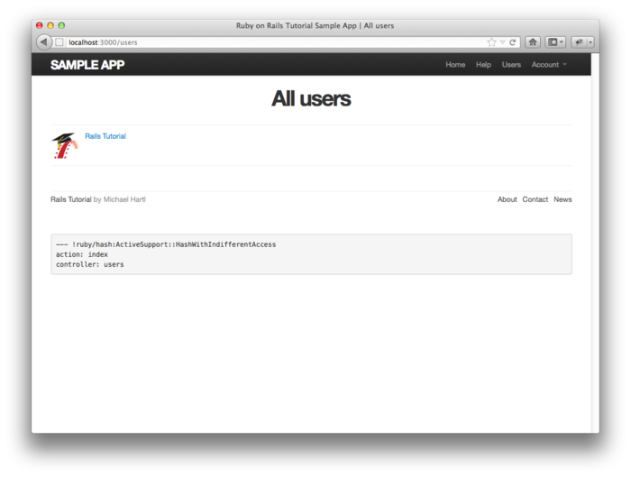

图 9.8：用户列表页面，只有一个用户

<h3 id="sec-9-3-2">9.3.2 示例用户</h3>

在本小节中，我们要为应用程序添加更多的用户。如果要让用户列表看上去像个列表，我们可以在浏览器中访问注册页面，然后一个一个地注册用户，不过还有更好的方法，让 Ruby 和 Rake 为我们创建用户。

首先，我们要在 `Gemfile` 中加入 `faker`（如代码 9.29 所示），使用这个 gem，我们可以使用半真实的名字和 Email 地址创建示例用户。

**代码 9.29** 把 `faker` 加入 `Gemfile`

```ruby
source 'https://rubygems.org'

gem 'rails', '3.2.13'
gem 'bootstrap-sass', '2.0.0'
gem 'bcrypt-ruby', '3.0.1'
gem 'faker', '1.0.1'
.
.
.
```

然后和之前一样，运行下面的命令安装：

```sh
$ bundle install
```

接下来我们要添加一个 Rake 任务创建示例用户。这个 Rake 任务保存在 `lib/tasks` 文件夹中，而且在 `:db` 命名空间中定义，如代码 9.30 所示。（代码中涉及到一些高级知识，现在不必深入了解。）

**代码 9.30** 在数据库中生成示例用户的 Rake 任务<br />`lib/tasks/sample_data.rake`

```ruby
namespace :db do
  desc "Fill database with sample data"
  task populate: :environment do
    User.create!(name: "Example User",
                 email: "example@railstutorial.org",
                 password: "foobar",
                 password_confirmation: "foobar")
    99.times do |n|
      name = Faker::Name.name
      email = "example-#{n+1}@railstutorial.org"
      password = "password"
      User.create!(name: name,
                   email: email,
                   password: password,
                   password_confirmation: password)
    end
  end
end
```

上述代码定义了一个名为 `db:populate` 的 Rake 任务，先创建一个用户替代之前存在的那个用户，然后还创建了 99 个用户。下面这行代码

```ruby
task populate: :environment do
```

确保这个 Rake 任务可以获取 Rails 环境的信息，包括 User 模型，所以才能使用 `User.create!` 方法。`create!` 方法和 `create` 方法的作用一样，只不过如果提供的信息不合法不会返回 `false` 而是会抛出异常（参见 [6.1.4 节](chapter6.html#sec-6-1-4)），这样如果出错的话就很容易找到错误发生的地方。

这个任务是定义在 `:db` 命名空间中的，所以我们要按照如下的方式来执行：

```sh
$ bundle exec rake db:reset
$ bundle exec rake db:populate
$ bundle exec rake db:test:prepare
```

执行这三个任务之后，我们的应用程序就有 100 个用户了，如图 9.9 所示。（我牺牲了一点个人时间为前几个用户上传了头像，这样就不都会显示默认的 Gravatar 头像了。）


图 9.9：显示了 100 个用户的用户列表页面（[/users](http://localhost:3000/users)）

<h3 id="sec-9-3-3">9.3.3 分页</h3>

现在，当初的用户不再孤单单了，但是又出现了新的问题：用户太多，全在一个页面中显示。现在的用户数量是 100 个，算是少的了，在真实的网站中，这个数量可能是以千计的。为了避免在一页中显示过多的用户，我们可以使用分页功能，一页只显示 30 个用户。

在 Rails 中有很多实现分页的方法，我们要使用其中一个最简单也最完善的，叫做 will_paginate。我们要使用 `will_paginate` 和 `bootstrap-will_paginate` 这两个 gem，`bootstrap-will_paginate` 的作用是设置 will_paginate 使用 Bootstrap 中的分页样式。修改后的 `Gemfile` 如代码 9.31 所示。

**代码 9.31** 在 `Gemfile` 中加入 will_paginate

```ruby
source 'https://rubygems.org'

gem 'rails', '3.2.13'
gem 'bootstrap-sass', '2.0.0'
gem 'bcrypt-ruby', '3.0.1'
gem 'faker', '1.0.1'
gem 'will_paginate', '3.0.3'
gem 'bootstrap-will_paginate', '0.0.6'
.
.
.
```

然后执行下面的命令安装：

```sh
$ bundle install
```

安装后你还要重启 Web 服务器，确保成功加载这两个新 gem。

因为 `will_paginate` 这个 gem 使用的范围很广，所以我们不必做大量的测试，只需简单的测试一下就可以了。首先我们要检测页面中是否包含一个 CSS class 为 `pagination` 的 `div` 元素，这个元素就是由 will_paginate 生成的。然后，我们要检测分页的第一页中是否显示有正确的用户列表。在测试中我们要用到 `paginate` 方法，稍后会做介绍。

和之前一样，我们要使用 Factory Girl 生成用户，但是我们立马就会遇到一个问题：因为用户的 Email 地址必须是唯一的，那么我们就要手动生成 30 个用户，这可是一件很费事的活儿。而且，在测试用户列表时，用户的名字最好也不一样。幸好 Factory Girl 料事如神，提供了 `sequence` 方法来解决这种问题。在代码 7.8 中，我们是直接输入名字和 Email 地址来创建预构件的：

```ruby
FactoryGirl.define do
  factory :user do
    name "Michael Hartl"
    email "michael@example.com"
    password "foobar"
    password_confirmation "foobar"
  end
end
```

现在我们要使用 `sequence` 方法自动创建一系列的名字和 Email 地址：

```ruby
factory :user do
  sequence(:name) { |n| "Person #{n}" }
  sequence(:email) { |n| "person_#{n}@example.com"}
  .
  .
  .
```

`sequence` 方法可以接受一个 Symbol 类型的参数，对应到属性上（例如 `:name`），其后还可以跟着块，有一个块参数，我们将其命名为 `n`。`FactoryGirl.create(:user)` 方法执行成功后，块参数会自动增加 1。因此，创建的第一个用户名字为“Person 1”，Email 地址为“person_1@example.com”；第二个用户的名字为 `Person 2`，Email 地址为“person_2@example.com”；依此类推。完整的代码如代码 9.32 所示。

**代码 9.32** 定义 Factory Girl 序列<br />`spec/factories.rb`

```ruby
FactoryGirl.define do
  factory :user do
    sequence(:name) { |n| "Person #{n}" }
    sequence(:email) { |n| "person_#{n}@example.com"}
    password "foobar"
    password_confirmation "foobar"
  end
end
```

创建了预构件序列后，在测试中就可以生成 30 个用户了，这 30 个用户就可以产生分页了：


```ruby
before(:all) { 30.times { FactoryGirl.create(:user) } }
after(:all) { User.delete_all }
```

注意，上述代码使用 `before(:all)` 确保在块中所有测试执行之前，一次性创建 30 个示例用户。这是对速度做的优化，因为在某些系统中每个测试都创建 30 个用户会很慢。对应的，我们调用 `after(:all)` 方法，在测试结束后一次性删除所有的用户。

代码 9.33 检测了页面中是否包含正确的 `div` 元素，以及是否显示了正确的用户。注意，我们把代码 9.23 中的 `User.all` 换成了 `User.paginate(page: 1)`，这样我们才能从数据库中取回第一页中要显示的用户。还要注意一下，代码 9.33 中使用的 `before(:each)` 方法是和 `before(:all)` 方法相反的操作。

**代码 9.33** 测试分页<br />`spec/requests/user_pages_spec.rb`

```ruby
require 'spec_helper'

describe "User pages" do

  subject { page }

  describe "index" do
    let(:user) { FactoryGirl.create(:user) }
    before(:each) do
      sign_in user
      visit users_path
    end

    it { should have_selector('title', text: 'All users') }
    it { should have_selector('h1', text: 'All users') }

    describe "pagination" do
      it { should have_selector('div.pagination') }
      it "should list each user" do
        User.paginate(page: 1).each do |user|
          page.should have_selector('li', text: user.name)
        end
      end
    end
  end
  .
  .
  .
end
```

要实现分页，我们要在用户列表页面的视图中加入一些代码，告诉 Rails 要分页显示用户，而且要把 `index` 动作中的 `User.all` 换成知道如何分页的方法。我们先在视图中加入特殊的 `will_paginate` 方法，如代码 9.34 所示。稍后我们会看到为什么要在用户列表的前后都加入分页代码。

**代码 9.34** 在用户列表视图中加入分页<br />`app/views/users/index.html.erb`

```erb
<% provide(:title, 'All users') %>
<h1>All users</h1>

<%= will_paginate %>

<ul class="users">
  <% @users.each do |user| %>
    <li>
      <%= gravatar_for user, size: 52 %>
      <%= link_to user.name, user %>
    </li>
  <% end %>
</ul>

<%= will_paginate %>
```

`will_paginate` 方法有点小神奇，在 Users 控制器的视图中，它会自动寻找名为 `@users` 的对象，然后显示一个分页导航链接。代码 9.34 所示的视图现在还不能正确显示分页，因为现在 `@users` 的值是通过 `User.all` 方法获取的，是个数组；而 `will_paginate` 方法需要的是 `ActiveRecored::Relation` 类对象。will_paginate 提供的 `paginate` 方法正好可以返回 `ActiveRecored::Relation` 类对象：

```sh
$ rails console
>> User.all.class
=> Array
>> User.paginate(page: 1).class
=> ActiveRecord::Relation
```

`paginate` 方法可以接受一个 Hash 类型的参数，键 `:page` 的值指定第几页。`User.paginate` 方法根据 `:page` 的值，一次取回一系列的用户（默认为 30 个）。所以，第一页显示的是第 1-30 个用户，第二页显示的是第 31-60 个，等。如果指定的页数不存在，`paginate` 会显示第一页。

我们可以把 `index` 动作中的 `all` 方法换成 `paginate`，这样页面中就可以显示分页导航了，如代码 9.35 所示。`paginate` 方法所需的 `:page` 参数值由 `params[:page]` 指定，这个 `params` 元素是由 `will_pagenate` 自动生成的。

**代码 9.35** 在 `index` 动作中按分页取回用户<br />`app/controllers/users_controller.rb`

```ruby
class UsersController < ApplicationController
  before_filter :signed_in_user, only: [:index, :edit, :update]
  .
  .
  .
  def index
    @users = User.paginate(page: params[:page])
  end
  .
  .
  .
end
```

现在，用户列表页面应该可以显示分页了，如图 9.10 所示。（在某些系统中，可能需要重启 Rails 服务器。）因为我们在用户列表前后都加入了 `will_paginate` 方法，所以这两个地方都会显示分页链接。

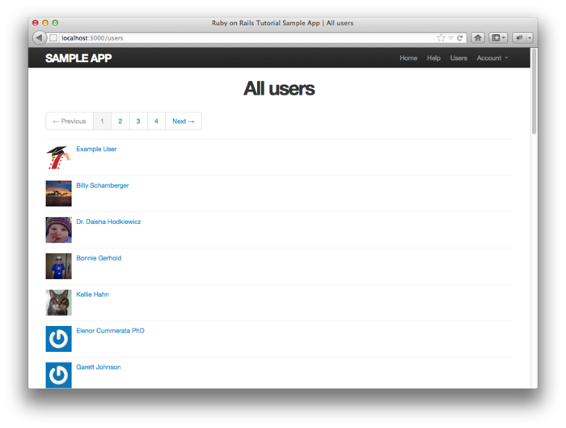

图 9.10：显示了分页链接的用户列表页面（[/users](http://localhost:3000/users)）

如果点击链接“2”，或者“Next”，就会显示第二页，如图 9.11 所示。

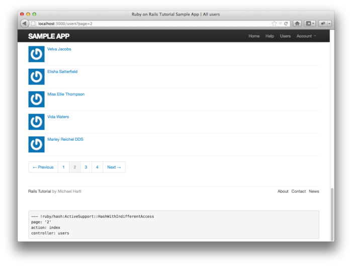

图 9.11：用户列表的第二页（[/users?page=2](http://localhost:3000/users?page=2)）

你还应该验证一下测试是否可以通过：

```sh
$ bundle exec rspec spec/
```

<h3 id="sec-9-3-4">9.3.4 视图重构</h3>

用户列表页面现在已经可以显示分页了，但是有个改进点我不得不介绍一下。Rails 提供了一些很巧妙的方法可以精简视图的结构，本小节我们就要利用这些方法重构一下用户列表页面。因为我们已经做了很好的测试，所以就可以放手去重构，不用担心会破坏网站的功能。

重构的第一步，要把代码 9.34 中的 `li` 换成对 `render` 方法的调用，如代码 9.36 所示。

**代码 9.36** 重构用户列表视图的第一步<br />`app/views/users/index.html.erb`

```erb
<% provide(:title, 'All users') %>
<h1>All users</h1>

<%= will_paginate %>

<ul class="users">
  <% @users.each do |user| %>
    <%= render user %>
  <% end %>
</ul>

<%= will_paginate %>
```

在上述代码中，`render` 的参数不再是指定局部试图的字符串，而是代表 `User` 类的 `user` 变量。<sup>[6](#fn-6)</sup>Rails 会自定寻找一个名为 `_user.html.erb` 的局部试图，我们要手动创建这个视图，然后写入代码 9.37 中的内容。

**代码 9.37** 显示单一用户的局部视图<br />`app/views/users/_user.html.erb`

```erb
<li>
  <%= gravatar_for user, size: 52 %>
  <%= link_to user.name, user %>
</li>
```

这个改进很不错，不过我们还可以做的跟好。我们可以直接把 `@users` 变量传递给 `render` 方法，如代码 9.38 所示。

**代码 9.38** 完全重构后的用户列表视图<br />`app/views/users/index.html.erb`

```erb
<% provide(:title, 'All users') %>
<h1>All users</h1>

<%= will_paginate %>

<ul class="users">
  <%= render @users %>
</ul>

<%= will_paginate %>
```

Rails 会把 `@users` 当作一系列的 `User` 对象，遍历这些对象，然后使用 `_user.html.erb` 渲染每个对象。所以我们就得到了代码 9.38 这样简洁的代码。每次重构后，你都应该验证一下测试组件是否还是可以通过的：

```sh
$ bundle exec rspec spec/
```

<h2 id="sec-9-4">9.4 删除用户</h2>

至此，用户索引也完成了。符合 REST 架构的Users 资源就只剩下最后一个 `destroy` 动作了。本节，我们先添加删除用户的链接（构思图如图 9.12 所示），然后再编写适当的 `destroy` 动作代码完成删除操作。不过，首先我们要先创建管理员级别的用户，并授权这些用户进行删除操作。

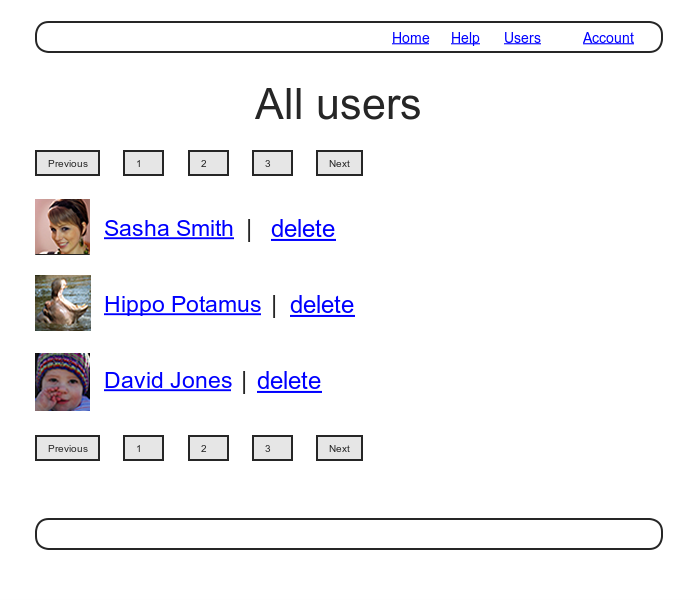

图 9.12：显示有删除链接的用户列表页面构思图

<h3 id="sec-9-4-1">9.4.1 管理员</h3>

我们要通过 User 模型中一个名为 `admin` 的属性来判断用户是否具有管理员权限。`admin` 属性的类型为布尔值，Active Record 会自动生成一个 `admin?` 方法，返回布尔值，判断用户是否为管理员。针对 `admin` 属性的测试如代码 9.39 所示。

**代码 9.39** 测试 `admin` 属性<br />`spec/models/user_spec.rb`

```ruby
require 'spec_helper'

describe User do
  .
  .
  .
  it { should respond_to(:admin) }
  it { should respond_to(:authenticate) }

  it { should be_valid }
  it { should_not be_admin }

  describe "with admin attribute set to 'true'" do
    before { @user.toggle!(:admin) }

    it { should be_admin }
  end
  .
  .
  .
end
```

在上述代码中我们使用 `toggle!` 方法把 `admin` 属性的值从 `false` 转变成 `true`。`it { should be_admin }` 这行代码说明用户对象应该可以响应 `admin?` 方法（这是 RSpec 对布尔值属性的一个约定）。

和之前一样，我们要使用迁移添加 `admin` 属性，在命令行中指定其类型为 `boolean`：

```sh
$ rails generate migration add_admin_to_users admin:boolean
```

这个命令生成的迁移文件（如代码 9.40 所示）会在 users 表中添加 `admin` 这一列，得到的数据模型如图 9.13 所示。

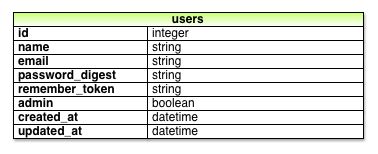

图 9.13：添加了 `admin` 属性后的 User 模型

**代码 9.40** 为 User 模型添加 `admin` 属性所用的迁移文件<br />`db/migrate/[timestamp]_add_admin_to_users.rb`

```ruby
class AddAdminToUsers < ActiveRecord::Migration
  def change
    add_column :users, :admin, :boolean, default: false
  end
end
```

注意，在代码 9.40 中，我们为 `add_column` 方法指定了 `default: false` 参数，添加这个参数后用户默认情况下就不是管理员。（如果没有指定 `default: false`，`admin` 的默认值是 `nil`，也是“假值”，所以严格来说，这个参数不是必须的。不过，指定这个参数，可以更明确地向 Rails 以及代码的阅读者表明这段代码的意图。）

然后，我们要在“开发数据库”中执行迁移操作，还要准备好“测试数据库”：

```sh
$ bundle exec rake db:migrate
$ bundle exec rake db:test:prepare
```

和预想的一样，Rails 可以自动识别 `admin` 属性的类型为布尔值，而且自动生成了 `admin?` 方法：

```sh
$ rails console --sandbox
>> user = User.first
>> user.admin?
=> false
>> user.toggle!(:admin)
=> true
>> user.admin?
=> true
```

执行迁移操作后，针对 `admin` 属性的测试应该可以通过了：

```sh
$ bundle exec rspec spec/models/user_spec.rb
```

最后，我们要修改一下生成示例用户的代码，把第一个用户设为管理员，如代码 9.41 所示。

**代码 9.41** 生成示例用户的代码，把第一个用户设为管理员<br />`lib/tasks/sample_data.rake`

```ruby
namespace :db do
  desc "Fill database with sample data"
  task populate: :environment do
    admin = User.create!(name: "Example User",
                         email: "example@railstutorial.org",
                         password: "foobar",
                         password_confirmation: "foobar")
    admin.toggle!(:admin)
    .
    .
    .
  end
end
```

之后还要还原数据库，并且重新生成示例用户：

```sh
$ bundle exec rake db:reset
$ bundle exec rake db:populate
$ bundle exec rake db:test:prepare
```

#### `attr_accessible` 再探

你可能注意到了，在代码 9.41 中，我们使用 `toggle!(:admin)` 把用户设为管理员，为什么没有直接在 `User.create!` 的参数中指定 `admin: true` 呢？原因是，直接指定 `admin: true` 不起作用，Rails 就是这样设计的，只有通过 `attr_accessible` 指定的属性才能通过 mass assignment 赋值，而 `admin` 并不是可访问的。代码 9.42 显示的是当前可访问的属性列表，注意其中并没有 `:admin`。

**代码 9.42** User 模型中通过 `attr_accessible` 指定的可访问的属性，其中没有 `:admin` 属性<br />`app/models/user.rb`

```ruby
class User < ActiveRecord::Base
  attr_accessible :name, :email, :password, :password_confirmation
  .
  .
  .
end
```

明确指定可访问的属性对网站的安全是很重要的，如果你没有指定，或者傻傻的把 `:admin` 也加进去了，那么心怀不轨的用户就可以发送下面这个 `PUT` 请求：<sup>[7](#fn-7)</sup>

```text
put /users/17?admin=1
```

这个请求会把 id 为 17 的用户设为管理员，这可是一个很严重的安全隐患。鉴于此，最佳的方法是在每个数据模型中都指定可访问的属性列表。其实，最好再测试一下各属性是否是可访问的，对 `:admin` 属性的可访问性测试留作练习，参见 [9.6 节](#sec-9-6)。

<h3 id="sec-9-4-2">9.4.2 <code>destroy</code> 动作</h3>

编写完整的 Users 资源还要再添加删除链接和 `destroy` 动作。我们先在用户列表页面每个用户后面都加入一个删除链接，而且限制只有管理员才能看到这些链接。

编写针对删除功能的测试，最好能有个创建管理员的工厂方法，为此，我们可以在预构件中加入一个名为 `:admin` 的块，如代码 9.43 所示。

**代码 9.43** 添加一个创建管理员的工厂方法<br />`spec/factories.rb`

```ruby
FactoryGirl.define do
  factory :user do
    sequence(:name) { |n| "Person #{n}" }
    sequence(:email) { |n| "person_#{n}@example.com"}
    password "foobar"
    password confirmation "foobar"
    factory :admin do
      admin true
    end
  end
end
```

添加了以上代码之后，我们就可以在测试中调用 `FactoryGirl.create(:admin)` 创建管理员用户了。

基于安全考虑，普通用户是看不到删除用户链接的，所以：

```ruby
it { should_not have_link('delete') }
```

只有管理员才能看到删除用户链接，如果管理员点击了删除用户链接，该用户会被删除，用户的数量就会减少 1 个：

```ruby
it { should have_link('delete', href: user_path(User.first)) }
it "should be able to delete another user" do
  expect { click_link('delete') }.to change(User, :count).by(-1)
end
it { should_not have_link('delete', href: user_path(admin)) }
```

注意，我们还添加了一个测试，确保管理员不会看到删除自己的链接。针对删除用户的完整测试如代码 9.44 所示。

**代码 9.44** 测试删除用户功能<br />`spec/requests/user_pages_spec.rb`

```ruby
require 'spec_helper'

describe "User pages" do

  subject { page }

  describe "index" do

    let(:user) { FactoryGirl.create(:user) }

    before do
      sign_in user
      visit users_path
    end

    it { should have_selector('title', text: 'All users') }
    it { should have_selector('h1', text: 'All users') }

    describe "pagination" do
      .
      .
      .
    end

    describe "delete links" do

      it { should_not have_link('delete') }

      describe "as an admin user" do
        let(:admin) { FactoryGirl.create(:admin) }
        before do
          sign_in admin
          visit users_path
        end

        it { should have_link('delete', href: user_path(User.first)) }
        it "should be able to delete another user" do
          expect { click_link('delete') }.to change(User, :count).by(-1)
        end
        it { should_not have_link('delete', href: user_path(admin)) }
      end
    end
  end
end
```

然后在视图中加入代码 9.45。注意链接中的 `method: delete` 参数，它指明点击链接后发送的是 `DELETE` 请求。我们还把各链接放在了 `if` 语句中，这样就只有管理员才能看到删除用户链接。管理员看到的页面如图 9.14 所示。

**代码 9.45** 删除用户的链接（只有管理员才能看到）<br />`app/views/users/_user.html.erb`

```erb
<li>
  <%= gravatar_for user, size: 52 %>
  <%= link_to user.name, user %>
  <% if current_user.admin? && !current_user?(user) %>
    | <%= link_to "delete", user, method: :delete, confirm: "You sure?" %>
  <% end %>
</li>
```

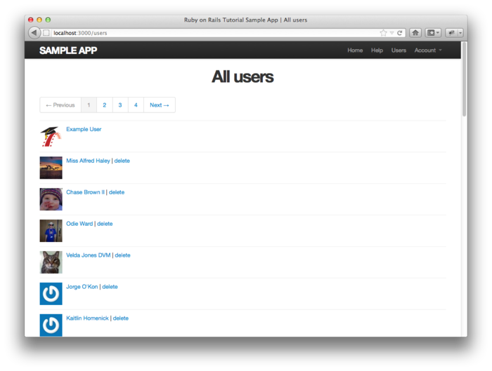

图 9.14：显示有删除用户链接的用户列表页面（[/users](http://localhost:3000/users)）

浏览器不能发送 `DELETE` 请求，Rails 通过 JavaScript 进行模拟的。也就是说，如果用户禁用了 JavaScript，那么删除用户的链接就不可用了。如果必须要支持没有启用 JavaScript 的浏览器，你可以使用一个发送 `POST` 请求的表单来模拟 `DELETE` 请求，这样即使浏览器的 JavaScript 被禁用了，删除用户的链接还是可用的，更多细节请观看 RailsCasts 第 77 集《[Destroy Without JavaScript](http://railscasts.com/episodes/77-destroy-without-javascript)》。

若要删除用户的链接起作用，我们要定义 `destroy` 动作（参见[表格 7.1](chapter7.html#table-7-1)）。在 `destroy` 动作中，先找到要删除的用户，使用 Active Record 提供的 `destroy` 方法删除这个用户，然后再转向用户列表页面，如代码 9.46 所示。

**代码 9.46** 加入 `destroy` 动作<br />`app/controllers/users_controller.rb`

```ruby
class UsersController < ApplicationController
  before_filter :signed_in_user, only: [:index, :edit, :update, :destroy]
  before_filter :correct_user, only: [:edit, :update]
  .
  .
  .
  def destroy
    User.find(params[:id]).destroy
    flash[:success] = "User destroyed."
    redirect_to users_path
  end
  .
  .
  .
end
```

注意上述 `destroy` 动作中，把 `find` 方法和 `destroy` 方法链在一起使用了：

```ruby
User.find(params[:id]).destroy
```

理论上，只有管理员才能看到删除用户的链接，所以只有管理员才能删除用户。但实际上，还是存在一个严重的安全隐患：只要攻击者有足够的经验，就可以在命令行中发送 `DELETE` 请求，删除网站中的用户。为了保证网站的安全，我们还要限制对 `destroy` 动作的访问，因此我们在测试中不仅要确保只有管理员才能删除用户，还要保证其他用户不能执行删除操作，如代码 9.47 所示。注意，和代码 9.11 中的 `put` 方法类似，在这段代码中我们使用 `delete` 方法向指定的地址（`user_path`，参见[表格 7.1](chapter7.html#table-7-1)）发送了一个 `DELETE` 请求。

**代码 9.47** 测试访问受限的 `destroy` 动作<br />`spec/requests/authentication_pages_spec.rb`

```ruby
require 'spec_helper'

describe "Authentication" do
  .
  .
  .
  describe "authorization" do
    .
    .
    .
    describe "as non-admin user" do
      let(:user) { FactoryGirl.create(:user) }
      let(:non_admin) { FactoryGirl.create(:user) }

      before { sign_in non_admin }

      describe "submitting a DELETE request to the Users#destroy action" do
        before { delete user_path(user) }
        specify { response.should redirect_to(root_path) }
      end
    end
  end
end
```

理论上来说，网站中还是有一个安全漏洞，管理员可以发送 `DELETE` 请求删除自己。有些人可能会想，这样的管理员是自作自受。不过作为开发人员，我们最好还是要避免这种情况的发生，具体的实现留作练习，参见 [9.6 节](#sec-9-6)。

你可能已经知道了，我们要使用一个事前过滤器限制对 `destroy` 动作的访问，如代码 9.48 所示。

**代码 9.48** 限制只有管理员才能访问 `destroy` 动作的事前过滤器<br />`app/controllers/users_controller.rb`

```ruby
class UsersController < ApplicationController
  before_filter :signed_in_user, only: [:index, :edit, :update, :destroy]
  before_filter :correct_user, only: [:edit, :update]
  before_filter :admin_user, only: :destroy
  .
  .
  .
  private
    .
    .
    .
    def admin_user
      redirect_to(root_path) unless current_user.admin?
    end
end
```

至此，所有的测试应该都可以通过了，而且 Users 相关的资源，包括控制器、模型和视图，都已经实现了。

```sh
$ bundle exec rspec spec/
```

<h2 id="sec-9-5">9.5 小结</h2>

我们用了好几章来介绍如何实现 Users 资源，在 [5.4 节](chapter5.html#sec-5-4)用户还不能注册，而现在不仅可以注册，还可以登录、退出、查看个人资料、修改设置，还能浏览网站中所有的用户列表，某些用户甚至可以删除其他的用户。

本书剩下的内容会以这个 Users 资源为基础（以及相关的权限授权系统），在[第十章](chapter10.html)中为示例程序加入类似 Twitter 的微博功能，在[第十一章](chapter11.html)中实现关注用户的状态列表。最后这两章会介绍几个 Rails 中最为强大的功能，其中就包括通过 `has_many` 和 `has_many through` 实现的数据模型关联。

在继续阅读之前，先把本章所做的改动合并到主分支：

```sh
$ git add .
$ git commit -m "Finish user edit, update, index, and destroy actions"
$ git checkout master
$ git merge updating-users
```

你还可以将程序部署到“生产环境”，再生成示例用户（在此之前要使用 `pg:reset` 命令还原“生产数据库”）：

```sh
$ git push heroku
$ heroku pg:reset SHARED_DATABASE --confirm <name-heroku-gave-to-your-app>
$ heroku run rake db:migrate
$ heroku run rake db:populate
```

（如果你忘了 Heroku 程序的名字，可以直接运行 `heroku pg:reset SHARED_DATABASE`，Heroku 会告诉你程序的名字。）

还有一点需要注意，本章我们加入了程序所需的最后一个 gem，最终的 `Gemfile` 如代码 9.49 所示。

**代码 9.49** 示例程序所需 `Gemfile` 的最终版本

```ruby
source 'https://rubygems.org'

gem 'rails', '3.2.13'
gem 'bootstrap-sass', '2.0.0'
gem 'bcrypt-ruby', '3.0.1'
gem 'faker', '1.0.1'
gem 'will_paginate', '3.0.3'
gem 'bootstrap-will_paginate', '0.0.6'

group :development do
  gem 'sqlite3', '1.3.5'
  gem 'annotate', '˜> 2.4.1.beta'
end

# Gems used only for assets and not required
# in production environments by default.
group :assets do
  gem 'sass-rails', '3.2.4'
  gem 'coffee-rails', '3.2.2'
  gem 'uglifier', '1.2.3'
end

gem 'jquery-rails', '2.0.0'

group :test, :development do
  gem 'rspec-rails', '2.10.0'
  gem 'guard-rspec', '0.5.5'
  gem 'guard-spork', '0.3.2'
  gem 'spork', '0.9.0'
end

group :test do
  gem 'capybara', '1.1.2'
  gem 'factory_girl_rails', '1.4.0'
  gem 'cucumber-rails', '1.2.1', require: false
  gem 'database_cleaner', '0.7.0'
end

group :production do
  gem 'pg', '0.12.2'
end
```

<h2 id="sec-9-6">9.6 练习</h2>

1. 参照代码 10.8，编写一个，测试确保 User 模型的 `admin` 属性是不可访问的。确保测试先是红色的，然后才会变绿。（提示：先要把 `admin` 加入可访问属性列表中。）
2. 把代码 9.3 中修改 Gravatar 头像的链接（“change”），使链接在新窗口（或新标签）中打开。提示：请搜索，你会发现一个很常用的方法，涉及到 `_blank` 的用法。
3. 现在针对身份验证系统的测试会确保用户登录后能看到“Profile”和“Settings”等导航链接。增加一个测试，确保用户未登录时看不到这些导航链接。
4. 在测试中尽量多的使用代码 9.6 中的 `sign_in` 帮助方法。
5. 使用代码 9.50 中的代码重构 `new.html.erb` 和 `edit.html.erb` 中的表单。注意，你要明确的传入 `f` 这个表单变量，如代码 9.51 所示。你还要修改相应的测试，因为表单已经不完全一样了。仔细的查找修改前后表单的差异，据此修改测试。
6. 已经登录的用户就没必要再访问 Users 控制器的 `new` 和 `create` 动作了，修改程序，如果登录后的用户访问这些地址时，转向到网站首页。
7. 在网站的布局中插入一些 [Rails API](http://api.rubyonrails.org/v3.2.0/classes/ActionDispatch/Request.html)<sup>[8](#fn-8)</sup> 中介绍的方法，了解一下 `request` 对象。（如果遇到了困难，可以参考代码 7.1。）
8. 编写一个测试，确保友好转向只在第一次转向指定的地址，其后再登录的话就转向默认设定的地址（如资料页面）。代码 9.52 是个提示，其实也就是所需的代码。
9. 修改 `destroy` 动作，避免管理员删除自己。（先编写测试。）

**代码 9.50** 注册和编辑表单字段的局部视图<br />`app/views/users/_fields.html.erb`

```erb
<%= render 'shared/error_messages' %>

<%= f.label :name %>
<%= f.text_field :name %>

<%= f.label :email %>
<%= f.text_field :email %>

<%= f.label :password %>
<%= f.password_field :password %>

<%= f.label :password_confirmation, "Confirm Password" %>
<%= f.password_field :password_confirmation %>
```

**代码 9.51** 使用局部视图后的注册页面视图<br />`app/views/users/new.html.erb`

```erb
<% provide(:title, 'Sign up') %>
<h1>Sign up</h1>

<div class="row">
  <div class="span6 offset3">
    <%= form_for(@user) do |f| %>
      <%= render 'fields', f: f %>
      <%= f.submit "Create my account", class: "btn btn-large btn-primary" %>
    <% end %>
  </div>
</div>
```

**代码 9.52** 测试友好的转向后，只能转向到默认的页面<br />`spec/requests/authentication_pages_spec.rb`

```ruby
require 'spec_helper'

describe "Authentication" do
  .
  .
  .
  describe "authorization" do

    describe "for non-signed-in users" do
      .
      .
      .
      describe "when attempting to visit a protected page" do
        before do
          visit edit_user_path(user)
          fill_in "Email", with: user.email
          fill_in "Password", with: user.password
          click_button "Sign in"
        end

        describe "after signing in" do

          it "should render the desired protected page" do
            page.should have_selector('title', text: 'Edit user')
          end

          describe "when signing in again" do
            before do
              visit signin_path
              fill_in "Email", with: user.email
              fill_in "Password", with: user.password
              click_button "Sign in"
            end

            it "should render the default (profile) page" do
              page.should have_selector('title', text: user.name)
            end
          end
        end
      end
    end
    .
    .
    .
  end
end
```

<div class="navigation">
  <a class="prev_page" href="chapter8.html">&laquo; 第八章 登录和退出</a>
  <a class="next_page" href="chapter10.html">第十章 用户的微博 &raquo;</a>
</div>

1. 图片来自 <http://www.flickr.com/photos/sashawolff/4598355045/>
2. Gravatar 会把这个地址转向 http://en.gravatar.com/emails，我去掉了前面的 en，这样选择其他语言的用户就会自动转向相应的页面了。
3. 不要担心实现的细节。具体的实现方式是 Rails 框架的开发者需要关注的，作为 Rails 程序开发者则无需关心。
4. 实现的代码来自 thoughtbot 的 Clearance gem。
5. 婴儿的图片来自 <www.flickr.com/photos/glasgows/338937124/>
6. 我们并不是一定要使用 `user`，遍历时如果用的是 `@users.each do |foobar|`，那么就要用 `render foobar`。这里的关键是要知道对象的类，也就是 `User`。
7. 类似 curl 的命令行工具可以发送这种 `PUT` 请求。
8. <http://api.rubyonrails.org/v3.2.0/classes/ActionDispatch/Request.html>
