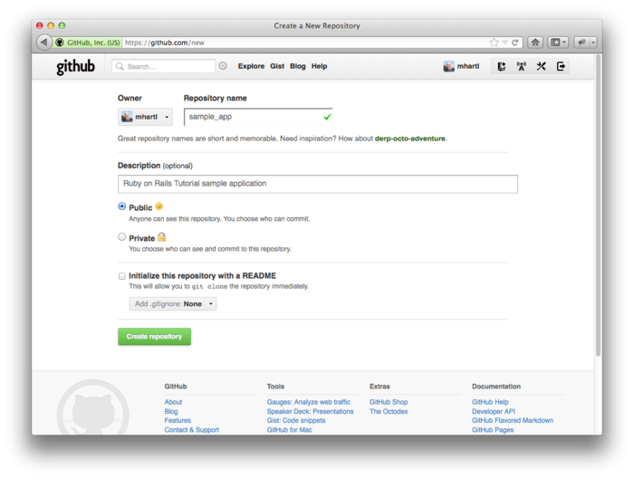
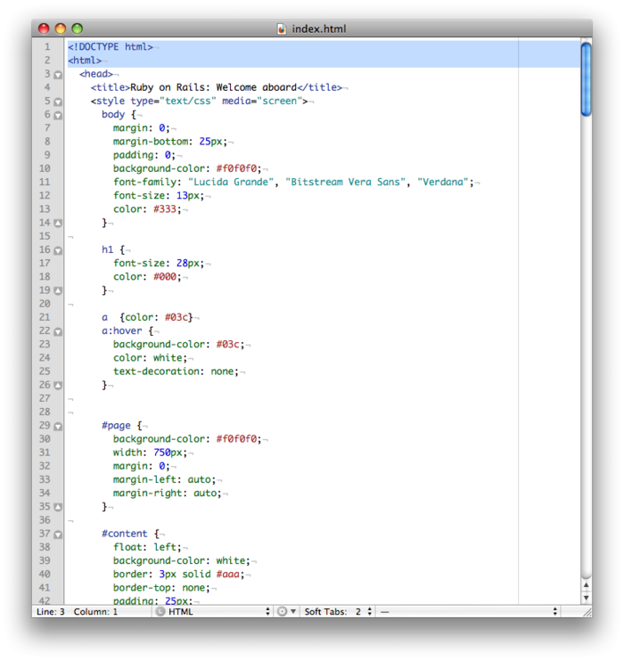
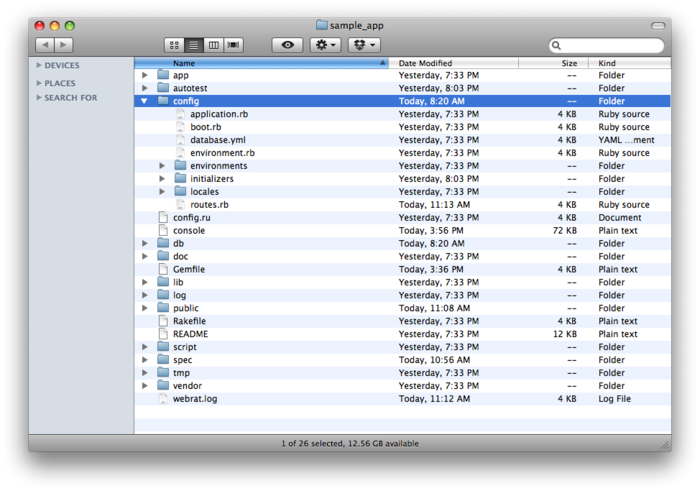

从本章开始我们要开发一个大型的示例程序，本书后续内容都会基于这个示例程序。最终完成的程序会包含用户、微博功能，以及完成的登录和用户验证系统，不过我们会从一个看似功能有限的话题出发——创建静态页面。这看似简单的一件事却是一个很好的锻炼，极具意义，对这个初建的程序而言也是个很好的开端。

虽然 Rails 是被设计用来开发基于数据库的动态网站的，不过它也能胜任使用纯 HTML 创建的静态页面。其实，使用 Rails 创建动态页面还有一点好处：我们可以方便的添加一小部分动态内容。这一章就会教你怎么做。在这个过程中我们还会一窥自动化测试（automated testing）的面目，自动化测试可以让我们确信自己编写的代码是正确的。而且，编写一个好的测试用例还可以让我们信心十足的重构（refactor）代码，修改实现过程但不影响最终效果。

本章有很多的代码，特别是在 [3.2 节](#sec-3-2)和[3.3 节](#sec-3-3)，如果你是 Ruby 初学者先不用担心没有理解这些代码。就像在 [1.1.1 节](chapter1.html#sec-1-1-1)中说过的，你可以直接复制粘贴测试代码，用来验证程序中代码的正确性而不用担心其工作原理。[第四章](chapter4.html)会更详细的介绍 Ruby，你有的是机会来理解这些代码。还有 RSpec 测试，它在本书中会被反复使用，如果你现在有点卡住了，我建议你硬着头皮往下看，几章过后你就会惊奇地发现，原本看起来很费解的代码现在已经很容易理解了。

类似第二章，在开始之前我们要先创建一个新的 Rails 项目，这里我们叫它 `sample_app`：


$ cd ~/rails_projects
$ rails new sample_app --skip-test-unit
$ cd sample_app


上面代码中传递给 `rails` 命令的 `--skip-test-unit` 选项的意思是让 Rails 不生成默认使用的 `Test::Unit` 测试框架对应的 `test` 文件夹。这样做并不是说我们不用写测试，而是从 [3.2 节](#sec-3-2)开始我们会使用另一个测试框架 RSpec 来写整个的测试用例。

类似 [2.1 节](chapter2.html#sec-2-1)，接下来我们要用文本编辑器打开并编辑 `Gemfile`，写入程序所需的 gem。这个示例成粗会用到之前没用过的两个 gem：RSpec 所需的 gem 和针对 Rails 的 RSPec 库 gem。代码 3.1 所示的代码会包含这些 gem。（注意：如果此时你想安装这个示例程序所需的所有 gem，你应该使用代码 9.49 中的代码。）

**代码 3.1** 示例程序的 `Gemfile`


source 'https://rubygems.org'

gem 'rails', '3.2.8'

group :development, :test do
  gem 'sqlite3', '1.3.5'
  gem 'rspec-rails', '2.11.0'
end

# Gems used only for assets and not required
# in production environments by default.
group :assets do
  gem 'sass-rails',   '3.2.5'
  gem 'coffee-rails', '3.2.2'
  gem 'uglifier', '1.2.3'
end

gem 'jquery-rails', '2.0.2'

group :test do
  gem 'capybara', '1.1.2'
end

group :production do
  gem 'pg', '0.12.2'
end


上面的代码将 `rspec-rails` 放在了开发组中，这样我们就可以使用 RSpec 相关的生成器了，同样我们还把它放到了测试组中，这样才能在测试时使用它。我们没必要单独的安装 RSpec，因为它是 rspec-rails 的依赖件（dependency），会被自动安装。我们还加入了 [Capybara](https://github.com/jnicklas/capybara)，这个 gem允许我们使用类似英语中的句法编写模拟和应用程序交互的代码。[1](#fn-1) 和[第二章](chapter2.html)一样，我们还要把 PostgreSQL 所需的 gem 加入生产组，这样才能部署到 Heroku：


group :production do
  gem 'pg', '0.12.2'
end


Heroku 建议在开发环境和生产环境使用不同的数据库，不过对我们的示例程序而言没什么影响，SQLite 比 PostgreSQL 更容易安装和配置。在你的电脑中安装和配置 PostgreSQL 会作为一个练习。（参见 [3.5 节](#sec-3-5)）

安装和包含这些新加的 gem，运行 `bundle install`：


$ bundle install --without production


和第二章一样，我们使用 `-without production` 禁止安装生产环境所需的 gem。这个选项会被记住，所以后续调用 Bundler 就不用再指定这个选项，直接运行 `bundle install` 就可以了。[2](#fn-2)

接着我们要设置一下让 Rails 使用 RSpec 而不用 `Test::Unit`。这个设置可以通过 `rails generate rspec:install` 命令实现：


$ rails generate rspec:install


如果系统提示缺少 JavaScript 运行时，你可以访问 [execjs 在 GitHub 的页面](https://github.com/sstephenson/execjs)查看可以使用的运行时。 我一般都建议安装 [Node.js](http://nodejs.org/)。

然后剩下的就是初始化 Git 仓库了：[3](#fn-3)


$ git init
$ git add .
$ git commit -m "Initial commit"


和第一个程序一样，我建议你更新一下 `README` 文件，能够更好的描述这个程序，还可以提供一些帮助信息，可参照代码 3.2。

**代码 3.2** 示例程序改善后的 `README` 文件


# Ruby on Rails Tutorial: sample application

This is the sample application for
[*Ruby on Rails Tutorial: Learn Rails by Example*](http://railstutorial.org/)
by [Michael Hartl](http://michaelhartl.com/).


然后添加 `.md` 后缀将其更改为 Markdown 格式，再提交所做的修改：


$ git mv README.rdoc README.md
$ git commit -a -m "Improve the README"


图 3.1：为示例程序在 GitHub 新建一个仓库

这个程序在本书的后续章节会一直使用，所以建议你在 GitHub 新建一个仓库（如图 3.1），让后将代码推动上去：


$ git remote add origin git@github.com:<username>/sample_app.git
$ git push -u origin master


我自己也做了这一步，你可以在 GitHub 上找到[这个示例程序的代码](https://github.com/railstutorial/sample_app_2nd_ed)。（我用了一个稍微不同的名字）

当然我们也可以选择在这个早期阶段将程序部署到 Heroku：


$ heroku create --stack cedar
$ git push heroku master


在阅读本书的过程中，我建议你经常地推送并部署这个程序：


$ git push
$ git push heroku


这样你可在远端做个备份，也可以尽早的获知生成环境中出现的错误。如果你在 Heroku 遇到了问题，可以看一下生成环境的日志文件尝试解决这些问题：


$ heroku logs


所有的准备工作都结束了，下面要开始开发这个示例程序了。

<h2 id="sec-3-1">3.1 静态页面</h2>

Rails 中有两种方式创建静态页面。其一，Rails 可以处理真正只包含 HTML 代码的静态页面。其二，Rails 允许我们定义包含纯 HTML 的视图，Rails 会对其进行渲染，然后 Web 服务器会将结果返回浏览器。

现在回想一下 [1.2.3 节](chapter1.html#sec-1-2-3) 中讲过的 Rails 目录结构（图 1.2）会对我们有点帮助。本节主要的工作都在 `app/controllers` 和 `app/views` 文件夹中。（[3.2 节](#sec-3-2)中我们还会新建一个文件夹）

在这节你会第一次发现在文本编辑器或 IDE 中打开整个 Rails 目录是多么有用。不过怎么做却取决于你的系统，大多数情况下你可以在命令行中用你选择的浏览器命令打开当前应用程序所在的目录，在 Unix 中当前目录就是一个点号（`.`）：


$ cd ~/rails_projects/sample_app
$ <editor name> .


例如，用 Sublime Text 打开示例程序，你可以输入：


$ subl .


对于 Vim 来说，针对你使用的不同变种，你可以输入 `vim .`、`gvim .` 或 `mvim .`。

<h3 id="sec-3-1-1">3.1.1 真正的静态页面</h3>

我们先来看一下真正静态的页面。回想一下 [1.2.5 节](chapter1.html#sec-1-2-5)，每个 Rails 应用程序执行过 `rails` 命令后都会生成一个小型的可以运行的程序，默认的欢迎页面的地址是 <http://localhost:3000/>（图 1.3）。

图 3.2：`public/index.html` 文件

如果想知道这个页面是怎么来的，请看一下 `public/index.html` 文件（如图 3.2）。因为文件中包含了一下样式信息，所以看起来有点乱，不过其效果却达到了：默认情况下 Rails 会直接将 `public` 目录下的文件发送给浏览器。[5](#fn-5) 对于特殊的 `index.html` 文件，你不用在 URI 中指定它，因为它是默认显示的文件。如果你想在 URI 中包含这个文件的名字也可以，不过 http://localhost:3000/ 和 http://localhost:3000/index.html 的效果是一样的。

如你所想的，如果你需要的话也可以创建静态的 HTML 文件，并将其放在和 `index.html` 相同的目录 `public` 中。举个例子，我们要创建一个文件显示一个友好的欢迎信息（参见代码 3.3）：[6](#fn-6)


$ subl public/hello.html


**代码 3.3** 一个标准的 HTML 文件，包含一个友好的欢迎信息  `public/hello.html`


<!DOCTYPE html>
<html>
  <head>
    <title>Greeting</title>
  </head>
  <body>
    
Hello, world!

  </body>
</html>


从代码 3.3 中我们可以看到 HTML 文件的标准结构：位于文件开头的文档类型（document type，简称 doctype）声明，告知浏览器我们所用的 HTML 版本（本例使用的是 HTML5）；[7](#fn-7) `head` 部分：本例包含一个 `title` 标签，其内容是“Greeting”；`body` 部分：本例包含一个 `p`（段落）标签，其内容是“Hello,world!”。（缩进是可选的，HTML 并不强制要求使用空格，它会忽略 Tab 和空格，但是缩进可以使文档的结构更清晰。）

现在执行下述命令启动本地浏览器


$ rails server


然后访问 <http://localhost:3000/hello.html>。就像前面说过的，Rails 会直接渲染这个页面（如图 3.3）。注意图 3.3 浏览器窗口顶部显示的标题，它就是 `title` 标签的内容，“Greeting”。

图 3.3：一个新的静态 HTML 文件

这个文件只是用来做演示的，我们的示例程序并不需要它，所以在体验了创建过程之后最好将其删掉：


$ rm public/hello.html


现在我们还要保留 `index.html` 文件，不过最后我们还是要将其删除的，因为我们不想把 Rails 默认的页面（如图 1.3）作为程序的首页。[5.3 节](chapter5.html#sec-5-3)会介绍如何将 <http://localhost:3000/> 指向 `public/index.html` 之外的地方。

<h3 id="sec-3-1-2">3.1.2 Rails 中的静态页面</h3>

能够放回静态 HTML 页面固然很好，不过对动态 Web 程序却没有什么用。本节我们要向创建动态页面迈出第一步，我们会创建一系列的 Rails 动作（action），这可比通过静态文件定义 URI  地址要强大得多。[8](#fn-8) Rails 的动作会按照一定的目的性归属在某个控制器（[1.2.6 节](chapter1.html#sec-1-2-6)介绍的 MVC 中的 C）中。在[第二章](chapter2.html)中已经简单介绍了控制器，当我们更详细的介绍 [REST 架构](http://en.wikipedia.org/wiki/Representational_State_Transfer)后（从[第六章](chapter6.html)开始）你会更深入的理解它。大体而言，控制器就是一组网页的（也许是动态的）容器。

开始之前，回想一下 [1.3.5 节](chapter1.html#sec-1-3-5)中的内容，使用 Git 时，在一个有别于主分支的独立从分支中工作是一个好习惯。如果你使用 Git 做版本控制，可以执行下面的命令：


$ git checkout -b static-pages


Rails 提供了一个脚本用来创建控制器，叫做 `generate`，只要提供控制器的名字就可以运行了。如果你想让 `generate` 同时生成 RSpec 测试用例，你要执行 RSpec 生成器命令，如果在阅读本章前面内容时没有执行这个命令的话，请执行下面的命令：


$ rails generate rspec:install


因为我们要创建一个控制器来处理静态页面，所有我们就叫它 StaticPages 吧。同时我们计划创建首页（Home）、帮助（Help）和关于（About）页面的动作。`generate` 可以接受一个可选的参数列表，制定要创建的动作，我们现在只通过命令行创建两个计划的动作（参见代码 3.4）。

**代码 3.4** 创建 StaticPages 控制器


$ rails generate controller StaticPages home help --no-test-framework
      create  app/controllers/static_pages_controller.rb
       route  get "static_pages/help"
       route  get "static_pages/home"
      invoke  erb
      create    app/views/static_pages
      create    app/views/static_pages/home.html.erb
      create    app/views/static_pages/help.html.erb
      invoke  helper
      create    app/helpers/static_pages_helper.rb
      invoke  assets
      invoke    coffee
      create      app/assets/javascripts/static_pages.js.coffee
      invoke    scss
      create      app/assets/stylesheets/static_pages.css.scss


注意我们使用了 `--no-test-framework` 选项禁止生成 RSpec 测试代码，因为我们不想自动生成在 [3.2 节](#sec-3-2)会手动创建测试。同时我们还故意从命令行参数中省去了 `about` 动作，稍后我们会看到如何通过 TDD 添加它（[3.2 节](#sec-3-2)）。

顺便说一下，如果在生成代码时出现了错误，知道如何撤销操作就很有用了。[旁注 3.1](#box-3-1) 中介绍了一些如何在 Rails 中撤销操作的方法。

  <h4>旁注 3.1 撤销操作</h4>
  
即使再小心，在开发 Rails 应用程序过程中仍然可能犯错。幸运的是，Rails 提供了一些工具能够帮助你进行复原。

  
举例来说，一个常见的情况是你想更改控制器的名字，这是你就要撤销生成的代码。生成控制器时，除了控制器文件本身之外，Rails 还会生成很多其他的文件（参见代码 3.4）。撤销生成的文件不仅仅要删除主要的文件，还要删除一些辅助的文件。（事实上，我们还要撤销对 <code>routes.rb</code> 文件自动做的一些改动。）在 Rails 中，我么你可以通过 <code>rails destroy</code> 命令完成这些操作。一般来说，下面的两个命令是相互抵消的：

  <pre>
    $ rails generate controller FooBars baz quux
    $ rails destroy  controller FooBars baz quux
  </pre>
  
同样的，在<a href="chapter6.html">第六章</a>中会使用下面的命令生成模型： 

  <pre>
    $ rails generate model Foo bar:string baz:integer
  </pre>
  
生成的模型可通过下面的命令撤销：

  <pre>
    $ rails destroy model Foo
  </pre>
  
（对模型来说我们可以省略命令行中其余的参数。当阅读到<a href="chapter6.html">第六章</a>时，看看你能否发现为什么可以做。）

  
对模型来说涉及到的另一个技术是撤销迁移。<a href="chapter2.html">第二章</a>已经简要的介绍了迁移，<a href="chapter6.html">第六章</a>开始会更深入的介绍。迁移通过下面的命令改变数据库的状态：

  <pre>
    $ rake db:migrate
  </pre>
  
我们可以使用下面的命令撤销一个迁移操作：

  <pre>
    $ rake db:rollback
  </pre>
  
如果要回到最开始的状态，可以使用：

  <pre>
    $ rake db:migrate VERSION=0
  </pre>
  
你可能已经猜到了，将数字 <tt>0</tt>换成其他的数字就会回到相应的版本状态，这些版本数字是按照迁移数量排序的。

  
有着这些技术，我们就可以得心的应对开发过程中遇到的各种<a href="http://en.wikipedia.org/wiki/SNAFU">混乱（snafu）</a>了。

代码 3.4 中生成 StaticPages 控制器的命令会自动更新路由文件（route），叫做 `config/routes.rb`，Rails 会通过这个文件寻找 URI 到网页之间的对应关系。这是我们第一次讲到 `config` 目录，所以让我们看一下目录的结构吧（如图 3.4）。`config` 目录如其名字所示，是存储 Rails 应用程序中的设置文件的。

图 3.4：示例程序的 `config` 目录

因为我们生成了 `home` 和 `help` 动作，路由文件中已经为每个动作生成了规则，如代码 3.5。

**代码 3.5** StaticPages 控制器中 `home` 和 `help` 动作的路由配置  `config/routes.rb`


SampleApp::Application.routes.draw do
  get "static_pages/home"
  get "static_pages/help"
  .
  .
  .
end


如下的规则


get "static_pages/home"


将来自 /static_pages/home 的请求映射到 StaticPages 控制器的 `home` 动作上。另外，当使用 `get` 时会将其对应到 GET 请求方法上，GET 是 HTTP（超文本传输协议，Hypertext Transfer Protocol）支持的基本方法之一（参见[旁注 3.2](#box-3-2)）。在我们这个例子中，当我们在 StaticPages 控制器中生成 `home` 动作时，我们就自动的在 /static_pages/home 地址上获得一个页面了。访问 [/static_pages/home](http://localhost:3000/static_pages/home) 查看页面（如图 3.5）。

图 3.5：简陋的首页视图（[/static_pages/home](http://localhost:3000/static_pages/home)）

  <h4>旁注 3.2 GET 等</h4>
  
超文本传输协议（HTTP）定义了四个基本的操作，对应到四个动词上，分别是 get、post、put 和 delete。这四个词表现了客户端电脑（通常会运行一个浏览器，例如 Firefox 或 Safari）和服务器（通常会运行一个 Web 服务器，例如 Apache 或 Nginx）之间的操作。（有一点很重要需要你知道，当在本地电脑上开发 Rails 应用程序时，客户端和服务器是在同一个物理设备上的，但是二者是不同的概念。）受 REST 架构影响的 Web 框架（包括 Rails）都很重视对 HTTP 动词的实现，我们在<a href="chapter2.html">第二章</a>已经简要介绍了 REST，从<a href="chapter7.html">第七章</a>开始会做更详细的介绍。

  
GET 是最常用的 HTTP 操作，用来从网络上读取数据，它的意思是“读取一个网页”，当你访问 google.com 或 wikipedia.org 时，你的浏览器发出的就是 GET 请求。POST 是第二最常用的操作，当你提交表单时浏览器发送的就是 POST 请求。在 Rails 应用程序中，POST 请求一般被用来创建某个东西（不过 HTTP 也允许 POST 进行更新操作）。例如，你提交注册表单时发送的 POST 请求就会在网站中创建一个新用户。剩下的两个动词，PUT 和 DELETE 分别用来更新和销魂服务器上的某个东西。这两个操作比 GET 和 POST 少用一些，因为浏览器没有内建对这两种请求的支持，不过有些 Web 框架（包括 Rails）通过一些聪明的处理方式让它开起来是浏览器发出了这种类型的请求。

要想弄明白这个页面是怎么来的，让我们在浏览器中看一下 StaticPages 控制器文件吧，你应该会看到类似代码 3.6 的内容。你可能已经注意到了，不像第二章中的 Users 和 Microposts 控制器，StaticPages 控制器没有使用标准的 REST 动作。这对静态页面来说是正常的，REST 架构并不能解决所有的问题。

**代码 3.6** 代码 3.4 生成的 StaticPages 控制器  `app/controllers/static_pages_controller.rb`


class StaticPagesController < ApplicationController

  def home
  end

  def help
  end
end


从上面代码中的 `class` 可以看到 `static_pages_controller.rb` 文件定义了一个类（class），叫做 `StaticPagesController`。类是一种组织函数（也叫方法）的有效方式，例如 `home` 和 `action` 动作就是方法，使用 `def` 关键字定义。尖括号 `<` 说明 `StaticPagesController` 是继承自 Rails 的 `ApplicationController` 类，这就意味着我们定义的页面拥有了 Rails 提供的大量功能。（我们会在 [4.4 节](chapter4.html#sec-4-4)中更详细的介绍类和继承。）

在本例中，StaticPages 控制器的两个方法默认都是空的：


def home
end

def help
end


如果是普通的 Ruby 代码，这两个方法什么也做不了。不过在 Rails 中就不一样了，`StaticPagesController` 是一个 Ruby 类，因为它继承自 `ApplicationController`，它的方法对 Rails 来说就有特殊的意义了：访问 /static_pages/home 时，Rails 在 StaticPages 控制器中寻找 `home` 动作，然后执行该动作，再渲染相应的视图（[1.2.6 节](chapter1.html#sec-1-2-6)中介绍的 MVC 中的 V）。在本例中，`home` 动作是空的，所以访问 /static_pages/home 后只会渲染视图。那么，视图是什么样子，怎么才能找到它呢？

如果你再看一下代码 3.4 的输出，或许你能猜到动作和视图之间的对应关系：`home` 动作对应的视图叫做 `home.html.erb`。[3.3 节](#sec-3-3)将告诉你 `.erb` 是什么意思。看到 `.html` 你或许就不会奇怪了，它基本上就是 HTML（代码 3.7）。

**代码 3.7** 为首页生成的视图  `app/views/static_pages/home.html.erb`


<h1>StaticPages#home</h1>

Find me in app/views/static_pages/home.html.erb



`help` 动作的视图代码类似（参见代码 3.8）。

**代码 3.8** 为帮助页面生成的视图  `app/views/static_pages/help.html.erb`


<h1>StaticPages#help</h1>

Find me in app/views/static_pages/help.html.erb



这两个视图只是站位用的，它们的内容都包含了一个一级标题（`h1` 标签）和一个显示视图文件完整的相对路径的段落（`p` 标签）。我们会在 [3.3 节](#sec-3-3)中添加一些简单的动态内容。这些静态内容的存在是为了强调一个很重要的事情：Rails 的视图可以只包含静态的 HTML。从浏览器的角度来看，[3.1.1 节](#sec-3-1-1)中的原始 HTML 文件和本节通过控制器和动作的方式渲染的页面没有什么差异，浏览器能看到的只有 HTML。

在本章剩下的内容中，我们回味首页和帮助页面添加一些内容，然后补上 [3.1.2 节](#sec-3-1-2)中丢下的关于页面。然后会添加量很少的动态内容，在每个页面显示不同的标题。

在继续下面的内容之前，如果你使用 Git 的话最好将 StaticPages 控制器相关的文件加入仓库：


$ git add .
$ git commit -m "Add a StaticPages controller"


<h2 id="sec-3-2">3.2 第一个测试</h2>

本书采用了一种直观的测试应用程序表现的方法，而不是具体的实现过程，这是 TDD 的一个变种，叫做 BDD（行为驱动开发，Behavior-driven Development）。我们使用的主要工具是集成测试（integration test）和单元测试(unit test)。集成测试在 RSpec 中叫做 request spec，它允许我们模拟用户在浏览器中和应用程序进行交互的操作。和 Capybara 提供的自然语言句法（natural-language syntax）一起使用，集成测试提供了一种强的大方法来测试应用程序的功能而不用在浏览器中手动去检查每个页面。（BDD 另外一个受欢迎的选择是 Cucumber，在 [8.3 节](chapter8.html#sec-8-3)中会介绍。）

TDD 的质量得益于测试优先，比编写应用程序的代码还早。刚接触的话要花一段时间才能适应这种方式，不过好处很明显。我们先写一个失败测试（failing test），然后编写代码使这个测试通过，这样我们就会相信测试真的是针对我们设想的功能。这种“失败-实现-通过”的开发循环包含了一个[心流](http://en.wikipedia.org/wiki/Flow_\(psychology\))，可以提高编程的乐趣并提高效率。测试还扮演着应用程序代码客户的角色，会提高软件设计的优雅性。

关于 TDD 有一点很重要需要你知道，它不是万用良药，没必要固执的认为总是要先写测试、测试要囊括程序所有的功能、所有情况都要写测试。例如，当你不确定如何处理某些编程问题时，通常推荐你跳过测试先编写代码看一下解决方法能否解决问题。（在[极限编程](http://en.wikipedia.org/wiki/Extreme_Programming)中，这个过程叫做“探针实验（spike）”。）一旦看到了解决问题的曙光，你就可以使用 TDD 实现一个更完美的版本。

本节我们会使用 RSpec 提供的 `rspec` 命令运行测试。初看起来这样做是应该的，不过却不完美，如果你是个高级用户我建议你按照 [3.6 节](#sec-3-6)的内容设置一下你的系统。

<h3 id="sec-3-2-1">3.2.1 测试驱动开发</h3>
