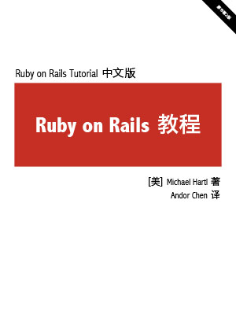

	
	<dl>
		<dt>原书名：</dt>
		<dd>Ruby on Rails Tutorial (2nd edition)</dd>
		<dt>作者：</dt>
		<dd>[美] Michael Hartl</dd>
		<dt>译者：</dt>
		<dd>Andor Chen</dd>
		<dt>Ruby：</dt>
		<dd>1.9.3</dd>
		<dt>Rails：</dt>
		<dd>3.2.13</dd>
		<dt>售价：</dt>
		<dd>￥9.90</dd>
		<dt>页数：</dt>
		<dd>460</dd>
		<dt>装帧：</dt>
		<dd>电子书</dd>
		<dt>格式：</dt>
		<dd>HTML, PDF, Epub, Mobi</dd>
	</dl>
	

		<h3>购买电子书</h3>
		<ul class="buy">
			<li id="buy-pdf"><a class="btn" href="http://item.taobao.com/item.htm?id=17282686017" title="购买 PDF 电子书" target="_blank">PDF 格式</a></li>
			<li id="buy-epub"><a class="btn" href="http://item.taobao.com/item.htm?id=19266423561" title="购买 ePub 电子书" target="_blank">ePub 格式</a></li>
			<li id="buy-mobi"><a class="btn" href="http://item.taobao.com/item.htm?id=23139240628" title="购买 Mobi 电子书" target="_blank">Mobi 格式</a></li>
		</ul>
		<ol class="notes">
			<li>出售行为已获原作者许可；</li>
			<li>三种格式分开销售，售价均为 ￥9.90；</li>
			<li>购买后，错误修正等更新免费获取，不再收费；</li>
			<li>如果你的 Kindle 安装了多看系统，建议购买 ePub 格式；</li>
		</ol>
	

	

		<h2>官方公告</h2>
		<blockquote>
			
I’m pleased to announce the availability of a Chinese translation of the Ruby on Rails Tutorial. I’d like to thank translator Andor Chen for his outstanding work. I deserve none of the credit; Andor reached out to me and asked if it was OK to translate the book, and I happily agreed. (All I did was contribute a short preface.) As with the English version, the Chinese translation is available for free online as HTML; with my blessing, Andor is also offering ebook sales of the translation, the proceeds of which go directly to him. If you are a Chinese speaker, please check it out!

			
-- <a href="http://news.railstutorial.org/rails-tutorial-chinese-translation/" title="Rails Tutorial Chinese translation" target="_blank">Michael Hartl, Mar 13th, 2013</a>

		</blockquote>
	

	

		<h2>目录</h2>
		<ol>
			<li><a href="author.html" title="作者译者">作者译者</a></li>
			<li><a href="preface.html" title="致中国读者">致中国读者</a></li>
			<li><a href="foreword.html" title="序">序</a></li>
			<li><a href="chapter1.html" title="第一章 从零到部署">第一章 从零到部署</a></li>
			<li><a href="chapter2.html" title="第二章 演示生活">第二章 演示程序</a></li>
			<li><a href="chapter3.html" title="第三章 基本静态的页面">第三章 基本静态的页面</a></li>
			<li><a href="chapter4.html" title="第四章 Rails 背后的 Ruby">第四章 Rails 背后的 Ruby</a></li>
			<li><a href="chapter5.html" title="第五章 完善布局">第五章 完善布局</a></li>
			<li><a href="chapter6.html" title="第六章 用户模型">第六章 用户模型</a></li>
			<li><a href="chapter7.html" title="第七章 用户注册">第七章 用户注册</a></li>
			<li><a href="chapter8.html" title="第八章 登录和退出">第八章 登录和退出</a></li>
			<li><a href="chapter9.html" title="第九章 更新、显示和删除用户">第九章 更新、显示和删除用户</a></li>
			<li><a href="chapter10.html" title="第十章 用户的微博">第十章 用户的微博</a></li>
			<li><a href="chapter11.html" title="第十一章 用户间互相关注">第十一章 关注用户</a></li>
		</ol>
	

	

